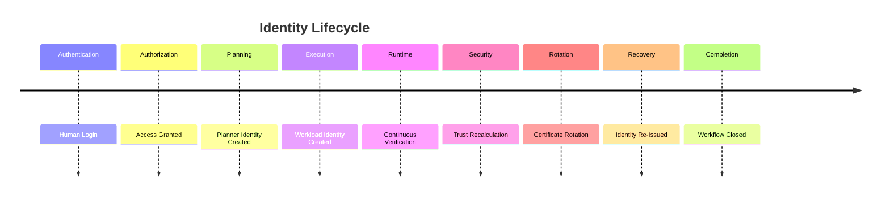

# Enterprise AI Software Factory
# Architecture Design Specification (ADS)

> **Document ID:** ADS-022-v5
>
> **Document Name:** Identity & Trust Plane — End-to-End Trust Lifecycle
>
> **Version:** 2.0.0
>
> **Classification:** Reference Implementation
>
> **Importance:** CRITICAL
>
> **Depends On:** ADS-022-v1
>
> **Depends On:** ADS-022-v2
>
> **Depends On:** ADS-022-v3
>
> **Depends On:** ADS-022-v4

---

# Executive Summary

This document demonstrates a complete identity lifecycle across the Enterprise AI Software Factory.

Unlike previous ADS documents that describe architecture, algorithms, contracts and runtime behavior, this specification simulates how identities are created, authenticated, trusted, authorized, monitored, rotated and revoked during a complete engineering workflow.

---

# Scenario

A software engineer logs into the Enterprise AI Software Factory.

The engineer submits a request.

```
Create a multi-tenant SaaS CRM platform.
```

The request triggers

- Human Authentication
- Workflow Creation
- AI Agent Identity
- Workload Identity
- Certificate Issuance
- Trust Evaluation
- Authorization
- Runtime Monitoring
- Certificate Rotation
- Audit Logging

---

# Stage 1 — Human Authentication

Developer

```
alice@example.com
```

Authentication

```
Passkey

↓

OpenID Connect

↓

Multi-Factor Authentication
```

Identity Provider

```
Keycloak
```

Result

```
Authenticated
```

Trust Score

```
97
```

Event

```
AuthenticationSucceeded
```

Checkpoint

```
ID-CP-001
```

---

# Stage 2 — Workflow Creation

The Workflow State Machine creates

```
WF-2026-001
```

Workflow ownership

```
Alice

↓

Workflow Manager
```

Identity token

```
Bound to Workflow
```

Authorization

```
Project Owner
```

Checkpoint

```
ID-CP-002
```

---

# Stage 3 — AI Agent Identity

The Planner Agent starts.

Identity

```
Planner-Agent-001
```

Capabilities

- Planning
- Architecture
- Task Decomposition

Restrictions

- No Production Deployment
- No Secret Access
- No Certificate Authority Access

SPIFFE Identity

```
spiffe://enterprise-ai/agents/planner-001
```

Certificate issued.

Checkpoint

```
ID-CP-003
```

---

# Stage 4 — Workload Identity

The Execution Plane launches workers.

Worker

```
execution-worker-011
```

Identity

```
SPIFFE

↓

SPIRE

↓

X.509 SVID
```

Lifetime

```
24 Hours
```

No shared credentials exist.

---

# Stage 5 — Trust Evaluation

The Trust Engine evaluates

- Identity
- Certificate
- Organization Policies
- Runtime Context
- Device Health
- Risk Signals

Calculation

```text
Identity

20

+

Certificate

20

+

Policies

20

+

Behavior

18

+

Device

10

+

Runtime Context

10

=

98
```

Trust Score

```
98
```

Authorization granted.

---

# Stage 6 — Authorization

OPA receives

```text
Identity

↓

Requested Action

↓

Organization Policy

↓

Tenant Context

↓

Risk Score
```

Decision

```
Allow
```

The Planner Agent may begin planning.

---

# Stage 7 — Runtime Verification

During execution

Every request performs

```text
Authenticate

↓

Authorize

↓

Policy Check

↓

Trust Evaluation

↓

Execution
```

No cached authorization decisions exist.

Continuous verification remains active.

---

# Stage 8 — Secret Retrieval

The Execution Worker requires

```
GitHub Token
```

Worker authenticates

```
SPIFFE Identity

↓

Vault

↓

Dynamic Secret

↓

Execution

↓

Secret Expired
```

Secret Lifetime

```
10 Minutes
```

The secret is automatically revoked after use.

---

# Stage 9 — Certificate Rotation

Certificate age

```
22 Hours
```

Rotation threshold reached.

Lifecycle

```text
Current Certificate

↓

Issue New Certificate

↓

Validate

↓

Update Trust

↓

Revoke Old Certificate
```

Workflow execution continues without interruption.

---

# Stage 10 — Security Incident

The Security Plane detects abnormal behavior.

Signal

```
Unexpected API Requests
```

Risk Level

```
High
```

Trust Engine recalculates.

Trust Score

```
98

↓

52
```

Policy Decision

```
Escalate
```

Affected identities enter monitoring mode.

---

# Stage 11 — Identity Revocation

The suspicious workload is revoked.

```mermaid
flowchart LR

Incident

-->

Trust Engine

-->

Identity Revoked

-->

Certificate Revoked

-->

Sessions Invalidated

-->

Workflow Paused

-->

Security Review
```

Revocation completes in seconds.

Audit records are generated automatically.

---

# Stage 12 — Recovery

The Security Team approves recovery.

Recovery sequence

```text
New Identity

↓

New Certificate

↓

Policy Validation

↓

Trust Evaluation

↓

Workflow Resumed
```

Workflow resumes from the last valid checkpoint.

---

# Stage 13 — Workflow Completion

The software factory completes

- Planning
- Agentic TDD
- Execution
- QA
- Security
- Deployment

Every participating identity remains auditable.

Final Event

```
WorkflowCompleted
```

---

# Identity Timeline



---

# Identity Event Stream

```text
IdentityCreated

↓

AuthenticationSucceeded

↓

AuthorizationGranted

↓

TrustScoreCalculated

↓

CertificateIssued

↓

SecretIssued

↓

CertificateRotated

↓

IdentityRevoked

↓

IdentityReissued

↓

WorkflowCompleted
```

---

# Produced Artifacts

| Artifact | Identifier |
|-----------|------------|
| Identity | ID-2026-001 |
| Certificate | CERT-001 |
| SPIFFE ID | SPIFFE-001 |
| Trust Report | TRUST-001 |
| Authorization Decision | AUTH-001 |
| Audit Package | AUDIT-001 |
| Rotation Record | ROTATE-001 |

---

# Runtime Metrics

| Metric | Value |
|----------|------:|
| Authentication Latency | 28 ms |
| Authorization Latency | 11 ms |
| Trust Evaluation | 18 ms |
| Certificate Rotation | 3.2 s |
| Secret Retrieval | 8 ms |
| Identities Created | 6 |
| Certificates Issued | 6 |
| Revocations | 1 |
| Audit Events | 31 |

---

# Operational Readiness Scorecard

| Capability | Status |
|------------|--------|
| Zero Trust | ✅ Verified |
| Workload Identity | ✅ Verified |
| Continuous Verification | ✅ Verified |
| Certificate Rotation | ✅ Verified |
| Dynamic Secrets | ✅ Verified |
| Multi-Tenant Isolation | ✅ Verified |
| Immutable Auditing | ✅ Verified |
| Disaster Recovery | ✅ Verified |

---

# Lessons Learned

The Identity & Trust Plane demonstrates the following principles.

- Every entity has a cryptographically verifiable identity.
- Trust is evaluated continuously rather than granted permanently.
- Authorization decisions remain contextual and policy-driven.
- Workload identities replace shared credentials.
- Short-lived certificates and dynamic secrets reduce attack surface.
- Security incidents trigger immediate trust recalculation and controlled recovery.
- Identity becomes the foundation upon which every other platform plane depends.

---

# Architecture Decision Record

## ADR-022-12

### Decision

Every engineering workflow MUST execute using continuously verified identities rather than static credentials.

### Status

Accepted

### Reason

Continuous identity verification enables Zero Trust security, limits credential exposure, and supports secure autonomous AI operations.

---

# Technology Decision Record

## TDR-022-06

### Technology

SPIFFE + SPIRE + Keycloak + Vault + OPA

### Decision

Adopt an integrated identity stack built on open standards rather than custom authentication mechanisms.

### Reason

Using mature, standards-based technologies improves interoperability, portability, security, and long-term maintainability while reducing operational risk.

---

# Related Documents

ADS-021-v5 — Workflow State Machine

ADS-022-v1 — Architecture

ADS-022-v2 — Trust Algorithms & Identity Model

ADS-022-v3 — APIs, Events & Contracts

ADS-022-v4 — Runtime & Identity Infrastructure

ADS-023-v1 — Enterprise Context & Memory Plane

---

# End of Document
