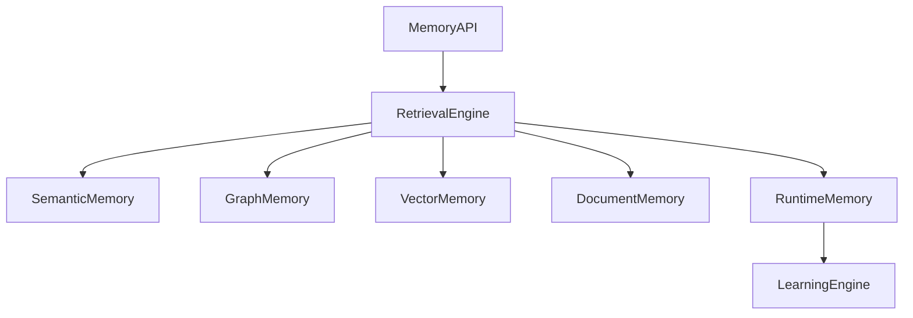

# Enterprise AI Software Factory
# Architecture Design Specification (ADS)

> **Document ID:** ADS-023-v1
>
> **Document Name:** Enterprise Context & Memory Plane — Architecture
>
> **Version:** 2.0.0
>
> **Classification:** Enterprise Platform Plane
>
> **Importance:** CRITICAL
>
> **Depends On:** ADS-021-v5
>
> **Depends On:** ADS-022-v5
>
> **Next:** ADS-023-v2 — Memory Algorithms & Context Retrieval

---

# Executive Summary

The Enterprise Context & Memory Plane provides persistent, structured, and intelligent memory for every subsystem within the Enterprise AI Software Factory.

Unlike traditional Retrieval-Augmented Generation (RAG) systems that rely solely on vector similarity, the Memory Plane combines multiple memory systems into a unified architecture capable of reasoning over source code, software architecture, execution history, organizational knowledge, and engineering workflows.

Every AI agent consumes memory.

No AI agent owns memory.

Memory is a shared platform capability.

---

# Why This System Exists

Traditional AI systems forget.

They rely on

- Prompt History
- Vector Search
- Temporary Context Windows

These approaches cannot support long-running enterprise engineering projects.

The Memory Plane enables

- persistent engineering knowledge
- architectural reasoning
- software traceability
- workflow awareness
- organizational learning

---

# Core Philosophy

Memory is separated into independent domains.

Each domain serves a unique purpose.

The platform never stores everything in one database.

Instead, specialized memory systems cooperate.

---

# Design Goals

The Memory Plane provides

- Semantic Memory
- Episodic Memory
- Procedural Memory
- Source Code Memory
- Architecture Memory
- Organizational Knowledge
- Runtime Context
- Workflow Context
- Long-Term Learning
- Retrieval Intelligence

---

# Architectural Position

```mermaid
flowchart TB

User

-->

Planning Engine

Planning Engine

-->

Workflow Kernel

Workflow Kernel

-->

Memory Plane

Memory Plane

-->

Execution Plane

Execution Plane

-->

Learning Plane
```

Every engineering subsystem both contributes to and consumes memory.

The Memory Plane is the single source of contextual knowledge.

---

# Memory Domains

| Memory | Purpose |
|----------|---------|
| Semantic | Facts and concepts |
| Episodic | Historical events |
| Procedural | Engineering procedures |
| Source Code | Code understanding |
| Architecture | Design decisions |
| Runtime | Execution context |
| Workflow | Workflow history |
| Organizational | Business knowledge |
| Learning | Continuous improvement |

Each memory domain is isolated but interconnected.

---

# High-Level Architecture



The Retrieval Engine orchestrates every memory query.

---

# Major Components

| Component | Responsibility |
|------------|----------------|
| Memory API | Public memory interface |
| Retrieval Engine | Query orchestration |
| Semantic Memory | Concept storage |
| Vector Store | Similarity search |
| Knowledge Graph | Explicit relationships |
| Runtime Memory | Active workflows |
| Memory Indexer | Content indexing |
| Learning Engine | Knowledge evolution |
| Governance Manager | Memory lifecycle |

---

# Memory Hierarchy

```text
Working Memory

↓

Session Memory

↓

Project Memory

↓

Organization Memory

↓

Long-Term Memory
```

Higher levels persist longer and contain broader context.

---

# Supported Memory Types

## Semantic Memory

Stores

- Engineering concepts
- Business rules
- Technical definitions
- Best practices

---

## Episodic Memory

Stores

- Workflow executions
- Failures
- Human approvals
- Incidents
- Reviews

---

## Procedural Memory

Stores

- Engineering processes
- Build procedures
- Deployment workflows
- Operational runbooks

---

## Source Code Memory

Stores

- AST graphs
- Dependency graphs
- Module relationships
- API references
- Symbols

---

## Architecture Memory

Stores

- ADRs
- TDRs
- System diagrams
- Interface contracts
- Design rationale

---

## Organizational Memory

Stores

- Team standards
- Coding conventions
- Compliance requirements
- Product knowledge

---

# Technology Mapping

| Capability | Default Technology |
|-------------|-------------------|
| Vector Search | Qdrant |
| Knowledge Graph | Neo4j |
| Relational Metadata | PostgreSQL |
| Object Storage | MinIO |
| Search | OpenSearch |
| Embeddings | Configurable Model |
| Cache | Redis |

Technologies remain replaceable through abstraction layers.

---

# Engineering Principles

The Memory Plane follows

- Memory is immutable by default
- Retrieval before generation
- Structured over unstructured
- Explicit relationships over inferred relationships
- Version every memory object
- Preserve historical context
- Separate storage from retrieval

---

# Architecture Decision Records

## ADR-023-01

### Decision

Use multiple specialized memory systems instead of a single vector database.

### Status

Accepted

### Reason

Different memory types have fundamentally different access patterns and consistency requirements.

---

## ADR-023-02

### Decision

Treat memory as a shared platform service.

### Status

Accepted

### Reason

Sharing memory across Planning, TDD, Execution, and Learning ensures consistency and prevents duplicated knowledge.

---

# Operational Readiness Scorecard

| Capability | Status |
|------------|--------|
| Multi-Modal Memory | ✅ Required |
| Graph Relationships | ✅ Required |
| Long-Term Persistence | ✅ Required |
| Context Versioning | ✅ Required |
| Multi-Tenant Isolation | ✅ Required |
| Retrieval Intelligence | ✅ Required |
| Governance | ✅ Required |
| Horizontal Scalability | ✅ Required |

---

# Version Roadmap

| Version | Description |
|----------|-------------|
| v1 | Architecture |
| v2 | Memory Algorithms & Retrieval |
| v3 | APIs, Events & Contracts |
| v4 | Runtime & Memory Infrastructure |
| v5 | End-to-End Memory Lifecycle |

---

# Related Documents

ADS-021-v5 — Workflow State Machine

ADS-022-v5 — Identity & Trust Plane

ADS-024-v1 — Execution Plane

ADS-025-v1 — Security Plane

ADS-026-v1 — Observability Plane

---

# Next Document

**ADS-023-v2 — Memory Algorithms & Context Retrieval**

This document defines memory indexing, hybrid retrieval, GraphRAG traversal, semantic ranking, memory aging, context assembly, conflict resolution, memory governance, and retrieval optimization algorithms.

---

# End of Document
