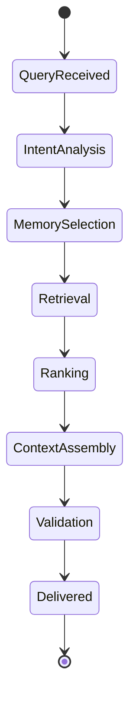
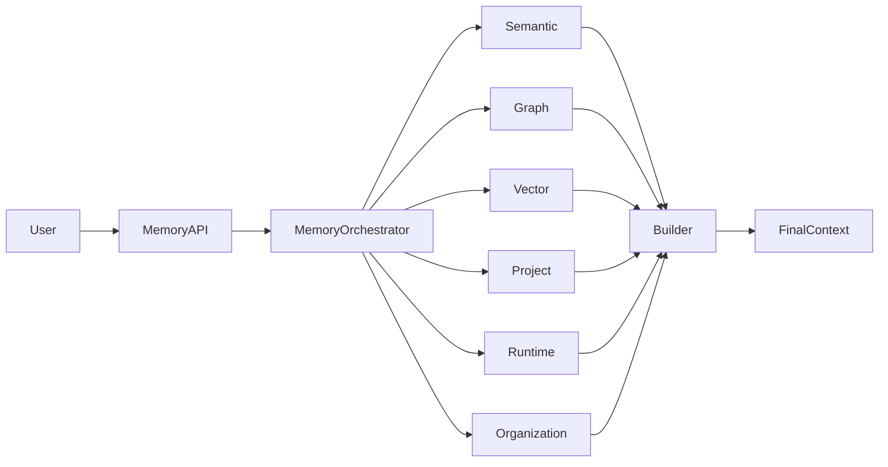

# Enterprise AI Software Factory
# Architecture Design Specification (ADS)

> **Document ID:** ADS-023-v2
>
> **Document Name:** Enterprise Context & Memory Plane — Memory Algorithms & Context Retrieval
>
> **Version:** 2.0.0
>
> **Classification:** Enterprise Platform Plane
>
> **Importance:** CRITICAL
>
> **Depends On:** ADS-023-v1
>
> **Next:** ADS-023-v3 — APIs, Events & Contracts

---

# Executive Summary

This document defines the algorithms that transform the Memory Plane into a cognitive memory system.

Unlike traditional Retrieval-Augmented Generation (RAG), the Enterprise Memory Plane combines multiple retrieval techniques, explicit knowledge graphs, runtime context, software architecture metadata, and organizational knowledge into a unified context assembly engine.

Retrieval is no longer "search".

Retrieval becomes reasoning.

---

# Design Philosophy

Memory retrieval follows six principles.

- Retrieve only relevant context
- Prefer explicit relationships over similarity
- Assemble context deterministically
- Preserve traceability
- Minimize hallucination risk
- Respect tenant boundaries

Every retrieval operation produces explainable results.

---

# Cognitive Memory Architecture

```mermaid
flowchart TB

Query

-->

Memory Orchestrator

Memory Orchestrator

-->

Semantic Memory

Memory Orchestrator

-->

Knowledge Graph

Memory Orchestrator

-->

Vector Store

Memory Orchestrator

-->

Runtime Memory

Memory Orchestrator

-->

Workflow Memory

Memory Orchestrator

-->

Organizational Memory

Semantic Memory --> Context Builder

Knowledge Graph --> Context Builder

Vector Store --> Context Builder

Runtime Memory --> Context Builder

Workflow Memory --> Context Builder

Organizational Memory --> Context Builder

Context Builder --> Final Context
```

The Memory Orchestrator decides which memory systems participate in each query.

---

# Retrieval Pipeline

```text
Incoming Request

↓

Intent Analysis

↓

Memory Selection

↓

Parallel Retrieval

↓

Relationship Expansion

↓

Context Ranking

↓

Conflict Resolution

↓

Context Assembly

↓

Final Prompt
```

Each stage is deterministic and observable.

---

# Memory Selection Algorithm

## ALG-023-001

The Memory Orchestrator first classifies the request.

| Request Type | Memory Sources |
|---------------|----------------|
| Code Generation | Source Code + Architecture + Runtime |
| Debugging | Episodic + Runtime + Source Code |
| Planning | Semantic + Organizational + Architecture |
| Deployment | Procedural + Runtime + Policies |
| Security | Organizational + Security Knowledge + Runtime |
| Refactoring | Source Code + Knowledge Graph |

Unnecessary memory systems are excluded.

---

# Working Memory

Working Memory stores

- Current prompt
- Active workflow
- Active task
- Active files
- Current execution state

Lifetime

```
Minutes
```

Storage

```
In-Memory Only
```

---

# Session Memory

Stores

- Current conversation
- Previous tool outputs
- Intermediate reasoning artifacts
- Workflow checkpoints

Lifetime

```
Hours
```

---

# Project Memory

Stores

- Source code
- ADRs
- TDRs
- APIs
- Requirements
- Test suites
- Architecture diagrams

Lifetime

```
Project Duration
```

---

# Organizational Memory

Stores

- Engineering standards
- Coding guidelines
- Security policies
- Compliance rules
- Preferred architectures
- Reusable patterns

Lifetime

```
Years
```

---

# ALG-023-002

## Hybrid Retrieval

The Memory Plane combines multiple retrieval strategies.

```text
Knowledge Graph

+

Vector Search

+

Keyword Search

+

AST Relationships

+

Runtime Context

=

Hybrid Context
```

Each retrieval strategy contributes independently.

---

# Knowledge Graph Traversal

The Knowledge Graph stores explicit software relationships.

Example

```text
AuthController

↓

AuthService

↓

UserRepository

↓

Database Schema

↓

Migration

↓

Integration Tests
```

Traversal uses graph edges rather than semantic similarity.

---

# Vector Retrieval

Vector search is used only for

- Natural language
- Design documents
- Engineering discussions
- Documentation
- Historical reviews

Vector search is never the sole retrieval strategy.

---

# AST Retrieval

The Source Code Memory indexes

- AST nodes
- Symbols
- Imports
- Function calls
- Dependencies
- Interfaces

Example

```text
API Route

↓

Service

↓

Repository

↓

Entity

↓

Migration

↓

Tests
```

AST relationships provide deterministic context.

---

# Runtime Context

Runtime Memory stores

- Active workflow
- Active branch
- Pending tasks
- Running agents
- Open pull requests
- Active deployments

Runtime context has highest priority.

---

# Context Ranking

Retrieved information is ranked using

- Relevance
- Freshness
- Dependency Distance
- Trust Level
- Workflow State
- User Intent

Ranking produces a deterministic order.

---

# ALG-023-003

## GraphRAG Traversal

Graph traversal follows explicit relationships rather than embedding similarity.

Traversal begins from one or more root entities.

```text
Requirement

↓

Architecture

↓

Component

↓

API

↓

Service

↓

Repository

↓

Tests

↓

Deployment
```

Traversal depth is configurable.

Default depth

```
5
```

Traversal never crosses tenant boundaries.

---

# ALG-023-004

## Context Expansion

After primary retrieval, related knowledge is expanded.

Expansion sources

- Parent nodes
- Child nodes
- Dependency graph
- Workflow history
- ADR references
- TDR references
- API contracts

Expansion stops when

- Context budget reached
- Relevance threshold drops
- Maximum graph depth reached

---

# ALG-023-005

## Context Deduplication

Multiple retrieval engines may return identical information.

Deduplication process

```text
Collect Results

↓

Normalize

↓

Hash

↓

Merge Duplicates

↓

Preserve Provenance

↓

Forward
```

Duplicate context is removed before ranking.

---

# ALG-023-006

## Conflict Resolution

Conflicting knowledge is resolved deterministically.

Priority order

```text
Runtime Context

↓

Workflow Context

↓

Project Memory

↓

Architecture Memory

↓

Organizational Memory

↓

Semantic Memory
```

Higher-priority memory overrides lower-priority memory.

Conflicts are recorded for auditing.

---

# ALG-023-007

## Context Assembly

The Context Builder assembles the final prompt package.

Assembly order

```text
Identity Context

↓

Workflow Context

↓

Task Context

↓

Architecture

↓

Relevant Source Code

↓

Tests

↓

Policies

↓

Supporting Documents

↓

Historical Knowledge
```

Context order is deterministic.

---

# ALG-023-008

## Memory Provenance

Every memory object records provenance.

| Attribute | Purpose |
|-----------|---------|
| Memory ID | Unique identifier |
| Source | Human, AI Agent, External |
| Tenant | Ownership |
| Workflow | Originating workflow |
| Version | Object version |
| Created | Creation timestamp |
| Verified | Last verification |
| Confidence | Trust level |
| Integrity Hash | Tamper detection |

Provenance travels with every retrieval.

---

# ALG-023-009

## Memory Aging

Not all knowledge remains equally valuable.

Memory aging considers

- Age
- Access Frequency
- Verification Date
- Project Activity
- Business Importance

Lifecycle

```text
Hot

↓

Warm

↓

Cold

↓

Archive
```

Archived memory remains searchable.

---

# ALG-023-010

## Learning Feedback

Every completed workflow contributes back into memory.

Learning sources

- Successful implementations
- Failed deployments
- Security incidents
- Human reviews
- Performance reports
- Production telemetry

Knowledge is curated before publication.

---

# Memory Consistency Rules

Every memory object MUST satisfy

- Unique identifier
- Version history
- Provenance metadata
- Tenant ownership
- Integrity verification
- Access policy

Invalid memory objects are quarantined.

---

# Memory Retrieval State Machine



Every query follows this lifecycle.

---

# Memory Topology



---

# Retrieval Decision Matrix

| Request | Primary Memory | Secondary Memory |
|----------|----------------|------------------|
| Generate Code | Source Code | Architecture |
| Debug Bug | Runtime | Episodic |
| Explain Design | Architecture | ADRs |
| Security Review | Organizational | Runtime |
| Refactor | AST Graph | Source Code |
| Deploy | Procedural | Runtime |

---

# Complexity Analysis

| Operation | Complexity |
|------------|------------|
| Vector Search | O(log n) |
| Graph Traversal | O(V + E) |
| AST Lookup | O(log n) |
| Context Ranking | O(n log n) |
| Deduplication | O(n) |
| Context Assembly | O(n) |

Where

- **V** = graph vertices
- **E** = graph edges
- **n** = retrieved memory objects

---

# Runtime Metrics

```text
memory_queries_total

memory_query_latency_seconds

memory_graph_traversals_total

memory_vector_search_total

memory_context_size_bytes

memory_cache_hit_ratio

memory_conflicts_detected_total

memory_deduplicated_objects_total

memory_provenance_verified_total

memory_context_assembly_duration_seconds
```

---

# Architecture Decision Records

## ADR-023-03

### Decision

Adopt hybrid retrieval instead of vector-only retrieval.

### Status

Accepted

### Reason

Engineering knowledge exists in structured relationships that embeddings alone cannot represent.

---

## ADR-023-04

### Decision

Treat provenance as part of every memory object.

### Status

Accepted

### Reason

Provenance improves explainability, auditing, and trustworthiness.

---

## ADR-023-05

### Decision

Separate retrieval orchestration from memory storage.

### Status

Accepted

### Reason

Storage technologies can evolve independently while retrieval behavior remains consistent.

---

# Operational Readiness Scorecard

| Capability | Status |
|------------|--------|
| Hybrid Retrieval | ✅ Required |
| GraphRAG | ✅ Required |
| Provenance Tracking | ✅ Required |
| Context Assembly | ✅ Required |
| Deterministic Ranking | ✅ Required |
| Memory Governance | ✅ Required |
| Multi-Tenant Isolation | ✅ Required |
| Explainable Retrieval | ✅ Required |

---

# Related Documents

ADS-021-v5 — Workflow State Machine

ADS-022-v5 — Identity & Trust Plane

ADS-023-v1 — Enterprise Memory Plane Architecture

ADS-023-v3 — APIs, Events & Contracts

ADS-024-v1 — Execution Plane

---

# End of Document
