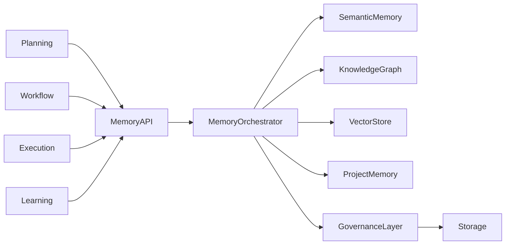
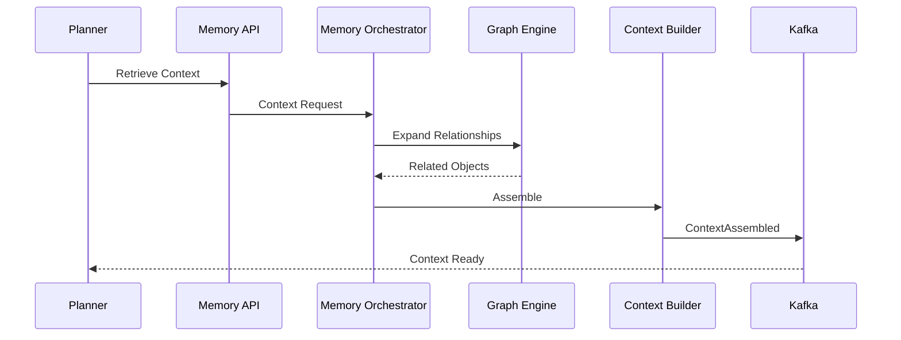
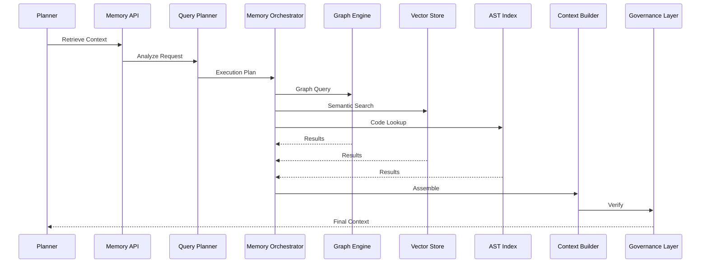

# Enterprise AI Software Factory
# Architecture Design Specification (ADS)

> **Document ID:** ADS-023-v3
>
> **Document Name:** Enterprise Context & Memory Plane — APIs, Events & Contracts
>
> **Version:** 2.0.0
>
> **Status:** Draft
>
> **Classification:** Enterprise Platform Plane
>
> **Importance:** CRITICAL
>
> **Depends On:** ADS-023-v1
>
> **Depends On:** ADS-023-v2
>
> **Next:** ADS-023-v4 — Runtime & Memory Infrastructure

---

# Executive Summary

The Memory Plane exposes standardized APIs, event contracts, retrieval interfaces, indexing services, graph traversal endpoints, provenance queries, and memory governance operations.

Every subsystem interacts with memory exclusively through these contracts.

Memory implementations may evolve.

Contracts remain stable.

---

# Communication Principles

Every memory operation MUST satisfy

- Authenticated
- Authorized
- Tenant Isolated
- Versioned
- Observable
- Replayable
- Auditable
- Idempotent

No subsystem directly accesses storage engines.

---

# Memory Communication Architecture



The Memory Orchestrator becomes the single entry point for every retrieval request.

---

# Public REST API

The Memory Plane exposes REST endpoints for

- Dashboard
- CLI
- Enterprise Integrations
- AI Agents
- External Systems

---

## API-023-001

### Store Memory

```http
POST /memory/v1/objects
```

Purpose

Stores a new memory object.

---

Request

```json
{
  "memoryType":"Architecture",
  "projectId":"PROJ-001",
  "workflowId":"WF-2026-001",
  "title":"Authentication ADR",
  "content":"..."
}
```

---

Response

```json
{
  "memoryId":"MEM-2026-001",
  "version":"1",
  "status":"Stored"
}
```

---

## API-023-002

### Retrieve Context

```http
POST /memory/v1/context
```

Returns

- Ranked Context
- Provenance
- Confidence
- Sources
- Retrieval Metrics

---

## API-023-003

### Search Memory

```http
GET /memory/v1/search
```

Supported

- Keyword
- Semantic
- Graph
- Hybrid

---

## API-023-004

### Update Memory

```http
PUT /memory/v1/objects/{memoryId}
```

Creates

A new version.

Existing versions remain immutable.

---

## API-023-005

### Archive Memory

```http
POST /memory/v1/objects/{memoryId}/archive
```

Memory becomes read-only.

---

# Internal gRPC Services

```protobuf
service MemoryService {

rpc StoreMemory(StoreMemoryRequest)

returns(StoreMemoryResponse);

rpc RetrieveContext(ContextRequest)

returns(ContextResponse);

rpc GraphTraversal(GraphRequest)

returns(GraphResponse);

rpc RankContext(RankingRequest)

returns(RankingResponse);

rpc VerifyProvenance(ProvenanceRequest)

returns(ProvenanceResponse);

}
```

---

# Memory Object Schema

```protobuf
message MemoryObject {

string memory_id = 1;

string tenant_id = 2;

string project_id = 3;

string workflow_id = 4;

string memory_type = 5;

int32 version = 6;

string integrity_hash = 7;

}
```

---

# Context Response Schema

```protobuf
message ContextResponse {

repeated MemoryObject objects = 1;

double confidence = 2;

int32 total_objects = 3;

int64 retrieval_time_ms = 4;

}
```

---

# MCP Tool Contracts

The Memory Plane exposes standardized tools.

```
store_memory

retrieve_context

search_memory

graph_traversal

verify_provenance

archive_memory

memory_statistics

context_builder
```

Every invocation is authenticated and audited.

---

# Memory Events

Every memory operation generates immutable events.

---

## EVT-023-001

MemoryStored

---

## EVT-023-002

MemoryRetrieved

---

## EVT-023-003

MemoryIndexed

---

## EVT-023-004

GraphTraversalCompleted

---

## EVT-023-005

ContextAssembled

---

## EVT-023-006

MemoryArchived

---

## EVT-023-007

MemoryVersionCreated

---

## EVT-023-008

MemoryVerified

---

## Event Flow



---

# Event Ordering

```
MemoryStored

↓

MemoryIndexed

↓

MemoryVerified

↓

ContextRetrieved

↓

ContextAssembled
```

Events are immutable and append-only.

---

# Event Metadata

Every event contains

```yaml
eventId:
memoryId:
workflowId:
tenantId:
traceId:
correlationId:
retrievalStrategy:
confidence:
timestamp:
schemaVersion:
```

---

# Contract Validation

Every request entering the Memory Plane follows a deterministic validation pipeline.

```text
Receive Request

↓

Schema Validation

↓

Authentication

↓

Authorization

↓

Tenant Validation

↓

Governance Validation

↓

Memory Planning

↓

Retrieval

↓

Context Assembly
```

Any validation failure terminates the request.

---

# Validation Rules

Every request MUST satisfy

| Rule | Description |
|------|-------------|
| API Version | Supported contract version |
| Authentication | Valid identity |
| Authorization | Required permission |
| Tenant Isolation | Same tenant |
| Data Classification | Access permitted |
| Governance | Memory policy satisfied |
| Memory Version | Valid version |
| Integrity Hash | Verified |

Requests failing validation are rejected.

---

# Authentication

Authentication is delegated to the Identity Plane.

Supported methods

- OAuth2.1
- OIDC
- SPIFFE
- mTLS
- Service Accounts

Memory services never authenticate users directly.

---

# Authorization

Authorization evaluates

- RBAC
- ABAC
- Project Membership
- Workflow Ownership
- Data Classification
- Organizational Policies

Decision

```text
Allow

↓

Retrieve

Deny

↓

Reject

Escalate

↓

Human Approval
```

Every authorization decision is audited.

---

# Memory Query Planner

Every request first enters the Query Planner.

Responsibilities

- Intent Detection
- Context Budget Calculation
- Retrieval Strategy Selection
- Parallel Query Planning
- Cost Estimation
- Latency Prediction

Planner Output

```yaml
intent:
memoryDomains:
retrievalStrategies:
estimatedLatency:
estimatedObjects:
contextBudget:
```

The planner minimizes unnecessary retrieval.

---

# Retrieval Strategies

Supported retrieval modes

| Strategy | Purpose |
|----------|---------|
| GraphRAG | Relationship traversal |
| Vector Search | Semantic similarity |
| Keyword Search | Exact lookup |
| AST Traversal | Source code |
| Metadata Search | Structured filters |
| Hybrid | Combined retrieval |

Strategies may execute in parallel.

---

# Multi-Tenant Isolation

Memory is partitioned by tenant.

```text
Tenant

↓

Organization

↓

Project

↓

Memory Namespace

↓

Objects
```

Cross-tenant retrieval is prohibited unless explicitly delegated.

---

# Memory Governance

Every retrieved object passes through governance.

Validation includes

- Classification
- Retention Policy
- Legal Hold
- PII Detection
- Integrity Verification
- Provenance Validation

Only compliant memory is returned.

---

# Memory Provenance

Every retrieved object includes provenance.

```yaml
memoryId:
origin:
createdBy:
verifiedBy:
workflow:
project:
tenant:
version:
confidence:
integrityHash:
```

Agents receive provenance alongside content.

---

# Runtime Sequence



---

# Retry Policy

Retryable operations

| Operation | Retry |
|------------|------:|
| Vector Store Timeout | Yes |
| Graph Timeout | Yes |
| Search Timeout | Yes |
| Cache Miss | Yes |
| Invalid Memory Object | No |
| Governance Failure | No |
| Authorization Failure | No |

Retry Schedule

```text
1 s

↓

2 s

↓

4 s

↓

8 s

↓

Escalation
```

---

# Circuit Breakers

Repeated failures isolate unhealthy storage systems.

```text
Failure

↓

Retry

↓

Threshold

↓

Circuit Open

↓

Fallback Retrieval

↓

Recovery Probe

↓

Circuit Closed
```

Fallback strategies ensure retrieval continuity.

---

# Distributed Tracing

Every retrieval receives

- Trace ID
- Query ID
- Workflow ID
- Memory Session ID

Trace Flow

```text
Memory API

↓

Query Planner

↓

Memory Orchestrator

↓

Storage Engines

↓

Context Builder

↓

Governance Layer

↓

Client
```

Every retrieval stage contributes spans.

---

# Prometheus Metrics

```text
memory_requests_total

memory_query_latency_seconds

memory_query_planner_duration_seconds

memory_context_size_bytes

memory_objects_returned_total

memory_graph_queries_total

memory_vector_queries_total

memory_governance_denied_total

memory_cache_hit_ratio

memory_provenance_verified_total
```

---

# Structured Logging

Example

```json
{
  "traceId":"trace-4101",
  "queryId":"QRY-991",
  "workflowId":"WF-2026-001",
  "retrievalStrategy":"Hybrid",
  "objectsReturned":34,
  "latencyMs":72,
  "confidence":0.97
}
```

Logs are immutable and searchable.

---

# Audit Records

Every retrieval records

- Query ID
- Identity ID
- Tenant
- Memory Domains
- Retrieved Objects
- Governance Decisions
- Context Budget
- Timestamp
- Trace ID

Audit history is append-only.

---

# Reference Standards & Specifications

The Memory Plane aligns with

| Standard / Specification | Purpose |
|--------------------------|---------|
| Model Context Protocol (MCP) | Standardized tool integration |
| OpenTelemetry | Distributed tracing |
| OpenSearch API | Search abstraction |
| GraphQL (optional) | Flexible retrieval APIs |
| JSON Schema | Memory validation |
| OpenAPI 3.1 | REST contract definition |
| Apache Kafka | Event streaming |
| Neo4j Property Graph Model | Graph relationships |

---

# Architecture Decision Records

## ADR-023-06

### Decision

Introduce a dedicated Memory Query Planner.

### Status

Accepted

### Reason

Separating planning from retrieval improves efficiency, explainability, and scalability.

---

## ADR-023-07

### Decision

Always attach provenance metadata to retrieved context.

### Status

Accepted

### Reason

Provenance enables trust-aware reasoning and reduces hallucination risk.

---

## ADR-023-08

### Decision

Enforce governance before returning memory objects.

### Status

Accepted

### Reason

Compliance, privacy, and tenant isolation must be guaranteed before context reaches AI agents.

---

# Operational Readiness Scorecard

| Capability | Status |
|------------|--------|
| Query Planning | ✅ Required |
| Hybrid Retrieval | ✅ Required |
| Governance Enforcement | ✅ Required |
| Provenance Tracking | ✅ Required |
| Multi-Tenant Isolation | ✅ Required |
| Explainable Retrieval | ✅ Required |
| Distributed Tracing | ✅ Required |
| Standards Compliance | ✅ Required |

---

# Related Documents

ADS-022-v5 — Identity & Trust Plane

ADS-023-v1 — Architecture

ADS-023-v2 — Memory Algorithms & Context Retrieval

ADS-023-v4 — Runtime & Memory Infrastructure

ADS-024-v1 — Execution Plane

---

# End of Document
