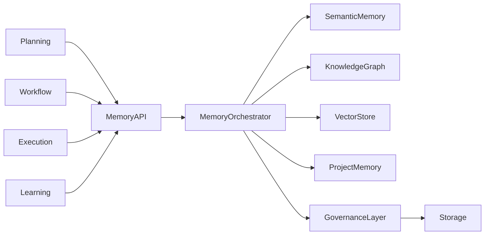
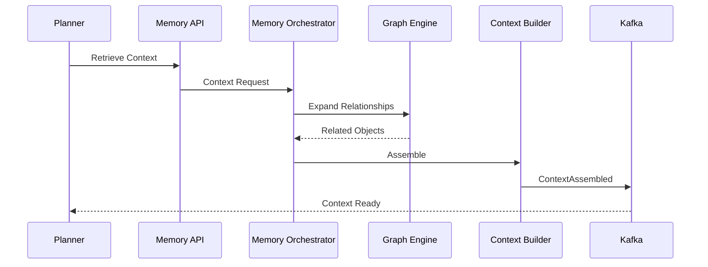

# Enterprise AI Software Factory
# Architecture Design Specification (ADS)

> **Document ID:** ADS-023-v3
>
> **Document Name:** Enterprise Context & Memory Plane — APIs, Events & Contracts
>
> **Version:** 2.0.0
>
> **Classification:** Enterprise Platform Plane
>
> **Importance:** CRITICAL
>
> **Depends On:** ADS-023-v1
>
> **Depends On:** ADS-023-v2
>
> **Next:** ADS-023-v4 — Runtime & Memory Infrastructure

---

# Executive Summary

The Memory Plane exposes standardized APIs, event contracts, retrieval interfaces, indexing services, graph traversal endpoints, provenance queries, and memory governance operations.

Every subsystem interacts with memory exclusively through these contracts.

Memory implementations may evolve.

Contracts remain stable.

---

# Communication Principles

Every memory operation MUST satisfy

- Authenticated
- Authorized
- Tenant Isolated
- Versioned
- Observable
- Replayable
- Auditable
- Idempotent

No subsystem directly accesses storage engines.

---

# Memory Communication Architecture



The Memory Orchestrator becomes the single entry point for every retrieval request.

---

# Public REST API

The Memory Plane exposes REST endpoints for

- Dashboard
- CLI
- Enterprise Integrations
- AI Agents
- External Systems

---

## API-023-001

### Store Memory

```http
POST /memory/v1/objects
```

Purpose

Stores a new memory object.

---

Request

```json
{
  "memoryType":"Architecture",
  "projectId":"PROJ-001",
  "workflowId":"WF-2026-001",
  "title":"Authentication ADR",
  "content":"..."
}
```

---

Response

```json
{
  "memoryId":"MEM-2026-001",
  "version":"1",
  "status":"Stored"
}
```

---

## API-023-002

### Retrieve Context

```http
POST /memory/v1/context
```

Returns

- Ranked Context
- Provenance
- Confidence
- Sources
- Retrieval Metrics

---

## API-023-003

### Search Memory

```http
GET /memory/v1/search
```

Supported

- Keyword
- Semantic
- Graph
- Hybrid

---

## API-023-004

### Update Memory

```http
PUT /memory/v1/objects/{memoryId}
```

Creates

A new version.

Existing versions remain immutable.

---

## API-023-005

### Archive Memory

```http
POST /memory/v1/objects/{memoryId}/archive
```

Memory becomes read-only.

---

# Internal gRPC Services

```protobuf
service MemoryService {

rpc StoreMemory(StoreMemoryRequest)

returns(StoreMemoryResponse);

rpc RetrieveContext(ContextRequest)

returns(ContextResponse);

rpc GraphTraversal(GraphRequest)

returns(GraphResponse);

rpc RankContext(RankingRequest)

returns(RankingResponse);

rpc VerifyProvenance(ProvenanceRequest)

returns(ProvenanceResponse);

}
```

---

# Memory Object Schema

```protobuf
message MemoryObject {

string memory_id = 1;

string tenant_id = 2;

string project_id = 3;

string workflow_id = 4;

string memory_type = 5;

int32 version = 6;

string integrity_hash = 7;

}
```

---

# Context Response Schema

```protobuf
message ContextResponse {

repeated MemoryObject objects = 1;

double confidence = 2;

int32 total_objects = 3;

int64 retrieval_time_ms = 4;

}
```

---

# MCP Tool Contracts

The Memory Plane exposes standardized tools.

```
store_memory

retrieve_context

search_memory

graph_traversal

verify_provenance

archive_memory

memory_statistics

context_builder
```

Every invocation is authenticated and audited.

---

# Memory Events

Every memory operation generates immutable events.

---

## EVT-023-001

MemoryStored

---

## EVT-023-002

MemoryRetrieved

---

## EVT-023-003

MemoryIndexed

---

## EVT-023-004

GraphTraversalCompleted

---

## EVT-023-005

ContextAssembled

---

## EVT-023-006

MemoryArchived

---

## EVT-023-007

MemoryVersionCreated

---

## EVT-023-008

MemoryVerified

---

## Event Flow



---

# Event Ordering

```
MemoryStored

↓

MemoryIndexed

↓

MemoryVerified

↓

ContextRetrieved

↓

ContextAssembled
```

Events are immutable and append-only.

---

# Event Metadata

Every event contains

```yaml
eventId:
memoryId:
workflowId:
tenantId:
traceId:
correlationId:
retrievalStrategy:
confidence:
timestamp:
schemaVersion:
```

---

# End of Part 1
