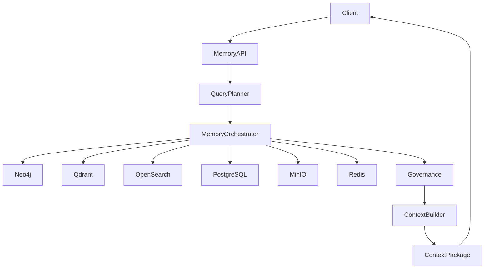
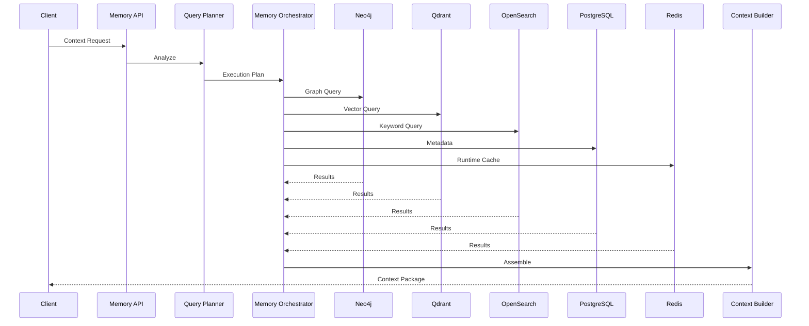

# Enterprise AI Software Factory
# Architecture Design Specification (ADS)

> **Document ID:** ADS-023-v4
>
> **Document Name:** Enterprise Context & Memory Plane — Runtime & Memory Infrastructure
>
> **Version:** 2.0.0
>
> **Classification:** Enterprise Runtime Specification
>
> **Importance:** CRITICAL
>
> **Depends On:** ADS-023-v1
>
> **Depends On:** ADS-023-v2
>
> **Depends On:** ADS-023-v3
>
> **Next:** ADS-023-v5 — End-to-End Memory Lifecycle

---

# Executive Summary

The Runtime & Memory Infrastructure defines how enterprise memory is deployed, synchronized, queried, governed, replicated, and protected in production.

Unlike traditional RAG systems that rely on a single vector database, the Enterprise Memory Plane consists of multiple specialized storage engines orchestrated as a single logical memory platform.

The runtime guarantees

- deterministic retrieval
- low-latency context assembly
- tenant isolation
- continuous synchronization
- high availability
- governance enforcement

---

# Runtime Philosophy

The runtime follows seven principles.

- Storage specialization
- Retrieval orchestration
- Immutable memory
- Distributed synchronization
- Continuous indexing
- Automatic governance
- Horizontal scalability

---

# Four Runtime Layers

## Logical Layer

Responsible for

- Memory APIs
- Query Planning
- Retrieval Orchestration
- Context Assembly

---

## Storage Layer

Responsible for

- Vector Store
- Graph Database
- Relational Metadata
- Search Index
- Object Storage

---

## Operational Layer

Responsible for

- Scaling
- Replication
- Backup
- Recovery
- Maintenance

---

## Governance Layer

Responsible for

- Compliance
- Classification
- Retention
- Provenance
- Access Policies

---

# Runtime Architecture



The Memory Orchestrator coordinates every storage engine.

---

# Runtime Components

| Component | Responsibility |
|------------|----------------|
| Memory API | Entry point |
| Query Planner | Retrieval planning |
| Memory Orchestrator | Storage coordination |
| Neo4j | Relationship graph |
| Qdrant | Vector similarity |
| PostgreSQL | Structured metadata |
| OpenSearch | Keyword search |
| Redis | Hot cache |
| MinIO | Large artifacts |
| Governance Layer | Policy enforcement |
| Context Builder | Final context assembly |

---

# Memory Storage Topology

```text
Working Memory

↓

Redis

↓

Session Memory

↓

PostgreSQL

↓

Project Memory

↓

Neo4j

↓

Vector Memory

↓

Qdrant

↓

Artifacts

↓

MinIO
```

Each storage engine specializes in one workload.

---

# Query Execution Pipeline



---

# Storage Responsibilities

## Redis

Stores

- Working Memory
- Active Sessions
- Runtime Context
- Temporary Retrieval Cache

---

## PostgreSQL

Stores

- Metadata
- Memory Catalog
- Version History
- Provenance
- Governance Records

---

## Neo4j

Stores

- Architecture Relationships
- Dependency Graphs
- Code Graphs
- Workflow Graphs
- ADR Links

---

## Qdrant

Stores

- Embeddings
- Semantic Similarity
- Documentation Vectors
- Design Discussions

---

## OpenSearch

Stores

- Keywords
- Logs
- Exact Search
- Documentation

---

## MinIO

Stores

- Documents
- Images
- Build Artifacts
- Architecture Diagrams
- PDFs

---

# Runtime Guarantees

The Memory Plane guarantees

- deterministic retrieval
- immutable history
- replayable context
- distributed storage
- explainable retrieval
- continuous synchronization
- tenant isolation

---

# End of Part 1
