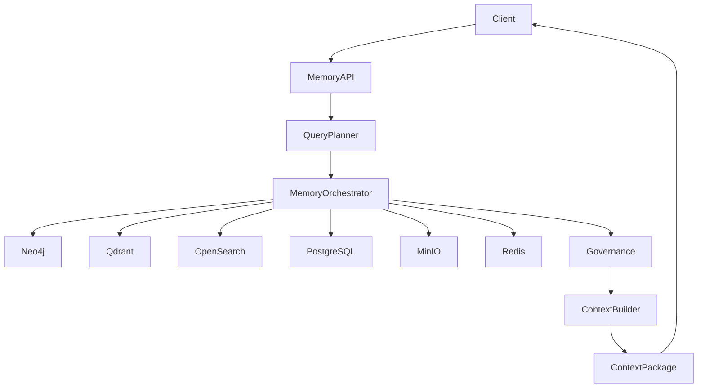
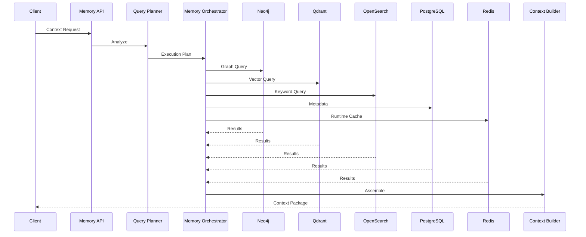
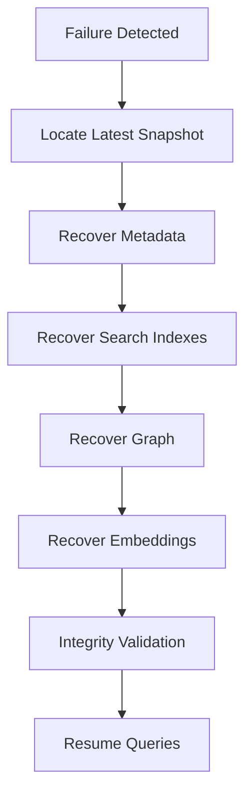
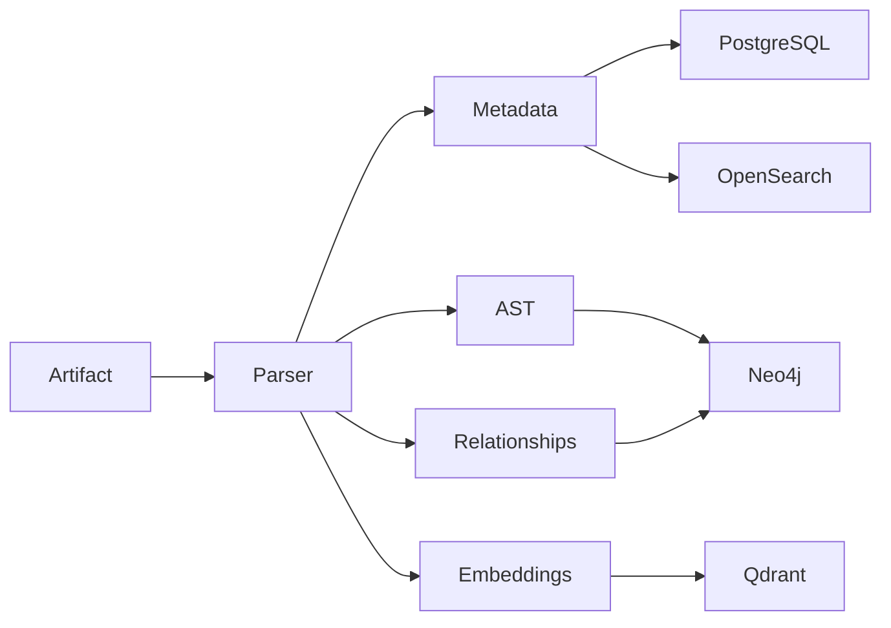
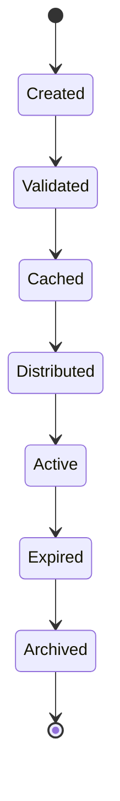

# Enterprise AI Software Factory
# Architecture Design Specification (ADS)

> **Document ID:** ADS-023-v4
>
> **Document Name:** Enterprise Context & Memory Plane — Runtime & Memory Infrastructure
>
> **Version:** 2.0.0
>
> **Classification:** Enterprise Runtime Specification
>
> **Importance:** CRITICAL
>
> **Depends On:** ADS-023-v1
>
> **Depends On:** ADS-023-v2
>
> **Depends On:** ADS-023-v3
>
> **Next:** ADS-023-v5 — End-to-End Memory Lifecycle

---

# Executive Summary

The Runtime & Memory Infrastructure defines how enterprise memory is deployed, synchronized, queried, governed, replicated, and protected in production.

Unlike traditional RAG systems that rely on a single vector database, the Enterprise Memory Plane consists of multiple specialized storage engines orchestrated as a single logical memory platform.

The runtime guarantees

- deterministic retrieval
- low-latency context assembly
- tenant isolation
- continuous synchronization
- high availability
- governance enforcement

---

# Runtime Philosophy

The runtime follows seven principles.

- Storage specialization
- Retrieval orchestration
- Immutable memory
- Distributed synchronization
- Continuous indexing
- Automatic governance
- Horizontal scalability

---

# Four Runtime Layers

## Logical Layer

Responsible for

- Memory APIs
- Query Planning
- Retrieval Orchestration
- Context Assembly

---

## Storage Layer

Responsible for

- Vector Store
- Graph Database
- Relational Metadata
- Search Index
- Object Storage

---

## Operational Layer

Responsible for

- Scaling
- Replication
- Backup
- Recovery
- Maintenance

---

## Governance Layer

Responsible for

- Compliance
- Classification
- Retention
- Provenance
- Access Policies

---

# Runtime Architecture



The Memory Orchestrator coordinates every storage engine.

---

# Runtime Components

| Component | Responsibility |
|------------|----------------|
| Memory API | Entry point |
| Query Planner | Retrieval planning |
| Memory Orchestrator | Storage coordination |
| Neo4j | Relationship graph |
| Qdrant | Vector similarity |
| PostgreSQL | Structured metadata |
| OpenSearch | Keyword search |
| Redis | Hot cache |
| MinIO | Large artifacts |
| Governance Layer | Policy enforcement |
| Context Builder | Final context assembly |

---

# Memory Storage Topology

```text
Working Memory

↓

Redis

↓

Session Memory

↓

PostgreSQL

↓

Project Memory

↓

Neo4j

↓

Vector Memory

↓

Qdrant

↓

Artifacts

↓

MinIO
```

Each storage engine specializes in one workload.

---

# Query Execution Pipeline



---

# Storage Responsibilities

## Redis

Stores

- Working Memory
- Active Sessions
- Runtime Context
- Temporary Retrieval Cache

---

## PostgreSQL

Stores

- Metadata
- Memory Catalog
- Version History
- Provenance
- Governance Records

---

## Neo4j

Stores

- Architecture Relationships
- Dependency Graphs
- Code Graphs
- Workflow Graphs
- ADR Links

---

## Qdrant

Stores

- Embeddings
- Semantic Similarity
- Documentation Vectors
- Design Discussions

---

## OpenSearch

Stores

- Keywords
- Logs
- Exact Search
- Documentation

---

## MinIO

Stores

- Documents
- Images
- Build Artifacts
- Architecture Diagrams
- PDFs

---

# Runtime Guarantees

The Memory Plane guarantees

- deterministic retrieval
- immutable history
- replayable context
- distributed storage
- explainable retrieval
- continuous synchronization
- tenant isolation

---

# Failure Recovery

The Memory Plane is designed to recover without losing contextual integrity.

Recovery always restores the latest verified memory state before accepting new requests.



Recovery guarantees

- No memory corruption
- No orphaned graph nodes
- No broken provenance
- No duplicate memory objects

---

# Runtime Synchronization

Every storage engine operates independently while remaining logically synchronized.

Synchronization Sources

- Kafka Events
- Workflow Events
- Repository Changes
- ADR Updates
- Code Commits
- Human Reviews

Synchronization Flow

```text
Source Change

↓

Kafka Event

↓

Indexer

↓

Metadata Update

↓

Graph Update

↓

Embedding Update

↓

Search Index Update

↓

Context Cache Refresh
```

Synchronization is asynchronous but deterministic.

---

# Distributed Indexing

Every new artifact follows a common indexing pipeline.



Each artifact may populate multiple storage systems.

---

# Cache Hierarchy

The runtime uses multiple cache levels.

```text
L1

Worker Memory

↓

L2

Redis

↓

L3

Context Package Cache

↓

Persistent Storage
```

Cache invalidation occurs automatically when underlying memory changes.

---

# Context Package Lifecycle

Context Packages are treated as managed runtime objects.



Every Context Package has

- Package ID
- Query Plan
- Retrieved Objects
- Provenance
- Trust Score
- TTL
- Version

---

# Horizontal Scaling

Memory services scale independently.

Scaling Inputs

- Query Rate
- Graph Traversals
- Vector Searches
- Context Assembly Time
- Cache Hit Ratio
- CPU Utilization
- Memory Utilization

Scaling Flow

```text
Increased Load

↓

Autoscaler

↓

Provision New Pods

↓

Join Service Mesh

↓

Register with Orchestrator

↓

Serve Requests
```

Storage engines scale independently according to workload.

---

# Runtime Health Monitoring

Every component continuously publishes health metrics.

Collected Metrics

- CPU
- Memory
- Disk Usage
- Index Queue Length
- Cache Hit Ratio
- Graph Traversal Latency
- Vector Search Latency
- Context Assembly Time

Health Pipeline

```text
Component

↓

Heartbeat

↓

Observability Plane

↓

Alert Manager

↓

Operations Dashboard
```

---

# Runtime Isolation

Memory infrastructure is deployed in dedicated namespaces.

Namespaces

- Memory API
- Query Planner
- Graph Services
- Vector Services
- Search Services
- Metadata Services
- Governance Services

Each namespace enforces

- Network Policies
- Resource Quotas
- RBAC
- Pod Security Standards
- Service Mesh Policies

---

# Runtime Configuration

Example

```yaml
memory:

  retrievalMode: hybrid

  graphTraversalDepth: 5

  contextBudgetTokens: 32000

  vectorProvider: qdrant

  graphProvider: neo4j

  metadataProvider: postgresql

  cacheProvider: redis

  packageTTL: 15m

  governanceEnabled: true

  provenanceRequired: true
```

Configuration changes are version-controlled.

---

# Performance Optimizations

The runtime optimizes retrieval using

- Parallel Storage Queries
- Context Package Reuse
- Incremental Indexing
- AST Caching
- Graph Traversal Caching
- Vector Quantization
- Adaptive Query Planning

Optimizations must preserve deterministic retrieval.

---

# Observability

Every retrieval emits

- Metrics
- Traces
- Structured Logs
- Governance Events
- Retrieval Events
- Context Package Events

No retrieval occurs without telemetry.

---

# Prometheus Metrics

```text
memory_requests_total

memory_context_packages_created_total

memory_cache_hit_ratio

memory_graph_latency_seconds

memory_vector_latency_seconds

memory_indexing_duration_seconds

memory_context_build_duration_seconds

memory_package_reuse_total

memory_storage_sync_latency_seconds

memory_governance_actions_total
```

---

# OpenTelemetry

Distributed tracing spans

```text
Memory API

↓

Query Planner

↓

Memory Orchestrator

↓

Storage Engines

↓

Governance Layer

↓

Context Builder

↓

Client
```

Every retrieval stage contributes spans.

---

# Structured Logging

Example

```json
{
  "traceId":"trace-5201",
  "packageId":"CTX-001",
  "queryId":"QRY-991",
  "retrievalMode":"Hybrid",
  "memoryObjects":42,
  "assemblyTimeMs":68,
  "cacheHit":true
}
```

Logs are immutable and retained according to governance policy.

---

# Disaster Recovery

Recovery Process

```text
Storage Failure

↓

Replica Promotion

↓

Metadata Validation

↓

Graph Consistency Check

↓

Embedding Verification

↓

Context Package Rebuild

↓

Resume Operations
```

Recovery Targets

Recovery Point Objective (RPO)

Near-zero data loss

Recovery Time Objective (RTO)

Less than five minutes

---

# Recommended Production Deployment

```text
Kubernetes Cluster

↓

Memory Namespace

↓

Memory API

↓

Query Planner

↓

Memory Orchestrator

↓

Redis

↓

PostgreSQL

↓

Neo4j

↓

Qdrant

↓

OpenSearch

↓

MinIO

↓

Kafka

↓

OpenTelemetry Collector

↓

Prometheus

↓

Grafana
```

---

# Technology Decision Records

## TDR-023-01

### Technology

Qdrant

### Decision

Adopt Qdrant as the default vector database.

### Reason

Provides efficient vector indexing, filtering, horizontal scaling, and open deployment options.

---

## TDR-023-02

### Technology

Neo4j

### Decision

Adopt Neo4j for relationship-aware retrieval.

### Reason

Native graph traversal supports GraphRAG and architectural reasoning better than vector similarity alone.

---

## TDR-023-03

### Technology

OpenSearch

### Decision

Use OpenSearch for keyword and document indexing.

### Reason

Provides fast structured search, filtering, and full-text capabilities.

---

## TDR-023-04

### Technology

Redis

### Decision

Use Redis for working memory and hot retrieval cache.

### Reason

Low-latency access reduces repeated retrieval cost during active workflows.

---

## TDR-023-05

### Technology

MinIO

### Decision

Store large artifacts in S3-compatible object storage.

### Reason

Separates binary assets from metadata while maintaining portability.

---

# Runtime Checklist

The Memory Plane MUST

- Preserve provenance
- Enforce governance
- Maintain tenant isolation
- Synchronize storage engines
- Rebuild Context Packages automatically
- Support deterministic retrieval
- Scale horizontally

The Memory Plane MUST NOT

- Return unverified memory
- Cross tenant boundaries
- Bypass governance
- Modify immutable historical records
- Expose confidential memory without authorization

---

# Architecture Decision Records

## ADR-023-09

### Decision

Treat Context Packages as first-class runtime artifacts.

### Status

Accepted

### Reason

Reusable Context Packages improve consistency, reduce latency, and create an auditable record of retrieval decisions.

---

## ADR-023-10

### Decision

Separate indexing from retrieval.

### Status

Accepted

### Reason

Independent indexing enables continuous synchronization without affecting query performance.

---

## ADR-023-11

### Decision

Deploy each storage engine independently.

### Status

Accepted

### Reason

Different memory systems scale differently and should not be coupled operationally.

---

# Operational Readiness Scorecard

| Capability | Status |
|------------|--------|
| Distributed Storage | ✅ Required |
| Context Packages | ✅ Required |
| Continuous Indexing | ✅ Required |
| Automatic Synchronization | ✅ Required |
| High Availability | ✅ Required |
| Horizontal Scaling | ✅ Required |
| Memory Governance | ✅ Required |
| Full Observability | ✅ Required |

---

# Related Documents

ADS-022-v5 — Identity & Trust Plane

ADS-023-v1 — Architecture

ADS-023-v2 — Memory Algorithms & Context Retrieval

ADS-023-v3 — APIs, Events & Contracts

ADS-023-v5 — End-to-End Memory Lifecycle

ADS-024-v1 — Execution Plane

---

# End of Document
