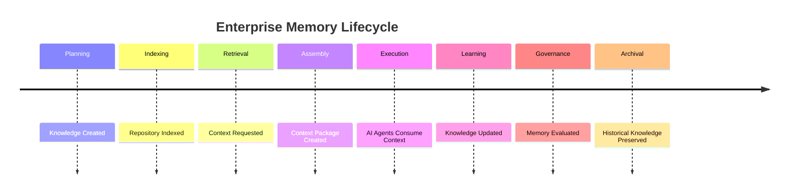

# Enterprise AI Software Factory
# Architecture Design Specification (ADS)

> **Document ID:** ADS-023-v5
>
> **Document Name:** Enterprise Context & Memory Plane — End-to-End Memory Lifecycle
>
> **Version:** 2.0.0
>
> **Classification:** Reference Implementation
>
> **Importance:** CRITICAL
>
> **Depends On:** ADS-023-v1
>
> **Depends On:** ADS-023-v2
>
> **Depends On:** ADS-023-v3
>
> **Depends On:** ADS-023-v4

---

# Executive Summary

This document demonstrates how knowledge flows through the Enterprise Memory Plane during the lifecycle of a real software engineering project.

Unlike previous documents that describe architecture and runtime behavior, this specification illustrates how memory is ingested, indexed, retrieved, governed, reused, and evolved throughout an engineering workflow.

Every stage produces observable artifacts.

Every decision remains traceable.

---

# Scenario

A development team receives a feature request.

```
Implement enterprise authentication
for a multi-tenant SaaS platform.
```

The request activates

- Planning
- Workflow Kernel
- Identity Plane
- Memory Plane
- Execution Plane

The Memory Plane continuously supports every subsystem.

---

# Stage 1 — Knowledge Ingestion

Planning produces

- Requirements
- Architecture
- ADRs
- Risk Analysis
- Task Graph

These artifacts enter the Memory Plane.

```text
Planning

↓

Parser

↓

Indexer

↓

Metadata

↓

Knowledge Graph

↓

Vector Store
```

Memory Objects Created

```
REQ-001

ARCH-001

ADR-021

TASK-001
```

---

# Stage 2 — Repository Indexing

The repository is analyzed.

Generated

- AST Graph
- Dependency Graph
- Symbol Index
- API Catalog
- Module Relationships

Storage

```
Neo4j

PostgreSQL

OpenSearch
```

Repository understanding becomes immediately searchable.

---

# Stage 3 — Workflow Context

Workflow

```
WF-2026-001
```

becomes active.

Working Memory stores

- Active branch
- Open files
- Current task
- Planner decisions
- Runtime variables

Lifetime

```
Current execution only
```

---

# Stage 4 — Context Request

The Planner Agent requests context.

Intent

```
Generate Authentication Module
```

The Query Planner analyzes

- Intent
- Workflow
- Context Budget
- Retrieval Strategy

Selected Memory

```
Architecture

↓

Source Code

↓

Security Standards

↓

Previous Authentication Modules

↓

Organizational Guidelines
```

---

# Stage 5 — Hybrid Retrieval

The Memory Orchestrator performs

```text
GraphRAG

+

Vector Search

+

Keyword Search

+

AST Traversal

+

Metadata Search
```

Results are merged.

No duplicate objects remain.

---

# Stage 6 — Governance Validation

Retrieved objects pass

- Provenance Validation
- Tenant Validation
- Policy Enforcement
- Classification Checks
- Integrity Verification

Governance Result

```
Approved
```

Only compliant objects continue.

---

# Stage 7 — Context Package Creation

The Context Builder assembles

```
CTX-2026-001
```

Package Contents

- Architecture
- Relevant Code
- API Contracts
- ADR References
- Security Policies
- Test Cases

Token Budget

```
28,000
```

Package Version

```
1.0
```

---

# Stage 8 — AI Agent Execution

The Planner Agent consumes

```
CTX-2026-001
```

Generated

- Design
- Tasks
- Implementation Plan

The Execution Plane receives the same Context Package.

Every agent operates from identical knowledge.

---

# Stage 9 — Knowledge Evolution

Development completes.

New knowledge generated

- New ADR
- New APIs
- Test Results
- Performance Metrics
- Human Review

Knowledge enters

```
Knowledge Ingestion Pipeline
```

Version

```
2
```

is created.

Original memory remains immutable.

---

# Stage 10 — Context Package Reuse

QA Agent requests

```
Authentication Context
```

The Memory Plane finds

```
CTX-2026-001
```

Cache

```
Hit
```

Package reused.

No additional retrieval required.

---

# Stage 11 — Production Feedback

Deployment completes.

Telemetry received

- Latency
- Errors
- User Feedback
- Security Alerts
- Performance

Learning Engine submits

```
Memory Update Request
```

Knowledge quality improves.

---

# Stage 12 — Memory Governance

Memory reaches retention checkpoint.

Governance evaluates

- Age
- Usage
- Compliance
- Legal Hold
- Business Value

Decision

```
Warm Storage
```

No deletion occurs.

Historical traceability remains intact.

---

# Stage 13 — Project Completion

Project closes.

Working Memory expires.

Session Memory expires.

Project Memory remains.

Organizational Memory receives

- Reusable Patterns
- Authentication Blueprint
- Security Improvements

Knowledge becomes reusable across future projects.

---

# Memory Timeline



---

# Memory Event Stream

```text
MemoryStored

↓

RepositoryIndexed

↓

ContextRequested

↓

GraphTraversalCompleted

↓

ContextPackageCreated

↓

ContextDelivered

↓

KnowledgeUpdated

↓

GovernanceValidated

↓

MemoryArchived
```

---

# Produced Artifacts

| Artifact | Identifier |
|-----------|------------|
| Memory Object | MEM-001 |
| Graph Node | NODE-001 |
| Context Package | CTX-2026-001 |
| Provenance Record | PROV-001 |
| Retrieval Plan | PLAN-QUERY-001 |
| Governance Report | GOV-001 |
| Knowledge Version | VER-002 |

---

# Runtime Metrics

| Metric | Value |
|----------|------:|
| Context Assembly Time | 74 ms |
| Graph Traversals | 18 |
| Vector Queries | 7 |
| Cache Hit Ratio | 91% |
| Memory Objects Retrieved | 43 |
| Duplicate Objects Removed | 9 |
| Provenance Verified | 43 |
| Governance Violations | 0 |

---

# Operational Readiness Scorecard

| Capability | Status |
|------------|--------|
| Hybrid Retrieval | ✅ Verified |
| Context Packages | ✅ Verified |
| Provenance | ✅ Verified |
| Governance | ✅ Verified |
| Knowledge Evolution | ✅ Verified |
| Multi-Tenant Isolation | ✅ Verified |
| Distributed Storage | ✅ Verified |
| Full Traceability | ✅ Verified |

---

# Lessons Learned

The Enterprise Memory Plane demonstrates the following principles.

- Enterprise knowledge is distributed across specialized memory systems rather than centralized in a single database.
- Context retrieval combines structural, semantic, and operational knowledge instead of relying solely on vector similarity.
- Context Packages create deterministic, reusable knowledge snapshots for collaborating AI agents.
- Provenance and governance ensure retrieved knowledge remains trustworthy, compliant, and auditable.
- Continuous ingestion and learning allow the Memory Plane to evolve without rewriting historical knowledge.

---

# Architecture Decision Record

## ADR-023-12

### Decision

Represent enterprise knowledge as a governed, versioned, distributed platform rather than a traditional RAG system.

### Status

Accepted

### Reason

Enterprise engineering requires traceable, reusable, and explainable knowledge that evolves over time while preserving historical accuracy.

---

# Technology Decision Record

## TDR-023-06

### Technology

Knowledge OS

### Decision

Adopt a distributed Knowledge Operating System architecture built from specialized storage engines coordinated through a Memory Orchestrator.

### Reason

Specialized systems provide better scalability, maintainability, and reasoning quality than a monolithic knowledge store while allowing independent evolution of storage technologies.

---

# Related Documents

ADS-021-v5 — Workflow State Machine

ADS-022-v5 — Identity & Trust Plane

ADS-023-v1 — Architecture

ADS-023-v2 — Memory Algorithms & Context Retrieval

ADS-023-v3 — APIs, Events & Contracts

ADS-023-v4 — Runtime & Memory Infrastructure

ADS-024-v1 — Execution Plane

---

# End of Document
