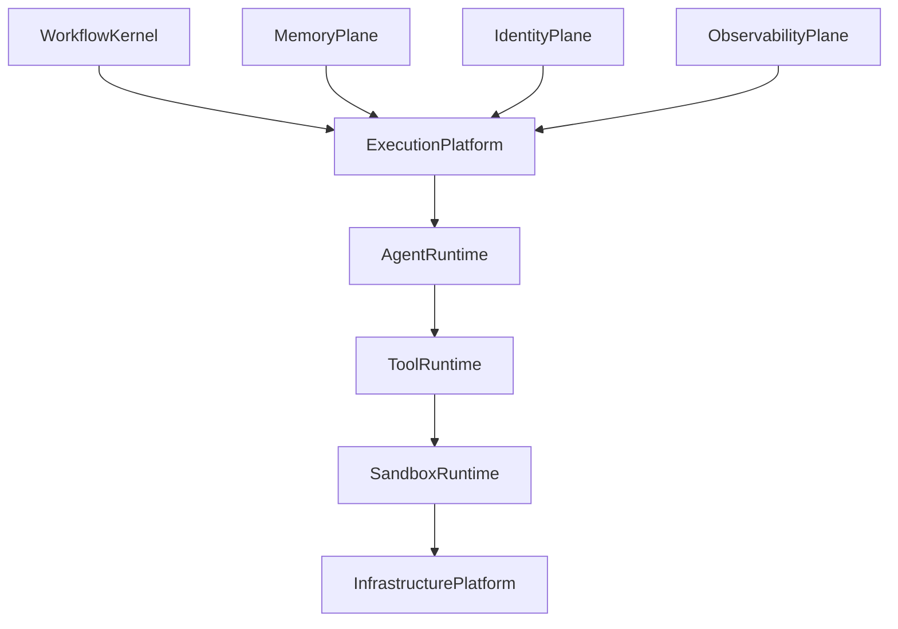
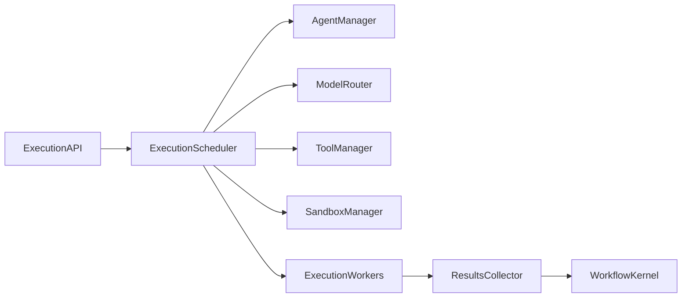
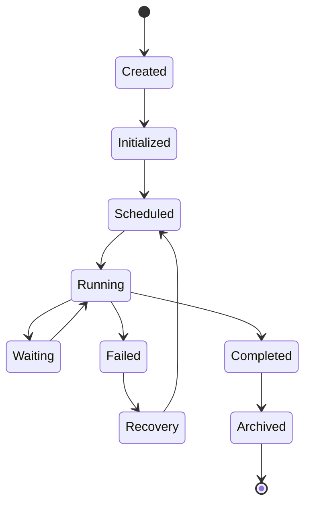

# Enterprise AI Software Factory
# Architecture Design Specification (ADS)

> **Document ID:** ADS-024-v1
>
> **Document Name:** Agent Execution Platform — Architecture
>
> **Version:** 2.0.0
>
> **Classification:** Enterprise Platform Plane
>
> **Importance:** CRITICAL
>
> **Depends On:** ADS-021-v5
>
> **Depends On:** ADS-022-v5
>
> **Depends On:** ADS-023-v5
>
> **Next:** ADS-024-v2 — Execution Algorithms & Agent Lifecycle

---

# Executive Summary

The Agent Execution Platform provides the runtime responsible for executing autonomous AI agents throughout the Enterprise AI Software Factory.

Unlike traditional AI assistants that execute prompts sequentially, the Agent Execution Platform coordinates hundreds or thousands of specialized agents that collaborate deterministically under governance.

Agents become distributed compute resources.

The platform manages

- agent lifecycle
- execution scheduling
- model routing
- tool invocation
- sandbox isolation
- collaboration
- governance
- recovery

Execution becomes a managed platform capability.

---

# Why This System Exists

Planning creates work.

Memory provides knowledge.

The Workflow Kernel coordinates execution.

The Execution Platform performs the work.

Every autonomous capability ultimately executes here.

Without an execution platform

- agents cannot collaborate
- tools cannot execute safely
- runtime isolation cannot exist
- execution cannot scale

---

# Core Philosophy

Agents are workers.

Models are interchangeable.

Tools are capabilities.

Execution is deterministic.

No agent owns global state.

No execution bypasses governance.

---

# Design Goals

The Execution Platform provides

- Agent Runtime
- Multi-Agent Collaboration
- Model Routing
- Tool Execution
- MCP Integration
- Sandboxed Execution
- Runtime Scheduling
- Agent Governance
- Resource Allocation
- Fault Recovery

---

# Architectural Position



The Execution Platform is the bridge between orchestration and infrastructure.

---

# High-Level Architecture



Every execution passes through the scheduler.

---

# Major Components

| Component | Responsibility |
|------------|----------------|
| Execution API | Public interface |
| Execution Scheduler | Task scheduling |
| Agent Manager | Agent lifecycle |
| Model Router | LLM selection |
| Tool Manager | MCP tool execution |
| Sandbox Manager | Execution isolation |
| Worker Pool | Parallel execution |
| Results Collector | Aggregate outputs |
| Execution Cache | Temporary runtime state |

---

# Agent Types

| Agent | Responsibility |
|--------|----------------|
| Planner | Architecture and planning |
| Architect | System design |
| Backend | Backend implementation |
| Frontend | UI implementation |
| Database | Schema and migrations |
| QA | Testing |
| Security | Security validation |
| DevOps | Infrastructure |
| Reviewer | Code review |
| Documentation | Documentation generation |

Agents remain stateless.

---

# Agent Lifecycle



The lifecycle is deterministic.

---

# Execution Pipeline

```text
Workflow Task

↓

Scheduler

↓

Agent Selection

↓

Model Selection

↓

Context Retrieval

↓

Tool Execution

↓

Validation

↓

Result Collection

↓

Workflow Update
```

Every stage is observable.

---

# Execution Modes

Supported execution modes

| Mode | Purpose |
|------|----------|
| Sequential | Ordered execution |
| Parallel | Independent tasks |
| DAG | Dependency-aware execution |
| Event-Driven | Reactive workflows |
| Human-in-the-Loop | Approval checkpoints |

Mode selection is determined by the Workflow Kernel.

---

# Model Routing

The platform separates

Task

↓

Capability

↓

Model

Example

```text
Code Generation

↓

Coding Capability

↓

Claude Code
```

or

```text
Architecture Review

↓

Reasoning Capability

↓

GPT-5
```

Models remain replaceable.

---

# Tool Execution

Tools execute through standardized interfaces.

Supported tool categories

- MCP Tools
- Internal APIs
- Git Operations
- Database Operations
- CI/CD
- Browser Automation
- Terminal
- Container Runtime

Agents never execute tools directly.

The Tool Manager mediates every invocation.

---

# Engineering Principles

The Execution Platform follows

- Deterministic Scheduling
- Stateless Agents
- Sandboxed Execution
- Capability-Based Routing
- Observable Execution
- Policy Enforcement
- Human Governance

---

# Architecture Decision Records

## ADR-024-01

### Decision

Separate execution from workflow orchestration.

### Status

Accepted

### Reason

Workflow coordination and task execution evolve independently and scale differently.

---

## ADR-024-02

### Decision

Treat agents as disposable execution workers.

### Status

Accepted

### Reason

Stateless workers improve scalability, resilience, and fault recovery.

---

# Operational Readiness Scorecard

| Capability | Status |
|------------|--------|
| Multi-Agent Execution | ✅ Required |
| Model Routing | ✅ Required |
| Tool Isolation | ✅ Required |
| Parallel Scheduling | ✅ Required |
| Sandboxed Runtime | ✅ Required |
| Agent Governance | ✅ Required |
| Fault Recovery | ✅ Required |
| Horizontal Scaling | ✅ Required |

---

# Version Roadmap

| Version | Description |
|----------|-------------|
| v1 | Architecture |
| v2 | Execution Algorithms & Agent Lifecycle |
| v3 | APIs, Events & Contracts |
| v4 | Runtime & Execution Infrastructure |
| v5 | End-to-End Multi-Agent Execution Walkthrough |

---

# Related Documents

ADS-021-v5 — Workflow State Machine

ADS-022-v5 — Identity & Trust Plane

ADS-023-v5 — Enterprise Memory Plane

ADS-025-v1 — Compute & Infrastructure Platform

ADS-026-v1 — Security Plane

ADS-027-v1 — Observability Plane

---

# Next Document

**ADS-024-v2 — Execution Algorithms & Agent Lifecycle**

This document defines agent scheduling, execution algorithms, model routing strategies, collaborative execution, tool orchestration, fault recovery, runtime governance, checkpointing, and deterministic multi-agent coordination.

---

# End of Document
