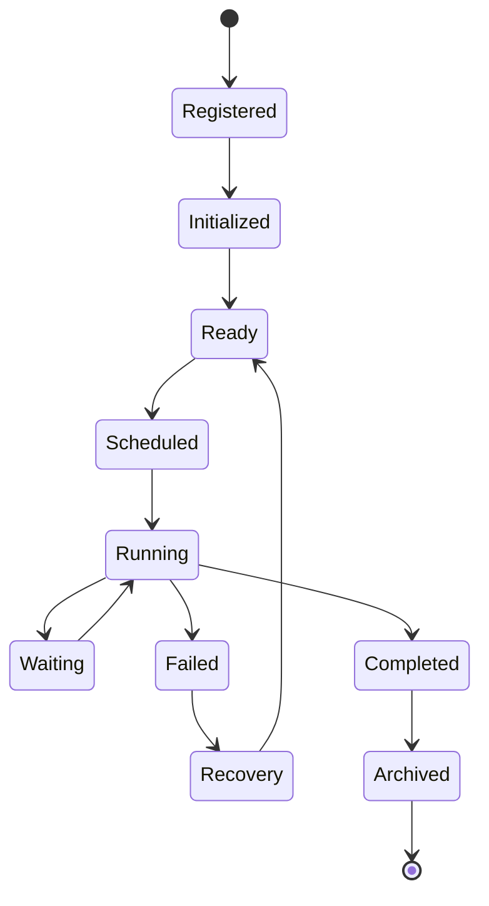
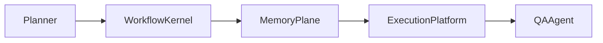
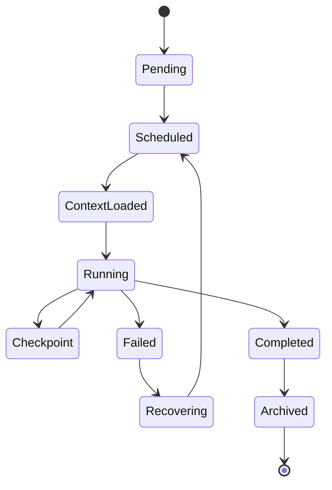
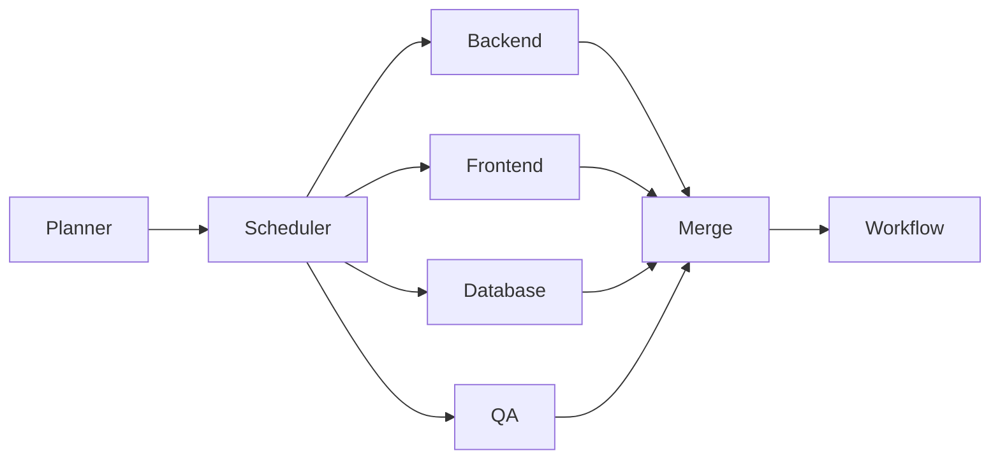

# Enterprise AI Software Factory
# Architecture Design Specification (ADS)

> **Document ID:** ADS-024-v2
>
> **Document Name:** Agent Execution Platform — Execution Algorithms & Agent Lifecycle
>
> **Version:** 2.0.0
>
> **Classification:** Enterprise Platform Plane
>
> **Importance:** CRITICAL
>
> **Depends On:** ADS-024-v1
>
> **Next:** ADS-024-v3 — APIs, Events & Contracts

---

# Executive Summary

This document defines the deterministic execution model governing autonomous AI agents.

Rather than treating agents as independent AI assistants, the Enterprise AI Software Factory treats every agent as a managed execution unit operating under strict lifecycle, governance, scheduling, identity, and observability rules.

Every agent follows the same execution contract regardless of model provider.

---

# Design Philosophy

The Agent Execution Platform follows six principles.

- Stateless execution
- Deterministic scheduling
- Capability-based routing
- Policy-first execution
- Observable lifecycle
- Recoverable execution

Execution should be reproducible.

---

# Agent Descriptor

Every agent is represented by a standardized descriptor.

```yaml
agentId:
agentType:
version:
capabilities:
requiredMemoryDomains:
allowedModels:
allowedTools:
identityProfile:
securityProfile:
executionPolicy:
resourceLimits:
checkpointPolicy:
rollbackPolicy:
observabilityProfile:
sla:
```

Every subsystem consumes this descriptor.

No subsystem maintains its own agent configuration.

---

# Agent Lifecycle



Every transition is recorded by the Workflow Kernel.

---

# Execution Pipeline

```text
Workflow Task

↓

Scheduler

↓

Agent Selection

↓

Identity Validation

↓

Memory Retrieval

↓

Model Selection

↓

Tool Authorization

↓

Execution

↓

Validation

↓

Checkpoint

↓

Result Publication
```

Every stage is observable.

---

# ALG-024-001

## Agent Registration

Before an agent may execute

The Agent Manager performs

```text
Descriptor Validation

↓

Capability Verification

↓

Identity Assignment

↓

Policy Binding

↓

Resource Allocation

↓

Registration
```

Registered agents become eligible for scheduling.

---

# Agent Categories

| Category | Purpose |
|-----------|----------|
| Planning | Requirements and architecture |
| Engineering | Implementation |
| QA | Testing |
| Security | Security validation |
| Infrastructure | Deployment |
| Documentation | Documentation |
| Learning | Knowledge extraction |
| Governance | Compliance |

Categories determine scheduling policy.

---

# ALG-024-002

## Capability Resolution

Execution never selects agents by name.

Selection occurs by capability.

Example

```
Generate Backend API

↓

Capability

↓

Backend Development

↓

Candidate Agents

↓

Capability Score

↓

Selected Agent
```

Agents remain interchangeable.

---

# Capability Matrix

| Capability | Example Agent |
|------------|---------------|
| Planning | Planner |
| Architecture | Architect |
| Backend | Backend Engineer |
| Frontend | Frontend Engineer |
| Database | Database Engineer |
| Testing | QA Engineer |
| Security | Security Analyst |
| DevOps | Platform Engineer |

Capabilities may be shared.

---

# ALG-024-003

## Agent Scheduling

The Scheduler considers

- Priority
- Workflow State
- Dependencies
- Agent Availability
- Resource Limits
- SLA
- Organization Policies

Scheduling remains deterministic.

---

# Scheduling Pipeline

```text
Task Queue

↓

Dependency Check

↓

Capability Match

↓

Identity Validation

↓

Worker Assignment

↓

Execution
```

No scheduling decision bypasses policy evaluation.

---

# ALG-024-004

## Identity Validation

Before execution

The Scheduler validates

- Agent Identity
- Workload Identity
- Trust Score
- Certificate
- Authorization

Execution never begins without successful validation.

---

# ALG-024-005

## Context Assembly

The Memory Plane constructs a Context Package.

Package contains

- Architecture
- Source Code
- APIs
- Tests
- Workflow State
- Organizational Policies

Context Packages are immutable.

---

# Agent Collaboration

Agents collaborate only through platform services.



Direct agent-to-agent communication is prohibited.

---

# Collaboration Modes

| Mode | Purpose |
|--------|---------|
| Sequential | Ordered execution |
| Parallel | Independent tasks |
| DAG | Dependency-aware execution |
| Review | Peer validation |
| Human Approval | Governance |

The Workflow Kernel coordinates collaboration.

---

# ALG-024-006

## Model Routing

Model selection occurs after capability resolution.

Routing inputs

- Task Type
- Capability
- Context Size
- Cost Policy
- Latency SLA
- Organization Policy
- Available Providers

Routing Pipeline

```text
Task

↓

Capability

↓

Policy Check

↓

Provider Selection

↓

Model Selection

↓

Execution
```

The selected model remains transparent to the requesting workflow.

---

# ALG-024-007

## Tool Authorization

Agents never invoke tools directly.

Execution flow

```text
Agent

↓

Tool Manager

↓

Identity Verification

↓

Policy Evaluation

↓

Tool Execution

↓

Result Validation

↓

Agent
```

Every invocation is audited.

---

# ALG-024-008

## Sandbox Execution

Every execution occurs inside an isolated sandbox.

Isolation guarantees

- Filesystem Isolation
- Network Policies
- Resource Limits
- Temporary Workspace
- Secret Injection
- Automatic Cleanup

Execution environments are ephemeral.

---

# ALG-024-009

## Checkpointing

Long-running executions create checkpoints.

Checkpoint Contents

- Workflow State
- Context Package ID
- Agent State
- Tool Results
- Runtime Metadata

Checkpoint Flow

```text
Execution

↓

Checkpoint

↓

Persist

↓

Resume

↓

Continue
```

Execution may resume from the latest valid checkpoint.

---

# ALG-024-010

## Failure Recovery

Failures are classified before recovery.

| Failure Type | Recovery Strategy |
|--------------|------------------|
| Model Timeout | Retry |
| Tool Failure | Retry / Alternate Tool |
| Sandbox Failure | Recreate Sandbox |
| Policy Failure | Stop |
| Identity Failure | Re-authenticate |
| Memory Failure | Rebuild Context Package |

Recovery always preserves workflow integrity.

---

# Execution State Machine



Every execution follows this lifecycle.

---

# Parallel Execution

Independent tasks may execute simultaneously.



Parallel execution requires dependency validation.

---

# Resource Scheduling

Scheduling considers

- CPU
- Memory
- GPU
- Token Budget
- Tool Availability
- Model Capacity
- Organization Limits

Resources are allocated dynamically.

---

# Execution Governance

Every execution must satisfy

- Identity Validation
- Policy Compliance
- Context Verification
- Tool Authorization
- Sandbox Isolation
- Observability Requirements

Executions failing governance checks are rejected.

---

# Retry Policy

Retryable operations

| Operation | Retry |
|-----------|------:|
| Model Timeout | Yes |
| Tool Timeout | Yes |
| Temporary Network Failure | Yes |
| Sandbox Startup Failure | Yes |
| Authorization Failure | No |
| Policy Denial | No |
| Invalid Context Package | No |

Retry Schedule

```text
1 s

↓

2 s

↓

4 s

↓

8 s

↓

Escalation
```

Retries are bounded and observable.

---

# Runtime Metrics

```text
agent_executions_total

agent_execution_duration_seconds

agent_failures_total

agent_checkpoint_total

sandbox_startup_duration_seconds

tool_invocations_total

tool_failures_total

model_routing_total

parallel_executions_total

execution_recovery_total
```

---

# Structured Logging

Example

```json
{
  "traceId":"trace-6101",
  "workflowId":"WF-2026-001",
  "agentId":"backend-agent-01",
  "executionMode":"Parallel",
  "model":"Claude Code",
  "toolsInvoked":6,
  "durationMs":8420,
  "status":"Completed"
}
```

Logs remain immutable and correlated with workflow execution.

---

# Agent Manifest

Every agent is defined by a versioned manifest.

Example

```yaml
agentManifest:

  metadata:

    id: backend-engineer

    version: 2.0.0

    owner: platform

  capabilities:

    - backend-development

    - api-design

  requiredMemoryDomains:

    - project

    - architecture

    - procedural

  supportedModels:

    - claude-code

    - gpt-5

  supportedTools:

    - git

    - terminal

    - mcp

  resourceProfile:

    cpu: medium

    memory: high

  lifecycle:

    restartPolicy: on-failure
```

The runtime descriptor is generated from the manifest.

---

# Architecture Decision Records

## ADR-024-03

### Decision

Route execution by capability rather than by named agent.

### Status

Accepted

### Reason

Capability-based routing allows interchangeable implementations and improves scalability.

---

## ADR-024-04

### Decision

Require sandbox isolation for every execution.

### Status

Accepted

### Reason

Sandboxing limits blast radius and improves security.

---

## ADR-024-05

### Decision

Generate runtime descriptors from versioned Agent Manifests.

### Status

Accepted

### Reason

Separating authoring from runtime execution improves governance, portability, and reproducibility.

---

# Operational Readiness Scorecard

| Capability | Status |
|------------|--------|
| Capability-Based Routing | ✅ Required |
| Agent Manifests | ✅ Required |
| Sandboxed Execution | ✅ Required |
| Checkpoint Recovery | ✅ Required |
| Parallel Scheduling | ✅ Required |
| Tool Governance | ✅ Required |
| Resource Scheduling | ✅ Required |
| Full Observability | ✅ Required |

---

# Related Documents

ADS-021-v5 — Workflow State Machine

ADS-022-v5 — Identity & Trust Plane

ADS-023-v5 — Enterprise Memory Plane

ADS-024-v1 — Agent Execution Platform

ADS-024-v3 — APIs, Events & Contracts

ADS-025-v1 — Compute & Infrastructure Platform

---

# End of Document
