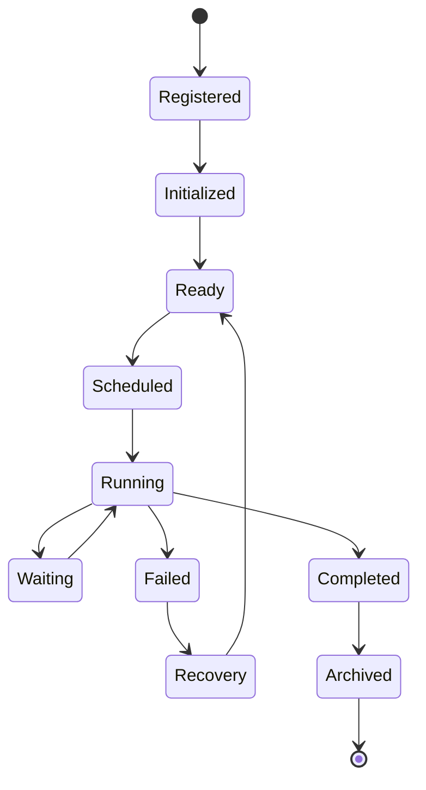

# Enterprise AI Software Factory
# Architecture Design Specification (ADS)

> **Document ID:** ADS-024-v2
>
> **Document Name:** Agent Execution Platform — Execution Algorithms & Agent Lifecycle
>
> **Version:** 2.0.0
>
> **Classification:** Enterprise Platform Plane
>
> **Importance:** CRITICAL
>
> **Depends On:** ADS-024-v1
>
> **Next:** ADS-024-v3 — APIs, Events & Contracts

---

# Executive Summary

This document defines the deterministic execution model governing autonomous AI agents.

Rather than treating agents as independent AI assistants, the Enterprise AI Software Factory treats every agent as a managed execution unit operating under strict lifecycle, governance, scheduling, identity, and observability rules.

Every agent follows the same execution contract regardless of model provider.

---

# Design Philosophy

The Agent Execution Platform follows six principles.

- Stateless execution
- Deterministic scheduling
- Capability-based routing
- Policy-first execution
- Observable lifecycle
- Recoverable execution

Execution should be reproducible.

---

# Agent Descriptor

Every agent is represented by a standardized descriptor.

```yaml
agentId:
agentType:
version:
capabilities:
requiredMemoryDomains:
allowedModels:
allowedTools:
identityProfile:
securityProfile:
executionPolicy:
resourceLimits:
checkpointPolicy:
rollbackPolicy:
observabilityProfile:
sla:
```

Every subsystem consumes this descriptor.

No subsystem maintains its own agent configuration.

---

# Agent Lifecycle



Every transition is recorded by the Workflow Kernel.

---

# Execution Pipeline

```text
Workflow Task

↓

Scheduler

↓

Agent Selection

↓

Identity Validation

↓

Memory Retrieval

↓

Model Selection

↓

Tool Authorization

↓

Execution

↓

Validation

↓

Checkpoint

↓

Result Publication
```

Every stage is observable.

---

# ALG-024-001

## Agent Registration

Before an agent may execute

The Agent Manager performs

```text
Descriptor Validation

↓

Capability Verification

↓

Identity Assignment

↓

Policy Binding

↓

Resource Allocation

↓

Registration
```

Registered agents become eligible for scheduling.

---

# Agent Categories

| Category | Purpose |
|-----------|----------|
| Planning | Requirements and architecture |
| Engineering | Implementation |
| QA | Testing |
| Security | Security validation |
| Infrastructure | Deployment |
| Documentation | Documentation |
| Learning | Knowledge extraction |
| Governance | Compliance |

Categories determine scheduling policy.

---

# ALG-024-002

## Capability Resolution

Execution never selects agents by name.

Selection occurs by capability.

Example

```
Generate Backend API

↓

Capability

↓

Backend Development

↓

Candidate Agents

↓

Capability Score

↓

Selected Agent
```

Agents remain interchangeable.

---

# Capability Matrix

| Capability | Example Agent |
|------------|---------------|
| Planning | Planner |
| Architecture | Architect |
| Backend | Backend Engineer |
| Frontend | Frontend Engineer |
| Database | Database Engineer |
| Testing | QA Engineer |
| Security | Security Analyst |
| DevOps | Platform Engineer |

Capabilities may be shared.

---

# ALG-024-003

## Agent Scheduling

The Scheduler considers

- Priority
- Workflow State
- Dependencies
- Agent Availability
- Resource Limits
- SLA
- Organization Policies

Scheduling remains deterministic.

---

# Scheduling Pipeline

```text
Task Queue

↓

Dependency Check

↓

Capability Match

↓

Identity Validation

↓

Worker Assignment

↓

Execution
```

No scheduling decision bypasses policy evaluation.

---

# ALG-024-004

## Identity Validation

Before execution

The Scheduler validates

- Agent Identity
- Workload Identity
- Trust Score
- Certificate
- Authorization

Execution never begins without successful validation.

---

# ALG-024-005

## Context Assembly

The Memory Plane constructs a Context Package.

Package contains

- Architecture
- Source Code
- APIs
- Tests
- Workflow State
- Organizational Policies

Context Packages are immutable.

---

# Agent Collaboration

Agents collaborate only through platform services.


Direct agent-to-agent communication is prohibited.

---

# Collaboration Modes

| Mode | Purpose |
|--------|---------|
| Sequential | Ordered execution |
| Parallel | Independent tasks |
| DAG | Dependency-aware execution |
| Review | Peer validation |
| Human Approval | Governance |

The Workflow Kernel coordinates collaboration.

---

# End of Part 1
