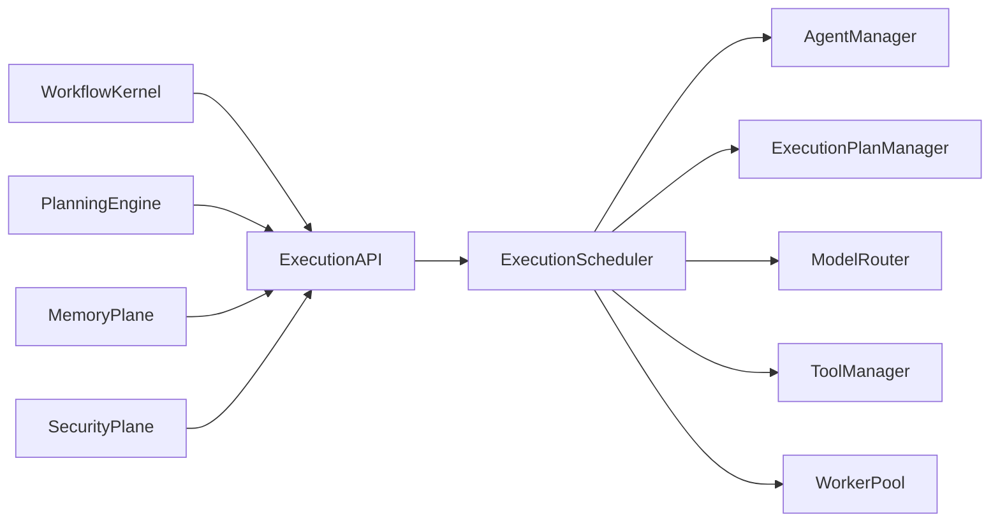
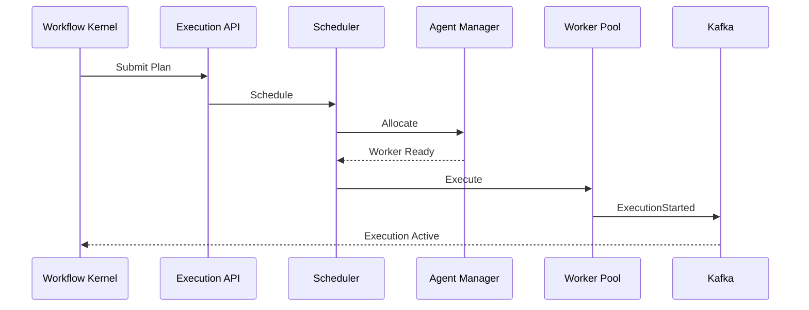

# Enterprise AI Software Factory
# Architecture Design Specification (ADS)

> **Document ID:** ADS-024-v3
>
> **Document Name:** Agent Execution Platform — APIs, Events & Contracts
>
> **Version:** 2.0.0
>
> **Classification:** Enterprise Platform Plane
>
> **Importance:** CRITICAL
>
> **Depends On:** ADS-024-v1
>
> **Depends On:** ADS-024-v2
>
> **Next:** ADS-024-v4 — Runtime & Execution Infrastructure

---

# Executive Summary

The Agent Execution Platform exposes standardized APIs, execution contracts, scheduling interfaces, lifecycle events, model routing services, tool orchestration endpoints, and execution status APIs.

Every subsystem interacts with execution exclusively through these contracts.

Execution implementations may evolve.

Execution contracts remain stable.

---

# Communication Principles

Every execution request MUST satisfy

- Authenticated
- Authorized
- Versioned
- Observable
- Auditable
- Replayable
- Idempotent
- Policy Compliant

No subsystem directly communicates with execution workers.

---

# Execution Communication Architecture



The Scheduler remains the single control point.

---

# Public REST API

The Execution Platform exposes APIs for

- Workflow Kernel
- Planning Engine
- Enterprise Dashboard
- CLI
- External Integrations

---

## API-024-001

### Submit Execution Plan

```http
POST /execution/v1/plans
```

Purpose

Registers a new execution plan.

---

Request

```json
{
  "workflowId":"WF-2026-001",
  "executionMode":"DAG",
  "priority":"HIGH",
  "contextPackage":"CTX-2026-001"
}
```

---

Response

```json
{
  "planId":"PLAN-2026-001",
  "status":"Accepted"
}
```

---

## API-024-002

### Start Execution

```http
POST /execution/v1/plans/{planId}/start
```

Starts execution.

---

## API-024-003

### Pause Execution

```http
POST /execution/v1/plans/{planId}/pause
```

Execution enters paused state.

---

## API-024-004

### Resume Execution

```http
POST /execution/v1/plans/{planId}/resume
```

Execution resumes from latest checkpoint.

---

## API-024-005

### Cancel Execution

```http
DELETE /execution/v1/plans/{planId}
```

Gracefully terminates execution.

---

# Internal gRPC Services

```protobuf
service ExecutionService {

rpc SubmitExecutionPlan(ExecutionPlanRequest)
returns(ExecutionPlanResponse);

rpc ScheduleExecution(ScheduleRequest)
returns(ScheduleResponse);

rpc AllocateWorker(WorkerRequest)
returns(WorkerResponse);

rpc PublishResult(ResultRequest)
returns(ResultResponse);

rpc CheckExecutionStatus(StatusRequest)
returns(StatusResponse);

}
```

---

# Execution Plan Schema

```protobuf
message ExecutionPlan {

string plan_id = 1;

string workflow_id = 2;

string execution_mode = 3;

string context_package = 4;

string scheduling_policy = 5;

string rollback_policy = 6;

}
```

---

# Execution Result Schema

```protobuf
message ExecutionResult {

string execution_id = 1;

string status = 2;

string artifact_id = 3;

double duration_seconds = 4;

}
```

---

# MCP Tool Contracts

The Execution Platform exposes

```
submit_execution_plan

start_execution

pause_execution

resume_execution

cancel_execution

execution_status

execution_metrics

allocate_agent
```

Every invocation requires authenticated identity.

---

# Execution Events

Every execution operation emits immutable events.

---

## EVT-024-001

ExecutionPlanCreated

---

## EVT-024-002

ExecutionScheduled

---

## EVT-024-003

AgentAllocated

---

## EVT-024-004

ExecutionStarted

---

## EVT-024-005

ExecutionCheckpointCreated

---

## EVT-024-006

ExecutionCompleted

---

## EVT-024-007

ExecutionFailed

---

## EVT-024-008

ExecutionCancelled

---

# Event Flow



---

# Event Ordering

```text
ExecutionPlanCreated

↓

ExecutionScheduled

↓

AgentAllocated

↓

ExecutionStarted

↓

CheckpointCreated

↓

ExecutionCompleted
```

Events are append-only.

---

# Event Metadata

Every event contains

```yaml
eventId:
planId:
executionId:
workflowId:
agentId:
traceId:
correlationId:
timestamp:
schemaVersion:
```

---

# End of Part 1
