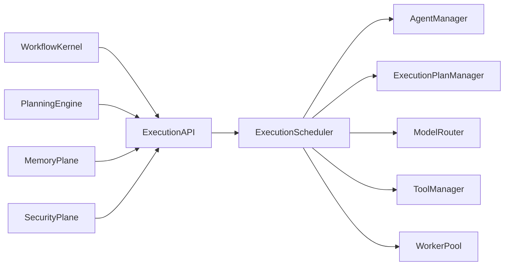
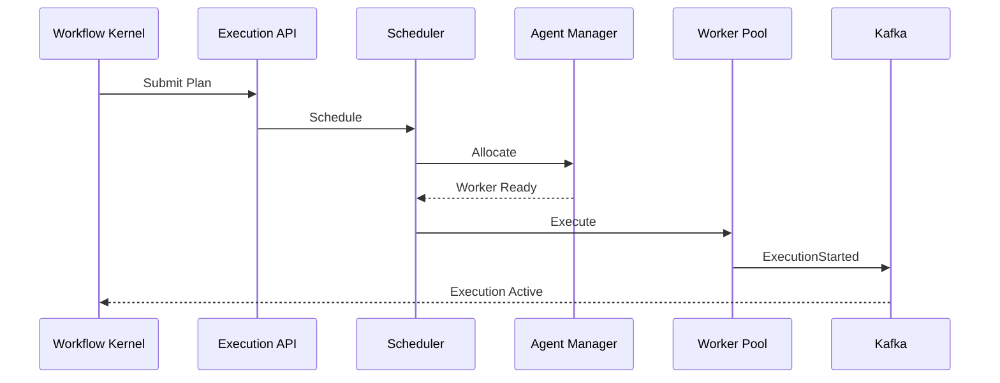
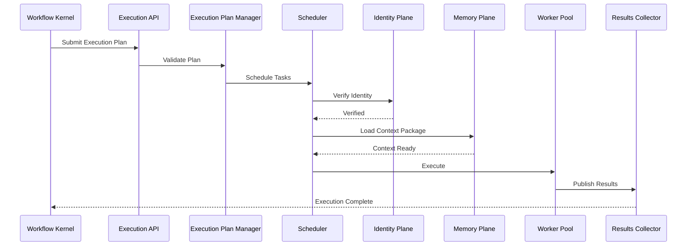

# Enterprise AI Software Factory
# Architecture Design Specification (ADS)

> **Document ID:** ADS-024-v3
>
> **Document Name:** Agent Execution Platform — APIs, Events & Contracts
>
> **Version:** 2.0.0
>
> **Classification:** Enterprise Platform Plane
>
> **Importance:** CRITICAL
>
> **Depends On:** ADS-024-v1
>
> **Depends On:** ADS-024-v2
>
> **Next:** ADS-024-v4 — Runtime & Execution Infrastructure

---

# Executive Summary

The Agent Execution Platform exposes standardized APIs, execution contracts, scheduling interfaces, lifecycle events, model routing services, tool orchestration endpoints, and execution status APIs.

Every subsystem interacts with execution exclusively through these contracts.

Execution implementations may evolve.

Execution contracts remain stable.

---

# Communication Principles

Every execution request MUST satisfy

- Authenticated
- Authorized
- Versioned
- Observable
- Auditable
- Replayable
- Idempotent
- Policy Compliant

No subsystem directly communicates with execution workers.

---

# Execution Communication Architecture



The Scheduler remains the single control point.

---

# Public REST API

The Execution Platform exposes APIs for

- Workflow Kernel
- Planning Engine
- Enterprise Dashboard
- CLI
- External Integrations

---

## API-024-001

### Submit Execution Plan

```http
POST /execution/v1/plans
```

Purpose

Registers a new execution plan.

---

Request

```json
{
  "workflowId":"WF-2026-001",
  "executionMode":"DAG",
  "priority":"HIGH",
  "contextPackage":"CTX-2026-001"
}
```

---

Response

```json
{
  "planId":"PLAN-2026-001",
  "status":"Accepted"
}
```

---

## API-024-002

### Start Execution

```http
POST /execution/v1/plans/{planId}/start
```

Starts execution.

---

## API-024-003

### Pause Execution

```http
POST /execution/v1/plans/{planId}/pause
```

Execution enters paused state.

---

## API-024-004

### Resume Execution

```http
POST /execution/v1/plans/{planId}/resume
```

Execution resumes from latest checkpoint.

---

## API-024-005

### Cancel Execution

```http
DELETE /execution/v1/plans/{planId}
```

Gracefully terminates execution.

---

# Internal gRPC Services

```protobuf
service ExecutionService {

rpc SubmitExecutionPlan(ExecutionPlanRequest)
returns(ExecutionPlanResponse);

rpc ScheduleExecution(ScheduleRequest)
returns(ScheduleResponse);

rpc AllocateWorker(WorkerRequest)
returns(WorkerResponse);

rpc PublishResult(ResultRequest)
returns(ResultResponse);

rpc CheckExecutionStatus(StatusRequest)
returns(StatusResponse);

}
```

---

# Execution Plan Schema

```protobuf
message ExecutionPlan {

string plan_id = 1;

string workflow_id = 2;

string execution_mode = 3;

string context_package = 4;

string scheduling_policy = 5;

string rollback_policy = 6;

}
```

---

# Execution Result Schema

```protobuf
message ExecutionResult {

string execution_id = 1;

string status = 2;

string artifact_id = 3;

double duration_seconds = 4;

}
```

---

# MCP Tool Contracts

The Execution Platform exposes

```
submit_execution_plan

start_execution

pause_execution

resume_execution

cancel_execution

execution_status

execution_metrics

allocate_agent
```

Every invocation requires authenticated identity.

---

# Execution Events

Every execution operation emits immutable events.

---

## EVT-024-001

ExecutionPlanCreated

---

## EVT-024-002

ExecutionScheduled

---

## EVT-024-003

AgentAllocated

---

## EVT-024-004

ExecutionStarted

---

## EVT-024-005

ExecutionCheckpointCreated

---

## EVT-024-006

ExecutionCompleted

---

## EVT-024-007

ExecutionFailed

---

## EVT-024-008

ExecutionCancelled

---

# Event Flow



---

# Event Ordering

```text
ExecutionPlanCreated

↓

ExecutionScheduled

↓

AgentAllocated

↓

ExecutionStarted

↓

CheckpointCreated

↓

ExecutionCompleted
```

Events are append-only.

---

# Event Metadata

Every event contains

```yaml
eventId:
planId:
executionId:
workflowId:
agentId:
traceId:
correlationId:
timestamp:
schemaVersion:
```

---

# Contract Validation

Every execution request passes through a deterministic validation pipeline.

```text
Receive Request

↓

Schema Validation

↓

Authentication

↓

Authorization

↓

Execution Plan Validation

↓

Context Package Validation

↓

Policy Evaluation

↓

Scheduling

↓

Execution
```

Execution begins only after every validation stage succeeds.

---

# Validation Rules

Every request MUST satisfy

| Rule | Description |
|------|-------------|
| API Version | Supported contract version |
| Authentication | Valid workload identity |
| Authorization | Required execution permission |
| Execution Plan | Valid version |
| Context Package | Verified and available |
| Policy | Organization policies satisfied |
| Resource Limits | Available capacity |
| Integrity | Execution signature verified |

Validation failures terminate the request.

---

# Authentication

Execution authentication is delegated to the Identity Plane.

Supported methods

- OAuth 2.1
- OpenID Connect
- SPIFFE / SPIRE
- Mutual TLS
- Service Accounts

Execution workers never authenticate independently.

---

# Authorization

Authorization evaluates

- Identity
- Agent Manifest
- Execution Plan
- Organization Policies
- Resource Policies
- Workflow Ownership

Decision

```text
Allow

↓

Schedule

Deny

↓

Reject

Escalate

↓

Human Approval
```

Every authorization decision is audited.

---

# Execution Plan Manager

Every execution begins with a versioned Execution Plan.

Responsibilities

- Plan Validation
- DAG Verification
- Dependency Resolution
- Context Package Validation
- Resource Estimation
- Rollback Strategy Validation

Execution Plans are immutable after approval.

---

# Scheduling Policies

Supported scheduling strategies

| Strategy | Purpose |
|----------|---------|
| FIFO | Simple execution |
| Priority | SLA-sensitive workloads |
| DAG | Dependency-aware execution |
| Fair Share | Multi-tenant fairness |
| Resource Aware | Optimize infrastructure usage |

Scheduling policy is selected by the Workflow Kernel.

---

# Multi-Tenant Isolation

Execution is isolated per tenant.

```text
Tenant

↓

Organization

↓

Workflow

↓

Execution Plan

↓

Agents

↓

Artifacts
```

Agents never execute tasks outside their tenant scope.

---

# Execution Contracts

Every execution must provide

```yaml
executionId:
planId:
workflowId:
agentManifest:
contextPackage:
resourceProfile:
checkpointPolicy:
rollbackPolicy:
```

These fields remain immutable during execution.

---

# Runtime Sequence



---

# Retry Policy

Retryable operations

| Operation | Retry |
|-----------|------:|
| Worker Startup Failure | Yes |
| Model Timeout | Yes |
| Temporary Tool Failure | Yes |
| Network Timeout | Yes |
| Invalid Execution Plan | No |
| Policy Violation | No |
| Identity Failure | No |

Retry schedule

```text
1 s

↓

2 s

↓

4 s

↓

8 s

↓

Escalation
```

Retries remain bounded.

---

# Circuit Breakers

Execution services isolate unhealthy workers.

```text
Worker Failure

↓

Retry

↓

Failure Threshold

↓

Circuit Open

↓

Route To Healthy Worker

↓

Recovery Probe

↓

Circuit Closed
```

Worker failures never propagate across the platform.

---

# Distributed Tracing

Every execution includes

- Trace ID
- Workflow ID
- Plan ID
- Agent ID
- Context Package ID

Trace Flow

```text
Execution API

↓

Scheduler

↓

Worker

↓

Tool Manager

↓

Results Collector

↓

Workflow Kernel
```

Every stage contributes trace spans.

---

# Prometheus Metrics

```text
execution_requests_total

execution_plan_validation_seconds

execution_scheduler_latency_seconds

execution_worker_allocations_total

execution_plan_failures_total

execution_completed_total

execution_failed_total

execution_checkpoint_total

execution_retry_total

execution_resource_utilization
```

---

# Structured Logging

Example

```json
{
  "traceId":"trace-7101",
  "planId":"PLAN-001",
  "workflowId":"WF-2026-001",
  "agentId":"planner-agent-01",
  "status":"Completed",
  "durationMs":10450,
  "checkpointCount":3
}
```

Logs are immutable and correlated.

---

# Audit Records

Every execution records

- Execution Plan ID
- Workflow ID
- Agent Manifest Version
- Context Package Version
- Scheduling Policy
- Resource Profile
- Execution Status
- Trace ID
- Timestamp

Audit history is append-only.

---

# Reference Standards & Specifications

The Execution Platform aligns with

| Standard | Purpose |
|----------|---------|
| Model Context Protocol (MCP) | Tool interoperability |
| OpenTelemetry | Distributed tracing |
| OpenAPI 3.1 | REST APIs |
| gRPC | Internal communication |
| CloudEvents | Event contracts |
| Kubernetes CRDs | Execution resource modeling |
| OCI Runtime Spec | Sandbox compatibility |

---

# Architecture Decision Records

## ADR-024-06

### Decision

Treat Execution Plans as immutable versioned artifacts.

### Status

Accepted

### Reason

Immutable plans enable deterministic replay, auditing, and recovery.

---

## ADR-024-07

### Decision

Validate Context Packages before scheduling.

### Status

Accepted

### Reason

Execution must operate on verified and reproducible context.

---

## ADR-024-08

### Decision

Centralize scheduling through the Execution Scheduler.

### Status

Accepted

### Reason

A single scheduling authority simplifies governance and prevents conflicting execution decisions.

---

# Operational Readiness Scorecard

| Capability | Status |
|------------|--------|
| Execution Plan Validation | ✅ Required |
| Multi-Tenant Isolation | ✅ Required |
| Context Validation | ✅ Required |
| Distributed Tracing | ✅ Required |
| Immutable Audit Trail | ✅ Required |
| Retry & Recovery | ✅ Required |
| Standards Compliance | ✅ Required |
| Deterministic Scheduling | ✅ Required |

---

# Related Documents

ADS-021-v5 — Workflow State Machine

ADS-022-v5 — Identity & Trust Plane

ADS-023-v5 — Enterprise Memory Plane

ADS-024-v1 — Agent Execution Platform

ADS-024-v2 — Execution Algorithms & Agent Lifecycle

ADS-024-v4 — Runtime & Execution Infrastructure

ADS-025-v1 — Compute & Infrastructure Platform

---

# End of Document
