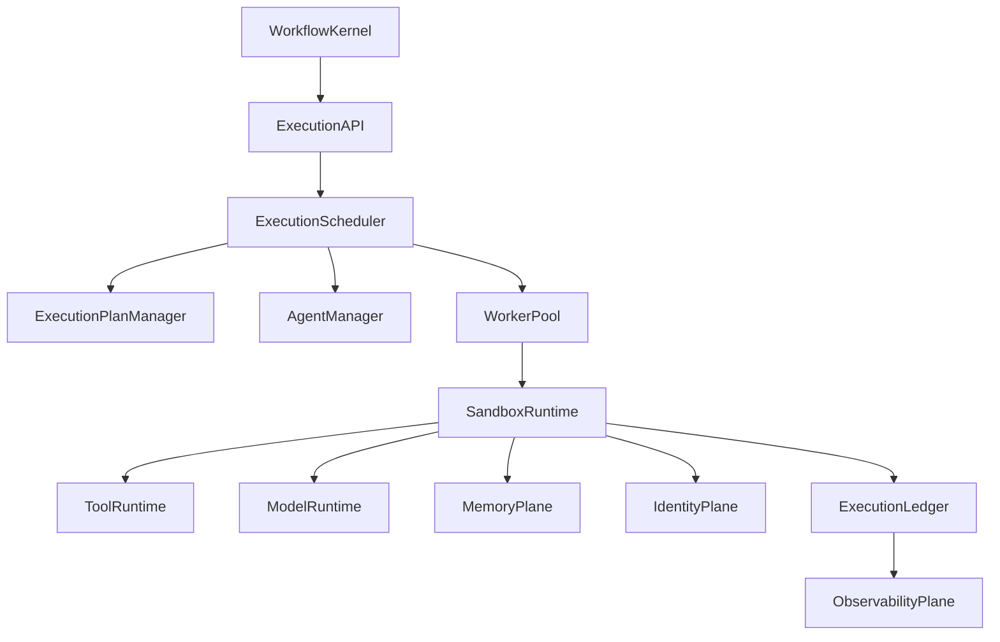
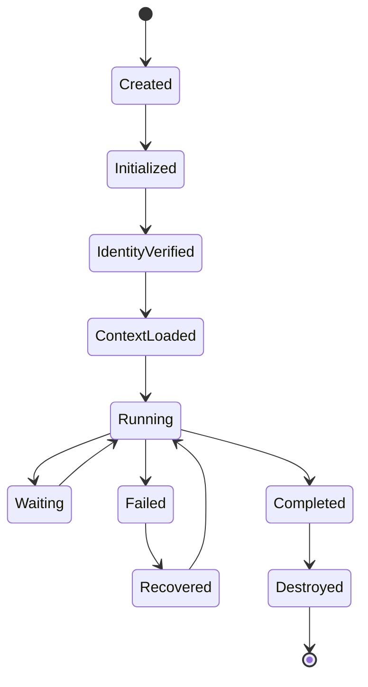
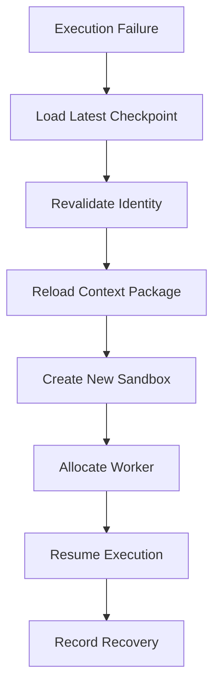

# Enterprise AI Software Factory
# Architecture Design Specification (ADS)

> **Document ID:** ADS-024-v4
>
> **Document Name:** Agent Execution Platform — Runtime & Execution Infrastructure
>
> **Version:** 2.0.0
>
> **Classification:** Enterprise Runtime Specification
>
> **Importance:** CRITICAL
>
> **Depends On:** ADS-024-v1
>
> **Depends On:** ADS-024-v2
>
> **Depends On:** ADS-024-v3
>
> **Next:** ADS-024-v5 — End-to-End Multi-Agent Execution

---

# Executive Summary

This document defines the runtime infrastructure responsible for executing autonomous AI agents across the Enterprise AI Software Factory.

The runtime transforms execution plans into isolated, observable, policy-compliant workloads capable of running at enterprise scale.

Execution infrastructure guarantees

- deterministic execution
- workload isolation
- high availability
- horizontal scalability
- automatic recovery
- policy enforcement
- complete observability

---

# Runtime Philosophy

The runtime follows seven principles.

- Immutable Execution
- Stateless Workers
- Ephemeral Sandboxes
- Identity Before Execution
- Context Before Compute
- Observe Everything
- Recover Automatically

---

# Four Runtime Layers

## Logical Layer

Responsible for

- Execution API
- Scheduler
- Agent Manager
- Model Router

---

## Execution Layer

Responsible for

- Worker Pool
- Sandbox Runtime
- Tool Runtime
- Context Loading

---

## Infrastructure Layer

Responsible for

- Kubernetes
- Autoscaling
- Storage
- Networking

---

## Governance Layer

Responsible for

- Identity
- Policy
- Security
- Audit
- Compliance

---

# Runtime Architecture



Every execution passes through the runtime pipeline.

---

# Runtime Components

| Component | Responsibility |
|------------|----------------|
| Execution API | Runtime entry point |
| Execution Scheduler | Work allocation |
| Execution Plan Manager | Plan validation |
| Agent Manager | Lifecycle management |
| Worker Pool | Parallel execution |
| Sandbox Runtime | Isolation |
| Tool Runtime | MCP execution |
| Model Runtime | Model invocation |
| Execution Ledger | Immutable execution history |
| Observability Plane | Metrics and tracing |

---

# Worker Lifecycle



Workers never persist after execution.

---

# Runtime Pipeline

```text
Execution Plan

↓

Identity Verification

↓

Context Package Loading

↓

Worker Allocation

↓

Sandbox Creation

↓

Model Initialization

↓

Tool Registration

↓

Execution

↓

Checkpoint

↓

Artifact Publication

↓

Worker Destruction
```

Every step is observable.

---

# Sandbox Runtime

Each execution receives its own isolated sandbox.

Isolation guarantees

- Read-only base image
- Ephemeral filesystem
- Dedicated workspace
- Resource quotas
- Network policies
- Secret injection
- Automatic cleanup

Sandboxes never share runtime state.

---

# Worker Pool

The Worker Pool maintains execution capacity.

Responsibilities

- Worker allocation
- Queue management
- Health monitoring
- Retry coordination
- Capacity balancing

Workers are disposable.

---

# Context Loading

Before execution begins

The runtime loads

- Context Package
- Agent Descriptor
- Execution Plan
- Identity
- Policies
- Runtime Configuration

Execution starts only after validation succeeds.

---

# Model Runtime

The Model Runtime provides

- Provider abstraction
- Failover
- Streaming
- Retry
- Rate limiting
- Token accounting

Models remain replaceable.

---

# Tool Runtime

The Tool Runtime executes

- MCP Servers
- Internal APIs
- Git
- Terminal
- Database Tools
- Browser Automation
- CI/CD

Every tool executes under policy.

---

# Runtime Guarantees

The Execution Platform guarantees

- Isolated execution
- Deterministic scheduling
- Identity verification
- Context integrity
- Automatic cleanup
- Immutable execution history

---

# Failure Recovery

The runtime is designed to recover execution without violating workflow consistency.

Recovery begins from the latest verified checkpoint.



Recovery guarantees

- No duplicated execution
- No lost checkpoints
- Context consistency
- Immutable execution history

---

# Runtime Health Monitoring

Every runtime component continuously reports health.

Collected metrics

- Worker Utilization
- Queue Depth
- Sandbox Startup Time
- Context Load Time
- Model Latency
- Tool Latency
- Checkpoint Duration
- Scheduler Latency

Health Flow

```text
Worker

↓

Heartbeat

↓

Execution Runtime

↓

Observability Plane

↓

Alert Manager

↓

Operations Dashboard
```

Missing heartbeats trigger automatic recovery.

---

# Horizontal Scaling

Execution services scale independently.

Scaling signals

- Queue Length
- Pending Execution Plans
- Worker Utilization
- CPU
- Memory
- GPU
- Model Throughput
- SLA Violations

Scaling Flow

```text
Queue Growth

↓

Autoscaler

↓

Provision Workers

↓

Join Worker Pool

↓

Accept Tasks
```

Workers remain stateless.

---

# Execution Profiles

Execution Profiles define reusable runtime configurations.

Example

```yaml
executionProfile:

  name: backend-standard

  cpu: 2

  memory: 8Gi

  gpu: none

  sandbox: firecracker

  maxExecutionTime: 30m

  retryPolicy: standard

  networkPolicy: restricted

  storageClass: ephemeral

  observabilityProfile: full
```

Execution Plans reference profiles rather than infrastructure details.

---

# Runtime Isolation

Every execution runs inside isolated infrastructure.

Isolation boundaries

- Filesystem
- Process Space
- Network
- Secrets
- Storage
- Runtime Cache

Workers cannot access resources belonging to another execution.

---

# Context Package Loading

The runtime validates every Context Package before loading.

Validation includes

- Package Integrity
- Provenance
- Version
- Trust Score
- Tenant
- Policy Compliance

Invalid Context Packages terminate execution before scheduling.

---

# Execution Ledger

Every execution generates an immutable ledger entry.

Ledger contents

- Execution Plan Version
- Agent Manifest Version
- Context Package Version
- Model Version
- Tool Versions
- Checkpoints
- Artifact Hashes
- Policy Decisions
- Human Approvals
- Execution Timeline
- Final Status

The Execution Ledger becomes the authoritative execution record.

---

# Runtime Configuration

Example

```yaml
execution:

  scheduler: deterministic

  workerPool: dynamic

  executionProfile: backend-standard

  checkpointInterval: 300s

  sandboxProvider: firecracker

  retryPolicy: bounded

  ledgerEnabled: true

  observability: full

  maxConcurrentWorkers: 500
```

Runtime configuration is version-controlled.

---

# Performance Optimizations

Runtime optimizations include

- Worker Pool Reuse
- Warm Model Sessions
- Context Package Cache
- Parallel Tool Invocation
- Incremental Checkpointing
- Adaptive Scheduling
- Queue Prioritization

Optimizations must never compromise determinism.

---

# Prometheus Metrics

```text
execution_workers_active

execution_queue_depth

execution_scheduler_latency_seconds

execution_context_load_seconds

execution_sandbox_startup_seconds

execution_model_latency_seconds

execution_tool_latency_seconds

execution_checkpoint_duration_seconds

execution_ledger_entries_total

execution_profile_usage_total
```

---

# OpenTelemetry

Distributed tracing spans

```text
Execution API

↓

Scheduler

↓

Worker Pool

↓

Sandbox Runtime

↓

Model Runtime

↓

Tool Runtime

↓

Execution Ledger

↓

Workflow Kernel
```

Every runtime stage contributes trace spans.

---

# Structured Logging

Example

```json
{
  "traceId":"trace-8101",
  "executionId":"EXEC-1021",
  "planId":"PLAN-001",
  "executionProfile":"backend-standard",
  "workerId":"worker-044",
  "sandbox":"firecracker",
  "durationMs":15422,
  "status":"Completed"
}
```

Logs are immutable and correlated with ledger entries.

---

# Disaster Recovery

Recovery Flow

```text
Node Failure

↓

Worker Loss

↓

Execution Recovery

↓

Checkpoint Restore

↓

Worker Reallocation

↓

Resume Execution
```

Recovery targets

Recovery Point Objective (RPO)

Near-zero execution loss

Recovery Time Objective (RTO)

Less than five minutes

---

# Recommended Production Deployment

```text
Workflow Kernel

↓

Execution API

↓

Execution Scheduler

↓

Execution Plan Manager

↓

Agent Manager

↓

Worker Pool

↓

Firecracker Sandboxes

↓

Model Runtime

↓

Tool Runtime

↓

Execution Ledger

↓

Observability Plane
```

---

# Technology Decision Records

## TDR-024-01

### Technology

Firecracker MicroVMs

### Decision

Use Firecracker as the default sandbox runtime.

### Reason

Provides stronger workload isolation with low startup overhead for short-lived execution environments.

---

## TDR-024-02

### Technology

Kubernetes

### Decision

Deploy workers on Kubernetes.

### Reason

Supports autoscaling, scheduling, and resilient orchestration for distributed workloads.

---

## TDR-024-03

### Technology

Temporal

### Decision

Use Temporal for durable workflow execution and checkpoint coordination.

### Reason

Provides reliable orchestration for long-running, recoverable executions.

---

## TDR-024-04

### Technology

Model Context Protocol (MCP)

### Decision

Standardize external tool integration through MCP.

### Reason

Creates a consistent, vendor-neutral interface for tool execution.

---

## TDR-024-05

### Technology

Execution Ledger

### Decision

Maintain an immutable execution ledger for every completed plan.

### Reason

Improves replay, compliance, debugging, and auditability across the platform.

---

# Runtime Checklist

The Execution Platform MUST

- Execute only validated plans
- Verify identity before execution
- Load verified Context Packages
- Isolate every workload
- Record every checkpoint
- Publish execution telemetry
- Persist execution ledgers

The Execution Platform MUST NOT

- Share execution state between workers
- Execute without identity validation
- Bypass policy enforcement
- Modify immutable ledger entries
- Skip checkpoint creation for recoverable workflows

---

# Architecture Decision Records

## ADR-024-09

### Decision

Treat Execution Profiles as reusable runtime configurations.

### Status

Accepted

### Reason

Execution Profiles standardize infrastructure settings while keeping Execution Plans infrastructure-independent.

---

## ADR-024-10

### Decision

Require immutable Execution Ledger entries for all completed executions.

### Status

Accepted

### Reason

Immutable execution history improves reproducibility, auditing, and forensic analysis.

---

## ADR-024-11

### Decision

Separate runtime execution from infrastructure provisioning.

### Status

Accepted

### Reason

Execution logic and infrastructure evolve independently and scale differently.

---

# Operational Readiness Scorecard

| Capability | Status |
|------------|--------|
| Automatic Recovery | ✅ Required |
| Stateless Workers | ✅ Required |
| Execution Profiles | ✅ Required |
| Immutable Execution Ledger | ✅ Required |
| Horizontal Scaling | ✅ Required |
| Sandbox Isolation | ✅ Required |
| Distributed Tracing | ✅ Required |
| Disaster Recovery | ✅ Required |

---

# Related Documents

ADS-021-v5 — Workflow State Machine

ADS-022-v5 — Identity & Trust Plane

ADS-023-v5 — Enterprise Memory Plane

ADS-024-v1 — Agent Execution Platform

ADS-024-v2 — Execution Algorithms & Agent Lifecycle

ADS-024-v3 — APIs, Events & Contracts

ADS-024-v5 — End-to-End Multi-Agent Execution

ADS-025-v1 — Compute & Infrastructure Platform

---

# End of Document
