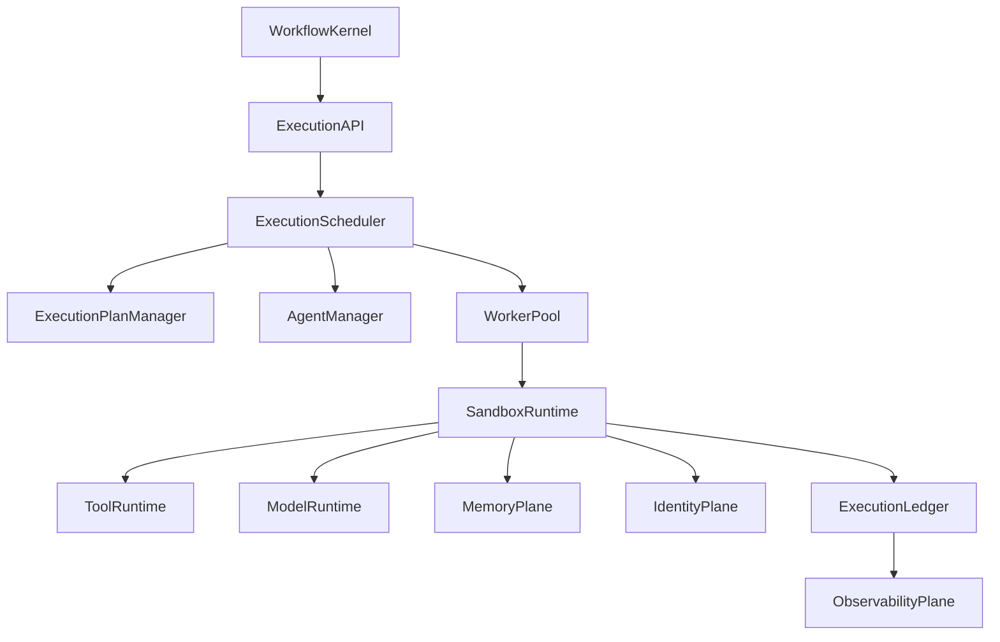
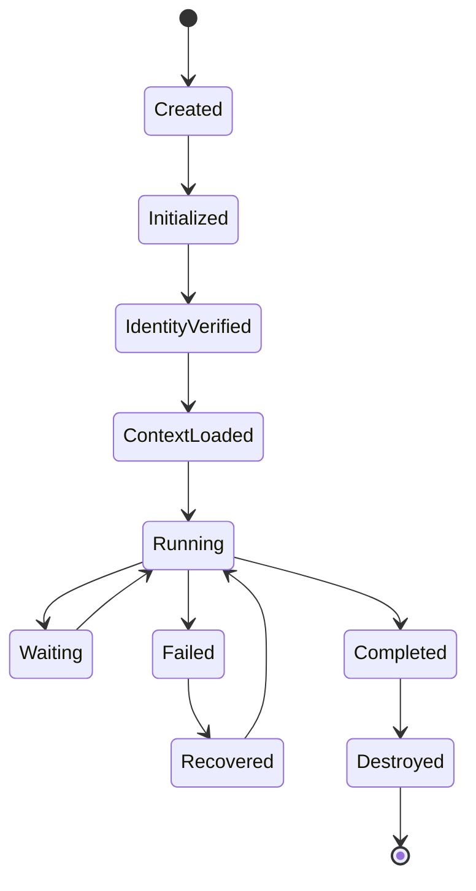

# Enterprise AI Software Factory
# Architecture Design Specification (ADS)

> **Document ID:** ADS-024-v4
>
> **Document Name:** Agent Execution Platform — Runtime & Execution Infrastructure
>
> **Version:** 2.0.0
>
> **Classification:** Enterprise Runtime Specification
>
> **Importance:** CRITICAL
>
> **Depends On:** ADS-024-v1
>
> **Depends On:** ADS-024-v2
>
> **Depends On:** ADS-024-v3
>
> **Next:** ADS-024-v5 — End-to-End Multi-Agent Execution

---

# Executive Summary

This document defines the runtime infrastructure responsible for executing autonomous AI agents across the Enterprise AI Software Factory.

The runtime transforms execution plans into isolated, observable, policy-compliant workloads capable of running at enterprise scale.

Execution infrastructure guarantees

- deterministic execution
- workload isolation
- high availability
- horizontal scalability
- automatic recovery
- policy enforcement
- complete observability

---

# Runtime Philosophy

The runtime follows seven principles.

- Immutable Execution
- Stateless Workers
- Ephemeral Sandboxes
- Identity Before Execution
- Context Before Compute
- Observe Everything
- Recover Automatically

---

# Four Runtime Layers

## Logical Layer

Responsible for

- Execution API
- Scheduler
- Agent Manager
- Model Router

---

## Execution Layer

Responsible for

- Worker Pool
- Sandbox Runtime
- Tool Runtime
- Context Loading

---

## Infrastructure Layer

Responsible for

- Kubernetes
- Autoscaling
- Storage
- Networking

---

## Governance Layer

Responsible for

- Identity
- Policy
- Security
- Audit
- Compliance

---

# Runtime Architecture



Every execution passes through the runtime pipeline.

---

# Runtime Components

| Component | Responsibility |
|------------|----------------|
| Execution API | Runtime entry point |
| Execution Scheduler | Work allocation |
| Execution Plan Manager | Plan validation |
| Agent Manager | Lifecycle management |
| Worker Pool | Parallel execution |
| Sandbox Runtime | Isolation |
| Tool Runtime | MCP execution |
| Model Runtime | Model invocation |
| Execution Ledger | Immutable execution history |
| Observability Plane | Metrics and tracing |

---

# Worker Lifecycle



Workers never persist after execution.

---

# Runtime Pipeline

```text
Execution Plan

↓

Identity Verification

↓

Context Package Loading

↓

Worker Allocation

↓

Sandbox Creation

↓

Model Initialization

↓

Tool Registration

↓

Execution

↓

Checkpoint

↓

Artifact Publication

↓

Worker Destruction
```

Every step is observable.

---

# Sandbox Runtime

Each execution receives its own isolated sandbox.

Isolation guarantees

- Read-only base image
- Ephemeral filesystem
- Dedicated workspace
- Resource quotas
- Network policies
- Secret injection
- Automatic cleanup

Sandboxes never share runtime state.

---

# Worker Pool

The Worker Pool maintains execution capacity.

Responsibilities

- Worker allocation
- Queue management
- Health monitoring
- Retry coordination
- Capacity balancing

Workers are disposable.

---

# Context Loading

Before execution begins

The runtime loads

- Context Package
- Agent Descriptor
- Execution Plan
- Identity
- Policies
- Runtime Configuration

Execution starts only after validation succeeds.

---

# Model Runtime

The Model Runtime provides

- Provider abstraction
- Failover
- Streaming
- Retry
- Rate limiting
- Token accounting

Models remain replaceable.

---

# Tool Runtime

The Tool Runtime executes

- MCP Servers
- Internal APIs
- Git
- Terminal
- Database Tools
- Browser Automation
- CI/CD

Every tool executes under policy.

---

# Runtime Guarantees

The Execution Platform guarantees

- Isolated execution
- Deterministic scheduling
- Identity verification
- Context integrity
- Automatic cleanup
- Immutable execution history

---

# End of Part 1
