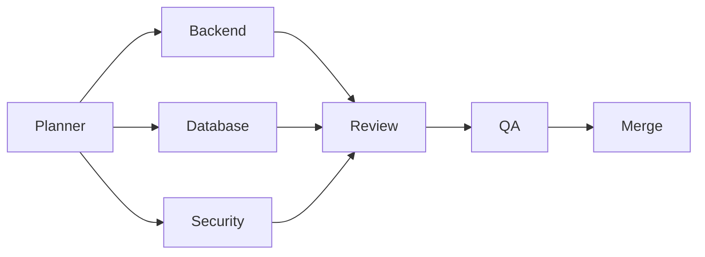
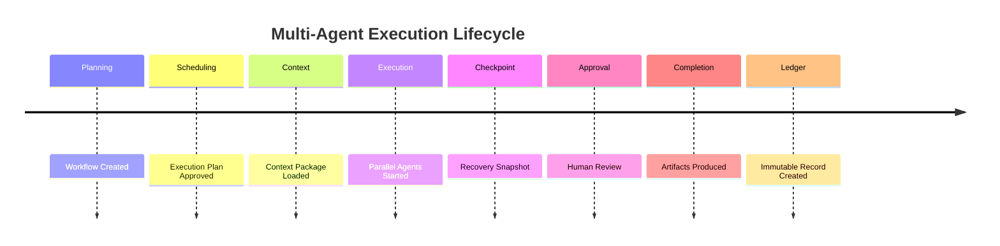

# Enterprise AI Software Factory
# Architecture Design Specification (ADS)

> **Document ID:** ADS-024-v5
>
> **Document Name:** Agent Execution Platform — End-to-End Multi-Agent Execution
>
> **Version:** 2.0.0
>
> **Classification:** Reference Implementation
>
> **Importance:** CRITICAL
>
> **Depends On:** ADS-024-v1
>
> **Depends On:** ADS-024-v2
>
> **Depends On:** ADS-024-v3
>
> **Depends On:** ADS-024-v4

---

# Executive Summary

This document demonstrates how the Agent Execution Platform executes a complete software engineering workflow.

It illustrates how Execution Plans, Agent Manifests, Context Packages, Execution Profiles, Execution Classes, and the Execution Ledger interact during a real engineering task.

Every action is deterministic.

Every artifact is traceable.

Every decision is reproducible.

---

# Scenario

An engineer submits the request

```
Build an enterprise authentication service
for a multi-tenant SaaS application.
```

The request activates

- Workflow Kernel
- Identity Plane
- Memory Plane
- Agent Execution Platform
- Compute Platform

---

# Stage 1 — Workflow Planning

The Workflow Kernel receives the request.

Artifacts produced

- Workflow
- Task DAG
- Approval Gates
- Success Criteria

Generated

```
WF-2026-001
```

The workflow becomes the execution authority.

---

# Stage 2 — Execution Plan

The Workflow Kernel generates

```
PLAN-2026-001
```

Plan contains

- Task DAG
- Context Package References
- Execution Class
- Execution Profile
- Rollback Policy
- Checkpoint Policy

The plan is immutable after approval.

---

# Stage 3 — Context Preparation

The Memory Plane creates

```
CTX-2026-001
```

Contains

- Architecture
- Existing Source Code
- Coding Standards
- ADRs
- APIs
- Security Policies
- Test Strategy

The Context Package is validated before use.

---

# Stage 4 — Agent Allocation

The Scheduler resolves required capabilities.

Allocated agents

- Planner
- Backend
- Database
- QA
- Security
- Reviewer

Each agent receives

- Agent Manifest
- Identity
- Context Package
- Execution Plan

---

# Stage 5 — Worker Creation

Execution workers are allocated.

Worker lifecycle

```text
Allocate

↓

Verify Identity

↓

Create Sandbox

↓

Load Context

↓

Initialize Model

↓

Register Tools
```

Workers are isolated.

---

# Stage 6 — Parallel Execution

The Scheduler identifies independent tasks.



Execution proceeds in parallel where dependencies permit.

---

# Stage 7 — Tool Execution

Agents invoke tools through the Tool Runtime.

Example

```text
Backend Agent

↓

Tool Manager

↓

Git

↓

Terminal

↓

Database

↓

MCP Server

↓

Results
```

Every tool invocation is authorized and audited.

---

# Stage 8 — Checkpointing

Long-running execution creates checkpoints.

Checkpoint contains

- Execution State
- Context Package Version
- Agent Manifest Version
- Tool Results
- Generated Artifacts

Checkpoint

```
CP-003
```

Execution may resume from this point.

---

# Stage 9 — Failure Recovery

The Database Agent encounters a temporary failure.

Recovery flow

```text
Failure

↓

Checkpoint Restore

↓

New Worker

↓

New Sandbox

↓

Reload Context

↓

Resume Execution
```

The workflow continues without repeating completed work.

---

# Stage 10 — Human Approval

The Security Agent detects a sensitive configuration change.

Execution enters

```
Approval Required
```

A reviewer approves the change.

Execution resumes using the existing Execution Plan.

---

# Stage 11 — Execution Completion

All execution branches complete.

Produced artifacts

- Source Code
- Tests
- Documentation
- Deployment Package

Execution status

```
Completed
```

---

# Stage 12 — Execution Ledger

The runtime writes

```
LEDGER-2026-001
```

Ledger includes

- Execution Plan Version
- Agent Manifest Versions
- Context Package Version
- Model Versions
- Tool Versions
- Artifact Hashes
- Checkpoints
- Human Approvals
- Execution Timeline
- Final Outcome

The ledger becomes immutable.

---

# Stage 13 — Workflow Closure

The Workflow Kernel closes

```
WF-2026-001
```

Workers are destroyed.

Sandboxes are removed.

Temporary secrets expire.

Context cache is released.

Persistent artifacts remain available.

---

# Execution Timeline



---

# Execution Event Stream

```text
ExecutionPlanCreated

↓

WorkersAllocated

↓

ContextLoaded

↓

ExecutionStarted

↓

CheckpointCreated

↓

ApprovalRequested

↓

ApprovalGranted

↓

ExecutionCompleted

↓

LedgerWritten

↓

WorkflowClosed
```

---

# Produced Artifacts

| Artifact | Identifier |
|-----------|------------|
| Workflow | WF-2026-001 |
| Execution Plan | PLAN-2026-001 |
| Context Package | CTX-2026-001 |
| Agent Manifest | MANIFEST-001 |
| Checkpoint | CP-003 |
| Execution Ledger | LEDGER-2026-001 |
| Deployment Bundle | ARTIFACT-001 |

---

# Runtime Metrics

| Metric | Value |
|----------|------:|
| Total Agents | 6 |
| Parallel Executions | 4 |
| Checkpoints | 3 |
| Tool Invocations | 57 |
| Sandbox Creations | 6 |
| Recovery Events | 1 |
| Execution Duration | 14 min |
| Ledger Entries | 1 |

---

# Operational Readiness Scorecard

| Capability | Status |
|------------|--------|
| Parallel Execution | ✅ Verified |
| Context Validation | ✅ Verified |
| Checkpoint Recovery | ✅ Verified |
| Human Approval | ✅ Verified |
| Immutable Ledger | ✅ Verified |
| Sandbox Isolation | ✅ Verified |
| Execution Profiles | ✅ Verified |
| Execution Classes | ✅ Verified |

---

# Lessons Learned

The Agent Execution Platform demonstrates the following principles.

- Execution Plans define *what* should happen, while the Scheduler determines *when* and *where* it happens.
- Agent Manifests provide versioned, governed definitions for every execution unit.
- Context Packages ensure every collaborating agent works from the same verified knowledge.
- Execution Profiles standardize runtime environments across workloads.
- Execution Classes express business intent independently from infrastructure configuration.
- Checkpoints and immutable ledgers enable deterministic recovery, replay, and compliance.
- Stateless workers and isolated sandboxes allow safe, scalable multi-agent execution.

---

# Architecture Decision Record

## ADR-024-12

### Decision

Treat multi-agent execution as a deterministic workflow composed of immutable artifacts and recoverable execution stages.

### Status

Accepted

### Reason

Deterministic execution improves reliability, reproducibility, operational transparency, and enterprise governance while supporting large-scale autonomous software engineering.

---

# Technology Decision Record

## TDR-024-06

### Technology

Execution Fabric

### Decision

Implement a distributed execution fabric built on stateless workers, isolated sandboxes, versioned execution artifacts, and centralized scheduling.

### Reason

A distributed execution fabric enables horizontal scalability, strong isolation, deterministic recovery, and consistent execution behavior across heterogeneous infrastructure.

---

# Related Documents

ADS-021-v5 — Workflow State Machine

ADS-022-v5 — Identity & Trust Plane

ADS-023-v5 — Enterprise Memory Plane

ADS-024-v1 — Agent Execution Platform

ADS-024-v2 — Execution Algorithms & Agent Lifecycle

ADS-024-v3 — APIs, Events & Contracts

ADS-024-v4 — Runtime & Execution Infrastructure

ADS-025-v1 — Compute & Infrastructure Platform

---

# End of Document
