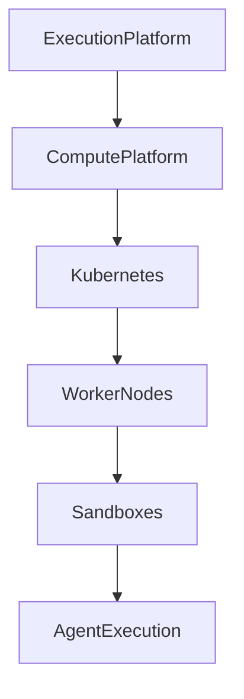
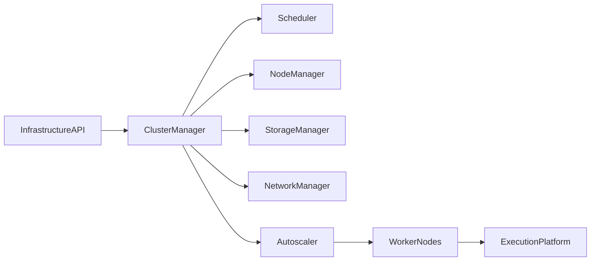
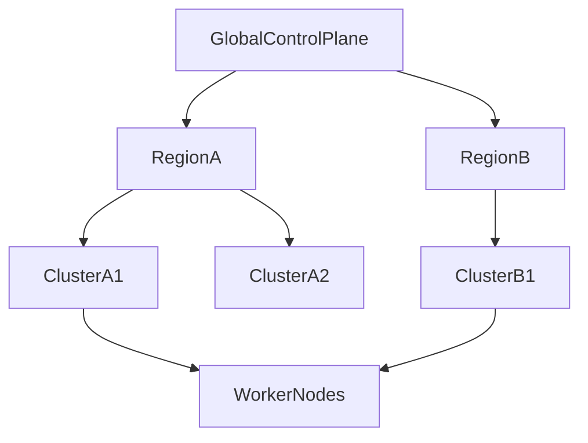

# Enterprise AI Software Factory
# Architecture Design Specification (ADS)

> **Document ID:** ADS-025-v1
>
> **Document Name:** Compute & Infrastructure Platform — Architecture
>
> **Version:** 2.0.0
>
> **Classification:** Enterprise Platform Plane
>
> **Importance:** CRITICAL
>
> **Depends On:** ADS-021-v5
>
> **Depends On:** ADS-022-v5
>
> **Depends On:** ADS-023-v5
>
> **Depends On:** ADS-024-v5
>
> **Next:** ADS-025-v2 — Infrastructure Algorithms & Scheduling

---

# Executive Summary

The Compute & Infrastructure Platform provides the physical and virtual execution environment for the Enterprise AI Software Factory.

While the Agent Execution Platform determines *what* should execute, the Compute Platform determines *where*, *how*, and *with which resources* execution occurs.

The platform manages

- Kubernetes clusters
- Compute scheduling
- GPU allocation
- CPU allocation
- Node lifecycle
- Autoscaling
- Storage
- Networking
- Multi-region deployment
- Disaster recovery

Infrastructure becomes a programmable platform service.

---

# Why This System Exists

Execution requires compute.

Compute requires orchestration.

Enterprise AI workloads demand

- high availability
- elasticity
- isolation
- resilience
- efficient resource utilization

The Compute Platform provides these guarantees.

---

# Core Philosophy

Infrastructure is declarative.

Nodes are disposable.

Clusters are elastic.

Compute is scheduled.

Resources are isolated.

Everything is observable.

---

# Design Goals

The platform provides

- Kubernetes Orchestration
- Multi-Cluster Management
- Node Scheduling
- GPU Scheduling
- CPU Scheduling
- Autoscaling
- Storage Management
- Network Policies
- Service Discovery
- Disaster Recovery

---

# Architectural Position

The Compute Platform supplies execution capacity to the Agent Execution Platform.

---

# High-Level Architecture

All infrastructure decisions pass through the Cluster Manager.

---

# Major Components

| Component | Responsibility |
|------------|----------------|
| Infrastructure API | Public interface |
| Cluster Manager | Cluster lifecycle |
| Scheduler | Node placement |
| Node Manager | Node lifecycle |
| Autoscaler | Elastic capacity |
| Storage Manager | Volumes & persistence |
| Network Manager | Connectivity |
| GPU Manager | Accelerator allocation |
| Capacity Manager | Resource accounting |
| Health Manager | Infrastructure health |

---

# Compute Resources

Supported resources

| Resource | Purpose |
|----------|----------|
| CPU | General workloads |
| GPU | AI inference & training |
| Memory | Runtime execution |
| Ephemeral Storage | Temporary execution |
| Persistent Storage | Durable data |
| Network | Service communication |

Resources are requested declaratively.

---

# Cluster Topology

Clusters operate independently while remaining centrally managed.

---

# Infrastructure Layers

## Control Plane

Responsible for

- Cluster management
- Scheduling
- Policy
- Capacity planning

---

## Compute Plane

Responsible for

- Worker nodes
- Pods
- GPU nodes
- CPU nodes

---

## Storage Plane

Responsible for

- Persistent volumes
- Object storage
- Snapshots
- Backups

---

## Network Plane

Responsible for

- Service mesh
- Load balancing
- Ingress
- Egress
- Network policies

---

# Node Categories

| Node Type | Purpose |
|-----------|----------|
| General Compute | Standard execution |
| High Memory | Large context workloads |
| GPU | Model inference |
| Build | CI/CD workloads |
| System | Platform services |

Node categories simplify scheduling.

---

# Infrastructure Principles

The Compute Platform follows

- Declarative Infrastructure
- Immutable Nodes
- Elastic Capacity
- Automated Recovery
- Resource Isolation
- Multi-Region Deployment
- Policy Enforcement

---

# Architecture Decision Records

## ADR-025-01

### Decision

Separate execution logic from infrastructure provisioning.

### Status

Accepted

### Reason

Execution and infrastructure evolve independently and scale differently.

---

## ADR-025-02

### Decision

Adopt Kubernetes as the infrastructure orchestration layer.

### Status

Accepted

### Reason

Kubernetes provides mature scheduling, scaling, and ecosystem support for distributed workloads.

---

# Operational Readiness Scorecard

| Capability | Status |
|------------|--------|
| Multi-Cluster | ✅ Required |
| GPU Scheduling | ✅ Required |
| Autoscaling | ✅ Required |
| High Availability | ✅ Required |
| Multi-Region | ✅ Required |
| Infrastructure as Code | ✅ Required |
| Disaster Recovery | ✅ Required |
| Full Observability | ✅ Required |

---

# Version Roadmap

| Version | Description |
|----------|-------------|
| v1 | Architecture |
| v2 | Infrastructure Algorithms & Scheduling |
| v3 | APIs, Events & Contracts |
| v4 | Runtime & Cluster Infrastructure |
| v5 | End-to-End Infrastructure Lifecycle |

---

# Related Documents

ADS-021-v5 — Workflow State Machine

ADS-022-v5 — Identity & Trust Plane

ADS-023-v5 — Enterprise Memory Plane

ADS-024-v5 — Agent Execution Platform

ADS-026-v1 — Security Platform

ADS-027-v1 — Observability Platform

---

# Next Document

**ADS-025-v2 — Infrastructure Algorithms & Scheduling**

Defines node scheduling, autoscaling algorithms, GPU allocation, storage placement, cluster balancing, resource quotas, capacity planning, workload affinity, and infrastructure optimization strategies.

---

# End of Document
