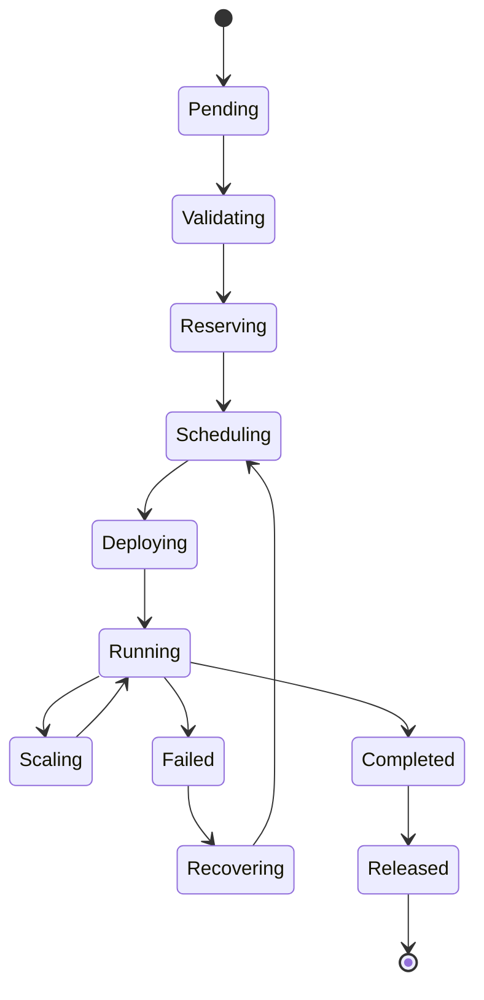

# Enterprise AI Software Factory
# Architecture Design Specification (ADS)

> **Document ID:** ADS-025-v2
>
> **Document Name:** Compute & Infrastructure Platform — Infrastructure Algorithms & Scheduling
>
> **Version:** 2.0.0
>
> **Classification:** Enterprise Platform Plane
>
> **Importance:** CRITICAL
>
> **Depends On:** ADS-025-v1
>
> **Next:** ADS-025-v3 — APIs, Events & Contracts

---

# Executive Summary

This document defines the algorithms responsible for infrastructure scheduling, workload placement, capacity management, autoscaling, GPU allocation, storage selection, and cluster optimization.

Infrastructure scheduling is deterministic.

The platform determines placement before Kubernetes executes it.

Infrastructure remains policy-driven.

---

# Design Philosophy

Infrastructure scheduling follows six principles.

- Policy First
- Capacity Aware
- Cost Conscious
- Failure Resistant
- Region Aware
- Deterministic

Infrastructure decisions should be explainable.

---

# Infrastructure Scheduling Pipeline

```text
Execution Plan

↓

Execution Profile

↓

Infrastructure Profile

↓

Policy Validation

↓

Capacity Analysis

↓

Node Selection

↓

Placement

↓

Deployment
```

Every placement decision is recorded.

---

# Infrastructure Profile

Infrastructure Profiles define reusable compute configurations.

```yaml
infrastructureProfile:

  name: gpu-large

  nodePool: gpu-a100

  cpu: 16

  memory: 64Gi

  gpu:

    type: NVIDIA A100

    count: 2

  storageClass: nvme-ssd

  availabilityZones:

    - zone-a

    - zone-b

  backupPolicy: standard
```

Execution Plans reference Infrastructure Profiles.

---

# ALG-025-001

## Infrastructure Resolution

Scheduling begins by resolving the Infrastructure Profile.

Resolution inputs

- Execution Profile
- Execution Class
- Organization Policy
- Tenant Policy
- Resource Quotas

Output

```
Deployment Specification
```

---

# Compute Scheduling

The Scheduler evaluates

- CPU
- Memory
- GPU
- Storage
- Network
- Affinity
- Anti-Affinity
- Regional Capacity

Scheduling is deterministic.

---

# Node Categories

Supported node categories

| Category | Purpose |
|-----------|----------|
| Standard | General execution |
| High Memory | Large contexts |
| GPU | AI inference |
| Compute Optimized | Heavy compilation |
| System | Platform services |

Workloads never target nodes directly.

---

# ALG-025-002

## Node Selection

Node selection evaluates

```text
Infrastructure Profile

↓

Available Capacity

↓

Affinity Rules

↓

Organization Policies

↓

Failure Domains

↓

Candidate Nodes

↓

Best Placement
```

The highest-ranked candidate is selected.

---

# Capacity Manager

The Capacity Manager tracks

- CPU Allocation
- Memory Allocation
- GPU Allocation
- Storage Usage
- Network Capacity
- Reserved Capacity

Capacity remains globally visible.

---

# ALG-025-003

## Resource Reservation

Resources are reserved before execution.

Reservation includes

- CPU
- Memory
- GPU
- Storage
- Network Bandwidth

Reservations expire automatically if execution never begins.

---

# GPU Scheduling

GPU allocation considers

- GPU Model
- VRAM
- Organization Priority
- Tenant Quotas
- Cost Policies

Supported GPU classes

| Class | Purpose |
|--------|----------|
| Shared | Inference |
| Dedicated | Critical inference |
| Multi-GPU | Large workloads |

GPU allocation is policy-driven.

---

# Storage Placement

Storage selection considers

- Performance
- Durability
- Region
- Encryption
- Snapshot Policy

Storage classes remain abstracted.

---

# ALG-025-004

## Workload Affinity

The Scheduler evaluates

- Node Affinity
- Pod Affinity
- Pod Anti-Affinity
- Zone Affinity
- Region Affinity

Affinity improves locality.

---

# Cluster Awareness

Scheduling considers

- Cluster Health
- Capacity
- Region
- Latency
- Failure Domains
- Maintenance Windows

Clusters remain interchangeable.

---

# ALG-025-005

## Cluster Selection

The Cluster Manager evaluates every available cluster before scheduling.

Evaluation criteria

- Available Capacity
- Region
- Availability Zone
- Latency
- GPU Availability
- Storage Availability
- Maintenance Windows
- Organization Policies

Selection Pipeline

```text
Execution Plan

↓

Infrastructure Profile

↓

Eligible Clusters

↓

Health Evaluation

↓

Capacity Analysis

↓

Cluster Ranking

↓

Selected Cluster
```

Every selection is deterministic.

---

# Placement Decision

Every scheduling operation produces a Placement Decision artifact.

```yaml
placementDecision:

  id:

  executionPlan:

  infrastructureProfile:

  selectedCluster:

  selectedNodePool:

  selectedZone:

  selectedNode:

  schedulingPolicy:

  capacitySnapshot:

  affinityEvaluation:

  estimatedLatency:

  estimatedCost:

  riskAssessment:

  timestamp:
```

Placement Decisions are immutable.

---

# ALG-025-006

## Autoscaling

Autoscaling continuously evaluates cluster demand.

Scaling Inputs

- Pending Workloads
- CPU Utilization
- Memory Utilization
- GPU Utilization
- Queue Depth
- SLA Violations

Scaling Flow

```text
Metrics

↓

Threshold Evaluation

↓

Scale Decision

↓

Provision Nodes

↓

Join Cluster

↓

Schedule Workloads
```

Scaling operations are policy controlled.

---

# ALG-025-007

## Cluster Balancing

The platform balances workloads across clusters.

Balancing factors

- CPU Utilization
- Memory Utilization
- GPU Utilization
- Network Load
- Storage Capacity
- Failure Domains

No cluster should become a bottleneck.

---

# ALG-025-008

## Capacity Forecasting

Capacity forecasting predicts future demand.

Prediction inputs

- Historical Usage
- Execution Trends
- Seasonal Patterns
- Organization Growth
- Reserved Capacity

Forecasts support proactive scaling.

---

# Resource Quotas

Quota scopes

| Scope | Description |
|--------|-------------|
| Organization | Maximum infrastructure allocation |
| Project | Project resource limits |
| Workflow | Execution-specific limits |
| Tenant | Multi-tenant isolation |
| Agent | Per-agent execution limits |

Quota violations reject scheduling.

---

# Placement Policies

Supported policies

| Policy | Purpose |
|---------|---------|
| Lowest Latency | Fastest execution |
| Lowest Cost | Cost optimization |
| Highest Availability | Mission critical workloads |
| GPU Optimized | Accelerator workloads |
| Data Locality | Minimize data movement |
| Balanced | General purpose scheduling |

Policies remain configurable.

---

# Multi-Region Scheduling

Scheduling considers

- Regional Capacity
- Regional Health
- Data Residency
- Latency
- Disaster Recovery
- Compliance

Cross-region placement follows governance rules.

---

# Infrastructure State Machine



Every infrastructure allocation follows this lifecycle.

---

# Runtime Metrics

```text
cluster_utilization_percent

node_allocations_total

placement_decisions_total

autoscaling_events_total

gpu_allocations_total

capacity_forecast_accuracy

cluster_failovers_total

resource_quota_violations_total

scheduler_duration_seconds

placement_latency_seconds
```

---

# Structured Logging

Example

```json
{
  "placementDecision":"PLACE-001",
  "executionPlan":"PLAN-001",
  "cluster":"cluster-east-01",
  "nodePool":"gpu-pool",
  "node":"gpu-node-18",
  "estimatedLatencyMs":27,
  "estimatedCost":"$1.84",
  "status":"Scheduled"
}
```

Logs remain immutable.

---

# Architecture Decision Records

## ADR-025-03

### Decision

Generate a Placement Decision for every scheduled workload.

### Status

Accepted

### Reason

Placement Decisions provide deterministic, replayable infrastructure scheduling.

---

## ADR-025-04

### Decision

Separate infrastructure scheduling from Kubernetes scheduling.

### Status

Accepted

### Reason

Platform scheduling determines intent, while Kubernetes performs orchestration.

---

## ADR-025-05

### Decision

Forecast infrastructure demand continuously.

### Status

Accepted

### Reason

Predictive scaling improves availability and reduces provisioning latency.

---

# Operational Readiness Scorecard

| Capability | Status |
|------------|--------|
| Placement Decisions | ✅ Required |
| Cluster Balancing | ✅ Required |
| Predictive Scaling | ✅ Required |
| GPU Scheduling | ✅ Required |
| Multi-Region Scheduling | ✅ Required |
| Capacity Forecasting | ✅ Required |
| Resource Quotas | ✅ Required |
| Deterministic Placement | ✅ Required |

---

# Related Documents

ADS-024-v5 — Agent Execution Platform

ADS-025-v1 — Compute & Infrastructure Platform

ADS-025-v3 — APIs, Events & Contracts

ADS-026-v1 — Security Platform

ADS-027-v1 — Observability Platform

---

# End of Document
