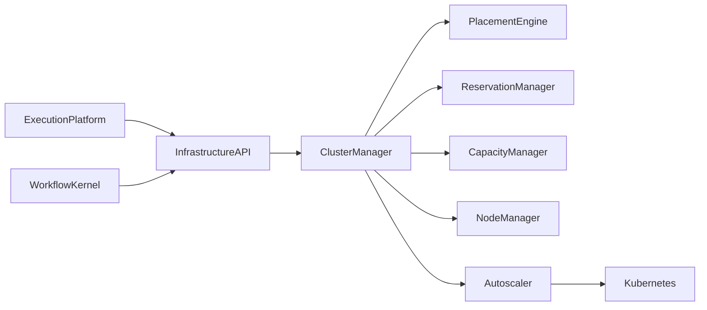
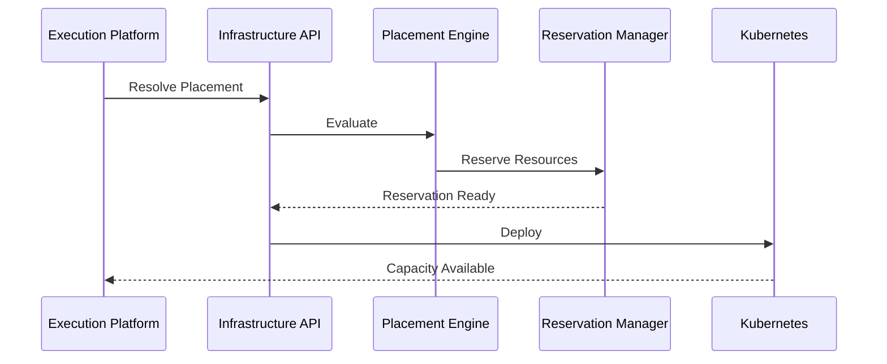

# Enterprise AI Software Factory
# Architecture Design Specification (ADS)

> **Document ID:** ADS-025-v3
>
> **Document Name:** Compute & Infrastructure Platform — APIs, Events & Contracts
>
> **Version:** 2.0.0
>
> **Classification:** Enterprise Platform Plane
>
> **Importance:** CRITICAL
>
> **Depends On:** ADS-025-v1
>
> **Depends On:** ADS-025-v2
>
> **Next:** ADS-025-v4 — Runtime & Cluster Infrastructure

---

# Executive Summary

The Compute & Infrastructure Platform exposes standardized APIs, infrastructure contracts, scheduling interfaces, reservation services, placement APIs, capacity services, and lifecycle events.

All infrastructure interactions occur through these contracts.

Infrastructure implementations may evolve.

Infrastructure contracts remain stable.

---

# Communication Principles

Every infrastructure request MUST satisfy

- Authenticated
- Authorized
- Versioned
- Observable
- Auditable
- Idempotent
- Policy Compliant
- Tenant Isolated

Infrastructure consumers never communicate directly with Kubernetes.

---

# Infrastructure Communication Architecture



The Cluster Manager is the only infrastructure orchestrator.

---

# Public REST API

The Infrastructure Platform exposes APIs for

- Execution Platform
- Workflow Kernel
- Enterprise Dashboard
- Operations Portal
- CLI

---

## API-025-001

### Resolve Placement

```http
POST /infrastructure/v1/placement
```

Purpose

Resolves placement for an Execution Plan.

---

Request

```json
{
  "executionPlan":"PLAN-2026-001",
  "executionProfile":"backend-standard",
  "infrastructureProfile":"gpu-large"
}
```

---

Response

```json
{
  "placementDecision":"PLACE-001",
  "status":"Approved"
}
```

---

## API-025-002

### Reserve Resources

```http
POST /infrastructure/v1/reservations
```

Creates an Infrastructure Reservation.

---

## API-025-003

### Release Reservation

```http
DELETE /infrastructure/v1/reservations/{reservationId}
```

Releases reserved capacity.

---

## API-025-004

### Query Capacity

```http
GET /infrastructure/v1/capacity
```

Returns cluster utilization.

---

## API-025-005

### List Clusters

```http
GET /infrastructure/v1/clusters
```

Returns available clusters and health.

---

# Internal gRPC Services

```protobuf
service InfrastructureService {

rpc ResolvePlacement(PlacementRequest)
returns(PlacementResponse);

rpc ReserveResources(ReservationRequest)
returns(ReservationResponse);

rpc ReleaseReservation(ReleaseRequest)
returns(ReleaseResponse);

rpc QueryCapacity(CapacityRequest)
returns(CapacityResponse);

rpc ScaleCluster(ScalingRequest)
returns(ScalingResponse);

}
```

---

# Placement Decision Schema

```protobuf
message PlacementDecision {

string placement_id = 1;

string execution_plan = 2;

string cluster = 3;

string node_pool = 4;

string infrastructure_profile = 5;

}
```

---

# Infrastructure Reservation Schema

```protobuf
message InfrastructureReservation {

string reservation_id = 1;

string placement_id = 2;

string cluster = 3;

string node_pool = 4;

string owner = 5;

}
```

---

# MCP Tool Contracts

The Compute Platform exposes

```
resolve_placement

reserve_resources

release_resources

query_capacity

cluster_health

scale_cluster

placement_history

reservation_status
```

Every invocation is authenticated and audited.

---

# Infrastructure Events

Every infrastructure operation emits immutable events.

---

## EVT-025-001

PlacementResolved

---

## EVT-025-002

ReservationCreated

---

## EVT-025-003

ReservationReleased

---

## EVT-025-004

ClusterScaled

---

## EVT-025-005

NodeProvisioned

---

## EVT-025-006

NodeRemoved

---

## EVT-025-007

CapacityUpdated

---

## EVT-025-008

InfrastructureRecovered

---

# Event Flow



---

# Event Ordering

```text
PlacementResolved

↓

ReservationCreated

↓

DeploymentStarted

↓

NodeProvisioned

↓

ExecutionReady
```

---

# Event Metadata

Every event contains

```yaml
eventId:
placementDecision:
reservationId:
clusterId:
nodePool:
traceId:
correlationId:
timestamp:
schemaVersion:
```

---

# End of Part 1
