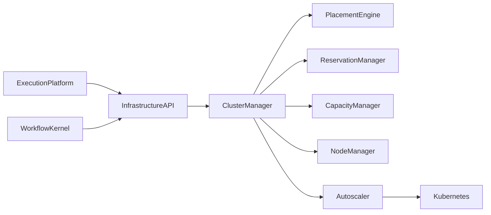
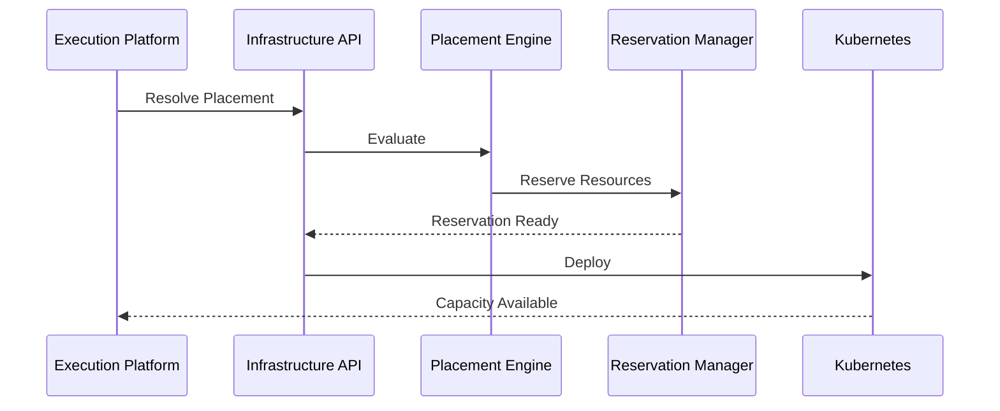
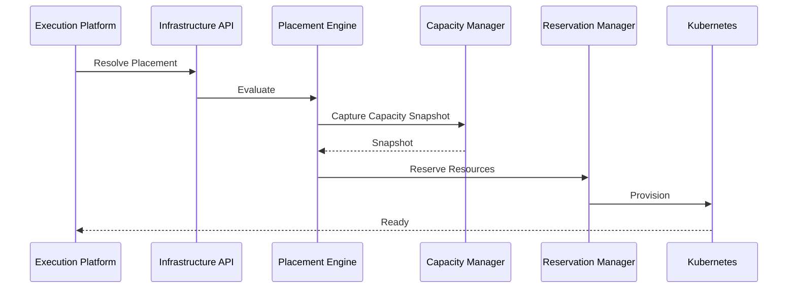

# Enterprise AI Software Factory
# Architecture Design Specification (ADS)

> **Document ID:** ADS-025-v3
>
> **Document Name:** Compute & Infrastructure Platform — APIs, Events & Contracts
>
> **Version:** 2.0.0
>
> **Classification:** Enterprise Platform Plane
>
> **Importance:** CRITICAL
>
> **Depends On:** ADS-025-v1
>
> **Depends On:** ADS-025-v2
>
> **Next:** ADS-025-v4 — Runtime & Cluster Infrastructure

---

# Executive Summary

The Compute & Infrastructure Platform exposes standardized APIs, infrastructure contracts, scheduling interfaces, reservation services, placement APIs, capacity services, and lifecycle events.

All infrastructure interactions occur through these contracts.

Infrastructure implementations may evolve.

Infrastructure contracts remain stable.

---

# Communication Principles

Every infrastructure request MUST satisfy

- Authenticated
- Authorized
- Versioned
- Observable
- Auditable
- Idempotent
- Policy Compliant
- Tenant Isolated

Infrastructure consumers never communicate directly with Kubernetes.

---

# Infrastructure Communication Architecture



The Cluster Manager is the only infrastructure orchestrator.

---

# Public REST API

The Infrastructure Platform exposes APIs for

- Execution Platform
- Workflow Kernel
- Enterprise Dashboard
- Operations Portal
- CLI

---

## API-025-001

### Resolve Placement

```http
POST /infrastructure/v1/placement
```

Purpose

Resolves placement for an Execution Plan.

---

Request

```json
{
  "executionPlan":"PLAN-2026-001",
  "executionProfile":"backend-standard",
  "infrastructureProfile":"gpu-large"
}
```

---

Response

```json
{
  "placementDecision":"PLACE-001",
  "status":"Approved"
}
```

---

## API-025-002

### Reserve Resources

```http
POST /infrastructure/v1/reservations
```

Creates an Infrastructure Reservation.

---

## API-025-003

### Release Reservation

```http
DELETE /infrastructure/v1/reservations/{reservationId}
```

Releases reserved capacity.

---

## API-025-004

### Query Capacity

```http
GET /infrastructure/v1/capacity
```

Returns cluster utilization.

---

## API-025-005

### List Clusters

```http
GET /infrastructure/v1/clusters
```

Returns available clusters and health.

---

# Internal gRPC Services

```protobuf
service InfrastructureService {

rpc ResolvePlacement(PlacementRequest)
returns(PlacementResponse);

rpc ReserveResources(ReservationRequest)
returns(ReservationResponse);

rpc ReleaseReservation(ReleaseRequest)
returns(ReleaseResponse);

rpc QueryCapacity(CapacityRequest)
returns(CapacityResponse);

rpc ScaleCluster(ScalingRequest)
returns(ScalingResponse);

}
```

---

# Placement Decision Schema

```protobuf
message PlacementDecision {

string placement_id = 1;

string execution_plan = 2;

string cluster = 3;

string node_pool = 4;

string infrastructure_profile = 5;

}
```

---

# Infrastructure Reservation Schema

```protobuf
message InfrastructureReservation {

string reservation_id = 1;

string placement_id = 2;

string cluster = 3;

string node_pool = 4;

string owner = 5;

}
```

---

# MCP Tool Contracts

The Compute Platform exposes

```
resolve_placement

reserve_resources

release_resources

query_capacity

cluster_health

scale_cluster

placement_history

reservation_status
```

Every invocation is authenticated and audited.

---

# Infrastructure Events

Every infrastructure operation emits immutable events.

---

## EVT-025-001

PlacementResolved

---

## EVT-025-002

ReservationCreated

---

## EVT-025-003

ReservationReleased

---

## EVT-025-004

ClusterScaled

---

## EVT-025-005

NodeProvisioned

---

## EVT-025-006

NodeRemoved

---

## EVT-025-007

CapacityUpdated

---

## EVT-025-008

InfrastructureRecovered

---

# Event Flow



---

# Event Ordering

```text
PlacementResolved

↓

ReservationCreated

↓

DeploymentStarted

↓

NodeProvisioned

↓

ExecutionReady
```

---

# Event Metadata

Every event contains

```yaml
eventId:
placementDecision:
reservationId:
clusterId:
nodePool:
traceId:
correlationId:
timestamp:
schemaVersion:
```

---

# Contract Validation

Every infrastructure request follows a deterministic validation pipeline.

```text
Receive Request

↓

Schema Validation

↓

Authentication

↓

Authorization

↓

Placement Validation

↓

Capacity Validation

↓

Policy Evaluation

↓

Reservation

↓

Deployment
```

Infrastructure operations begin only after successful validation.

---

# Validation Rules

Every request MUST satisfy

| Rule | Description |
|------|-------------|
| API Version | Supported contract version |
| Authentication | Valid workload identity |
| Authorization | Infrastructure permissions |
| Placement Decision | Valid version |
| Infrastructure Profile | Approved profile |
| Capacity | Sufficient available resources |
| Policy | Organizational policy satisfied |
| Integrity | Request integrity verified |

Validation failures terminate the request.

---

# Authentication

Infrastructure authentication is delegated to the Identity Plane.

Supported methods

- OAuth 2.1
- OpenID Connect
- SPIFFE / SPIRE
- Mutual TLS
- Service Accounts

Infrastructure components never authenticate users directly.

---

# Authorization

Authorization evaluates

- Organization Policy
- Tenant Policy
- Infrastructure Profile
- Resource Quotas
- Cluster Access
- Deployment Policy

Decision

```text
Allow

↓

Reserve

Deny

↓

Reject

Escalate

↓

Operations Approval
```

Every authorization decision is audited.

---

# Placement Engine

Every scheduling request enters the Placement Engine.

Responsibilities

- Infrastructure Profile Resolution
- Cluster Ranking
- Node Pool Selection
- Capacity Validation
- Affinity Evaluation
- Risk Assessment
- Cost Estimation

Placement Decisions are immutable.

---

# Capacity Snapshot

Every Placement Decision references a Capacity Snapshot.

```yaml
capacitySnapshot:

  snapshotId:

  cluster:

  cpuAvailable:

  memoryAvailable:

  gpuAvailable:

  activeReservations:

  queueDepth:

  nodeHealth:

  utilization:

  timestamp:
```

Capacity Snapshots remain immutable.

---

# Runtime Sequence



---

# Retry Policy

Retryable operations

| Operation | Retry |
|-----------|------:|
| Node Provisioning Timeout | Yes |
| Autoscaler Delay | Yes |
| Temporary Capacity Shortage | Yes |
| Network Timeout | Yes |
| Invalid Placement Decision | No |
| Quota Violation | No |
| Authorization Failure | No |

Retry schedule

```text
1 s

↓

2 s

↓

4 s

↓

8 s

↓

Escalation
```

Retries remain bounded.

---

# Circuit Breakers

Infrastructure isolates unhealthy clusters.

```text
Cluster Failure

↓

Retry

↓

Failure Threshold

↓

Cluster Disabled

↓

Alternative Cluster

↓

Recovery Probe

↓

Cluster Enabled
```

Infrastructure failures remain localized.

---

# Distributed Tracing

Every infrastructure operation includes

- Trace ID
- Placement Decision ID
- Reservation ID
- Cluster ID
- Node Pool ID

Trace Flow

```text
Infrastructure API

↓

Placement Engine

↓

Capacity Manager

↓

Reservation Manager

↓

Cluster Manager

↓

Kubernetes
```

Every infrastructure stage contributes trace spans.

---

# Prometheus Metrics

```text
placement_requests_total

placement_duration_seconds

reservation_requests_total

capacity_snapshot_total

cluster_provisioning_seconds

node_pool_utilization

quota_violations_total

autoscaling_events_total

cluster_failover_total

reservation_expirations_total
```

---

# Structured Logging

Example

```json
{
  "traceId":"trace-9101",
  "placementDecision":"PLACE-001",
  "reservationId":"RES-001",
  "cluster":"cluster-east-01",
  "nodePool":"gpu-a100",
  "capacitySnapshot":"SNAP-2026-011",
  "status":"Reserved"
}
```

Logs are immutable and correlated.

---

# Audit Records

Every infrastructure operation records

- Placement Decision
- Capacity Snapshot
- Reservation
- Cluster
- Node Pool
- Infrastructure Profile
- Resource Allocation
- Timestamp
- Trace ID

Audit history is append-only.

---

# Reference Standards & Specifications

The Compute Platform aligns with

| Standard | Purpose |
|----------|---------|
| Kubernetes API | Cluster orchestration |
| Cluster API (CAPI) | Cluster lifecycle |
| OpenTelemetry | Distributed tracing |
| OpenAPI 3.1 | REST APIs |
| gRPC | Internal communication |
| OCI Runtime Specification | Container runtime |
| CSI | Storage integration |
| CNI | Networking integration |

---

# Architecture Decision Records

## ADR-025-06

### Decision

Capture immutable Capacity Snapshots for every Placement Decision.

### Status

Accepted

### Reason

Immutable infrastructure state enables deterministic replay and scheduling analysis.

---

## ADR-025-07

### Decision

Require Infrastructure Reservations before deployment.

### Status

Accepted

### Reason

Reservations prevent contention and guarantee resource availability.

---

## ADR-025-08

### Decision

Treat Kubernetes as the execution engine rather than the scheduling authority.

### Status

Accepted

### Reason

The platform owns scheduling intent while Kubernetes performs infrastructure orchestration.

---

# Operational Readiness Scorecard

| Capability | Status |
|------------|--------|
| Placement Engine | ✅ Required |
| Capacity Snapshots | ✅ Required |
| Infrastructure Reservations | ✅ Required |
| Distributed Tracing | ✅ Required |
| Immutable Audit Trail | ✅ Required |
| Retry & Recovery | ✅ Required |
| Standards Compliance | ✅ Required |
| Deterministic Placement | ✅ Required |

---

# Related Documents

ADS-024-v5 — Agent Execution Platform

ADS-025-v1 — Compute & Infrastructure Platform

ADS-025-v2 — Infrastructure Algorithms & Scheduling

ADS-025-v4 — Runtime & Cluster Infrastructure

ADS-026-v1 — Security Platform

ADS-027-v1 — Observability Platform

---

# End of Document
