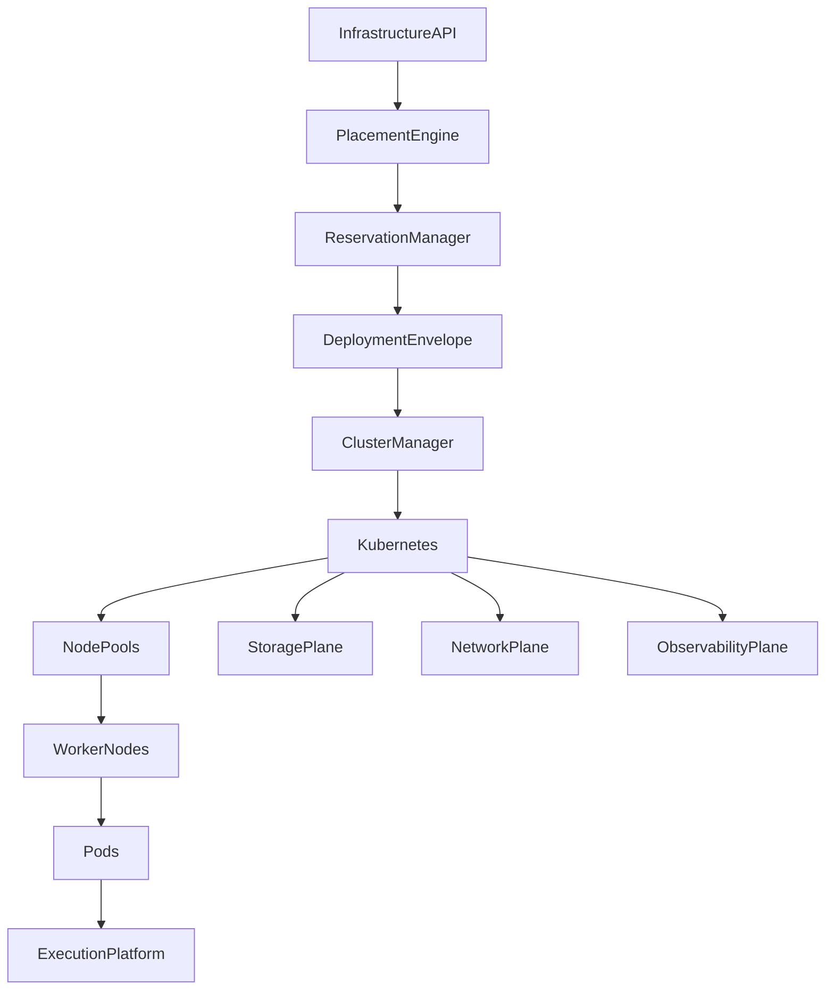
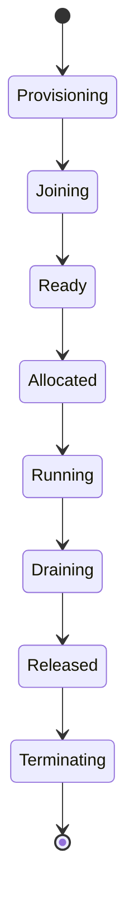

# Enterprise AI Software Factory
# Architecture Design Specification (ADS)

> **Document ID:** ADS-025-v4
>
> **Document Name:** Compute & Infrastructure Platform — Runtime & Cluster Infrastructure
>
> **Version:** 2.0.0
>
> **Classification:** Enterprise Runtime Specification
>
> **Importance:** CRITICAL
>
> **Depends On:** ADS-025-v1
>
> **Depends On:** ADS-025-v2
>
> **Depends On:** ADS-025-v3
>
> **Next:** ADS-025-v5 — End-to-End Infrastructure Lifecycle

---

# Executive Summary

This document defines the runtime infrastructure responsible for operating clusters, nodes, storage systems, networking, autoscaling, and workload placement across the Enterprise AI Software Factory.

The runtime converts Placement Decisions into running infrastructure while maintaining security, availability, scalability, and observability.

The runtime guarantees

- deterministic deployment
- infrastructure isolation
- high availability
- elastic scaling
- automatic recovery
- workload portability
- continuous monitoring

---

# Runtime Philosophy

The runtime follows seven principles.

- Immutable Infrastructure
- Disposable Nodes
- Automated Recovery
- Policy Enforcement
- Elastic Capacity
- Observable Operations
- Multi-Region Resilience

---

# Runtime Layers

## Control Plane

Responsible for

- Cluster Management
- Placement
- Scheduling
- Autoscaling
- Capacity Planning

---

## Compute Plane

Responsible for

- Worker Nodes
- Node Pools
- Kubernetes Pods
- GPU Nodes
- Runtime Isolation

---

## Storage Plane

Responsible for

- Persistent Volumes
- Object Storage
- Snapshots
- Backups
- Replication

---

## Network Plane

Responsible for

- Service Mesh
- DNS
- Load Balancing
- Ingress
- Egress
- Network Policies

---

# Runtime Architecture



Deployment Envelopes are the deployment authority.

---

# Runtime Components

| Component | Responsibility |
|------------|----------------|
| Cluster Manager | Cluster lifecycle |
| Placement Engine | Placement execution |
| Reservation Manager | Resource ownership |
| Kubernetes | Container orchestration |
| Node Pool Manager | Node lifecycle |
| Autoscaler | Elastic capacity |
| Storage Plane | Persistent storage |
| Network Plane | Connectivity |
| Observability Plane | Monitoring |
| Recovery Manager | Infrastructure recovery |

---

# Node Lifecycle



Nodes are immutable and disposable.

---

# Deployment Pipeline

```text
Deployment Envelope

↓

Reservation Validation

↓

Cluster Selection

↓

Node Allocation

↓

Pod Scheduling

↓

Health Verification

↓

Traffic Admission

↓

Running
```

Every stage is observable.

---

# Node Pools

Supported node pools

| Pool | Purpose |
|------|----------|
| General | Standard execution |
| Compute Optimized | Compilation |
| High Memory | Large contexts |
| GPU | AI inference |
| System | Platform services |

Node pools scale independently.

---

# Runtime Isolation

Infrastructure isolation includes

- Cluster Isolation
- Namespace Isolation
- Node Pool Isolation
- Pod Isolation
- Network Isolation
- Storage Isolation

Isolation boundaries are enforced continuously.

---

# Storage Runtime

The Storage Plane manages

- CSI Drivers
- Volume Provisioning
- Snapshots
- Replication
- Encryption
- Recovery

Storage remains infrastructure-independent.

---

# Network Runtime

The Network Plane provides

- Service Discovery
- Internal DNS
- Service Mesh
- Ingress
- Egress
- Network Policies

Network policies are enforced before traffic is admitted.

---

# Runtime Guarantees

The runtime guarantees

- Immutable deployments
- Deterministic placement
- Continuous health monitoring
- Automatic scaling
- Secure networking
- Portable workloads

---

# End of Part 1
