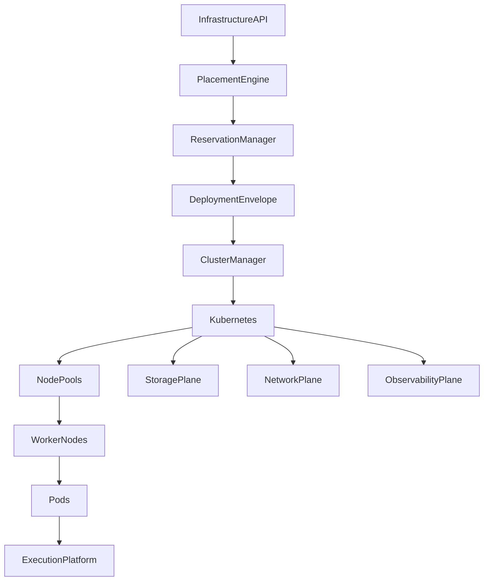
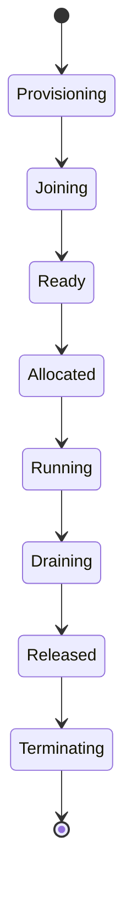
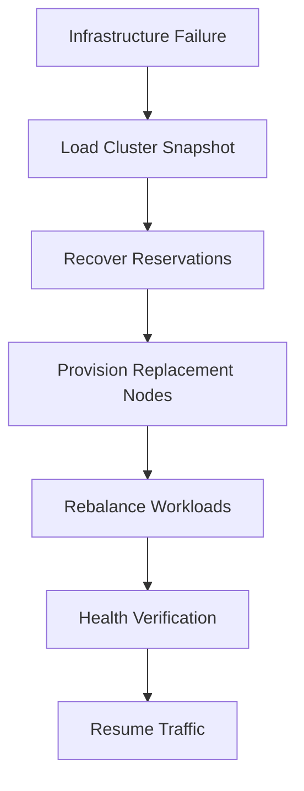

# Enterprise AI Software Factory
# Architecture Design Specification (ADS)

> **Document ID:** ADS-025-v4
>
> **Document Name:** Compute & Infrastructure Platform — Runtime & Cluster Infrastructure
>
> **Version:** 2.0.0
>
> **Classification:** Enterprise Runtime Specification
>
> **Importance:** CRITICAL
>
> **Depends On:** ADS-025-v1
>
> **Depends On:** ADS-025-v2
>
> **Depends On:** ADS-025-v3
>
> **Next:** ADS-025-v5 — End-to-End Infrastructure Lifecycle

---

# Executive Summary

This document defines the runtime infrastructure responsible for operating clusters, nodes, storage systems, networking, autoscaling, and workload placement across the Enterprise AI Software Factory.

The runtime converts Placement Decisions into running infrastructure while maintaining security, availability, scalability, and observability.

The runtime guarantees

- deterministic deployment
- infrastructure isolation
- high availability
- elastic scaling
- automatic recovery
- workload portability
- continuous monitoring

---

# Runtime Philosophy

The runtime follows seven principles.

- Immutable Infrastructure
- Disposable Nodes
- Automated Recovery
- Policy Enforcement
- Elastic Capacity
- Observable Operations
- Multi-Region Resilience

---

# Runtime Layers

## Control Plane

Responsible for

- Cluster Management
- Placement
- Scheduling
- Autoscaling
- Capacity Planning

---

## Compute Plane

Responsible for

- Worker Nodes
- Node Pools
- Kubernetes Pods
- GPU Nodes
- Runtime Isolation

---

## Storage Plane

Responsible for

- Persistent Volumes
- Object Storage
- Snapshots
- Backups
- Replication

---

## Network Plane

Responsible for

- Service Mesh
- DNS
- Load Balancing
- Ingress
- Egress
- Network Policies

---

# Runtime Architecture



Deployment Envelopes are the deployment authority.

---

# Runtime Components

| Component | Responsibility |
|------------|----------------|
| Cluster Manager | Cluster lifecycle |
| Placement Engine | Placement execution |
| Reservation Manager | Resource ownership |
| Kubernetes | Container orchestration |
| Node Pool Manager | Node lifecycle |
| Autoscaler | Elastic capacity |
| Storage Plane | Persistent storage |
| Network Plane | Connectivity |
| Observability Plane | Monitoring |
| Recovery Manager | Infrastructure recovery |

---

# Node Lifecycle



Nodes are immutable and disposable.

---

# Deployment Pipeline

```text
Deployment Envelope

↓

Reservation Validation

↓

Cluster Selection

↓

Node Allocation

↓

Pod Scheduling

↓

Health Verification

↓

Traffic Admission

↓

Running
```

Every stage is observable.

---

# Node Pools

Supported node pools

| Pool | Purpose |
|------|----------|
| General | Standard execution |
| Compute Optimized | Compilation |
| High Memory | Large contexts |
| GPU | AI inference |
| System | Platform services |

Node pools scale independently.

---

# Runtime Isolation

Infrastructure isolation includes

- Cluster Isolation
- Namespace Isolation
- Node Pool Isolation
- Pod Isolation
- Network Isolation
- Storage Isolation

Isolation boundaries are enforced continuously.

---

# Storage Runtime

The Storage Plane manages

- CSI Drivers
- Volume Provisioning
- Snapshots
- Replication
- Encryption
- Recovery

Storage remains infrastructure-independent.

---

# Network Runtime

The Network Plane provides

- Service Discovery
- Internal DNS
- Service Mesh
- Ingress
- Egress
- Network Policies

Network policies are enforced before traffic is admitted.

---

# Runtime Guarantees

The runtime guarantees

- Immutable deployments
- Deterministic placement
- Continuous health monitoring
- Automatic scaling
- Secure networking
- Portable workloads

---

# Failure Recovery

The infrastructure runtime continuously monitors cluster health and automatically recovers from failures.

Recovery always preserves workload integrity.



Recovery guarantees

- No orphaned reservations
- No duplicate workloads
- Deterministic workload recovery
- Preserved deployment history

---

# Runtime Health Monitoring

Every runtime component continuously reports health.

Collected metrics

- Cluster Health
- Node Health
- Node Pool Utilization
- Storage Health
- Network Health
- Scheduler Health
- Autoscaler Health
- Deployment Success Rate

Health Flow

```text
Infrastructure Component

↓

Heartbeat

↓

Health Manager

↓

Observability Plane

↓

Alert Manager

↓

Operations Dashboard
```

Missing heartbeats trigger recovery workflows.

---

# Horizontal Scaling

Infrastructure scales automatically.

Scaling signals

- Pending Reservations
- CPU Utilization
- Memory Utilization
- GPU Utilization
- Queue Depth
- SLA Violations
- Cluster Saturation

Scaling Flow

```text
Metrics

↓

Scaling Policy

↓

Provision Nodes

↓

Join Cluster

↓

Rebalance Workloads
```

Scaling remains policy-driven.

---

# Cluster Snapshot

Every running cluster periodically generates a Cluster Snapshot.

```yaml
clusterSnapshot:

  snapshotId:

  clusterId:

  nodePools:

  activeNodes:

  runningWorkloads:

  activeReservations:

  cpuUtilization:

  memoryUtilization:

  gpuUtilization:

  storageHealth:

  networkHealth:

  timestamp:
```

Snapshots support recovery and diagnostics.

---

# Infrastructure Reservation

Infrastructure Reservations remain active throughout workload execution.

Reservation lifecycle

```text
Created

↓

Validated

↓

Allocated

↓

Active

↓

Released

↓

Archived
```

Reservations guarantee resource ownership.

---

# Runtime Configuration

Example

```yaml
infrastructure:

  clusterManager: kubernetes

  autoscaler: karpenter

  serviceMesh: istio

  networkProvider: cilium

  storageProvider: rook-ceph

  snapshotInterval: 300s

  deploymentEnvelope: required

  recoveryEnabled: true

  observability: full
```

Configuration remains version-controlled.

---

# Performance Optimizations

Infrastructure optimizations include

- Node Pool Rebalancing
- Predictive Autoscaling
- GPU Packing
- Warm Node Pools
- Intelligent Bin Packing
- Storage Locality
- Network Locality

Optimizations must preserve deterministic scheduling.

---

# Prometheus Metrics

```text
cluster_snapshot_total

deployment_envelopes_total

node_pool_utilization

cluster_health_score

storage_latency_seconds

network_latency_seconds

autoscaler_events_total

reservation_active_total

node_recovery_total

placement_rebalance_total
```

---

# OpenTelemetry

Distributed tracing spans

```text
Infrastructure API

↓

Placement Engine

↓

Reservation Manager

↓

Cluster Manager

↓

Kubernetes

↓

Node Pools

↓

Pods

↓

Observability Plane
```

Every runtime stage contributes trace spans.

---

# Structured Logging

Example

```json
{
  "traceId":"trace-10101",
  "cluster":"cluster-east-01",
  "snapshot":"SNAP-004",
  "deploymentEnvelope":"ENV-001",
  "nodePool":"gpu-pool",
  "activeNodes":42,
  "status":"Healthy"
}
```

Logs are immutable and correlated with deployment records.

---

# Disaster Recovery

Recovery flow

```text
Region Failure

↓

Secondary Region

↓

Restore Cluster State

↓

Recover Reservations

↓

Rebuild Node Pools

↓

Resume Workloads
```

Recovery targets

Recovery Point Objective (RPO)

Near-zero infrastructure data loss

Recovery Time Objective (RTO)

Less than ten minutes

---

# Recommended Production Deployment

```text
Global Control Plane

↓

Regional Clusters

↓

Cluster Manager

↓

Kubernetes

↓

Karpenter

↓

Node Pools

↓

Firecracker Workers

↓

Cilium

↓

Istio

↓

CSI Storage

↓

OpenTelemetry

↓

Prometheus

↓

Grafana
```

---

# Technology Decision Records

## TDR-025-01

### Technology

Karpenter

### Decision

Use Karpenter for dynamic node provisioning.

### Reason

Provides efficient, policy-driven autoscaling with rapid provisioning.

---

## TDR-025-02

### Technology

Cilium

### Decision

Adopt Cilium as the CNI.

### Reason

Supports advanced networking, security policies, and observability.

---

## TDR-025-03

### Technology

Istio

### Decision

Use Istio as the default service mesh.

### Reason

Provides traffic management, mTLS, and telemetry.

---

## TDR-025-04

### Technology

Rook-Ceph

### Decision

Adopt Rook-Ceph for distributed persistent storage.

### Reason

Provides scalable, resilient storage across Kubernetes clusters.

---

## TDR-025-05

### Technology

Cluster Snapshot

### Decision

Persist periodic Cluster Snapshots.

### Reason

Supports recovery, replay, diagnostics, and operational analysis.

---

# Runtime Checklist

The Compute Platform MUST

- Validate Deployment Envelopes
- Maintain Infrastructure Reservations
- Generate Cluster Snapshots
- Recover failed nodes automatically
- Enforce network policies
- Continuously publish telemetry
- Support multi-region failover

The Compute Platform MUST NOT

- Schedule workloads without reservations
- Bypass placement validation
- Share isolated workloads
- Lose deployment history
- Skip health verification

---

# Architecture Decision Records

## ADR-025-09

### Decision

Treat Deployment Envelopes as immutable deployment artifacts.

### Status

Accepted

### Reason

Deployment Envelopes create deterministic, reproducible infrastructure deployments.

---

## ADR-025-10

### Decision

Generate periodic Cluster Snapshots.

### Status

Accepted

### Reason

Snapshots improve recovery, diagnostics, and infrastructure replay.

---

## ADR-025-11

### Decision

Separate infrastructure runtime from execution runtime.

### Status

Accepted

### Reason

Infrastructure concerns evolve independently from execution logic.

---

# Operational Readiness Scorecard

| Capability | Status |
|------------|--------|
| Cluster Snapshots | ✅ Required |
| Deployment Envelopes | ✅ Required |
| Automatic Recovery | ✅ Required |
| Predictive Autoscaling | ✅ Required |
| Multi-Region Failover | ✅ Required |
| Infrastructure Reservations | ✅ Required |
| Service Mesh | ✅ Required |
| Full Observability | ✅ Required |

---

# Related Documents

ADS-024-v5 — Agent Execution Platform

ADS-025-v1 — Compute & Infrastructure Platform

ADS-025-v2 — Infrastructure Algorithms & Scheduling

ADS-025-v3 — APIs, Events & Contracts

ADS-025-v5 — End-to-End Infrastructure Lifecycle

ADS-026-v1 — Security Platform

---

# End of Document
