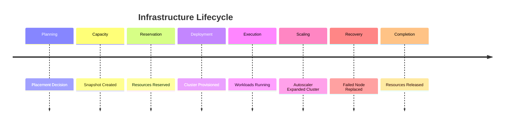

# Enterprise AI Software Factory
# Architecture Design Specification (ADS)

> **Document ID:** ADS-025-v5
>
> **Document Name:** Compute & Infrastructure Platform — End-to-End Infrastructure Lifecycle
>
> **Version:** 2.0.0
>
> **Classification:** Reference Implementation
>
> **Importance:** CRITICAL
>
> **Depends On:** ADS-025-v1
>
> **Depends On:** ADS-025-v2
>
> **Depends On:** ADS-025-v3
>
> **Depends On:** ADS-025-v4

---

# Executive Summary

This document demonstrates how the Compute & Infrastructure Platform provisions, schedules, operates, scales, and recovers infrastructure for a complete engineering workflow.

Unlike previous documents that define architecture and runtime behavior, this document illustrates the complete infrastructure lifecycle using a realistic enterprise scenario.

Every infrastructure decision remains deterministic.

Every deployment is reproducible.

Every resource is traceable.

---

# Scenario

The Workflow Kernel approves an execution requiring

- 18 AI Agents
- GPU inference
- Parallel execution
- High availability
- Multi-region failover

Generated artifacts

```
WF-2026-051

PLAN-2026-051
```

---

# Stage 1 — Infrastructure Resolution

Execution Profile

```
backend-production
```

references

```
gpu-large
```

Infrastructure Profile.

The Placement Engine resolves infrastructure requirements.

Produced

```
PLACE-2026-051
```

---

# Stage 2 — Capacity Snapshot

The Capacity Manager captures

```
SNAP-2026-018
```

Snapshot contains

- Cluster utilization
- Active reservations
- GPU availability
- Node health
- Queue depth

Snapshot becomes immutable.

---

# Stage 3 — Placement Decision

The Placement Engine evaluates

- Region
- Capacity
- Cost
- Affinity
- Organization Policies
- Failure Domains

Selected

```
cluster-east-01
```

Reason

Lowest latency with available GPU capacity.

---

# Stage 4 — Infrastructure Reservation

Reservation created

```
RES-2026-102
```

Reserved

- 32 CPU
- 96 GiB RAM
- 2 NVIDIA A100 GPUs
- NVMe SSD Storage

Reservation guarantees execution capacity.

---

# Stage 5 — Deployment Envelope

Infrastructure generates

```
ENV-2026-011
```

Contains

- Placement Decision
- Reservation
- Execution Plan
- Infrastructure Profile
- Execution Profile
- Security Policies
- Observability Profile

Envelope becomes immutable.

---

# Stage 6 — Cluster Deployment

Cluster Manager deploys workload.

Pipeline

```text
Deployment Envelope

↓

Reservation Validation

↓

Node Pool Selection

↓

Pod Scheduling

↓

Service Registration

↓

Health Verification

↓

Traffic Admission
```

Deployment succeeds.

---

# Stage 7 — Runtime Operation

Infrastructure provisions

- 12 Standard Workers
- 4 GPU Workers
- 2 High Memory Workers

All workloads enter

```
Running
```

state.

---

# Stage 8 — Autoscaling

Traffic increases.

Autoscaler detects

- CPU > 80%
- Queue Growth
- GPU Saturation

Action

```
Scale Out
```

Provisioned

```
+8 Worker Nodes
```

No execution interruption occurs.

---

# Stage 9 — Failure Recovery

One node fails unexpectedly.

Recovery pipeline

```text
Node Failure

↓

Cluster Snapshot

↓

Reservation Recovery

↓

Replacement Node

↓

Workload Migration

↓

Health Verification
```

Recovery completes automatically.

---

# Stage 10 — Multi-Region Failover

Primary region becomes unavailable.

Failover process

- Secondary region activated
- Reservations recreated
- Deployment Envelope replayed
- Workloads restored

Recovery objective achieved.

---

# Stage 11 — Execution Completion

Execution Platform reports

```
Completed
```

Infrastructure releases

- CPU
- Memory
- GPU
- Temporary Storage

Reservations become

```
Released
```

---

# Stage 12 — Cluster Snapshot

Final snapshot

```
SNAP-2026-019
```

Records

- Final utilization
- Running workloads
- Released reservations
- Cluster health

Snapshot archived.

---

# Stage 13 — Infrastructure Closure

Node pools rebalance.

Unused nodes terminate.

Temporary volumes deleted.

Persistent storage retained.

Deployment Envelope archived.

Infrastructure returns to baseline capacity.

---

# Infrastructure Timeline



---

# Infrastructure Event Stream

```text
PlacementResolved

↓

CapacitySnapshotCreated

↓

ReservationCreated

↓

DeploymentEnvelopeGenerated

↓

DeploymentStarted

↓

NodeProvisioned

↓

ScalingTriggered

↓

RecoveryCompleted

↓

ReservationReleased

↓

ClusterSnapshotArchived
```

---

# Produced Artifacts

| Artifact | Identifier |
|-----------|------------|
| Placement Decision | PLACE-2026-051 |
| Capacity Snapshot | SNAP-2026-018 |
| Infrastructure Reservation | RES-2026-102 |
| Deployment Envelope | ENV-2026-011 |
| Cluster Snapshot | SNAP-2026-019 |
| Execution Plan | PLAN-2026-051 |

---

# Runtime Metrics

| Metric | Value |
|---------|------:|
| Clusters Used | 2 |
| Worker Nodes | 26 |
| GPU Nodes | 4 |
| Autoscaling Events | 3 |
| Recovery Events | 1 |
| Deployment Time | 54 s |
| Failover Time | 2 min |
| Cluster Availability | 99.99% |

---

# Operational Readiness Scorecard

| Capability | Status |
|------------|--------|
| Placement Decisions | ✅ Verified |
| Infrastructure Reservations | ✅ Verified |
| Deployment Envelopes | ✅ Verified |
| Cluster Snapshots | ✅ Verified |
| Predictive Autoscaling | ✅ Verified |
| Multi-Region Recovery | ✅ Verified |
| Automatic Node Recovery | ✅ Verified |
| Infrastructure Traceability | ✅ Verified |

---

# Lessons Learned

The Compute & Infrastructure Platform demonstrates the following principles.

- Placement Decisions define where workloads should execute.
- Infrastructure Reservations guarantee resources before deployment.
- Deployment Envelopes package all validated deployment artifacts into an immutable deployment specification.
- Cluster Snapshots capture actual runtime state for diagnostics, recovery, and replay.
- Predictive autoscaling and deterministic placement improve both utilization and reliability.
- Infrastructure remains decoupled from execution logic while providing elastic, resilient compute resources.

---

# Architecture Decision Record

## ADR-025-12

### Decision

Represent infrastructure operations as a deterministic lifecycle built from immutable platform artifacts.

### Status

Accepted

### Reason

Versioned infrastructure artifacts improve reproducibility, operational transparency, disaster recovery, and enterprise governance.

---

# Technology Decision Record

## TDR-025-06

### Technology

Infrastructure Control Plane

### Decision

Implement a centralized Infrastructure Control Plane responsible for placement, reservations, deployment envelopes, autoscaling, and recovery.

### Reason

A dedicated control plane enables consistent infrastructure decisions while allowing Kubernetes and supporting technologies to remain focused on workload orchestration.

---

# Related Documents

ADS-024-v5 — Agent Execution Platform

ADS-025-v1 — Compute & Infrastructure Platform

ADS-025-v2 — Infrastructure Algorithms & Scheduling

ADS-025-v3 — APIs, Events & Contracts

ADS-025-v4 — Runtime & Cluster Infrastructure

ADS-026-v1 — Security Platform

---

# End of Document
