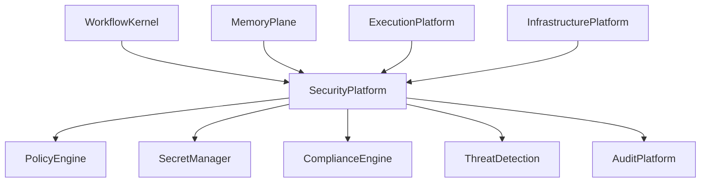
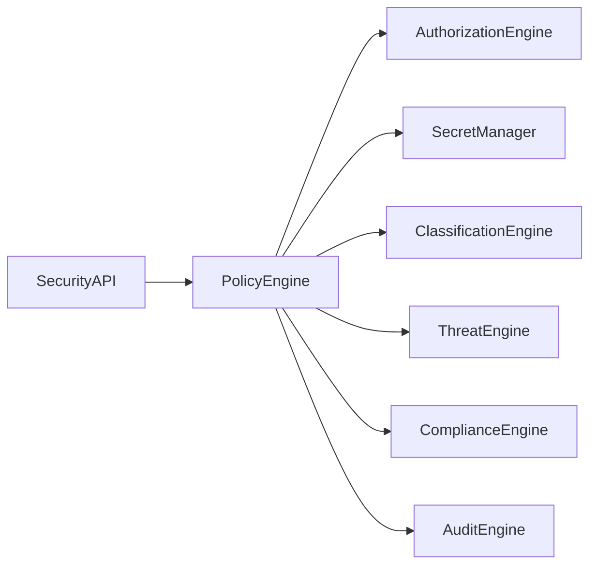

# Enterprise AI Software Factory
# Architecture Design Specification (ADS)

> **Document ID:** ADS-026-v1
>
> **Document Name:** Security Platform — Architecture
>
> **Version:** 2.0.0
>
> **Classification:** Enterprise Platform Plane
>
> **Importance:** CRITICAL
>
> **Depends On:** ADS-021-v5
>
> **Depends On:** ADS-022-v5
>
> **Depends On:** ADS-023-v5
>
> **Depends On:** ADS-024-v5
>
> **Depends On:** ADS-025-v5
>
> **Next:** ADS-026-v2 — Zero Trust Algorithms & Policy Engine

---

# Executive Summary

The Security Platform provides enterprise-grade Zero Trust security across every layer of the Enterprise AI Software Factory.

Security is not implemented as an isolated subsystem.

Security is embedded into every platform plane.

Every request, workflow, execution, tool invocation, memory access, infrastructure deployment, and human interaction is continuously verified, authorized, observed, and audited.

The Security Platform provides

- Zero Trust Architecture
- Policy Enforcement
- Identity Verification
- Authorization
- Secret Management
- Data Classification
- Runtime Protection
- Supply Chain Security
- Compliance
- Incident Response

---

# Why This System Exists

Every platform requires

- authentication
- authorization
- governance
- compliance
- auditing
- isolation

Traditional perimeter security is insufficient.

Trust is never assumed.

Trust is continuously evaluated.

---

# Core Philosophy

Never Trust.

Always Verify.

Every request is authenticated.

Every request is authorized.

Every action is observable.

Every decision is auditable.

---

# Design Goals

The Security Platform provides

- Zero Trust
- Policy Engine
- Secret Management
- Runtime Security
- Artifact Signing
- Data Protection
- Compliance
- Threat Detection
- Security Monitoring
- Incident Response

---

# Architectural Position



Every platform integrates with Security.

---

# High-Level Architecture



Every security decision passes through the Policy Engine.

---

# Major Components

| Component | Responsibility |
|------------|----------------|
| Security API | Public interface |
| Policy Engine | Policy evaluation |
| Authorization Engine | Access decisions |
| Secret Manager | Secret lifecycle |
| Classification Engine | Data classification |
| Threat Engine | Threat detection |
| Compliance Engine | Regulatory validation |
| Audit Engine | Immutable audit records |
| Security Ledger | Security history |

---

# Security Domains

| Domain | Purpose |
|---------|----------|
| Identity | Authentication |
| Authorization | Access Control |
| Secrets | Credential Management |
| Data | Protection & Classification |
| Runtime | Execution Security |
| Infrastructure | Cluster Security |
| Supply Chain | Artifact Trust |
| Compliance | Governance |
| Monitoring | Threat Detection |

Each domain is independently evolvable.

---

# Zero Trust Model

Every request follows

```text
Authenticate

↓

Authorize

↓

Evaluate Policies

↓

Verify Context

↓

Allow

or

Deny
```

No implicit trust exists.

---

# Security Boundaries

Security is enforced at

- User
- Agent
- Workflow
- Memory
- Tool
- Execution
- Infrastructure
- API
- Data

Every boundary is verified independently.

---

# Data Classification

Supported classifications

| Level | Description |
|--------|-------------|
| Public | No restrictions |
| Internal | Organization only |
| Confidential | Restricted access |
| Highly Confidential | Need-to-know only |
| Regulated | Compliance controlled |

Classification follows data throughout its lifecycle.

---

# Security Principles

The Security Platform follows

- Least Privilege
- Zero Trust
- Defense in Depth
- Explicit Authorization
- Continuous Verification
- Immutable Audit
- Policy as Code

---

# Architecture Decision Records

## ADR-026-01

### Decision

Adopt Zero Trust as the default security model.

### Status

Accepted

### Reason

Implicit trust creates unnecessary attack surface in distributed AI systems.

---

## ADR-026-02

### Decision

Centralize policy evaluation through a Policy Engine.

### Status

Accepted

### Reason

Consistent policy enforcement improves governance, auditability, and maintainability.

---

# Operational Readiness Scorecard

| Capability | Status |
|------------|--------|
| Zero Trust | ✅ Required |
| Policy Enforcement | ✅ Required |
| Secret Management | ✅ Required |
| Runtime Protection | ✅ Required |
| Supply Chain Security | ✅ Required |
| Threat Detection | ✅ Required |
| Compliance | ✅ Required |
| Immutable Audit | ✅ Required |

---

# Version Roadmap

| Version | Description |
|----------|-------------|
| v1 | Architecture |
| v2 | Zero Trust Algorithms & Policy Engine |
| v3 | APIs, Events & Contracts |
| v4 | Runtime & Security Infrastructure |
| v5 | End-to-End Security Lifecycle |

---

# Related Documents

ADS-021-v5 — Workflow State Machine

ADS-022-v5 — Identity & Trust Plane

ADS-023-v5 — Enterprise Memory Plane

ADS-024-v5 — Agent Execution Platform

ADS-025-v5 — Compute & Infrastructure Platform

ADS-027-v1 — Observability Platform

---

# Next Document

**ADS-026-v2 — Zero Trust Algorithms & Policy Engine**

This document defines policy evaluation algorithms, authorization models, risk scoring, secret lifecycle management, runtime security enforcement, compliance validation, supply chain verification, and deterministic Zero Trust decision-making.

---

# End of Document
