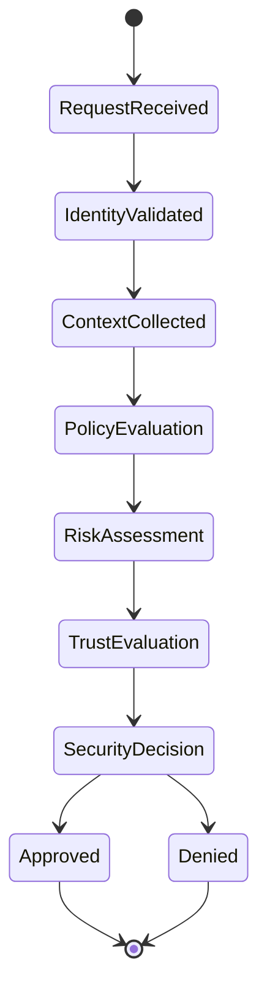

# Enterprise AI Software Factory
# Architecture Design Specification (ADS)

> **Document ID:** ADS-026-v2
>
> **Document Name:** Security Platform — Zero Trust Algorithms & Policy Engine
>
> **Version:** 2.0.0
>
> **Classification:** Enterprise Platform Plane
>
> **Importance:** CRITICAL
>
> **Depends On:** ADS-026-v1
>
> **Next:** ADS-026-v3 — APIs, Events & Contracts

---

# Executive Summary

This document defines the algorithms responsible for policy evaluation, authorization, trust scoring, risk analysis, secret lifecycle management, runtime protection, compliance validation, and Zero Trust enforcement.

Every security decision is deterministic.

Every decision is explainable.

Every decision is auditable.

---

# Design Philosophy

The Security Platform follows six principles.

- Never Trust
- Verify Continuously
- Least Privilege
- Policy First
- Explain Every Decision
- Audit Everything

Security decisions must be reproducible.

---

# Zero Trust Decision Pipeline

```text
Incoming Request

↓

Identity Validation

↓

Context Collection

↓

Policy Evaluation

↓

Risk Analysis

↓

Trust Evaluation

↓

Authorization

↓

Security Decision
```

Every request follows this pipeline.

---

# Security Decision

Every authorization request produces an immutable Security Decision.

```yaml
securityDecision:

  decisionId:

  requestId:

  identity:

  resource:

  action:

  policySet:

  riskScore:

  trustScore:

  decision:

  justification:

  obligations:

  expiresAt:

  timestamp:
```

Security Decisions become permanent audit artifacts.

---

# ALG-026-001

## Identity Validation

Before policy evaluation

The platform validates

- Human Identity
- Agent Identity
- Service Identity
- Workload Identity
- Certificate
- Token
- Trust Chain

Only verified identities continue.

---

# ALG-026-002

## Context Collection

The Policy Engine gathers

- Identity
- Workflow
- Tenant
- Project
- Resource
- Time
- Device
- Network
- Risk Signals

Policy decisions are context aware.

---

# ALG-026-003

## Policy Evaluation

Policies evaluate

- RBAC
- ABAC
- Organization Rules
- Compliance Rules
- Tenant Policies
- Runtime Policies
- Infrastructure Policies

Evaluation is deterministic.

---

# Policy Hierarchy

```text
Global Policies

↓

Organization Policies

↓

Tenant Policies

↓

Project Policies

↓

Workflow Policies

↓

Execution Policies
```

Lower levels cannot override higher-level restrictions.

---

# Trust Evaluation

Trust inputs

- Identity Verification
- Device Trust
- Agent Trust
- Runtime Integrity
- Infrastructure Health
- Historical Behavior

Trust Score

```
0–100
```

Higher scores indicate stronger confidence.

---

# ALG-026-004

## Risk Analysis

Risk evaluation considers

- Sensitive Resource
- Failed Authentication
- Unusual Location
- High Privilege Request
- Policy Violations
- Threat Intelligence

Risk Score

```
0–100
```

Higher scores indicate increased risk.

---

# Authorization Models

Supported models

| Model | Purpose |
|--------|----------|
| RBAC | Role-based |
| ABAC | Attribute-based |
| PBAC | Policy-based |
| ReBAC | Relationship-based |
| Risk-Based | Adaptive authorization |

Multiple models may participate in a single decision.

---

# Secret Management

Managed secrets include

- API Keys
- Certificates
- OAuth Tokens
- SSH Keys
- Database Credentials
- Encryption Keys

Secrets are never stored in plaintext.

---

# ALG-026-005

## Secret Lifecycle

Every secret follows a managed lifecycle.

```text
Generate

↓

Encrypt

↓

Store

↓

Distribute

↓

Rotate

↓

Revoke

↓

Archive
```

Secrets are versioned.

Secret access is fully audited.

---

# ALG-026-006

## Runtime Protection

The Security Platform continuously evaluates

- Running Agents
- Tool Invocations
- Model Calls
- Memory Access
- Infrastructure Operations

Runtime violations trigger policy enforcement immediately.

---

# ALG-026-007

## Compliance Validation

Every protected operation evaluates

- Organization Policies
- Regulatory Policies
- Data Classification
- Retention Policies
- Audit Requirements

Validation occurs before execution.

---

# ALG-026-008

## Supply Chain Verification

Every executable artifact is verified.

Verification targets

- Agent Manifests
- Context Packages
- Execution Plans
- Deployment Envelopes
- Container Images
- MCP Servers
- Internal Plugins

Verification Pipeline

```text
Artifact

↓

Signature Verification

↓

Integrity Check

↓

Policy Validation

↓

Trust Evaluation

↓

Approved
```

Unsigned artifacts are rejected.

---

# ALG-026-009

## Threat Detection

Threat Engine evaluates

- Failed Logins
- Privilege Escalation
- Suspicious API Usage
- Abnormal Agent Behavior
- Infrastructure Anomalies
- Data Exfiltration Indicators

Threats are continuously scored.

---

# ALG-026-010

## Security Decision Generation

Every request produces

```text
Policy Evaluation

+

Risk Score

+

Trust Score

+

Compliance Status

↓

Security Decision
```

Possible outcomes

- Allow
- Deny
- Require Approval
- Require MFA
- Require Additional Verification

Security Decisions remain immutable.

---

# Policy Bundle

Security policies are deployed as immutable Policy Bundles.

```yaml
policyBundle:

  bundleId:

  version:

  policySet:

  organization:

  effectiveFrom:

  expiresAt:

  complianceMappings:

  signature:

  checksum:
```

Bundles are digitally signed before deployment.

---

# Secret Rotation

Rotation policies

| Secret Type | Rotation |
|-------------|----------|
| API Keys | Scheduled |
| Certificates | Before expiry |
| OAuth Tokens | Automatic refresh |
| SSH Keys | Periodic |
| Database Credentials | Scheduled |
| Encryption Keys | Policy-driven |

Rotation never interrupts active workloads.

---

# Runtime Policy Enforcement

Every protected action validates

- Identity
- Security Decision
- Policy Bundle
- Resource Classification
- Runtime Context
- Threat Status

Execution proceeds only after approval.

---

# Security State Machine



Every protected operation follows this lifecycle.

---

# Security Metrics

```text
security_decisions_total

authorization_requests_total

policy_bundle_version

secret_rotations_total

runtime_policy_denials_total

threat_detections_total

risk_score_average

trust_score_average

compliance_failures_total

artifact_verification_total
```

---

# Structured Logging

Example

```json
{
  "decisionId":"SEC-1001",
  "requestId":"REQ-981",
  "identity":"backend-agent",
  "resource":"Context Package",
  "riskScore":12,
  "trustScore":96,
  "decision":"Allow",
  "policyBundle":"PB-004",
  "timestamp":"2026-08-01T10:15:21Z"
}
```

Logs remain immutable.

---

# Architecture Decision Records

## ADR-026-03

### Decision

Represent every authorization outcome as a Security Decision artifact.

### Status

Accepted

### Reason

Security Decisions provide deterministic, replayable, and explainable authorization.

---

## ADR-026-04

### Decision

Deploy signed Policy Bundles instead of individual policy files.

### Status

Accepted

### Reason

Signed bundles ensure policy integrity, simplify rollback, and provide a verifiable chain of custody.

---

## ADR-026-05

### Decision

Continuously evaluate runtime trust rather than relying on one-time authentication.

### Status

Accepted

### Reason

Zero Trust requires ongoing verification throughout the lifecycle of every operation.

---

# Operational Readiness Scorecard

| Capability | Status |
|------------|--------|
| Zero Trust Decisions | ✅ Required |
| Signed Policy Bundles | ✅ Required |
| Runtime Protection | ✅ Required |
| Secret Lifecycle | ✅ Required |
| Threat Detection | ✅ Required |
| Compliance Validation | ✅ Required |
| Supply Chain Verification | ✅ Required |
| Deterministic Authorization | ✅ Required |

---

# Related Documents

ADS-022-v5 — Identity & Trust Plane

ADS-023-v5 — Enterprise Memory Plane

ADS-024-v5 — Agent Execution Platform

ADS-025-v5 — Compute & Infrastructure Platform

ADS-026-v1 — Security Platform

ADS-026-v3 — APIs, Events & Contracts

ADS-027-v1 — Observability Platform

---

# End of Document
