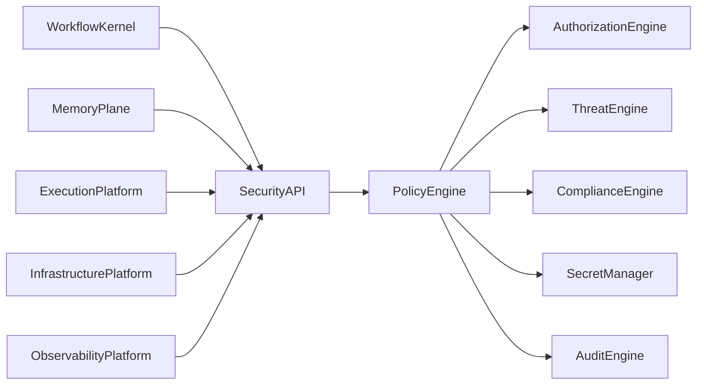
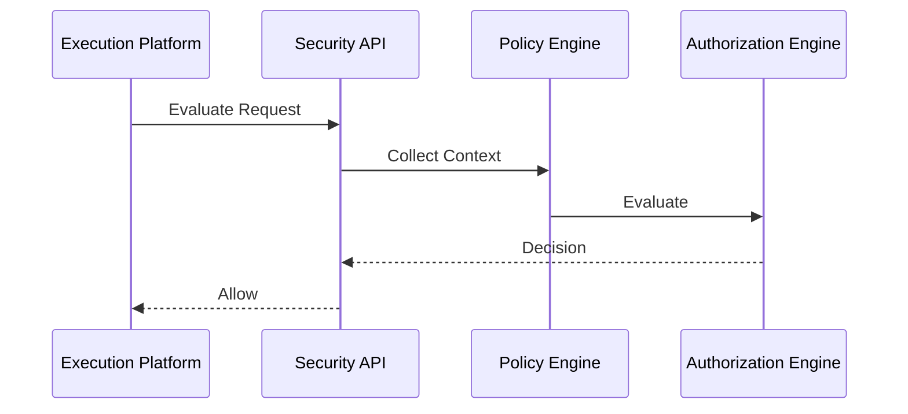

# Enterprise AI Software Factory
# Architecture Design Specification (ADS)

> **Document ID:** ADS-026-v3
>
> **Document Name:** Security Platform — APIs, Events & Contracts
>
> **Version:** 2.0.0
>
> **Classification:** Enterprise Platform Plane
>
> **Importance:** CRITICAL
>
> **Depends On:** ADS-026-v1
>
> **Depends On:** ADS-026-v2
>
> **Next:** ADS-026-v4 — Runtime & Security Infrastructure

---

# Executive Summary

The Security Platform exposes standardized APIs, policy evaluation interfaces, authorization services, secret management APIs, compliance services, threat detection endpoints, and immutable security event contracts.

All security interactions occur exclusively through these contracts.

Security implementations may evolve.

Security contracts remain stable.

---

# Communication Principles

Every security request MUST satisfy

- Authenticated
- Authorized
- Versioned
- Observable
- Auditable
- Replayable
- Policy Compliant
- Tenant Isolated

No subsystem bypasses the Security Platform.

---

# Security Communication Architecture



The Policy Engine is the single decision authority.

---

# Public REST API

The Security Platform exposes APIs for

- Workflow Kernel
- Memory Plane
- Execution Platform
- Infrastructure Platform
- Enterprise Dashboard
- CLI

---

## API-026-001

### Evaluate Security Decision

```http
POST /security/v1/decisions
```

Purpose

Evaluates a protected operation.

---

Request

```json
{
  "identity":"backend-agent",
  "resource":"ContextPackage",
  "action":"READ",
  "securityContext":"CTX-SEC-001"
}
```

---

Response

```json
{
  "decisionId":"SEC-1001",
  "decision":"Allow",
  "expiresAt":"2026-08-01T12:00:00Z"
}
```

---

## API-026-002

### Retrieve Secret

```http
GET /security/v1/secrets/{secretId}
```

Returns an authorized secret.

---

## API-026-003

### Rotate Secret

```http
POST /security/v1/secrets/{secretId}/rotate
```

Initiates secret rotation.

---

## API-026-004

### Evaluate Compliance

```http
POST /security/v1/compliance
```

Validates compliance policies.

---

## API-026-005

### Query Threat Status

```http
GET /security/v1/threats
```

Returns current threat posture.

---

# Internal gRPC Services

```protobuf
service SecurityService {

rpc EvaluateDecision(SecurityRequest)
returns(SecurityResponse);

rpc ResolveSecret(SecretRequest)
returns(SecretResponse);

rpc RotateSecret(RotationRequest)
returns(RotationResponse);

rpc EvaluateCompliance(ComplianceRequest)
returns(ComplianceResponse);

rpc DetectThreat(ThreatRequest)
returns(ThreatResponse);

}
```

---

# Security Context Schema

```protobuf
message SecurityContext {

string context_id = 1;

string identity = 2;

string tenant = 3;

string workflow = 4;

string resource = 5;

double trust_score = 6;

double risk_score = 7;

}
```

---

# Security Decision Schema

```protobuf
message SecurityDecision {

string decision_id = 1;

string request_id = 2;

string policy_bundle = 3;

string decision = 4;

double trust_score = 5;

double risk_score = 6;

}
```

---

# MCP Tool Contracts

The Security Platform exposes

```
evaluate_security

retrieve_secret

rotate_secret

evaluate_compliance

query_threats

verify_artifact

policy_status

security_audit
```

Every invocation requires authenticated identity.

---

# Security Events

Every security operation emits immutable events.

---

## EVT-026-001

SecurityContextCreated

---

## EVT-026-002

SecurityDecisionGenerated

---

## EVT-026-003

SecretRetrieved

---

## EVT-026-004

SecretRotated

---

## EVT-026-005

ThreatDetected

---

## EVT-026-006

ComplianceValidated

---

## EVT-026-007

ArtifactVerified

---

## EVT-026-008

PolicyBundleActivated

---

# Event Flow



---

# Event Ordering

```text
SecurityContextCreated

↓

PolicyEvaluated

↓

RiskCalculated

↓

TrustCalculated

↓

SecurityDecisionGenerated
```

Events are immutable.

---

# Event Metadata

Every event contains

```yaml
eventId:
decisionId:
contextId:
identity:
policyBundle:
traceId:
correlationId:
timestamp:
schemaVersion:
```

---

# End of Part 1
