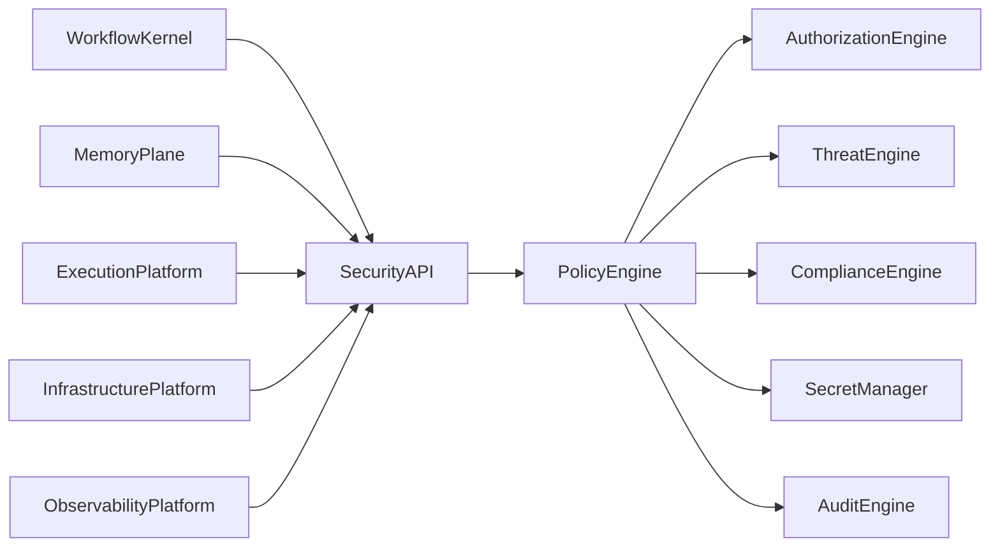
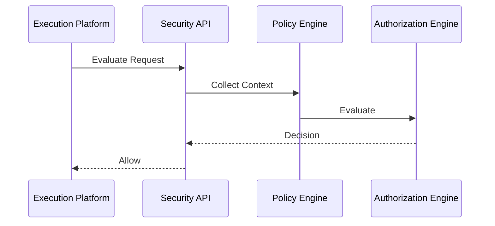
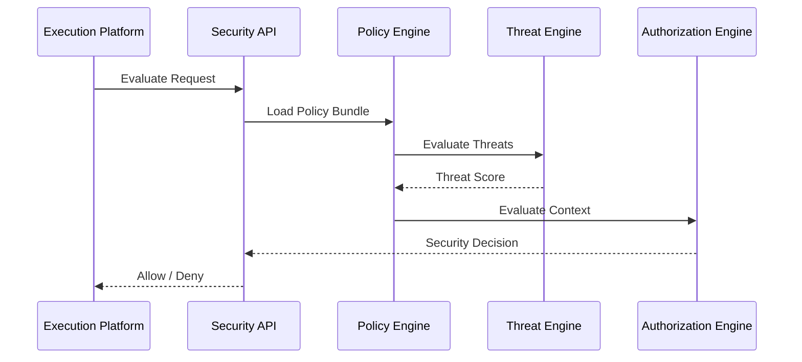

# Enterprise AI Software Factory
# Architecture Design Specification (ADS)

> **Document ID:** ADS-026-v3
>
> **Document Name:** Security Platform — APIs, Events & Contracts
>
> **Version:** 2.0.0
>
> **Classification:** Enterprise Platform Plane
>
> **Importance:** CRITICAL
>
> **Depends On:** ADS-026-v1
>
> **Depends On:** ADS-026-v2
>
> **Next:** ADS-026-v4 — Runtime & Security Infrastructure

---

# Executive Summary

The Security Platform exposes standardized APIs, policy evaluation interfaces, authorization services, secret management APIs, compliance services, threat detection endpoints, and immutable security event contracts.

All security interactions occur exclusively through these contracts.

Security implementations may evolve.

Security contracts remain stable.

---

# Communication Principles

Every security request MUST satisfy

- Authenticated
- Authorized
- Versioned
- Observable
- Auditable
- Replayable
- Policy Compliant
- Tenant Isolated

No subsystem bypasses the Security Platform.

---

# Security Communication Architecture



The Policy Engine is the single decision authority.

---

# Public REST API

The Security Platform exposes APIs for

- Workflow Kernel
- Memory Plane
- Execution Platform
- Infrastructure Platform
- Enterprise Dashboard
- CLI

---

## API-026-001

### Evaluate Security Decision

```http
POST /security/v1/decisions
```

Purpose

Evaluates a protected operation.

---

Request

```json
{
  "identity":"backend-agent",
  "resource":"ContextPackage",
  "action":"READ",
  "securityContext":"CTX-SEC-001"
}
```

---

Response

```json
{
  "decisionId":"SEC-1001",
  "decision":"Allow",
  "expiresAt":"2026-08-01T12:00:00Z"
}
```

---

## API-026-002

### Retrieve Secret

```http
GET /security/v1/secrets/{secretId}
```

Returns an authorized secret.

---

## API-026-003

### Rotate Secret

```http
POST /security/v1/secrets/{secretId}/rotate
```

Initiates secret rotation.

---

## API-026-004

### Evaluate Compliance

```http
POST /security/v1/compliance
```

Validates compliance policies.

---

## API-026-005

### Query Threat Status

```http
GET /security/v1/threats
```

Returns current threat posture.

---

# Internal gRPC Services

```protobuf
service SecurityService {

rpc EvaluateDecision(SecurityRequest)
returns(SecurityResponse);

rpc ResolveSecret(SecretRequest)
returns(SecretResponse);

rpc RotateSecret(RotationRequest)
returns(RotationResponse);

rpc EvaluateCompliance(ComplianceRequest)
returns(ComplianceResponse);

rpc DetectThreat(ThreatRequest)
returns(ThreatResponse);

}
```

---

# Security Context Schema

```protobuf
message SecurityContext {

string context_id = 1;

string identity = 2;

string tenant = 3;

string workflow = 4;

string resource = 5;

double trust_score = 6;

double risk_score = 7;

}
```

---

# Security Decision Schema

```protobuf
message SecurityDecision {

string decision_id = 1;

string request_id = 2;

string policy_bundle = 3;

string decision = 4;

double trust_score = 5;

double risk_score = 6;

}
```

---

# MCP Tool Contracts

The Security Platform exposes

```
evaluate_security

retrieve_secret

rotate_secret

evaluate_compliance

query_threats

verify_artifact

policy_status

security_audit
```

Every invocation requires authenticated identity.

---

# Security Events

Every security operation emits immutable events.

---

## EVT-026-001

SecurityContextCreated

---

## EVT-026-002

SecurityDecisionGenerated

---

## EVT-026-003

SecretRetrieved

---

## EVT-026-004

SecretRotated

---

## EVT-026-005

ThreatDetected

---

## EVT-026-006

ComplianceValidated

---

## EVT-026-007

ArtifactVerified

---

## EVT-026-008

PolicyBundleActivated

---

# Event Flow



---

# Event Ordering

```text
SecurityContextCreated

↓

PolicyEvaluated

↓

RiskCalculated

↓

TrustCalculated

↓

SecurityDecisionGenerated
```

Events are immutable.

---

# Event Metadata

Every event contains

```yaml
eventId:
decisionId:
contextId:
identity:
policyBundle:
traceId:
correlationId:
timestamp:
schemaVersion:
```

---

# Contract Validation

Every security request follows a deterministic validation pipeline.

```text
Receive Request

↓

Schema Validation

↓

Authentication

↓

Authorization

↓

Security Context Validation

↓

Policy Bundle Validation

↓

Risk Evaluation

↓

Security Decision
```

Security operations begin only after successful validation.

---

# Validation Rules

Every request MUST satisfy

| Rule | Description |
|------|-------------|
| API Version | Supported contract version |
| Authentication | Valid identity |
| Authorization | Authorized caller |
| Security Context | Valid context version |
| Policy Bundle | Active signed bundle |
| Compliance | Regulatory requirements satisfied |
| Integrity | Request signature verified |
| Tenant | Tenant isolation enforced |

Validation failures terminate the request.

---

# Authentication

Authentication is delegated to the Identity Plane.

Supported methods

- OAuth 2.1
- OpenID Connect
- SPIFFE / SPIRE
- Mutual TLS
- Service Accounts

Every authenticated identity is continuously verified.

---

# Authorization

Authorization evaluates

- Identity
- Security Context
- Policy Bundle
- Trust Score
- Risk Score
- Compliance Status
- Threat Status

Decision

```text
Allow

↓

Proceed

Deny

↓

Reject

Require Approval

↓

Human Approval

Require MFA

↓

Additional Verification
```

Every authorization decision produces a Security Decision artifact.

---

# Authorization Session

Repeated authorization checks may reuse a short-lived Authorization Session.

```yaml
authorizationSession:

  sessionId:

  securityContext:

  policyBundle:

  trustScore:

  issuedDecision:

  issuedAt:

  expiresAt:

  revocationState:

  tenant:

  organization:
```

Sessions never replace authentication.

They optimize repeated policy evaluation.

---

# Runtime Sequence



---

# Retry Policy

Retryable operations

| Operation | Retry |
|-----------|------:|
| Temporary Secret Store Timeout | Yes |
| Policy Cache Miss | Yes |
| Threat Feed Timeout | Yes |
| Network Timeout | Yes |
| Invalid Security Context | No |
| Invalid Policy Bundle | No |
| Authentication Failure | No |

Retry schedule

```text
1 s

↓

2 s

↓

4 s

↓

8 s

↓

Escalation
```

Retries remain bounded.

---

# Circuit Breakers

Security services isolate unhealthy components.

```text
Service Failure

↓

Retry

↓

Failure Threshold

↓

Circuit Open

↓

Fallback Service

↓

Recovery Probe

↓

Circuit Closed
```

Security failures remain isolated.

---

# Distributed Tracing

Every security operation includes

- Trace ID
- Security Context ID
- Security Decision ID
- Policy Bundle ID
- Identity ID

Trace Flow

```text
Security API

↓

Policy Engine

↓

Threat Engine

↓

Authorization Engine

↓

Audit Engine

↓

Security Ledger
```

Every stage contributes trace spans.

---

# Prometheus Metrics

```text
security_requests_total

security_decisions_total

authorization_latency_seconds

policy_bundle_evaluations_total

security_context_creations_total

authorization_sessions_total

secret_access_total

secret_rotation_total

threat_detections_total

compliance_evaluations_total
```

---

# Structured Logging

Example

```json
{
  "traceId":"trace-11001",
  "securityContext":"CTX-SEC-001",
  "decisionId":"SEC-1001",
  "policyBundle":"PB-004",
  "authorizationSession":"AUTH-012",
  "decision":"Allow",
  "riskScore":14,
  "trustScore":95
}
```

Logs remain immutable and correlated with Security Decisions.

---

# Audit Records

Every protected operation records

- Security Context
- Security Decision
- Policy Bundle Version
- Authorization Session
- Identity
- Resource
- Trust Score
- Risk Score
- Timestamp
- Trace ID

Audit history is append-only.

---

# Reference Standards & Specifications

The Security Platform aligns with

| Standard | Purpose |
|----------|---------|
| OAuth 2.1 | Authorization |
| OpenID Connect | Authentication |
| SPIFFE / SPIRE | Workload Identity |
| Open Policy Agent (OPA) | Policy Evaluation |
| OpenTelemetry | Distributed Tracing |
| OpenAPI 3.1 | REST APIs |
| gRPC | Internal Communication |
| Sigstore / Cosign | Artifact Signing |

---

# Architecture Decision Records

## ADR-026-06

### Decision

Represent every authorization request with a Security Context.

### Status

Accepted

### Reason

Separating evaluation inputs from decisions improves replayability, auditing, and deterministic authorization.

---

## ADR-026-07

### Decision

Support short-lived Authorization Sessions for repeated evaluations.

### Status

Accepted

### Reason

Authorization Sessions reduce redundant policy evaluations without compromising Zero Trust.

---

## ADR-026-08

### Decision

Deploy only signed Policy Bundles.

### Status

Accepted

### Reason

Signed bundles guarantee integrity, provenance, and controlled policy rollout.

---

# Operational Readiness Scorecard

| Capability | Status |
|------------|--------|
| Security Context | ✅ Required |
| Security Decisions | ✅ Required |
| Authorization Sessions | ✅ Required |
| Signed Policy Bundles | ✅ Required |
| Threat Evaluation | ✅ Required |
| Immutable Audit Trail | ✅ Required |
| Standards Compliance | ✅ Required |
| Deterministic Authorization | ✅ Required |

---

# Related Documents

ADS-022-v5 — Identity & Trust Plane

ADS-023-v5 — Enterprise Memory Plane

ADS-024-v5 — Agent Execution Platform

ADS-025-v5 — Compute & Infrastructure Platform

ADS-026-v1 — Security Platform

ADS-026-v2 — Zero Trust Algorithms & Policy Engine

ADS-026-v4 — Runtime & Security Infrastructure

ADS-027-v1 — Observability Platform

---

# End of Document
