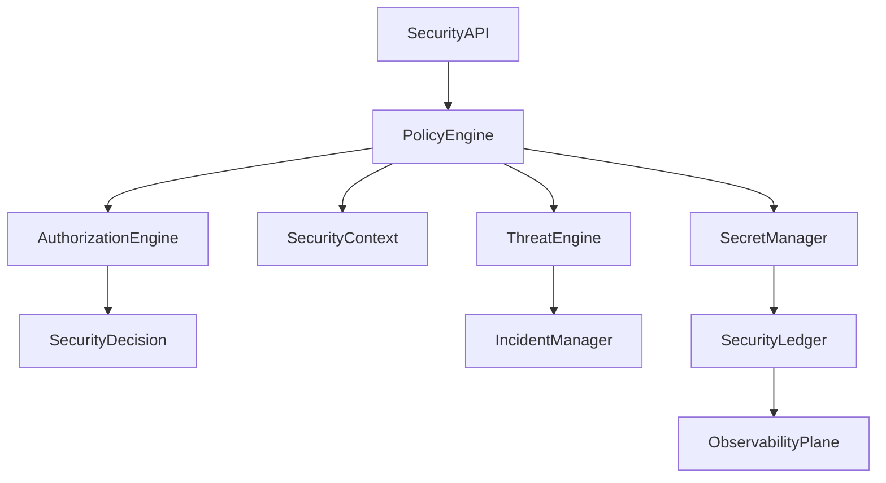
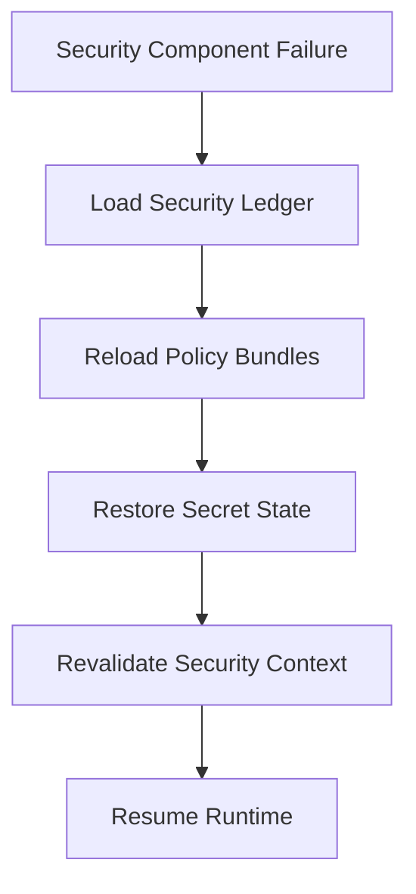

# Enterprise AI Software Factory
# Architecture Design Specification (ADS)

> **Document ID:** ADS-026-v4
>
> **Document Name:** Security Platform — Runtime & Security Infrastructure
>
> **Version:** 2.0.0
>
> **Classification:** Enterprise Runtime Specification
>
> **Importance:** CRITICAL
>
> **Depends On:** ADS-026-v1
>
> **Depends On:** ADS-026-v2
>
> **Depends On:** ADS-026-v3
>
> **Next:** ADS-026-v5 — End-to-End Security Lifecycle

---

# Executive Summary

This document defines the runtime infrastructure responsible for enforcing Zero Trust security across the Enterprise AI Software Factory.

The runtime continuously validates identities, evaluates policies, protects secrets, detects threats, verifies artifacts, and records immutable security history.

Security operates continuously rather than only at login or deployment time.

---

# Runtime Philosophy

The runtime follows seven principles.

- Continuous Verification
- Zero Trust
- Immutable Audit
- Runtime Protection
- Automated Response
- Least Privilege
- Defense in Depth

Security is never disabled during execution.

---

# Runtime Layers

## Identity Runtime

Responsible for

- Identity Verification
- Token Validation
- Certificate Validation
- Trust Evaluation

---

## Policy Runtime

Responsible for

- Policy Evaluation
- Authorization
- Policy Bundles
- Risk Analysis

---

## Secret Runtime

Responsible for

- Secret Distribution
- Rotation
- Revocation
- Encryption

---

## Threat Runtime

Responsible for

- Threat Detection
- Anomaly Detection
- Runtime Monitoring
- Incident Generation

---

# Runtime Architecture



Every security operation becomes part of the Security Ledger.

---

# Runtime Components

| Component | Responsibility |
|------------|----------------|
| Policy Engine | Policy evaluation |
| Authorization Engine | Access decisions |
| Secret Manager | Secret lifecycle |
| Threat Engine | Threat monitoring |
| Incident Manager | Security incidents |
| Compliance Engine | Regulatory validation |
| Audit Engine | Immutable audit |
| Security Ledger | Security history |
| Runtime Monitor | Continuous verification |

---

# Security Runtime Pipeline

```text
Incoming Request

↓

Identity Verification

↓

Security Context

↓

Policy Evaluation

↓

Threat Evaluation

↓

Security Decision

↓

Runtime Monitoring

↓

Security Ledger
```

Every operation remains observable.

---

# Runtime Monitoring

The runtime continuously observes

- Agent Activity
- Tool Usage
- API Calls
- Secret Access
- Memory Access
- Infrastructure Operations
- Policy Violations

Monitoring never stops during execution.

---

# Security Context Loading

Before evaluation

The runtime loads

- Identity
- Workflow
- Execution Plan
- Resource Classification
- Policy Bundle
- Threat Status

Evaluation begins only after validation succeeds.

---

# Secret Runtime

The Secret Runtime manages

- Secret Distribution
- Encryption
- Rotation
- Revocation
- Expiration
- Audit

Secrets remain encrypted at every stage.

---

# Threat Runtime

Threat monitoring includes

- Behavioral Analysis
- Privilege Escalation
- Data Exfiltration
- Suspicious Tool Usage
- Abnormal Agent Activity
- Infrastructure Anomalies

Threat detection remains continuous.

---

# Runtime Guarantees

The Security Platform guarantees

- Continuous Verification
- Immutable Audit
- Runtime Protection
- Signed Policy Bundles
- Secret Encryption
- Threat Monitoring
- Deterministic Authorization

---

# Failure Recovery

The Security Runtime automatically recovers from component failures while preserving security guarantees.

Recovery never bypasses policy enforcement.



Recovery guarantees

- No policy bypass
- No secret exposure
- No audit loss
- Continuous protection

---

# Runtime Health Monitoring

Every runtime component continuously reports health.

Collected metrics

- Policy Engine Health
- Secret Manager Health
- Threat Engine Health
- Authorization Latency
- Policy Evaluation Rate
- Secret Rotation Status
- Incident Response Time
- Security Ledger Status

Health Flow

```text
Security Component

↓

Heartbeat

↓

Runtime Monitor

↓

Observability Plane

↓

Alert Manager

↓

Security Dashboard
```

Missing heartbeats trigger recovery workflows.

---

# Continuous Threat Monitoring

Threat evaluation continuously analyzes

- Identity Changes
- Agent Behavior
- Tool Usage
- API Requests
- Memory Access
- Infrastructure Activity
- Data Access Patterns

Threats are evaluated in near real time.

---

# Incident Record

Every verified security incident produces an immutable Incident Record.

```yaml
incidentRecord:

  incidentId:

  severity:

  status:

  detectedAt:

  securityContext:

  securityDecision:

  affectedResources:

  relatedWorkflow:

  relatedExecutionPlan:

  containmentActions:

  remediationActions:

  resolvedAt:

  owner:

  timeline:
```

Incident Records remain immutable.

---

# Security Ledger

Every protected operation generates an immutable Security Ledger entry.

Ledger contains

- Security Context
- Security Decision
- Authorization Session
- Policy Bundle Version
- Threat Evaluation
- Compliance Evaluation
- Related Workflow
- Related Execution Plan
- Timestamp
- Digital Signature

The Security Ledger becomes the authoritative security record.

---

# Runtime Configuration

Example

```yaml
security:

  policyEngine: opa

  secretManager: vault

  artifactSigning: sigstore

  runtimeProtection: enabled

  continuousVerification: true

  threatMonitoring: realtime

  policyBundleValidation: required

  securityLedger: enabled

  incidentManagement: automatic
```

Configuration remains version-controlled.

---

# Secret Rotation

The runtime rotates secrets without interrupting workloads.

Rotation strategy

- Generate replacement secret
- Validate replacement
- Update authorized consumers
- Revoke previous version
- Archive audit record

Rotation remains transparent to running services.

---

# Runtime Isolation

Security services operate with strict isolation.

Isolation boundaries

- Policy Evaluation
- Secret Storage
- Audit Storage
- Incident Processing
- Threat Analysis
- Compliance Validation

Security domains never share mutable state.

---

# Prometheus Metrics

```text
security_runtime_health

security_incidents_total

security_ledger_entries_total

security_policy_latency_seconds

secret_distribution_total

secret_rotation_duration_seconds

artifact_signature_failures_total

runtime_policy_enforcement_total

continuous_verification_total

threat_response_seconds
```

---

# OpenTelemetry

Distributed tracing spans

```text
Security API

↓

Policy Engine

↓

Threat Engine

↓

Authorization Engine

↓

Incident Manager

↓

Security Ledger

↓

Observability Plane
```

Every security stage contributes trace spans.

---

# Structured Logging

Example

```json
{
  "traceId":"trace-12001",
  "incidentId":"INC-001",
  "securityDecision":"SEC-1001",
  "policyBundle":"PB-004",
  "severity":"High",
  "status":"Contained",
  "ledgerEntry":"LEDGER-1102"
}
```

Logs remain immutable and digitally signed.

---

# Disaster Recovery

Recovery flow

```text
Security Runtime Failure

↓

Restore Security Ledger

↓

Reload Policy Bundles

↓

Restore Secret Manager

↓

Rebuild Threat Engine

↓

Resume Continuous Verification
```

Recovery targets

Recovery Point Objective (RPO)

Zero security audit loss

Recovery Time Objective (RTO)

Less than five minutes

---

# Recommended Production Deployment

```text
Security API

↓

Policy Engine (OPA)

↓

HashiCorp Vault

↓

Threat Engine

↓

Incident Manager

↓

Security Ledger

↓

OpenTelemetry

↓

Prometheus

↓

Grafana

↓

SIEM Platform
```

---

# Technology Decision Records

## TDR-026-01

### Technology

Open Policy Agent (OPA)

### Decision

Use OPA as the default policy evaluation engine.

### Reason

Supports policy-as-code, deterministic evaluation, and broad ecosystem integration.

---

## TDR-026-02

### Technology

HashiCorp Vault

### Decision

Use Vault for enterprise secret management.

### Reason

Provides secure secret storage, dynamic credentials, encryption, and automated rotation.

---

## TDR-026-03

### Technology

Sigstore / Cosign

### Decision

Sign all platform artifacts using Sigstore-compatible tooling.

### Reason

Ensures artifact provenance and supply chain integrity.

---

## TDR-026-04

### Technology

Security Ledger

### Decision

Persist immutable Security Ledger entries for every protected operation.

### Reason

Improves auditing, compliance, forensic investigation, and deterministic replay.

---

## TDR-026-05

### Technology

Incident Manager

### Decision

Manage verified security events through immutable Incident Records.

### Reason

Separates detection from response while improving operational consistency and compliance.

---

# Runtime Checklist

The Security Platform MUST

- Continuously verify identities
- Enforce signed Policy Bundles
- Encrypt all secrets
- Generate Security Decisions
- Persist Security Ledger entries
- Detect runtime threats
- Produce Incident Records

The Security Platform MUST NOT

- Trust unauthenticated requests
- Bypass policy evaluation
- Expose plaintext secrets
- Modify immutable ledger entries
- Execute unsigned artifacts

---

# Architecture Decision Records

## ADR-026-09

### Decision

Treat Incident Records as immutable security artifacts.

### Status

Accepted

### Reason

Incident Records improve investigation, compliance reporting, and post-incident analysis.

---

## ADR-026-10

### Decision

Continuously evaluate runtime security throughout execution.

### Status

Accepted

### Reason

Zero Trust requires ongoing verification rather than one-time authorization.

---

## ADR-026-11

### Decision

Maintain a tamper-evident Security Ledger.

### Status

Accepted

### Reason

An immutable security history strengthens auditability, forensic analysis, and regulatory compliance.

---

# Operational Readiness Scorecard

| Capability | Status |
|------------|--------|
| Continuous Verification | ✅ Required |
| Security Ledger | ✅ Required |
| Incident Records | ✅ Required |
| Secret Rotation | ✅ Required |
| Runtime Threat Detection | ✅ Required |
| Signed Artifacts | ✅ Required |
| Automatic Recovery | ✅ Required |
| Zero Trust Enforcement | ✅ Required |

---

# Related Documents

ADS-022-v5 — Identity & Trust Plane

ADS-023-v5 — Enterprise Memory Plane

ADS-024-v5 — Agent Execution Platform

ADS-025-v5 — Compute & Infrastructure Platform

ADS-026-v1 — Security Platform

ADS-026-v2 — Zero Trust Algorithms & Policy Engine

ADS-026-v3 — APIs, Events & Contracts

ADS-026-v5 — End-to-End Security Lifecycle

ADS-027-v1 — Observability Platform

---

# End of Document
