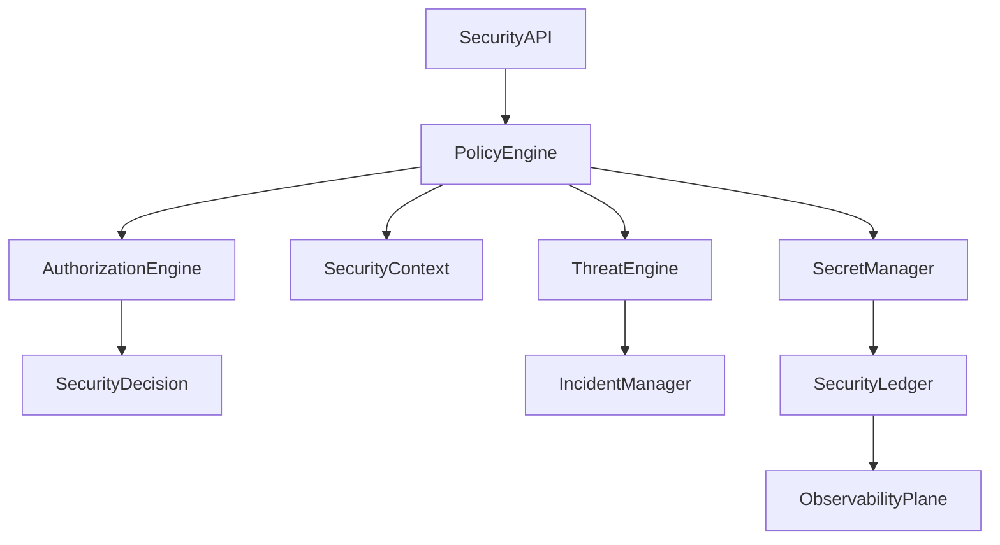

# Enterprise AI Software Factory
# Architecture Design Specification (ADS)

> **Document ID:** ADS-026-v4
>
> **Document Name:** Security Platform — Runtime & Security Infrastructure
>
> **Version:** 2.0.0
>
> **Classification:** Enterprise Runtime Specification
>
> **Importance:** CRITICAL
>
> **Depends On:** ADS-026-v1
>
> **Depends On:** ADS-026-v2
>
> **Depends On:** ADS-026-v3
>
> **Next:** ADS-026-v5 — End-to-End Security Lifecycle

---

# Executive Summary

This document defines the runtime infrastructure responsible for enforcing Zero Trust security across the Enterprise AI Software Factory.

The runtime continuously validates identities, evaluates policies, protects secrets, detects threats, verifies artifacts, and records immutable security history.

Security operates continuously rather than only at login or deployment time.

---

# Runtime Philosophy

The runtime follows seven principles.

- Continuous Verification
- Zero Trust
- Immutable Audit
- Runtime Protection
- Automated Response
- Least Privilege
- Defense in Depth

Security is never disabled during execution.

---

# Runtime Layers

## Identity Runtime

Responsible for

- Identity Verification
- Token Validation
- Certificate Validation
- Trust Evaluation

---

## Policy Runtime

Responsible for

- Policy Evaluation
- Authorization
- Policy Bundles
- Risk Analysis

---

## Secret Runtime

Responsible for

- Secret Distribution
- Rotation
- Revocation
- Encryption

---

## Threat Runtime

Responsible for

- Threat Detection
- Anomaly Detection
- Runtime Monitoring
- Incident Generation

---

# Runtime Architecture



Every security operation becomes part of the Security Ledger.

---

# Runtime Components

| Component | Responsibility |
|------------|----------------|
| Policy Engine | Policy evaluation |
| Authorization Engine | Access decisions |
| Secret Manager | Secret lifecycle |
| Threat Engine | Threat monitoring |
| Incident Manager | Security incidents |
| Compliance Engine | Regulatory validation |
| Audit Engine | Immutable audit |
| Security Ledger | Security history |
| Runtime Monitor | Continuous verification |

---

# Security Runtime Pipeline

```text
Incoming Request

↓

Identity Verification

↓

Security Context

↓

Policy Evaluation

↓

Threat Evaluation

↓

Security Decision

↓

Runtime Monitoring

↓

Security Ledger
```

Every operation remains observable.

---

# Runtime Monitoring

The runtime continuously observes

- Agent Activity
- Tool Usage
- API Calls
- Secret Access
- Memory Access
- Infrastructure Operations
- Policy Violations

Monitoring never stops during execution.

---

# Security Context Loading

Before evaluation

The runtime loads

- Identity
- Workflow
- Execution Plan
- Resource Classification
- Policy Bundle
- Threat Status

Evaluation begins only after validation succeeds.

---

# Secret Runtime

The Secret Runtime manages

- Secret Distribution
- Encryption
- Rotation
- Revocation
- Expiration
- Audit

Secrets remain encrypted at every stage.

---

# Threat Runtime

Threat monitoring includes

- Behavioral Analysis
- Privilege Escalation
- Data Exfiltration
- Suspicious Tool Usage
- Abnormal Agent Activity
- Infrastructure Anomalies

Threat detection remains continuous.

---

# Runtime Guarantees

The Security Platform guarantees

- Continuous Verification
- Immutable Audit
- Runtime Protection
- Signed Policy Bundles
- Secret Encryption
- Threat Monitoring
- Deterministic Authorization

---

# End of Part 1
