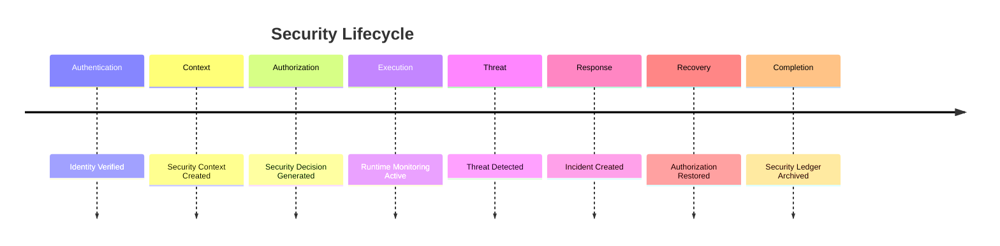

# Enterprise AI Software Factory
# Architecture Design Specification (ADS)

> **Document ID:** ADS-026-v5
>
> **Document Name:** Security Platform — End-to-End Security Lifecycle
>
> **Version:** 2.0.0
>
> **Classification:** Reference Implementation
>
> **Importance:** CRITICAL
>
> **Depends On:** ADS-026-v1
>
> **Depends On:** ADS-026-v2
>
> **Depends On:** ADS-026-v3
>
> **Depends On:** ADS-026-v4

---

# Executive Summary

This document demonstrates how the Security Platform protects a complete enterprise software engineering workflow.

It illustrates how Security Contexts, Security Decisions, Authorization Sessions, Policy Bundles, Security Ledgers, Incident Records, and runtime monitoring interact throughout a real engineering task.

Every authorization is deterministic.

Every security event is traceable.

Every incident is reproducible.

---

# Scenario

An engineer submits a request

```
Deploy a production payment service
handling confidential customer data.
```

The request activates

- Workflow Kernel
- Identity Plane
- Memory Plane
- Agent Execution Platform
- Compute Platform
- Security Platform

---

# Stage 1 — Authentication

The engineer authenticates using

- Corporate Identity Provider
- MFA
- Device Certificate

Identity is verified.

Generated

```
IDENTITY-2026-011
```

---

# Stage 2 — Security Context

The Security Platform builds

```
SECCTX-2026-001
```

Contains

- Identity
- Tenant
- Workflow
- Execution Plan
- Resource Classification
- Device Trust
- Network Trust
- Policy Bundle
- Threat Status

Security Context becomes immutable.

---

# Stage 3 — Policy Evaluation

The Policy Engine loads

```
PB-2026-004
```

Policy Bundle.

Evaluated policies

- Organization
- Compliance
- Workflow
- Runtime
- Infrastructure

Evaluation succeeds.

---

# Stage 4 — Risk & Trust

Calculated

```
Risk Score: 18
Trust Score: 96
```

Decision

```
Allow
```

Generated

```
SEC-2026-021
```

Security Decision becomes immutable.

---

# Stage 5 — Authorization Session

The platform creates

```
AUTH-2026-011
```

Session references

- Security Context
- Security Decision
- Policy Bundle

The session supports repeated evaluations during the workflow.

---

# Stage 6 — Secret Distribution

The Secret Manager distributes

- Database Credentials
- API Keys
- TLS Certificates

Secrets remain encrypted.

No plaintext secret is exposed.

---

# Stage 7 — Artifact Verification

Verified artifacts

- Agent Manifest
- Context Package
- Execution Plan
- Deployment Envelope
- Container Image

Verification pipeline

```text
Signature

↓

Integrity

↓

Policy

↓

Trust

↓

Approved
```

Execution proceeds.

---

# Stage 8 — Runtime Monitoring

Runtime continuously observes

- Agent Behavior
- API Calls
- Memory Access
- Tool Usage
- Infrastructure Activity
- Secret Access

No anomalies detected.

---

# Stage 9 — Threat Detection

The Threat Engine detects

```
Unexpected privileged tool access
```

Risk increases.

```
Risk Score: 72
```

Generated

```
THREAT-2026-008
```

---

# Stage 10 — Incident Response

The Incident Manager creates

```
INC-2026-003
```

Containment actions

- Suspend affected agent
- Revoke Authorization Session
- Rotate exposed secret
- Notify Security Operations

Execution pauses until remediation completes.

---

# Stage 11 — Recovery

Security verifies

- New Security Context
- Updated Policy Bundle
- Fresh Authorization Session
- Secret Rotation

Execution resumes safely.

---

# Stage 12 — Security Ledger

Runtime writes

```
LEDGER-SEC-2026-015
```

Ledger includes

- Security Context
- Security Decision
- Authorization Session
- Policy Bundle Version
- Threat Evaluation
- Incident Record
- Compliance Evaluation
- Digital Signature

Ledger becomes immutable.

---

# Stage 13 — Workflow Closure

Execution completes.

Temporary Authorization Sessions expire.

Secrets return to normal lifecycle.

Threat monitoring continues.

Security artifacts remain archived.

---

# Security Timeline



---

# Security Event Stream

```text
SecurityContextCreated

↓

PolicyEvaluated

↓

SecurityDecisionGenerated

↓

AuthorizationSessionCreated

↓

ArtifactVerified

↓

ThreatDetected

↓

IncidentCreated

↓

RecoveryCompleted

↓

SecurityLedgerWritten

↓

WorkflowClosed
```

---

# Produced Artifacts

| Artifact | Identifier |
|-----------|------------|
| Security Context | SECCTX-2026-001 |
| Security Decision | SEC-2026-021 |
| Authorization Session | AUTH-2026-011 |
| Policy Bundle | PB-2026-004 |
| Incident Record | INC-2026-003 |
| Security Ledger | LEDGER-SEC-2026-015 |

---

# Runtime Metrics

| Metric | Value |
|---------|------:|
| Security Decisions | 148 |
| Authorization Sessions | 17 |
| Threats Detected | 1 |
| Incident Records | 1 |
| Secret Rotations | 2 |
| Policy Evaluations | 312 |
| Average Trust Score | 95 |
| Average Risk Score | 16 |

---

# Operational Readiness Scorecard

| Capability | Status |
|------------|--------|
| Security Context | ✅ Verified |
| Security Decisions | ✅ Verified |
| Authorization Sessions | ✅ Verified |
| Policy Bundles | ✅ Verified |
| Threat Detection | ✅ Verified |
| Incident Response | ✅ Verified |
| Security Ledger | ✅ Verified |
| Continuous Verification | ✅ Verified |

---

# Lessons Learned

The Security Platform demonstrates the following principles.

- Security Contexts define the complete evaluation inputs.
- Security Decisions provide deterministic authorization outcomes.
- Authorization Sessions optimize repeated evaluations without compromising Zero Trust.
- Policy Bundles guarantee consistent and verifiable policy enforcement.
- Runtime monitoring continuously evaluates security posture throughout execution.
- Security Ledgers create immutable, replayable security history.
- Incident Records separate threat detection from coordinated operational response.

---

# Architecture Decision Record

## ADR-026-12

### Decision

Model enterprise security as a deterministic lifecycle built from immutable security artifacts.

### Status

Accepted

### Reason

Artifact-centric security improves replayability, governance, compliance, explainability, and enterprise-scale operational consistency.

---

# Technology Decision Record

## TDR-026-06

### Technology

Zero Trust Security Platform

### Decision

Implement a centralized Zero Trust Security Platform responsible for policy evaluation, runtime protection, artifact verification, threat detection, incident response, and immutable security history.

### Reason

A unified security platform ensures consistent enforcement across workflows, memory, execution, infrastructure, and future platform services while maintaining deterministic and auditable security behavior.

---

# Related Documents

ADS-022-v5 — Identity & Trust Plane

ADS-023-v5 — Enterprise Memory Plane

ADS-024-v5 — Agent Execution Platform

ADS-025-v5 — Compute & Infrastructure Platform

ADS-026-v1 — Security Platform

ADS-026-v2 — Zero Trust Algorithms & Policy Engine

ADS-026-v3 — APIs, Events & Contracts

ADS-026-v4 — Runtime & Security Infrastructure

ADS-027-v1 — Observability Platform

---

# End of Document
