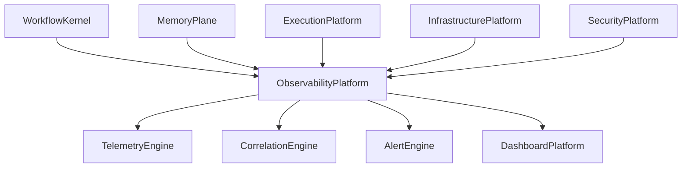
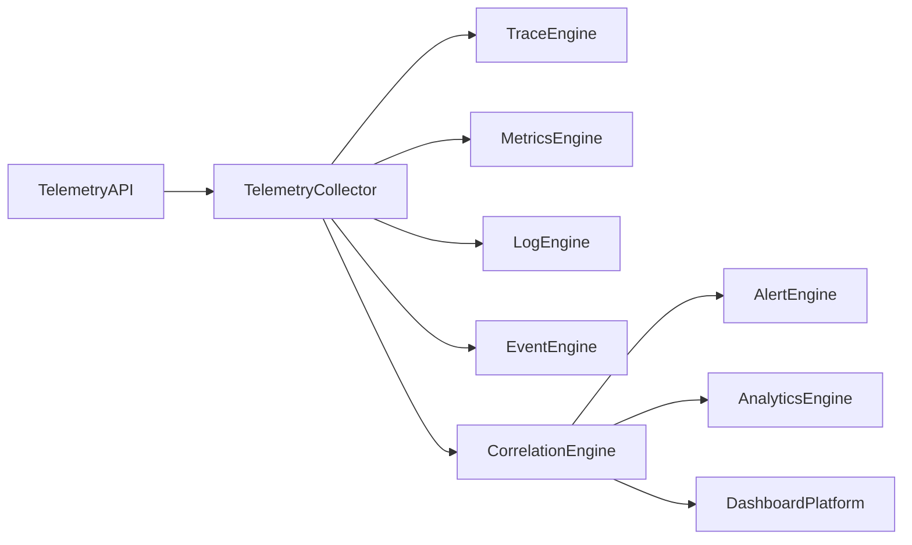

# Enterprise AI Software Factory
# Architecture Design Specification (ADS)

> **Document ID:** ADS-027-v1
>
> **Document Name:** Observability Platform — Architecture
>
> **Version:** 2.0.0
>
> **Classification:** Enterprise Platform Plane
>
> **Importance:** CRITICAL
>
> **Depends On:** ADS-021-v5
>
> **Depends On:** ADS-022-v5
>
> **Depends On:** ADS-023-v5
>
> **Depends On:** ADS-024-v5
>
> **Depends On:** ADS-025-v5
>
> **Depends On:** ADS-026-v5
>
> **Next:** ADS-027-v2 — Telemetry Algorithms & Correlation Engine

---

# Executive Summary

The Observability Platform provides enterprise-wide visibility into every workflow, execution, infrastructure operation, security event, and runtime interaction.

Rather than treating logs, metrics, traces, and events as separate systems, the platform correlates them into a unified operational model.

The Observability Platform provides

- Distributed Tracing
- Metrics Collection
- Structured Logging
- Event Correlation
- Alerting
- SLO Monitoring
- Cost Analytics
- Performance Analytics
- Replay Support
- Operational Dashboards

---

# Why This System Exists

Autonomous systems cannot be trusted unless they are observable.

Observability enables

- debugging
- optimization
- governance
- compliance
- capacity planning
- incident response

Every platform produces telemetry.

The Observability Platform transforms telemetry into operational knowledge.

---

# Core Philosophy

Observe Everything.

Correlate Everything.

Explain Everything.

Replay Everything.

---

# Design Goals

The platform provides

- Trace Correlation
- Metrics Pipeline
- Log Aggregation
- Event Correlation
- Alert Engine
- Dashboard Platform
- Cost Visibility
- Replay Support
- Operational Analytics
- SLO Monitoring

---

# Architectural Position

Every platform publishes telemetry.

---

# High-Level Architecture

Every observation passes through the Correlation Engine.

---

# Major Components

| Component | Responsibility |
|------------|----------------|
| Telemetry API | Telemetry ingestion |
| Telemetry Collector | Data collection |
| Trace Engine | Distributed tracing |
| Metrics Engine | Metrics aggregation |
| Log Engine | Structured logs |
| Event Engine | Event ingestion |
| Correlation Engine | Unified operational model |
| Alert Engine | Notifications |
| Analytics Engine | Operational intelligence |
| Dashboard Platform | Visualization |

---

# Observability Domains

| Domain | Purpose |
|---------|----------|
| Workflows | Workflow execution |
| Memory | Memory access |
| Execution | Agent execution |
| Infrastructure | Compute |
| Security | Security operations |
| APIs | Request lifecycle |
| Models | LLM performance |
| Cost | Resource consumption |
| Business | Platform KPIs |

Each domain publishes standardized telemetry.

---

# Telemetry Types

Supported telemetry

| Type | Purpose |
|------|----------|
| Metrics | Quantitative measurement |
| Logs | Structured events |
| Traces | End-to-End execution |
| Events | Business state changes |

Telemetry remains immutable after publication.

---

# Correlation Model

Every telemetry item references

- Trace ID
- Workflow ID
- Execution Plan
- Agent ID
- Placement Decision
- Security Decision

Telemetry becomes cross-platform.

---

# Observability Principles

The Observability Platform follows

- Structured Telemetry
- Immutable Logs
- Distributed Tracing
- Unified Correlation
- Replay Support
- Cost Visibility
- Open Standards

---

# Architecture Decision Records

## ADR-027-01

### Decision

Centralize telemetry through a Correlation Engine.

### Status

Accepted

### Reason

Correlated telemetry provides better operational insight than isolated logs and metrics.

---

## ADR-027-02

### Decision

Require every platform plane to emit standardized telemetry.

### Status

Accepted

### Reason

Standardization simplifies analytics, replay, and debugging.

---

# Operational Readiness Scorecard

| Capability | Status |
|------------|--------|
| Distributed Tracing | ✅ Required |
| Metrics | ✅ Required |
| Structured Logging | ✅ Required |
| Correlation Engine | ✅ Required |
| Alerting | ✅ Required |
| Cost Analytics | ✅ Required |
| Replay Support | ✅ Required |
| Operational Dashboards | ✅ Required |

---

# Version Roadmap

| Version | Description |
|----------|-------------|
| v1 | Architecture |
| v2 | Telemetry Algorithms & Correlation Engine |
| v3 | APIs, Events & Contracts |
| v4 | Runtime & Observability Infrastructure |
| v5 | End-to-End Observability Lifecycle |

---

# Related Documents

ADS-021-v5 — Workflow Kernel

ADS-022-v5 — Identity & Trust Plane

ADS-023-v5 — Enterprise Memory Plane

ADS-024-v5 — Agent Execution Platform

ADS-025-v5 — Compute & Infrastructure Platform

ADS-026-v5 — Security Platform

---

# Next Document

**ADS-027-v2 — Telemetry Algorithms & Correlation Engine**

This document defines telemetry collection algorithms, distributed tracing, event correlation, replay support, metrics aggregation, SLO monitoring, anomaly detection, and operational analytics.

---

# End of Document
