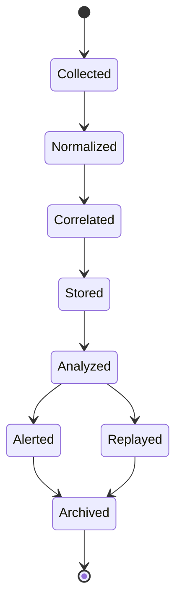

# Enterprise AI Software Factory
# Architecture Design Specification (ADS)

> **Document ID:** ADS-027-v2
>
> **Document Name:** Observability Platform — Telemetry Algorithms & Correlation Engine
>
> **Version:** 2.0.0
>
> **Classification:** Enterprise Platform Plane
>
> **Importance:** CRITICAL
>
> **Depends On:** ADS-027-v1
>
> **Next:** ADS-027-v3 — APIs, Events & Contracts

---

# Executive Summary

This document defines the algorithms responsible for telemetry collection, distributed tracing, event correlation, metrics aggregation, anomaly detection, replay support, cost analytics, and operational intelligence.

Rather than treating metrics, logs, traces, and events independently, the platform correlates them into a unified operational graph.

Every observation becomes explainable.

Every anomaly becomes traceable.

---

# Design Philosophy

The Observability Platform follows six principles.

- Observe Everything
- Correlate Everything
- Explain Everything
- Replay Everything
- Open Standards
- Immutable Telemetry

Observability data must always be reproducible.

---

# Telemetry Collection Pipeline

```text
Platform Event

↓

Telemetry Collection

↓

Normalization

↓

Correlation

↓

Observation Record

↓

Analytics

↓

Dashboard
```

Every telemetry source follows the same pipeline.

---

# Observation Record

Every telemetry item is normalized into an Observation Record.

```yaml
observationRecord:

  observationId:

  traceId:

  workflowId:

  executionPlan:

  securityDecision:

  placementDecision:

  agentId:

  telemetryType:

  resource:

  severity:

  source:

  timestamp:

  payloadHash:
```

Observation Records remain immutable.

---

# ALG-027-001

## Telemetry Collection

Every platform continuously emits telemetry.

Supported producers

- Workflow Kernel
- Memory Plane
- Execution Platform
- Compute Platform
- Security Platform
- APIs
- Models
- Infrastructure

Collection is asynchronous.

---

# ALG-027-002

## Telemetry Normalization

Incoming telemetry is normalized into a common schema.

Normalization includes

- Timestamp
- Source
- Severity
- Trace ID
- Correlation Metadata
- Payload Validation

Normalization guarantees consistency.

---

# ALG-027-003

## Trace Correlation

The Correlation Engine groups telemetry using

- Trace ID
- Workflow ID
- Execution Plan
- Agent ID
- Security Decision
- Placement Decision

Correlated telemetry forms a complete execution timeline.

---

# Correlation Graph

```text
Workflow

↓

Execution Plan

↓

Agent

↓

Infrastructure

↓

Security

↓

Observation Records
```

Every observation participates in the graph.

---

# ALG-027-004

## Metrics Aggregation

Metrics aggregation computes

- Latency
- Throughput
- Error Rate
- Availability
- Resource Usage
- Cost

Aggregation windows remain configurable.

---

# Telemetry Types

| Type | Purpose |
|------|----------|
| Metrics | Quantitative measurement |
| Logs | Structured events |
| Traces | End-to-end execution |
| Events | Business state changes |
| Profiles | Runtime performance sampling |

Profiles are optional.

---

# Distributed Tracing

Every trace contains

- Trace ID
- Parent Span
- Child Spans
- Timing
- Status
- Correlation Metadata

Tracing follows the complete execution path.

---

# ALG-027-005

## Event Correlation

The Correlation Engine evaluates

- Related Events
- Temporal Proximity
- Shared Resources
- Shared Workflow
- Shared Identity
- Shared Infrastructure

Correlated events improve diagnosis.

---

# ALG-027-006

## Anomaly Detection

The Observability Platform continuously evaluates operational telemetry for anomalies.

Detection inputs

- Latency
- Error Rate
- Resource Utilization
- Cost Trends
- Agent Behavior
- Infrastructure Health
- Security Events

Detection Flow

```text
Observation Records

↓

Baseline Comparison

↓

Statistical Analysis

↓

Threshold Evaluation

↓

Anomaly Detection

↓

Incident Recommendation
```

Detected anomalies are correlated before alert generation.

---

# ALG-027-007

## Replay Engine

The Replay Engine reconstructs historical platform activity.

Replay inputs

- Observation Records
- Correlation Graph
- Execution Ledger
- Security Ledger
- Cluster Snapshots
- Incident Records

Replay Flow

```text
Replay Request

↓

Retrieve Artifacts

↓

Build Correlation Graph

↓

Reconstruct Timeline

↓

Replay Events

↓

Replay Report
```

Replay never modifies production state.

---

# ALG-027-008

## Operational Analytics

Analytics evaluates

- Workflow Performance
- Agent Productivity
- Model Utilization
- Infrastructure Efficiency
- Security Activity
- Cost Trends
- SLA Compliance

Analytics remains historical and real-time.

---

# Correlation Graph

Every correlated workflow generates a Correlation Graph.

```yaml
correlationGraph:

  graphId:

  workflow:

  executionPlan:

  traces:

  observations:

  securityDecisions:

  placementDecisions:

  incidentRecords:

  infrastructureReservations:

  nodes:

  edges:

  generatedAt:
```

Correlation Graphs remain immutable.

---

# SLO Monitoring

Supported Service Level Objectives

| SLO | Description |
|-----|-------------|
| Availability | Platform uptime |
| Latency | Request duration |
| Error Rate | Failed operations |
| Throughput | Completed requests |
| Recovery Time | Incident recovery |
| Cost Efficiency | Cost per workflow |

SLOs drive operational alerts.

---

# Cost Analytics

The platform tracks

- Model Cost
- Infrastructure Cost
- Agent Cost
- Storage Cost
- Network Cost
- Total Workflow Cost

Cost attribution remains traceable to individual workflows.

---

# Observation State Machine



Every observation follows this lifecycle.

---

# Alert Generation

Alert evaluation considers

- Severity
- Impact
- SLO Violation
- Correlated Events
- Historical Frequency
- Active Incidents

Duplicate alerts are suppressed.

---

# Metrics

```text
observation_records_total

correlation_graphs_total

telemetry_ingestion_rate

trace_duration_seconds

anomalies_detected_total

replay_requests_total

alert_generation_total

dashboard_queries_total

cost_per_workflow

slo_violations_total
```

---

# Structured Logging

Example

```json
{
  "traceId":"trace-13001",
  "observationId":"OBS-2201",
  "correlationGraph":"GRAPH-009",
  "workflowId":"WF-2026-031",
  "severity":"Warning",
  "anomaly":"HighLatency",
  "replayAvailable":true
}
```

Logs remain immutable and correlated.

---

# Architecture Decision Records

## ADR-027-03

### Decision

Normalize all telemetry into Observation Records.

### Status

Accepted

### Reason

Normalization enables consistent analytics, replay, and correlation across every platform plane.

---

## ADR-027-04

### Decision

Represent operational relationships as immutable Correlation Graphs.

### Status

Accepted

### Reason

Graph-based correlation provides richer operational insight than isolated traces or logs.

---

## ADR-027-05

### Decision

Support deterministic replay using immutable operational artifacts.

### Status

Accepted

### Reason

Replay improves debugging, auditing, optimization, and post-incident analysis.

---

# Operational Readiness Scorecard

| Capability | Status |
|------------|--------|
| Observation Records | ✅ Required |
| Correlation Graphs | ✅ Required |
| Distributed Tracing | ✅ Required |
| Replay Engine | ✅ Required |
| Anomaly Detection | ✅ Required |
| Cost Analytics | ✅ Required |
| SLO Monitoring | ✅ Required |
| Deterministic Replay | ✅ Required |

---

# Related Documents

ADS-021-v5 — Workflow Kernel

ADS-022-v5 — Identity & Trust Plane

ADS-023-v5 — Enterprise Memory Plane

ADS-024-v5 — Agent Execution Platform

ADS-025-v5 — Compute & Infrastructure Platform

ADS-026-v5 — Security Platform

ADS-027-v1 — Observability Platform

ADS-027-v3 — APIs, Events & Contracts

---

# End of Document
