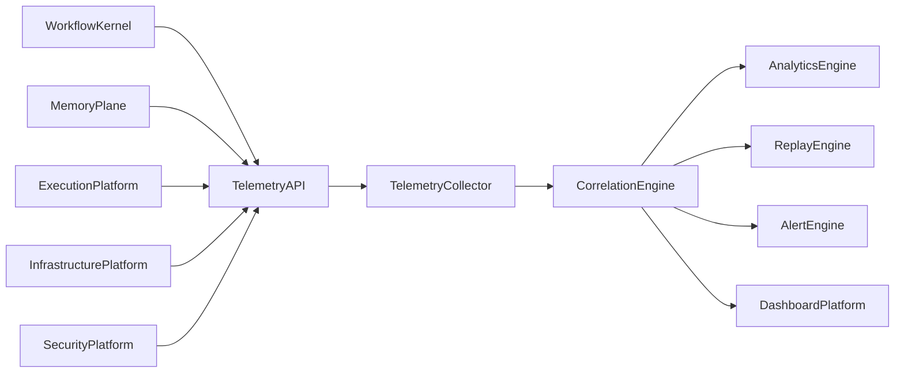
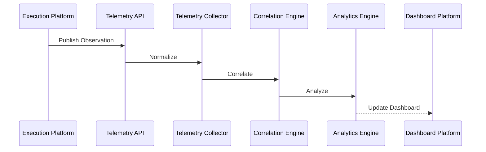
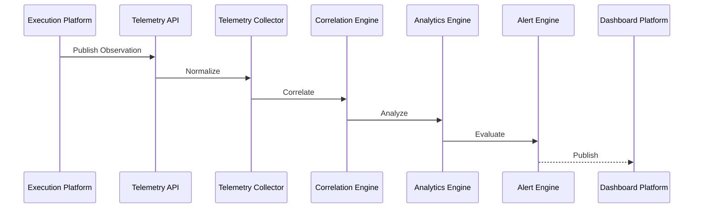

# Enterprise AI Software Factory
# Architecture Design Specification (ADS)

> **Document ID:** ADS-027-v3
>
> **Document Name:** Observability Platform — APIs, Events & Contracts
>
> **Version:** 2.0.0
>
> **Classification:** Enterprise Platform Plane
>
> **Importance:** CRITICAL
>
> **Depends On:** ADS-027-v1
>
> **Depends On:** ADS-027-v2
>
> **Next:** ADS-027-v4 — Runtime & Observability Infrastructure

---

# Executive Summary

The Observability Platform exposes standardized APIs for telemetry ingestion, trace collection, metrics publication, event correlation, replay services, analytics queries, and alert management.

Every platform emits telemetry through these contracts.

Telemetry producers remain independent.

Observability contracts remain stable.

---

# Communication Principles

Every telemetry request MUST satisfy

- Authenticated
- Authorized
- Versioned
- Observable
- Correlated
- Immutable
- Replayable
- Tenant Isolated

No platform bypasses the Telemetry API.

---

# Observability Communication Architecture



The Correlation Engine is the central observability authority.

---

# Public REST API

The Observability Platform exposes APIs for

- Workflow Kernel
- Memory Plane
- Execution Platform
- Compute Platform
- Security Platform
- Enterprise Dashboard
- Operations Portal
- CLI

---

## API-027-001

### Publish Observation

```http
POST /observability/v1/observations
```

Purpose

Publishes telemetry as an Observation Record.

---

Request

```json
{
  "traceId":"trace-13001",
  "workflowId":"WF-2026-031",
  "telemetryType":"Event",
  "source":"Execution Platform",
  "severity":"Info"
}
```

---

Response

```json
{
  "observationId":"OBS-2201",
  "status":"Accepted"
}
```

---

## API-027-002

### Query Correlation Graph

```http
GET /observability/v1/correlation/{graphId}
```

Returns a Correlation Graph.

---

## API-027-003

### Start Replay

```http
POST /observability/v1/replay
```

Starts a Replay Session.

---

## API-027-004

### Query Metrics

```http
GET /observability/v1/metrics
```

Returns aggregated metrics.

---

## API-027-005

### Query Alerts

```http
GET /observability/v1/alerts
```

Returns active alerts.

---

# Internal gRPC Services

```protobuf
service ObservabilityService {

rpc PublishObservation(ObservationRequest)
returns(ObservationResponse);

rpc BuildCorrelationGraph(GraphRequest)
returns(GraphResponse);

rpc StartReplay(ReplayRequest)
returns(ReplayResponse);

rpc QueryMetrics(MetricsRequest)
returns(MetricsResponse);

rpc EvaluateAlerts(AlertRequest)
returns(AlertResponse);

}
```

---

# Observation Record Schema

```protobuf
message ObservationRecord {

string observation_id = 1;

string trace_id = 2;

string workflow_id = 3;

string telemetry_type = 4;

string source = 5;

string severity = 6;

}
```

---

# Correlation Graph Schema

```protobuf
message CorrelationGraph {

string graph_id = 1;

string workflow = 2;

string execution_plan = 3;

repeated string observations = 4;

repeated string traces = 5;

}
```

---

# Replay Session Schema

```protobuf
message ReplaySession {

string session_id = 1;

string workflow_id = 2;

string correlation_graph = 3;

string replay_mode = 4;

string analyst = 5;

}
```

---

# MCP Tool Contracts

The Observability Platform exposes

```
publish_observation

query_metrics

build_correlation_graph

start_replay

query_alerts

query_dashboard

query_costs

telemetry_health
```

Every invocation is authenticated and audited.

---

# Observability Events

Every telemetry operation emits immutable events.

---

## EVT-027-001

ObservationPublished

---

## EVT-027-002

CorrelationGraphGenerated

---

## EVT-027-003

ReplaySessionStarted

---

## EVT-027-004

ReplayCompleted

---

## EVT-027-005

AlertGenerated

---

## EVT-027-006

AlertResolved

---

## EVT-027-007

DashboardUpdated

---

## EVT-027-008

AnalyticsComputed

---

# Event Flow



---

# Event Ordering

```text
ObservationPublished

↓

TelemetryNormalized

↓

CorrelationGraphGenerated

↓

AnalyticsComputed

↓

DashboardUpdated
```

---

# Event Metadata

Every event contains

```yaml
eventId:
observationId:
traceId:
workflowId:
correlationGraph:
replaySession:
timestamp:
schemaVersion:
```

---

# Contract Validation

Every observability request follows a deterministic validation pipeline.

```text
Receive Request

↓

Schema Validation

↓

Authentication

↓

Authorization

↓

Observation Validation

↓

Correlation Validation

↓

Persistence

↓

Analytics
```

Telemetry is accepted only after successful validation.

---

# Validation Rules

Every request MUST satisfy

| Rule | Description |
|------|-------------|
| API Version | Supported contract version |
| Authentication | Valid platform identity |
| Authorization | Authorized telemetry producer |
| Observation Record | Valid schema |
| Correlation Metadata | Required identifiers present |
| Integrity | Payload checksum verified |
| Tenant | Tenant isolation enforced |
| Timestamp | Valid event timestamp |

Validation failures reject the request.

---

# Authentication

Telemetry producers authenticate using

- OAuth 2.1
- SPIFFE / SPIRE
- Mutual TLS
- Service Accounts

Anonymous telemetry is prohibited.

---

# Authorization

Authorization evaluates

- Platform Identity
- Organization
- Tenant
- Telemetry Scope
- Data Classification
- Observation Type

Decision

```text
Allow

↓

Accept

Deny

↓

Reject

Throttle

↓

Rate Limit
```

Every decision is audited.

---

# Replay Session

Every replay operation creates a Replay Session.

```yaml
replaySession:

  sessionId:

  replayRequest:

  workflowId:

  correlationGraph:

  observationRecords:

  executionLedger:

  securityLedger:

  selectedTimeRange:

  replayMode:

  analyst:

  findings:

  generatedReport:

  completedAt:
```

Replay Sessions remain immutable.

---

# Alert Record

Alerts become immutable operational artifacts.

```yaml
alertRecord:

  alertId:

  observationId:

  correlationGraph:

  replaySession:

  severity:

  category:

  affectedServices:

  triggeredAt:

  acknowledgedBy:

  resolvedAt:

  rootCause:

  status:
```

Alert Records support investigations and compliance.

---

# Runtime Sequence



---

# Retry Policy

Retryable operations

| Operation | Retry |
|-----------|------:|
| Collector Timeout | Yes |
| Storage Timeout | Yes |
| Analytics Delay | Yes |
| Dashboard Update Timeout | Yes |
| Invalid Observation | No |
| Invalid Correlation Metadata | No |
| Authentication Failure | No |

Retry schedule

```text
1 s

↓

2 s

↓

4 s

↓

8 s

↓

Escalation
```

Retries remain bounded.

---

# Circuit Breakers

Observability services isolate unhealthy components.

```text
Collector Failure

↓

Retry

↓

Failure Threshold

↓

Circuit Open

↓

Fallback Collector

↓

Recovery Probe

↓

Circuit Closed
```

Observability failures remain localized.

---

# Distributed Tracing

Every observability operation includes

- Trace ID
- Observation ID
- Correlation Graph ID
- Replay Session ID
- Alert Record ID

Trace Flow

```text
Telemetry API

↓

Collector

↓

Correlation Engine

↓

Analytics Engine

↓

Alert Engine

↓

Dashboard Platform
```

Every observability stage contributes trace spans.

---

# Prometheus Metrics

```text
telemetry_requests_total

observation_records_total

correlation_graph_build_seconds

replay_sessions_total

alerts_generated_total

alerts_resolved_total

dashboard_render_seconds

analytics_queries_total

telemetry_validation_failures_total

collector_health_score
```

---

# Structured Logging

Example

```json
{
  "traceId":"trace-13001",
  "observationId":"OBS-2201",
  "correlationGraph":"GRAPH-009",
  "replaySession":"REPLAY-003",
  "alertRecord":"ALERT-118",
  "status":"Processed"
}
```

Logs remain immutable and correlated.

---

# Audit Records

Every observability operation records

- Observation Record
- Correlation Graph
- Replay Session
- Alert Record
- Trace ID
- Workflow ID
- Timestamp
- Analytics Version

Audit history is append-only.

---

# Reference Standards & Specifications

The Observability Platform aligns with

| Standard | Purpose |
|----------|---------|
| OpenTelemetry | Telemetry collection |
| Prometheus | Metrics |
| OpenMetrics | Metric format |
| OpenAPI 3.1 | REST APIs |
| gRPC | Internal communication |
| W3C Trace Context | Distributed tracing |
| OTLP | Telemetry transport |

---

# Architecture Decision Records

## ADR-027-06

### Decision

Normalize all telemetry into immutable Observation Records.

### Status

Accepted

### Reason

Observation Records create a consistent foundation for analytics and replay.

---

## ADR-027-07

### Decision

Represent investigations as Replay Sessions.

### Status

Accepted

### Reason

Replay Sessions provide reproducible operational analysis and debugging.

---

## ADR-027-08

### Decision

Treat alerts as immutable operational artifacts.

### Status

Accepted

### Reason

Alert Records improve auditability, incident response, and operational governance.

---

# Operational Readiness Scorecard

| Capability | Status |
|------------|--------|
| Observation Records | ✅ Required |
| Correlation Graphs | ✅ Required |
| Replay Sessions | ✅ Required |
| Alert Records | ✅ Required |
| Distributed Tracing | ✅ Required |
| Standards Compliance | ✅ Required |
| Immutable Audit | ✅ Required |
| Deterministic Replay | ✅ Required |

---

# Related Documents

ADS-021-v5 — Workflow Kernel

ADS-022-v5 — Identity & Trust Plane

ADS-023-v5 — Enterprise Memory Plane

ADS-024-v5 — Agent Execution Platform

ADS-025-v5 — Compute & Infrastructure Platform

ADS-026-v5 — Security Platform

ADS-027-v1 — Observability Platform

ADS-027-v2 — Telemetry Algorithms & Correlation Engine

ADS-027-v4 — Runtime & Observability Infrastructure

---

# End of Document
