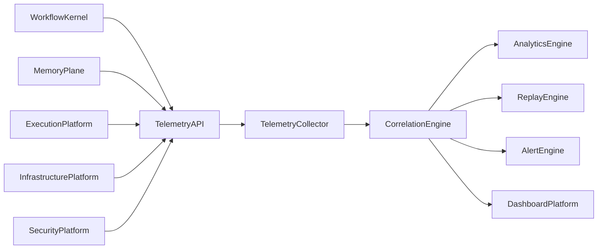
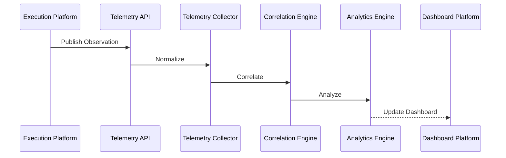

# Enterprise AI Software Factory
# Architecture Design Specification (ADS)

> **Document ID:** ADS-027-v3
>
> **Document Name:** Observability Platform — APIs, Events & Contracts
>
> **Version:** 2.0.0
>
> **Classification:** Enterprise Platform Plane
>
> **Importance:** CRITICAL
>
> **Depends On:** ADS-027-v1
>
> **Depends On:** ADS-027-v2
>
> **Next:** ADS-027-v4 — Runtime & Observability Infrastructure

---

# Executive Summary

The Observability Platform exposes standardized APIs for telemetry ingestion, trace collection, metrics publication, event correlation, replay services, analytics queries, and alert management.

Every platform emits telemetry through these contracts.

Telemetry producers remain independent.

Observability contracts remain stable.

---

# Communication Principles

Every telemetry request MUST satisfy

- Authenticated
- Authorized
- Versioned
- Observable
- Correlated
- Immutable
- Replayable
- Tenant Isolated

No platform bypasses the Telemetry API.

---

# Observability Communication Architecture



The Correlation Engine is the central observability authority.

---

# Public REST API

The Observability Platform exposes APIs for

- Workflow Kernel
- Memory Plane
- Execution Platform
- Compute Platform
- Security Platform
- Enterprise Dashboard
- Operations Portal
- CLI

---

## API-027-001

### Publish Observation

```http
POST /observability/v1/observations
```

Purpose

Publishes telemetry as an Observation Record.

---

Request

```json
{
  "traceId":"trace-13001",
  "workflowId":"WF-2026-031",
  "telemetryType":"Event",
  "source":"Execution Platform",
  "severity":"Info"
}
```

---

Response

```json
{
  "observationId":"OBS-2201",
  "status":"Accepted"
}
```

---

## API-027-002

### Query Correlation Graph

```http
GET /observability/v1/correlation/{graphId}
```

Returns a Correlation Graph.

---

## API-027-003

### Start Replay

```http
POST /observability/v1/replay
```

Starts a Replay Session.

---

## API-027-004

### Query Metrics

```http
GET /observability/v1/metrics
```

Returns aggregated metrics.

---

## API-027-005

### Query Alerts

```http
GET /observability/v1/alerts
```

Returns active alerts.

---

# Internal gRPC Services

```protobuf
service ObservabilityService {

rpc PublishObservation(ObservationRequest)
returns(ObservationResponse);

rpc BuildCorrelationGraph(GraphRequest)
returns(GraphResponse);

rpc StartReplay(ReplayRequest)
returns(ReplayResponse);

rpc QueryMetrics(MetricsRequest)
returns(MetricsResponse);

rpc EvaluateAlerts(AlertRequest)
returns(AlertResponse);

}
```

---

# Observation Record Schema

```protobuf
message ObservationRecord {

string observation_id = 1;

string trace_id = 2;

string workflow_id = 3;

string telemetry_type = 4;

string source = 5;

string severity = 6;

}
```

---

# Correlation Graph Schema

```protobuf
message CorrelationGraph {

string graph_id = 1;

string workflow = 2;

string execution_plan = 3;

repeated string observations = 4;

repeated string traces = 5;

}
```

---

# Replay Session Schema

```protobuf
message ReplaySession {

string session_id = 1;

string workflow_id = 2;

string correlation_graph = 3;

string replay_mode = 4;

string analyst = 5;

}
```

---

# MCP Tool Contracts

The Observability Platform exposes

```
publish_observation

query_metrics

build_correlation_graph

start_replay

query_alerts

query_dashboard

query_costs

telemetry_health
```

Every invocation is authenticated and audited.

---

# Observability Events

Every telemetry operation emits immutable events.

---

## EVT-027-001

ObservationPublished

---

## EVT-027-002

CorrelationGraphGenerated

---

## EVT-027-003

ReplaySessionStarted

---

## EVT-027-004

ReplayCompleted

---

## EVT-027-005

AlertGenerated

---

## EVT-027-006

AlertResolved

---

## EVT-027-007

DashboardUpdated

---

## EVT-027-008

AnalyticsComputed

---

# Event Flow



---

# Event Ordering

```text
ObservationPublished

↓

TelemetryNormalized

↓

CorrelationGraphGenerated

↓

AnalyticsComputed

↓

DashboardUpdated
```

---

# Event Metadata

Every event contains

```yaml
eventId:
observationId:
traceId:
workflowId:
correlationGraph:
replaySession:
timestamp:
schemaVersion:
```

---

# End of Part 1
