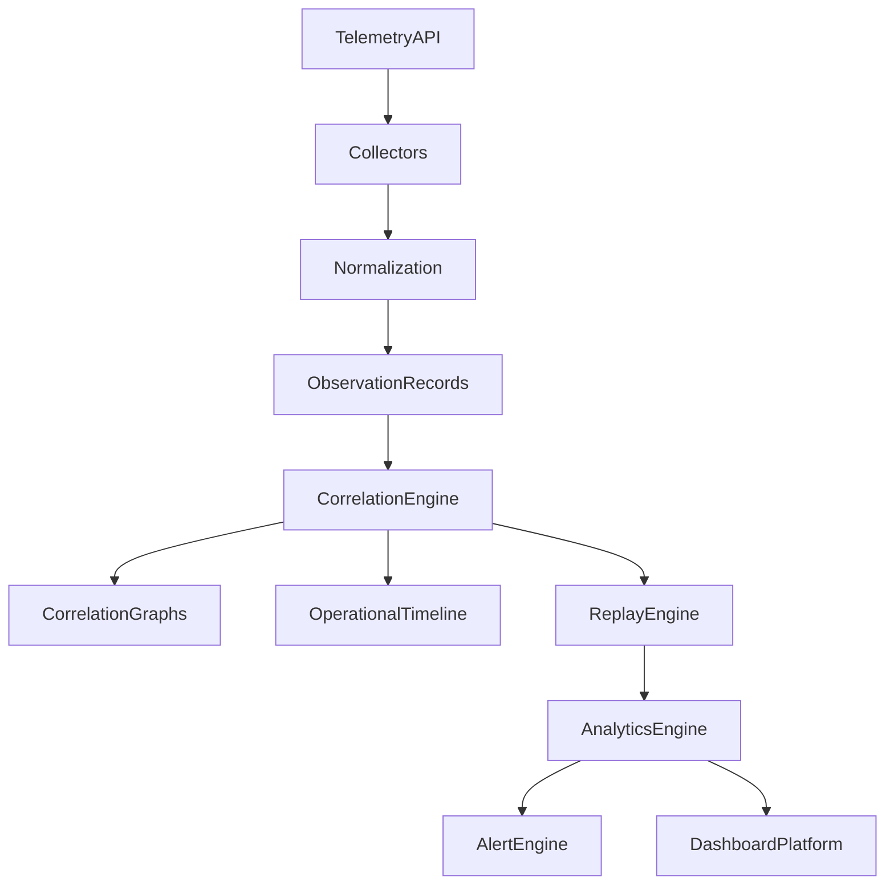
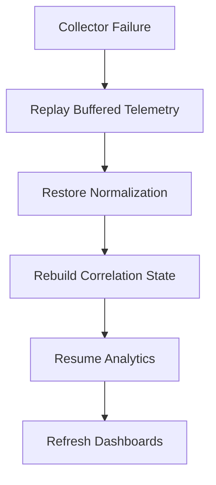

# Enterprise AI Software Factory
# Architecture Design Specification (ADS)

> **Document ID:** ADS-027-v4
>
> **Document Name:** Observability Platform — Runtime & Observability Infrastructure
>
> **Version:** 2.0.0
>
> **Classification:** Enterprise Runtime Specification
>
> **Importance:** CRITICAL
>
> **Depends On:** ADS-027-v1
>
> **Depends On:** ADS-027-v2
>
> **Depends On:** ADS-027-v3
>
> **Next:** ADS-027-v5 — End-to-End Observability Lifecycle

---

# Executive Summary

This document defines the runtime infrastructure responsible for collecting, correlating, storing, analyzing, replaying, and visualizing telemetry across the Enterprise AI Software Factory.

The runtime continuously processes telemetry while maintaining low latency, high availability, replayability, and operational integrity.

Observability never interferes with production execution.

---

# Runtime Philosophy

The runtime follows seven principles.

- Continuous Collection
- Immutable Telemetry
- Low Overhead
- Deterministic Correlation
- Replayable Operations
- High Availability
- Open Standards

Observability always operates asynchronously.

---

# Runtime Layers

## Collection Runtime

Responsible for

- Telemetry Collection
- OTLP Ingestion
- Buffering
- Validation

---

## Correlation Runtime

Responsible for

- Observation Records
- Correlation Graphs
- Operational Timelines
- Replay Preparation

---

## Analytics Runtime

Responsible for

- Aggregations
- Cost Analytics
- SLO Monitoring
- Trend Analysis
- Capacity Analytics

---

## Visualization Runtime

Responsible for

- Dashboards
- Alerting
- Reports
- Operational Views

---

# Runtime Architecture



Observation Records become the canonical telemetry artifact.

---

# Runtime Components

| Component | Responsibility |
|------------|----------------|
| Telemetry Collector | Ingestion |
| Normalization Engine | Canonical schema |
| Observation Store | Immutable telemetry |
| Correlation Engine | Relationship analysis |
| Replay Engine | Historical reconstruction |
| Analytics Engine | Operational intelligence |
| Alert Engine | Alert generation |
| Dashboard Platform | Visualization |
| Archive Manager | Long-term retention |

---

# Runtime Pipeline

```text
Telemetry

↓

Validation

↓

Normalization

↓

Observation Record

↓

Correlation

↓

Analytics

↓

Alerts

↓

Dashboards
```

Every telemetry item follows this lifecycle.

---

# Collection Runtime

The Collection Runtime accepts

- Metrics
- Logs
- Traces
- Events
- Profiles

Collection remains asynchronous.

---

# Observation Storage

Observation Records are

- Immutable
- Versioned
- Searchable
- Replayable
- Correlated

Observation storage supports long-term retention.

---

# Correlation Runtime

The runtime continuously constructs

- Correlation Graphs
- Operational Timelines
- Replay Sessions

Correlation never blocks telemetry ingestion.

---

# Replay Runtime

Replay supports

- Workflow Replay
- Infrastructure Replay
- Security Replay
- Timeline Replay
- Cost Replay

Replay is isolated from production.

---

# Runtime Guarantees

The runtime guarantees

- Continuous Collection
- Immutable Observations
- Deterministic Correlation
- Replay Isolation
- Low Collection Latency
- High Availability
- Complete Traceability

---

# Failure Recovery

The Observability Runtime automatically recovers from telemetry pipeline failures.

Recovery preserves telemetry integrity.



Recovery guarantees

- No telemetry loss
- No duplicate observations
- Deterministic replay
- Continuous monitoring

---

# Runtime Health Monitoring

Every runtime component continuously reports health.

Collected metrics

- Collector Health
- Correlation Engine Health
- Analytics Health
- Replay Engine Health
- Dashboard Availability
- Storage Utilization
- Queue Depth
- Processing Latency

Health Flow

```text
Runtime Component

↓

Heartbeat

↓

Runtime Monitor

↓

Observability Dashboard

↓

Alert Engine

↓

Operations Team
```

Health monitoring remains continuous.

---

# Telemetry Snapshot

The platform periodically generates Telemetry Snapshots.

```yaml
telemetrySnapshot:

  snapshotId:

  generatedAt:

  observationCount:

  activeTraces:

  activeAlerts:

  activeIncidents:

  activeWorkflows:

  infrastructureHealth:

  securityHealth:

  platformHealth:

  sloStatus:

  costSummary:
```

Telemetry Snapshots provide point-in-time operational state.

---

# Runtime Buffering

Incoming telemetry is buffered before processing.

Buffer stages

```text
Receive

↓

Validate

↓

Buffer

↓

Normalize

↓

Persist

↓

Correlate
```

Buffers absorb temporary traffic spikes.

---

# Runtime Configuration

Example

```yaml
observability:

  telemetryProtocol: otlp

  collectorMode: distributed

  observationStore: immutable

  replayEngine: enabled

  telemetrySnapshots: enabled

  anomalyDetection: realtime

  alertEngine: automatic

  retentionPeriod: 365d
```

Configuration remains version-controlled.

---

# Data Retention

Retention policies

| Data | Default |
|------|---------|
| Metrics | 90 Days |
| Logs | 180 Days |
| Traces | 90 Days |
| Observation Records | 365 Days |
| Correlation Graphs | 365 Days |
| Replay Sessions | 365 Days |
| Alert Records | 365 Days |
| Telemetry Snapshots | 365 Days |

Retention policies remain configurable.

---

# Runtime Optimizations

The runtime performs

- Adaptive Sampling
- Intelligent Compression
- Parallel Correlation
- Incremental Replay
- Dashboard Caching
- Query Acceleration
- Storage Tiering

Optimizations never compromise traceability.

---

# Prometheus Metrics

```text
telemetry_snapshot_total

collector_queue_depth

collector_latency_seconds

observation_storage_bytes

correlation_runtime_seconds

replay_runtime_seconds

analytics_processing_seconds

dashboard_refresh_total

retention_cleanup_total

runtime_health_score
```

---

# OpenTelemetry

Distributed tracing spans

```text
Telemetry API

↓

Collector

↓

Normalization

↓

Observation Store

↓

Correlation Engine

↓

Analytics Engine

↓

Dashboard Platform
```

Every runtime stage contributes trace spans.

---

# Structured Logging

Example

```json
{
  "traceId":"trace-14001",
  "telemetrySnapshot":"SNAP-OBS-004",
  "observationCount":18241,
  "activeAlerts":3,
  "runtimeHealth":"Healthy",
  "dashboard":"Operations"
}
```

Logs remain immutable and correlated.

---

# Disaster Recovery

Recovery flow

```text
Collector Failure

↓

Restore Observation Store

↓

Rebuild Correlation Graphs

↓

Restore Telemetry Snapshots

↓

Resume Analytics

↓

Refresh Dashboards
```

Recovery targets

Recovery Point Objective (RPO)

Near-zero telemetry loss

Recovery Time Objective (RTO)

Less than five minutes

---

# Recommended Production Deployment

```text
OTLP Collectors

↓

Kafka

↓

Normalization Engine

↓

Observation Store

↓

Correlation Engine

↓

Replay Engine

↓

Analytics Engine

↓

Alert Engine

↓

Prometheus

↓

Grafana
```

---

# Technology Decision Records

## TDR-027-01

### Technology

OpenTelemetry

### Decision

Use OpenTelemetry as the standard telemetry protocol.

### Reason

Provides vendor-neutral telemetry collection and distributed tracing.

---

## TDR-027-02

### Technology

Apache Kafka

### Decision

Use Kafka as the telemetry streaming backbone.

### Reason

Supports durable, scalable, high-throughput telemetry ingestion.

---

## TDR-027-03

### Technology

Prometheus

### Decision

Use Prometheus for metrics storage and alert rule evaluation.

### Reason

Provides mature metrics collection with strong Kubernetes integration.

---

## TDR-027-04

### Technology

Grafana

### Decision

Use Grafana as the primary visualization platform.

### Reason

Supports dashboards, alert visualization, and operational analytics.

---

## TDR-027-05

### Technology

Telemetry Snapshot

### Decision

Persist periodic Telemetry Snapshots.

### Reason

Supports executive reporting, diagnostics, replay, and historical comparison.

---

# Runtime Checklist

The Observability Platform MUST

- Collect telemetry continuously
- Normalize every observation
- Build Correlation Graphs
- Generate Telemetry Snapshots
- Support deterministic replay
- Preserve immutable telemetry
- Continuously evaluate SLOs

The Observability Platform MUST NOT

- Drop validated telemetry
- Modify Observation Records
- Replay into production
- Break trace correlation
- Bypass alert evaluation

---

# Architecture Decision Records

## ADR-027-09

### Decision

Treat Telemetry Snapshots as immutable runtime artifacts.

### Status

Accepted

### Reason

Snapshots improve diagnostics, capacity planning, and operational reporting.

---

## ADR-027-10

### Decision

Separate telemetry collection from analytics processing.

### Status

Accepted

### Reason

Independent scaling improves resilience and reduces telemetry latency.

---

## ADR-027-11

### Decision

Maintain immutable Observation Records throughout their lifecycle.

### Status

Accepted

### Reason

Immutable telemetry enables replay, auditing, and deterministic operational analysis.

---

# Operational Readiness Scorecard

| Capability | Status |
|------------|--------|
| Continuous Collection | ✅ Required |
| Telemetry Snapshots | ✅ Required |
| Correlation Runtime | ✅ Required |
| Replay Isolation | ✅ Required |
| Runtime Recovery | ✅ Required |
| Immutable Observation Store | ✅ Required |
| High Availability | ✅ Required |
| Full Traceability | ✅ Required |

---

# Related Documents

ADS-021-v5 — Workflow Kernel

ADS-022-v5 — Identity & Trust Plane

ADS-023-v5 — Enterprise Memory Plane

ADS-024-v5 — Agent Execution Platform

ADS-025-v5 — Compute & Infrastructure Platform

ADS-026-v5 — Security Platform

ADS-027-v1 — Observability Platform

ADS-027-v2 — Telemetry Algorithms & Correlation Engine

ADS-027-v3 — APIs, Events & Contracts

ADS-027-v5 — End-to-End Observability Lifecycle

---

# End of Document
