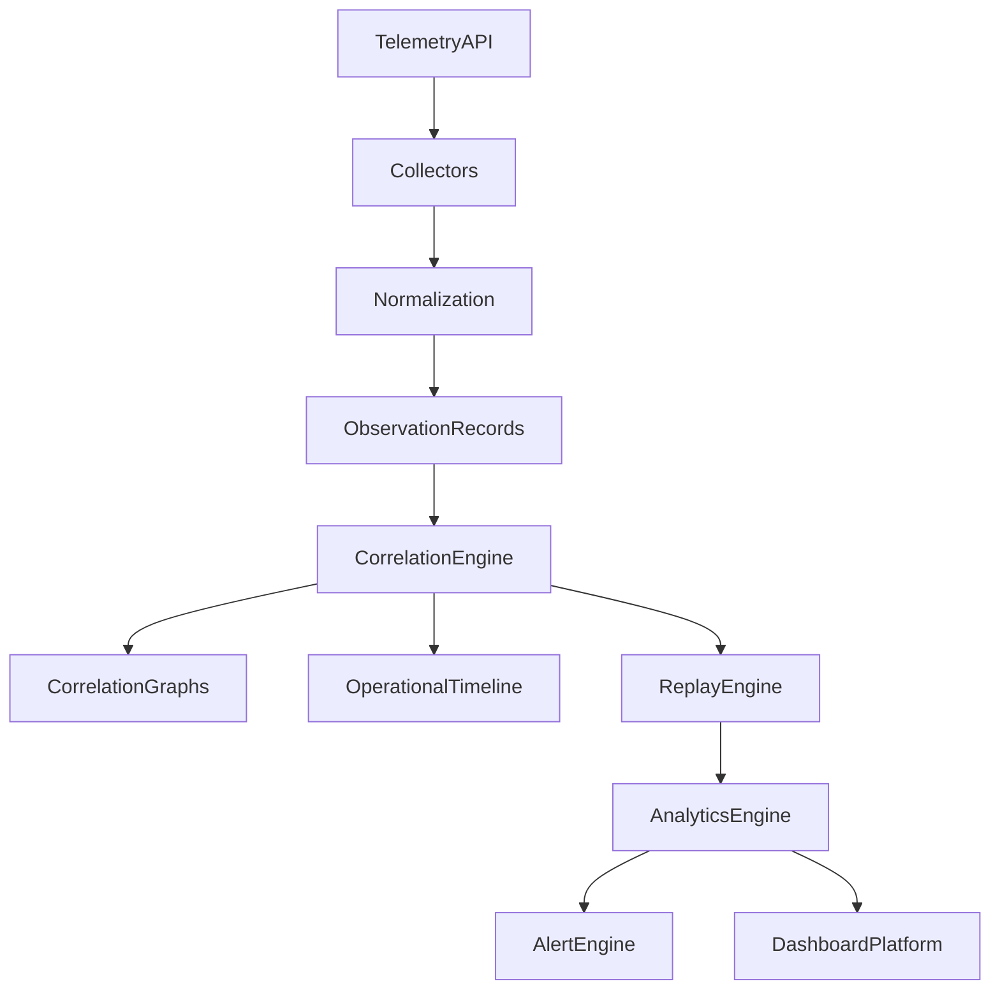

# Enterprise AI Software Factory
# Architecture Design Specification (ADS)

> **Document ID:** ADS-027-v4
>
> **Document Name:** Observability Platform — Runtime & Observability Infrastructure
>
> **Version:** 2.0.0
>
> **Classification:** Enterprise Runtime Specification
>
> **Importance:** CRITICAL
>
> **Depends On:** ADS-027-v1
>
> **Depends On:** ADS-027-v2
>
> **Depends On:** ADS-027-v3
>
> **Next:** ADS-027-v5 — End-to-End Observability Lifecycle

---

# Executive Summary

This document defines the runtime infrastructure responsible for collecting, correlating, storing, analyzing, replaying, and visualizing telemetry across the Enterprise AI Software Factory.

The runtime continuously processes telemetry while maintaining low latency, high availability, replayability, and operational integrity.

Observability never interferes with production execution.

---

# Runtime Philosophy

The runtime follows seven principles.

- Continuous Collection
- Immutable Telemetry
- Low Overhead
- Deterministic Correlation
- Replayable Operations
- High Availability
- Open Standards

Observability always operates asynchronously.

---

# Runtime Layers

## Collection Runtime

Responsible for

- Telemetry Collection
- OTLP Ingestion
- Buffering
- Validation

---

## Correlation Runtime

Responsible for

- Observation Records
- Correlation Graphs
- Operational Timelines
- Replay Preparation

---

## Analytics Runtime

Responsible for

- Aggregations
- Cost Analytics
- SLO Monitoring
- Trend Analysis
- Capacity Analytics

---

## Visualization Runtime

Responsible for

- Dashboards
- Alerting
- Reports
- Operational Views

---

# Runtime Architecture



Observation Records become the canonical telemetry artifact.

---

# Runtime Components

| Component | Responsibility |
|------------|----------------|
| Telemetry Collector | Ingestion |
| Normalization Engine | Canonical schema |
| Observation Store | Immutable telemetry |
| Correlation Engine | Relationship analysis |
| Replay Engine | Historical reconstruction |
| Analytics Engine | Operational intelligence |
| Alert Engine | Alert generation |
| Dashboard Platform | Visualization |
| Archive Manager | Long-term retention |

---

# Runtime Pipeline

```text
Telemetry

↓

Validation

↓

Normalization

↓

Observation Record

↓

Correlation

↓

Analytics

↓

Alerts

↓

Dashboards
```

Every telemetry item follows this lifecycle.

---

# Collection Runtime

The Collection Runtime accepts

- Metrics
- Logs
- Traces
- Events
- Profiles

Collection remains asynchronous.

---

# Observation Storage

Observation Records are

- Immutable
- Versioned
- Searchable
- Replayable
- Correlated

Observation storage supports long-term retention.

---

# Correlation Runtime

The runtime continuously constructs

- Correlation Graphs
- Operational Timelines
- Replay Sessions

Correlation never blocks telemetry ingestion.

---

# Replay Runtime

Replay supports

- Workflow Replay
- Infrastructure Replay
- Security Replay
- Timeline Replay
- Cost Replay

Replay is isolated from production.

---

# Runtime Guarantees

The runtime guarantees

- Continuous Collection
- Immutable Observations
- Deterministic Correlation
- Replay Isolation
- Low Collection Latency
- High Availability
- Complete Traceability

---

# End of Part 1
