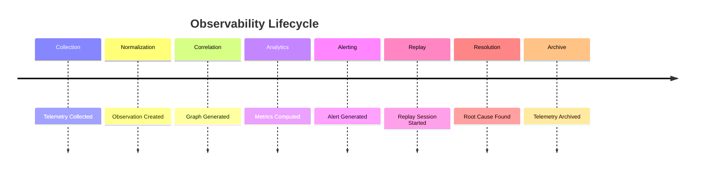

# Enterprise AI Software Factory
# Architecture Design Specification (ADS)

> **Document ID:** ADS-027-v5
>
> **Document Name:** Observability Platform — End-to-End Observability Lifecycle
>
> **Version:** 2.0.0
>
> **Classification:** Reference Implementation
>
> **Importance:** CRITICAL
>
> **Depends On:** ADS-027-v1
>
> **Depends On:** ADS-027-v2
>
> **Depends On:** ADS-027-v3
>
> **Depends On:** ADS-027-v4

---

# Executive Summary

This document demonstrates how the Observability Platform captures, correlates, analyzes, alerts on, and replays telemetry throughout a complete enterprise software engineering workflow.

Unlike previous documents that define architecture and runtime behavior, this document illustrates how Observation Records, Correlation Graphs, Replay Sessions, Alert Records, Operational Timelines, and Telemetry Snapshots work together during production execution.

Every observation is traceable.

Every alert is explainable.

Every investigation is reproducible.

---

# Scenario

An engineering workflow deploys

```
Production Payment API
```

Platform participants

- Workflow Kernel
- Identity Plane
- Memory Plane
- Agent Execution Platform
- Compute Platform
- Security Platform
- Observability Platform

---

# Stage 1 — Telemetry Collection

The Workflow Kernel emits

```
WorkflowStarted
```

Generated

```
OBS-2026-001
```

Observation Record is stored.

---

# Stage 2 — Normalization

Telemetry Collector validates

- Timestamp
- Trace ID
- Workflow ID
- Schema Version
- Payload Integrity

Telemetry becomes normalized.

---

# Stage 3 — Observation Record

Generated

```
OBS-2026-002
```

Contains

- Trace ID
- Workflow
- Execution Plan
- Platform Source
- Severity
- Timestamp

Observation becomes immutable.

---

# Stage 4 — Correlation Graph

Correlation Engine builds

```
GRAPH-2026-007
```

Graph connects

- Workflow
- Execution Plan
- Agents
- Placement Decisions
- Security Decisions
- Observation Records

Relationships become queryable.

---

# Stage 5 — Operational Timeline

Generated

```
TIMELINE-2026-004
```

Timeline records

- Workflow Started
- Agents Created
- Infrastructure Provisioned
- Security Approved
- Deployment Completed

Timeline remains chronological.

---

# Stage 6 — Analytics

Analytics computes

- Workflow Duration
- Agent Utilization
- Infrastructure Cost
- Model Usage
- Latency
- Error Rate

Analytics become available to dashboards.

---

# Stage 7 — Alert Generation

Latency exceeds

```
500 ms
```

Alert generated

```
ALERT-2026-011
```

Severity

```
Warning
```

Alert references

- Observation Record
- Correlation Graph
- Operational Timeline

---

# Stage 8 — Telemetry Snapshot

Generated

```
SNAP-OBS-2026-008
```

Snapshot captures

- Active Workflows
- Active Alerts
- Platform Health
- SLO Status
- Cost Summary

Snapshot archived.

---

# Stage 9 — Replay Session

Operations requests replay.

Generated

```
REPLAY-2026-002
```

Replay loads

- Observation Records
- Correlation Graph
- Operational Timeline
- Security Ledger
- Execution Ledger

Historical execution is reconstructed.

---

# Stage 10 — Root Cause Analysis

Replay identifies

```
GPU node provisioning delay
```

Impact

- Increased deployment latency
- Temporary SLO violation

Root cause linked to infrastructure autoscaling.

---

# Stage 11 — Resolution

Infrastructure optimization applied.

Replay confirms

```
Latency reduced by 42%
```

Alert resolved.

Dashboard updated.

---

# Stage 12 — Archive

Artifacts archived

- Observation Records
- Correlation Graph
- Replay Session
- Alert Record
- Operational Timeline
- Telemetry Snapshot

Historical investigations remain reproducible.

---

# Observability Timeline



---

# Observability Event Stream

```text
ObservationPublished

↓

TelemetryNormalized

↓

CorrelationGraphGenerated

↓

OperationalTimelineCreated

↓

AnalyticsComputed

↓

AlertGenerated

↓

ReplaySessionStarted

↓

RootCauseIdentified

↓

AlertResolved

↓

TelemetryArchived
```

---

# Produced Artifacts

| Artifact | Identifier |
|-----------|------------|
| Observation Record | OBS-2026-002 |
| Correlation Graph | GRAPH-2026-007 |
| Operational Timeline | TIMELINE-2026-004 |
| Replay Session | REPLAY-2026-002 |
| Alert Record | ALERT-2026-011 |
| Telemetry Snapshot | SNAP-OBS-2026-008 |

---

# Runtime Metrics

| Metric | Value |
|---------|------:|
| Observation Records | 18,241 |
| Correlation Graphs | 512 |
| Replay Sessions | 18 |
| Alerts Generated | 43 |
| Alerts Resolved | 42 |
| Average Collection Latency | 18 ms |
| Replay Duration | 4.3 s |
| Dashboard Availability | 99.99% |

---

# Operational Readiness Scorecard

| Capability | Status |
|------------|--------|
| Observation Records | ✅ Verified |
| Correlation Graphs | ✅ Verified |
| Operational Timelines | ✅ Verified |
| Replay Sessions | ✅ Verified |
| Alert Records | ✅ Verified |
| Telemetry Snapshots | ✅ Verified |
| Deterministic Replay | ✅ Verified |
| Operational Analytics | ✅ Verified |

---

# Lessons Learned

The Observability Platform demonstrates the following principles.

- Observation Records normalize every telemetry event into a common format.
- Correlation Graphs capture relationships across workflows, execution, infrastructure, and security.
- Operational Timelines reconstruct chronological platform behavior.
- Replay Sessions enable deterministic debugging without impacting production systems.
- Alert Records provide immutable operational notifications linked to their originating observations.
- Telemetry Snapshots capture platform state for diagnostics, reporting, and capacity planning.
- Analytics transforms telemetry into actionable operational intelligence.

---

# Architecture Decision Record

## ADR-027-12

### Decision

Represent observability as a deterministic lifecycle built from immutable operational artifacts.

### Status

Accepted

### Reason

Artifact-centric observability improves replayability, diagnostics, auditability, operational analytics, and long-term platform evolution.

---

# Technology Decision Record

## TDR-027-06

### Technology

Unified Observability Platform

### Decision

Implement a centralized Observability Platform responsible for telemetry ingestion, correlation, analytics, replay, dashboards, and operational intelligence.

### Reason

A unified platform enables consistent operational visibility across workflows, memory, execution, infrastructure, security, and future platform services while preserving deterministic telemetry processing and replay.

---

# Related Documents

ADS-021-v5 — Workflow Kernel

ADS-022-v5 — Identity & Trust Plane

ADS-023-v5 — Enterprise Memory Plane

ADS-024-v5 — Agent Execution Platform

ADS-025-v5 — Compute & Infrastructure Platform

ADS-026-v5 — Security Platform

ADS-027-v1 — Observability Platform

ADS-027-v2 — Telemetry Algorithms & Correlation Engine

ADS-027-v3 — APIs, Events & Contracts

ADS-027-v4 — Runtime & Observability Infrastructure

---

# End of Document
