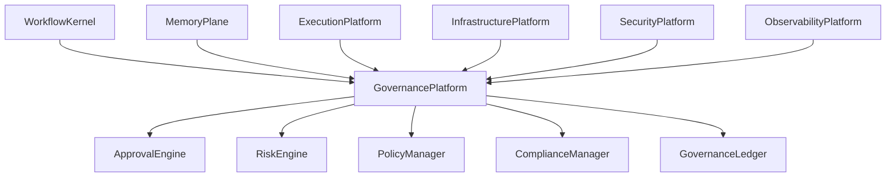
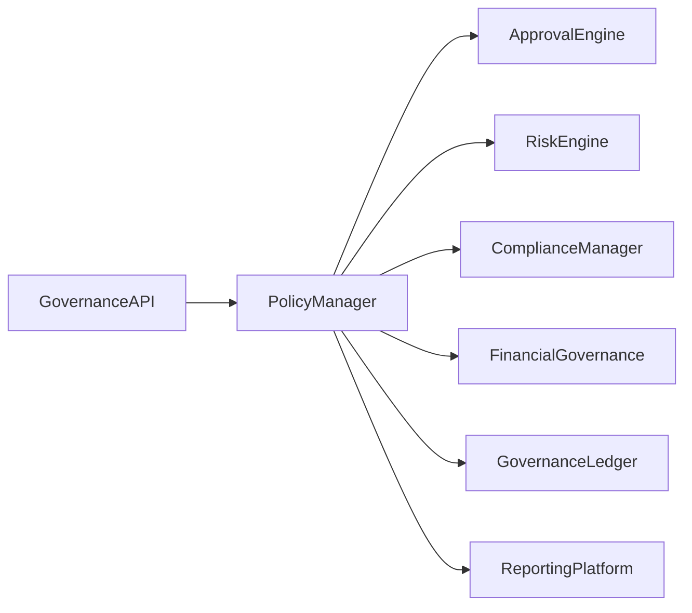

# Enterprise AI Software Factory
# Architecture Design Specification (ADS)

> **Document ID:** ADS-028-v1
>
> **Document Name:** Governance Platform — Architecture
>
> **Version:** 2.0.0
>
> **Classification:** Enterprise Platform Plane
>
> **Importance:** CRITICAL
>
> **Depends On:** ADS-021-v5
>
> **Depends On:** ADS-022-v5
>
> **Depends On:** ADS-023-v5
>
> **Depends On:** ADS-024-v5
>
> **Depends On:** ADS-025-v5
>
> **Depends On:** ADS-026-v5
>
> **Depends On:** ADS-027-v5
>
> **Next:** ADS-028-v2 — Governance Algorithms & Policy Framework

---

# Executive Summary

The Governance Platform provides centralized oversight, policy management, compliance enforcement, approval workflows, audit governance, operational controls, financial governance, and enterprise risk management across the Enterprise AI Software Factory.

Governance is not limited to compliance.

It governs how autonomous systems are designed, deployed, operated, monitored, and retired.

The Governance Platform provides

- Enterprise Policies
- Approval Workflows
- Human Oversight
- Financial Governance
- Compliance Governance
- Risk Management
- Lifecycle Governance
- Exception Management
- Governance Reporting
- Enterprise Controls

---

# Why This System Exists

Enterprise AI systems require more than execution.

They require

- accountability
- ownership
- transparency
- compliance
- financial control
- operational governance

Every autonomous action must remain governed.

---

# Core Philosophy

Govern Everything.

Explain Everything.

Approve What Matters.

Automate What Is Safe.

Escalate What Is Risky.

---

# Design Goals

The Governance Platform provides

- Enterprise Policy Management
- Risk Evaluation
- Approval Engine
- Exception Handling
- Cost Governance
- Compliance Governance
- Governance Reporting
- Operational Controls
- Executive Dashboards
- Audit Integration

---

# Architectural Position

Governance spans every platform plane.

---

# High-Level Architecture

Every governance decision passes through the Policy Manager.

---

# Major Components

| Component | Responsibility |
|------------|----------------|
| Governance API | Public interface |
| Policy Manager | Governance policies |
| Approval Engine | Human approvals |
| Risk Engine | Enterprise risk |
| Compliance Manager | Regulatory governance |
| Financial Governance | Budget and cost controls |
| Governance Ledger | Immutable governance history |
| Reporting Platform | Executive reporting |
| Exception Manager | Controlled policy exceptions |

---

# Governance Domains

| Domain | Purpose |
|---------|----------|
| Workflow | Process governance |
| Agents | Operational governance |
| Memory | Data governance |
| Security | Security governance |
| Infrastructure | Infrastructure governance |
| Financial | Cost governance |
| Compliance | Regulatory governance |
| Risk | Enterprise risk |

Governance applies consistently across all domains.

---

# Governance Principles

The Governance Platform follows

- Policy First
- Human Accountability
- Risk-Based Decisions
- Immutable Audit
- Least Necessary Approval
- Explainable Governance
- Continuous Compliance

---

# Governance Boundaries

Governance is enforced at

- Workflow Creation
- Agent Registration
- Tool Registration
- Memory Access
- Infrastructure Provisioning
- Security Policy Changes
- Financial Thresholds
- Production Deployment

Every critical operation remains governed.

---

# Architecture Decision Records

## ADR-028-01

### Decision

Centralize enterprise governance into a dedicated Governance Platform.

### Status

Accepted

### Reason

Consistent governance simplifies enterprise operations, compliance, and accountability.

---

## ADR-028-02

### Decision

Represent governance actions as immutable artifacts.

### Status

Accepted

### Reason

Immutable governance records improve explainability, compliance, and enterprise auditability.

---

# Operational Readiness Scorecard

| Capability | Status |
|------------|--------|
| Policy Governance | ✅ Required |
| Approval Engine | ✅ Required |
| Risk Evaluation | ✅ Required |
| Financial Governance | ✅ Required |
| Governance Ledger | ✅ Required |
| Executive Reporting | ✅ Required |
| Compliance Governance | ✅ Required |
| Human Oversight | ✅ Required |

---

# Version Roadmap

| Version | Description |
|----------|-------------|
| v1 | Architecture |
| v2 | Governance Algorithms & Policy Framework |
| v3 | APIs, Events & Contracts |
| v4 | Runtime & Governance Infrastructure |
| v5 | End-to-End Governance Lifecycle |

---

# Related Documents

ADS-021-v5 — Workflow Kernel

ADS-022-v5 — Identity & Trust Plane

ADS-023-v5 — Enterprise Memory Plane

ADS-024-v5 — Agent Execution Platform

ADS-025-v5 — Compute & Infrastructure Platform

ADS-026-v5 — Security Platform

ADS-027-v5 — Observability Platform

---

# Next Document

**ADS-028-v2 — Governance Algorithms & Policy Framework**

Defines governance policies, approval algorithms, risk scoring, financial controls, exception handling, compliance evaluation, and enterprise governance decision models.

---

# End of Document
