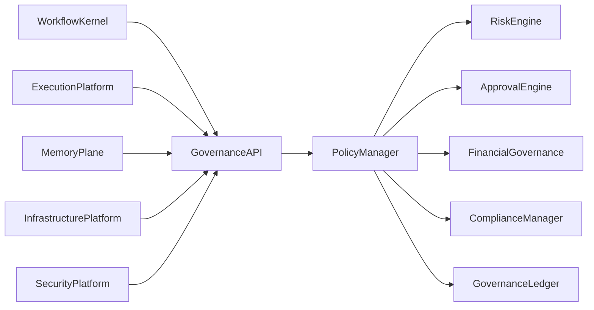
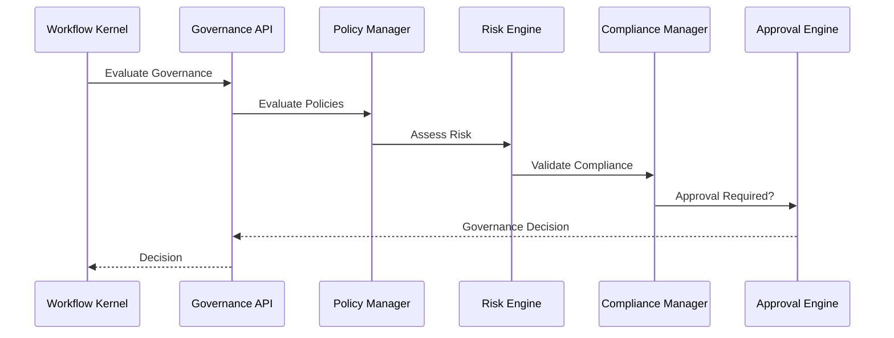
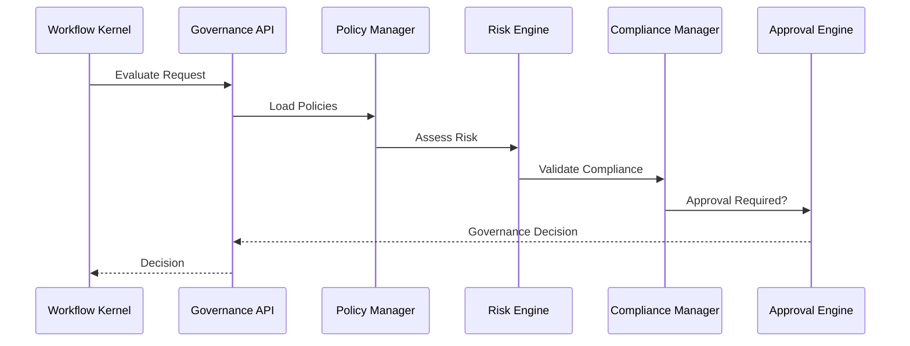

# Enterprise AI Software Factory
# Architecture Design Specification (ADS)

> **Document ID:** ADS-028-v3
>
> **Document Name:** Governance Platform — APIs, Events & Contracts
>
> **Version:** 2.0.0
>
> **Classification:** Enterprise Platform Plane
>
> **Importance:** CRITICAL
>
> **Depends On:** ADS-028-v1
>
> **Depends On:** ADS-028-v2
>
> **Next:** ADS-028-v4 — Runtime & Governance Infrastructure
>
---

# Executive Summary

The Governance Platform exposes standardized APIs for governance policy evaluation, approval management, compliance validation, financial governance, risk assessment, exception handling, and immutable governance records.

Every enterprise governance interaction occurs through these contracts.

Governance implementations may evolve.

Governance contracts remain stable.

---

# Communication Principles

Every governance request MUST satisfy

- Authenticated
- Authorized
- Versioned
- Observable
- Auditable
- Replayable
- Policy Compliant
- Tenant Isolated

No subsystem bypasses Governance.

---

# Governance Communication Architecture



The Policy Manager is the governance authority.

---

# Public REST API

The Governance Platform exposes APIs for

- Workflow Kernel
- Memory Plane
- Execution Platform
- Infrastructure Platform
- Security Platform
- Enterprise Dashboard
- Operations Portal
- CLI

---

## API-028-001

### Evaluate Governance

```http
POST /governance/v1/decisions
```

Purpose

Evaluates whether an operation satisfies enterprise governance requirements.

---

Request

```json
{
  "workflowId":"WF-2026-031",
  "action":"DEPLOY",
  "governanceContext":"GCTX-001"
}
```

---

Response

```json
{
  "decisionId":"GOV-2026-015",
  "decision":"Approved",
  "approvalRequired":false
}
```

---

## API-028-002

### Request Approval

```http
POST /governance/v1/approvals
```

Creates an approval request.

---

## API-028-003

### Resolve Approval

```http
POST /governance/v1/approvals/{approvalId}
```

Approves or rejects a pending request.

---

## API-028-004

### Evaluate Compliance

```http
POST /governance/v1/compliance
```

Evaluates compliance policies.

---

## API-028-005

### Request Exception

```http
POST /governance/v1/exceptions
```

Creates a governance exception request.

---

# Internal gRPC Services

```protobuf
service GovernanceService {

rpc EvaluateDecision(GovernanceRequest)
returns(GovernanceResponse);

rpc RequestApproval(ApprovalRequest)
returns(ApprovalResponse);

rpc ResolveApproval(ApprovalResolution)
returns(ApprovalResult);

rpc EvaluateCompliance(ComplianceRequest)
returns(ComplianceResponse);

rpc RequestException(ExceptionRequest)
returns(ExceptionResponse);

}
```

---

# Governance Context Schema

```protobuf
message GovernanceContext {

string context_id = 1;

string organization = 2;

string project = 3;

string workflow = 4;

string environment = 5;

string compliance_profile = 6;

double risk_score = 7;

}
```

---

# Governance Decision Schema

```protobuf
message GovernanceDecision {

string decision_id = 1;

string workflow_id = 2;

string decision = 3;

double risk_score = 4;

bool approval_required = 5;

string policy_version = 6;

}
```

---

# Approval Record Schema

```protobuf
message ApprovalRecord {

string approval_id = 1;

string governance_decision = 2;

string approval_level = 3;

string approver = 4;

string status = 5;

}
```

---

# MCP Tool Contracts

The Governance Platform exposes

```
evaluate_governance

request_approval

resolve_approval

evaluate_compliance

request_exception

governance_status

policy_catalog

governance_audit
```

Every invocation is authenticated and audited.

---

# Governance Events

Every governance operation emits immutable events.

---

## EVT-028-001

GovernanceContextCreated

---

## EVT-028-002

GovernanceDecisionGenerated

---

## EVT-028-003

ApprovalRequested

---

## EVT-028-004

ApprovalGranted

---

## EVT-028-005

ApprovalRejected

---

## EVT-028-006

ComplianceValidated

---

## EVT-028-007

ExceptionRequested

---

## EVT-028-008

ExceptionApproved

---

# Event Flow



---

# Contract Validation

Every governance request follows a deterministic validation pipeline.

```text
Receive Request

↓

Schema Validation

↓

Authentication

↓

Authorization

↓

Governance Context Validation

↓

Policy Evaluation

↓

Approval Resolution

↓

Governance Decision
```

Governance evaluation begins only after successful validation.

---

# Validation Rules

Every request MUST satisfy

| Rule | Description |
|------|-------------|
| API Version | Supported contract version |
| Authentication | Valid enterprise identity |
| Authorization | Authorized requester |
| Governance Context | Valid context version |
| Policy Version | Active governance policy |
| Compliance | Regulatory requirements satisfied |
| Financial Profile | Budget information available |
| Tenant | Tenant isolation enforced |

Validation failures terminate the request.

---

# Authentication

Authentication is delegated to the Identity Plane.

Supported methods

- OAuth 2.1
- OpenID Connect
- Mutual TLS
- SPIFFE / SPIRE
- Enterprise SSO

Every governance request originates from a verified identity.

---

# Authorization

Authorization evaluates

- Organization
- Business Unit
- Governance Role
- Policy Scope
- Risk Profile
- Compliance Profile

Decision

```text
Allow

↓

Proceed

Deny

↓

Reject

Require Approval

↓

Approval Workflow
```

Every authorization remains auditable.

---

# Policy Evaluation Record

Every policy evaluation produces an immutable Policy Evaluation Record.

```yaml
policyEvaluationRecord:

  evaluationId:

  governanceContext:

  evaluatedPolicies:

  matchedRules:

  skippedRules:

  overriddenRules:

  evaluationDuration:

  resultingRiskScore:

  resultingComplianceStatus:

  resultingDecision:

  timestamp:
```

Policy Evaluation Records explain governance decisions.

---

# Runtime Sequence



---

# Retry Policy

Retryable operations

| Operation | Retry |
|-----------|------:|
| Policy Store Timeout | Yes |
| Approval Service Timeout | Yes |
| Compliance Service Timeout | Yes |
| Notification Timeout | Yes |
| Invalid Governance Context | No |
| Invalid Policy Version | No |
| Authentication Failure | No |

Retry schedule

```text
1 s

↓

2 s

↓

4 s

↓

8 s

↓

Escalation
```

Retries remain bounded.

---

# Circuit Breakers

Governance services isolate unhealthy components.

```text
Policy Service Failure

↓

Retry

↓

Failure Threshold

↓

Circuit Open

↓

Fallback Read Replica

↓

Recovery Probe

↓

Circuit Closed
```

Governance failures remain isolated.

---

# Distributed Tracing

Every governance operation includes

- Trace ID
- Governance Context ID
- Governance Decision ID
- Approval Record ID
- Policy Evaluation Record ID

Trace Flow

```text
Governance API

↓

Policy Manager

↓

Risk Engine

↓

Compliance Manager

↓

Approval Engine

↓

Governance Ledger
```

Every governance stage contributes trace spans.

---

# Prometheus Metrics

```text
governance_requests_total

governance_decisions_total

policy_evaluations_total

approval_records_total

approval_latency_seconds

policy_evaluation_duration_seconds

exception_requests_total

governance_validation_failures_total

risk_assessment_duration_seconds

financial_budget_checks_total
```

---

# Structured Logging

Example

```json
{
  "traceId":"trace-15001",
  "governanceContext":"GCTX-021",
  "decisionId":"GOV-2026-015",
  "approvalRecord":"APR-008",
  "policyEvaluation":"PE-114",
  "decision":"Approved",
  "riskScore":28
}
```

Logs remain immutable and correlated.

---

# Audit Records

Every governance operation records

- Governance Context
- Governance Decision
- Policy Evaluation Record
- Approval Record
- Workflow ID
- Trace ID
- Timestamp
- Policy Version

Audit history is append-only.

---

# Reference Standards & Specifications

The Governance Platform aligns with

| Standard | Purpose |
|----------|---------|
| OpenAPI 3.1 | REST APIs |
| gRPC | Internal communication |
| OAuth 2.1 | Authentication |
| OpenID Connect | Identity federation |
| OpenTelemetry | Distributed tracing |
| ISO 37301 | Compliance management |
| COSO ERM | Enterprise risk management |

---

# Architecture Decision Records

## ADR-028-06

### Decision

Represent every policy evaluation as a Policy Evaluation Record.

### Status

Accepted

### Reason

Policy Evaluation Records provide explainability, replayability, and governance transparency.

---

## ADR-028-07

### Decision

Separate governance decisions from approval evidence.

### Status

Accepted

### Reason

Approval Records document organizational authorization independently of governance evaluation.

---

## ADR-028-08

### Decision

Evaluate governance using immutable Governance Contexts.

### Status

Accepted

### Reason

Immutable inputs guarantee deterministic governance outcomes and simplify auditing.

---

# Operational Readiness Scorecard

| Capability | Status |
|------------|--------|
| Governance Context | ✅ Required |
| Governance Decisions | ✅ Required |
| Approval Records | ✅ Required |
| Policy Evaluation Records | ✅ Required |
| Compliance Validation | ✅ Required |
| Financial Governance | ✅ Required |
| Immutable Audit | ✅ Required |
| Deterministic Governance | ✅ Required |

---

# Related Documents

ADS-021-v5 — Workflow Kernel

ADS-022-v5 — Identity & Trust Plane

ADS-023-v5 — Enterprise Memory Plane

ADS-024-v5 — Agent Execution Platform

ADS-025-v5 — Compute & Infrastructure Platform

ADS-026-v5 — Security Platform

ADS-027-v5 — Observability Platform

ADS-028-v1 — Governance Platform

ADS-028-v2 — Governance Algorithms & Policy Framework

ADS-028-v4 — Runtime & Governance Infrastructure

---

# End of Document
