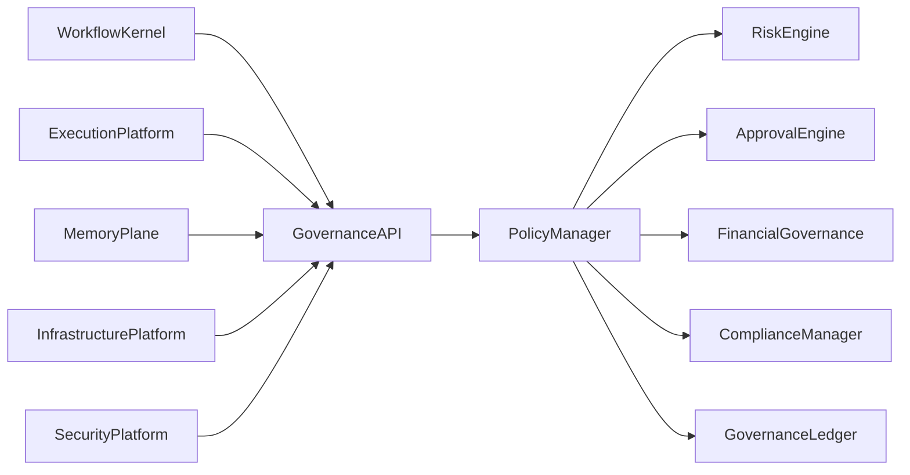
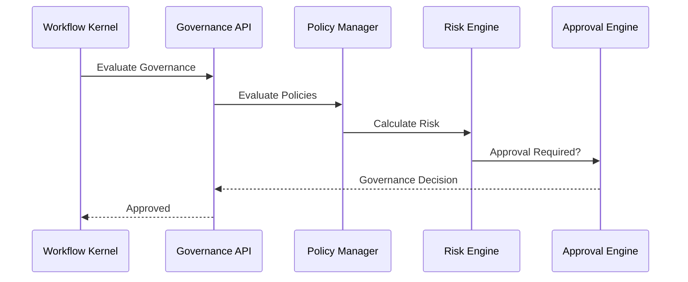

# Enterprise AI Software Factory
# Architecture Design Specification (ADS)

> **Document ID:** ADS-028-v3
>
> **Document Name:** Governance Platform — APIs, Events & Contracts
>
> **Version:** 2.0.0
>
> **Classification:** Enterprise Platform Plane
>
> **Importance:** CRITICAL
>
> **Depends On:** ADS-028-v1
>
> **Depends On:** ADS-028-v2
>
> **Next:** ADS-028-v4 — Runtime & Governance Infrastructure
>
---

# Executive Summary

The Governance Platform exposes standardized APIs for governance policy evaluation, approval management, compliance validation, financial governance, risk assessment, exception handling, and immutable governance records.

Every enterprise governance interaction occurs through these contracts.

Governance implementations may evolve.

Governance contracts remain stable.

---

# Communication Principles

Every governance request MUST satisfy

- Authenticated
- Authorized
- Versioned
- Observable
- Auditable
- Replayable
- Policy Compliant
- Tenant Isolated

No subsystem bypasses Governance.

---

# Governance Communication Architecture



The Policy Manager is the governance authority.

---

# Public REST API

The Governance Platform exposes APIs for

- Workflow Kernel
- Memory Plane
- Execution Platform
- Infrastructure Platform
- Security Platform
- Enterprise Dashboard
- Operations Portal
- CLI

---

## API-028-001

### Evaluate Governance

```http
POST /governance/v1/decisions
```

Purpose

Evaluates whether an operation satisfies enterprise governance requirements.

---

Request

```json
{
  "workflowId":"WF-2026-031",
  "action":"DEPLOY",
  "governanceContext":"GCTX-001"
}
```

---

Response

```json
{
  "decisionId":"GOV-2026-015",
  "decision":"Approved",
  "approvalRequired":false
}
```

---

## API-028-002

### Request Approval

```http
POST /governance/v1/approvals
```

Creates an approval request.

---

## API-028-003

### Resolve Approval

```http
POST /governance/v1/approvals/{approvalId}
```

Approves or rejects a pending request.

---

## API-028-004

### Evaluate Compliance

```http
POST /governance/v1/compliance
```

Evaluates compliance policies.

---

## API-028-005

### Request Exception

```http
POST /governance/v1/exceptions
```

Creates a governance exception request.

---

# Internal gRPC Services

```protobuf
service GovernanceService {

rpc EvaluateDecision(GovernanceRequest)
returns(GovernanceResponse);

rpc RequestApproval(ApprovalRequest)
returns(ApprovalResponse);

rpc ResolveApproval(ApprovalResolution)
returns(ApprovalResult);

rpc EvaluateCompliance(ComplianceRequest)
returns(ComplianceResponse);

rpc RequestException(ExceptionRequest)
returns(ExceptionResponse);

}
```

---

# Governance Context Schema

```protobuf
message GovernanceContext {

string context_id = 1;

string organization = 2;

string project = 3;

string workflow = 4;

string environment = 5;

string compliance_profile = 6;

double risk_score = 7;

}
```

---

# Governance Decision Schema

```protobuf
message GovernanceDecision {

string decision_id = 1;

string workflow_id = 2;

string decision = 3;

double risk_score = 4;

bool approval_required = 5;

string policy_version = 6;

}
```

---

# Approval Record Schema

```protobuf
message ApprovalRecord {

string approval_id = 1;

string governance_decision = 2;

string approval_level = 3;

string approver = 4;

string status = 5;

}
```

---

# MCP Tool Contracts

The Governance Platform exposes

```
evaluate_governance

request_approval

resolve_approval

evaluate_compliance

request_exception

governance_status

policy_catalog

governance_audit
```

Every invocation is authenticated and audited.

---

# Governance Events

Every governance operation emits immutable events.

---

## EVT-028-001

GovernanceContextCreated

---

## EVT-028-002

GovernanceDecisionGenerated

---

## EVT-028-003

ApprovalRequested

---

## EVT-028-004

ApprovalGranted

---

## EVT-028-005

ApprovalRejected

---

## EVT-028-006

ComplianceValidated

---

## EVT-028-007

ExceptionRequested

---

## EVT-028-008

ExceptionApproved

---

# Event Flow



---

# Event Ordering

```text
GovernanceContextCreated

↓

PolicyEvaluated

↓

RiskCalculated

↓

GovernanceDecisionGenerated

↓

ApprovalRequested

↓

ApprovalGranted
```

---

# Event Metadata

Every event contains

```yaml
eventId:
decisionId:
contextId:
approvalId:
workflowId:
traceId:
correlationId:
timestamp:
schemaVersion:
```

---

# End of Part 1
