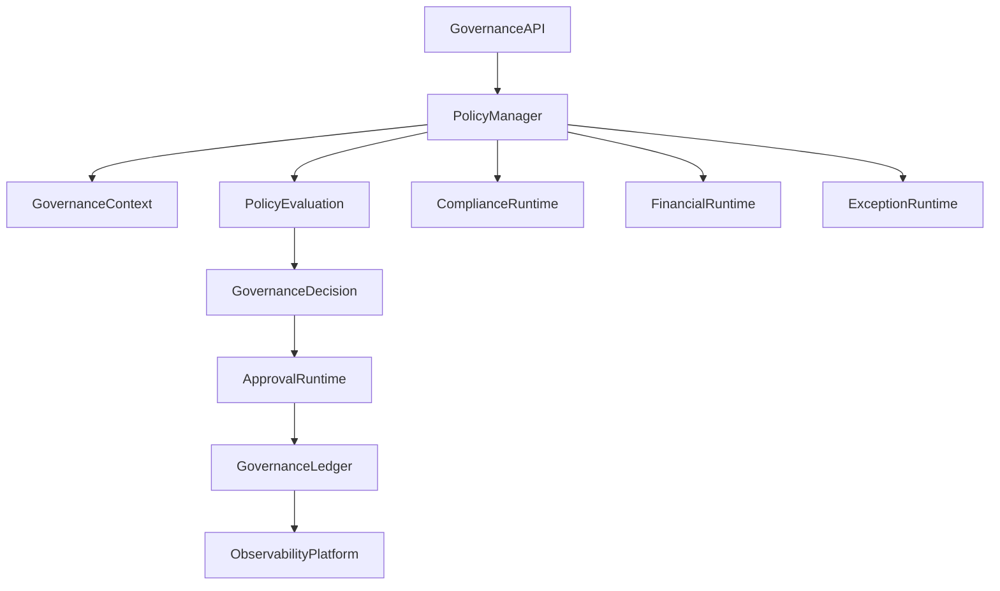

# Enterprise AI Software Factory
# Architecture Design Specification (ADS)

> **Document ID:** ADS-028-v4
>
> **Document Name:** Governance Platform — Runtime & Governance Infrastructure
>
> **Version:** 2.0.0
>
> **Classification:** Enterprise Runtime Specification
>
> **Importance:** CRITICAL
>
> **Depends On:** ADS-028-v1
>
> **Depends On:** ADS-028-v2
>
> **Depends On:** ADS-028-v3
>
> **Next:** ADS-028-v5 — End-to-End Governance Lifecycle
>
---

# Executive Summary

This document defines the runtime infrastructure responsible for continuously enforcing enterprise governance across workflows, agents, memory, infrastructure, security, and organizational operations.

Governance remains active throughout the entire execution lifecycle.

Policy compliance is continuously evaluated rather than checked only before execution.

---

# Runtime Philosophy

The Governance Runtime follows seven principles.

- Continuous Governance
- Policy First
- Human Accountability
- Financial Awareness
- Continuous Compliance
- Immutable Governance
- Explainable Decisions

Governance remains active throughout execution.

---

# Runtime Layers

## Policy Runtime

Responsible for

- Policy Evaluation
- Policy Distribution
- Policy Versioning
- Policy Enforcement

---

## Approval Runtime

Responsible for

- Approval Workflows
- Escalations
- Expirations
- Delegations

---

## Compliance Runtime

Responsible for

- Regulatory Validation
- Continuous Compliance
- Audit Controls
- Retention Validation

---

## Financial Runtime

Responsible for

- Budget Monitoring
- Spending Controls
- Cost Thresholds
- Chargeback Policies

---

## Exception Runtime

Responsible for

- Exception Requests
- Exception Expiration
- Compensating Controls
- Periodic Reviews

---

# Runtime Architecture



Every governance operation becomes part of the Governance Ledger.

---

# Runtime Components

| Component | Responsibility |
|------------|----------------|
| Policy Runtime | Policy enforcement |
| Approval Runtime | Human approvals |
| Compliance Runtime | Continuous compliance |
| Financial Runtime | Budget enforcement |
| Exception Runtime | Exception lifecycle |
| Governance Ledger | Immutable governance history |
| Runtime Monitor | Governance health |
| Notification Service | Approval notifications |

---

# Governance Runtime Pipeline

```text
Incoming Request

↓

Governance Context

↓

Policy Evaluation

↓

Compliance Validation

↓

Financial Evaluation

↓

Approval Evaluation

↓

Governance Decision

↓

Governance Ledger
```

Every governed action follows this lifecycle.

---

# Runtime Monitoring

The runtime continuously monitors

- Active Policies
- Pending Approvals
- Budget Utilization
- Compliance Status
- Exception Expirations
- Governance Violations
- Organizational Risk

Governance monitoring never stops.

---

# Governance Context Loading

Before evaluation

The runtime loads

- Organization
- Business Unit
- Workflow
- Policy Set
- Compliance Profile
- Budget Profile
- Risk Profile

Evaluation begins after validation succeeds.

---

# Approval Runtime

Approval Runtime manages

- Approval Requests
- Escalations
- Delegations
- Expirations
- Revocations

Approvals remain fully auditable.

---

# Runtime Guarantees

The Governance Platform guarantees

- Continuous Governance
- Immutable Governance History
- Continuous Compliance
- Policy Version Control
- Financial Controls
- Human Oversight
- Deterministic Governance

---

# End of Part 1
