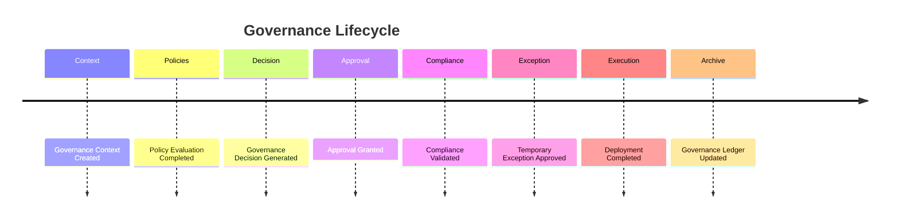

# Enterprise AI Software Factory
# Architecture Design Specification (ADS)

> **Document ID:** ADS-028-v5
>
> **Document Name:** Governance Platform — End-to-End Governance Lifecycle
>
> **Version:** 2.0.0
>
> **Classification:** Reference Implementation
>
> **Importance:** CRITICAL
>
> **Depends On:** ADS-028-v1
>
> **Depends On:** ADS-028-v2
>
> **Depends On:** ADS-028-v3
>
> **Depends On:** ADS-028-v4
>
---

# Executive Summary

This document demonstrates how the Governance Platform evaluates, approves, governs, monitors, and archives a complete enterprise engineering workflow.

It illustrates how Governance Contexts, Policy Evaluation Records, Governance Decisions, Approval Records, Exception Records, Governance Ledger Entries, and Governance Snapshots interact throughout a real organizational process.

Every governance decision is deterministic.

Every approval is traceable.

Every organizational action is auditable.

---

# Scenario

An engineering team submits a request

```
Deploy a new production payment platform
serving regulated customer data.
```

The request activates

- Workflow Kernel
- Identity Plane
- Memory Plane
- Agent Execution Platform
- Compute Platform
- Security Platform
- Observability Platform
- Governance Platform

---

# Stage 1 — Governance Context

The Governance Platform builds

```
GCTX-2026-001
```

Contains

- Organization
- Business Unit
- Project
- Workflow
- Environment
- Applicable Policies
- Compliance Profile
- Financial Profile
- Risk Profile

Governance Context becomes immutable.

---

# Stage 2 — Policy Evaluation

Policy Manager evaluates

```
Enterprise Policy Set
v4.2
```

Evaluated

- Deployment Policies
- Security Policies
- Financial Policies
- Compliance Policies
- Production Controls

Generated

```
PE-2026-011
```

Policy Evaluation Record.

---

# Stage 3 — Risk Assessment

Calculated

```
Risk Score: 41
```

Business impact

```
Medium
```

Operational impact

```
Medium
```

Compliance impact

```
High
```

---

# Stage 4 — Financial Governance

Estimated deployment cost

```
$8,250
```

Budget availability

```
Approved
```

Department budget remains within policy.

---

# Stage 5 — Governance Decision

Generated

```
GOV-2026-021
```

Decision

```
Approval Required
```

Reason

```
Production deployment of regulated workload.
```

Governance Decision becomes immutable.

---

# Stage 6 — Approval Workflow

Approval request

```
APR-2026-006
```

Approval Level

```
Department
```

Approvers

- Engineering Director
- Security Manager

Approval granted.

Approval Record archived.

---

# Stage 7 — Compliance Validation

Compliance Runtime validates

- GDPR
- SOC 2
- PCI DSS

All required controls satisfied.

Execution permitted.

---

# Stage 8 — Exception Handling

Deployment requests temporary policy exception.

Generated

```
EXC-2026-002
```

Reason

```
Temporary maintenance window.
```

Exception expires automatically after deployment.

---

# Stage 9 — Governance Snapshot

Generated

```
GSNAP-2026-004
```

Snapshot includes

- Active Policies
- Pending Approvals
- Governance Health
- Financial Health
- Organizational Risk

Snapshot archived.

---

# Stage 10 — Governance Ledger

Runtime writes

```
GL-2026-018
```

Governance Ledger Entry references

- Governance Context
- Policy Evaluation Record
- Governance Decision
- Approval Record
- Exception Record
- Workflow
- Execution Plan

Entry becomes immutable.

---

# Stage 11 — Runtime Monitoring

Governance Runtime continuously evaluates

- Compliance
- Budget
- Policy Changes
- Exception Expiration

No governance violations detected.

---

# Stage 12 — Workflow Completion

Deployment completes successfully.

Temporary exception expires.

Approval lifecycle closes.

Governance artifacts remain archived.

---

# Governance Timeline



---

# Governance Event Stream

```text
GovernanceContextCreated

↓

PolicyEvaluated

↓

RiskCalculated

↓

FinancialEvaluationCompleted

↓

GovernanceDecisionGenerated

↓

ApprovalRequested

↓

ApprovalGranted

↓

ComplianceValidated

↓

ExceptionApproved

↓

GovernanceLedgerWritten

↓

WorkflowCompleted
```

---

# Produced Artifacts

| Artifact | Identifier |
|-----------|------------|
| Governance Context | GCTX-2026-001 |
| Policy Evaluation Record | PE-2026-011 |
| Governance Decision | GOV-2026-021 |
| Approval Record | APR-2026-006 |
| Exception Record | EXC-2026-002 |
| Governance Snapshot | GSNAP-2026-004 |
| Governance Ledger Entry | GL-2026-018 |

---

# Runtime Metrics

| Metric | Value |
|---------|------:|
| Governance Decisions | 84 |
| Policy Evaluations | 231 |
| Approval Requests | 17 |
| Exception Requests | 3 |
| Governance Snapshots | 48 |
| Average Risk Score | 29 |
| Average Approval Time | 3.6 min |
| Compliance Success Rate | 100% |

---

# Operational Readiness Scorecard

| Capability | Status |
|------------|--------|
| Governance Context | ✅ Verified |
| Policy Evaluation | ✅ Verified |
| Governance Decisions | ✅ Verified |
| Approval Records | ✅ Verified |
| Exception Records | ✅ Verified |
| Governance Snapshots | ✅ Verified |
| Governance Ledger | ✅ Verified |
| Continuous Governance | ✅ Verified |

---

# Lessons Learned

The Governance Platform demonstrates the following principles.

- Governance Contexts provide deterministic organizational inputs.
- Policy Evaluation Records explain why governance decisions were reached.
- Governance Decisions capture the authoritative organizational outcome.
- Approval Records document organizational authorization independently from policy evaluation.
- Exception Records provide controlled, auditable deviations from standard governance.
- Governance Snapshots capture organization-wide governance health at specific points in time.
- Governance Ledger Entries create a permanent, replayable governance history.

---

# Architecture Decision Record

## ADR-028-12

### Decision

Represent enterprise governance as a deterministic lifecycle built from immutable governance artifacts.

### Status

Accepted

### Reason

Artifact-centric governance improves organizational accountability, compliance, auditability, explainability, and enterprise-scale operational consistency.

---

# Technology Decision Record

## TDR-028-06

### Technology

Enterprise Governance Platform

### Decision

Implement a centralized Governance Platform responsible for policy evaluation, approval workflows, compliance validation, financial governance, exception management, and immutable governance history.

### Reason

A unified Governance Platform ensures consistent organizational oversight across workflows, memory, execution, infrastructure, security, observability, and future platform services while preserving deterministic governance behavior.

---

# Related Documents

ADS-021-v5 — Workflow Kernel

ADS-022-v5 — Identity & Trust Plane

ADS-023-v5 — Enterprise Memory Plane

ADS-024-v5 — Agent Execution Platform

ADS-025-v5 — Compute & Infrastructure Platform

ADS-026-v5 — Security Platform

ADS-027-v5 — Observability Platform

ADS-028-v1 — Governance Platform

ADS-028-v2 — Governance Algorithms & Policy Framework

ADS-028-v3 — APIs, Events & Contracts

ADS-028-v4 — Runtime & Governance Infrastructure

---

# End of Document
