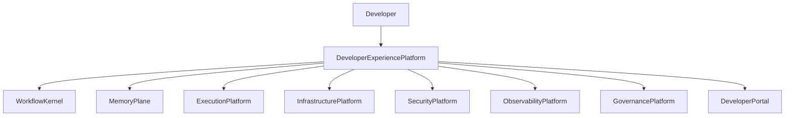
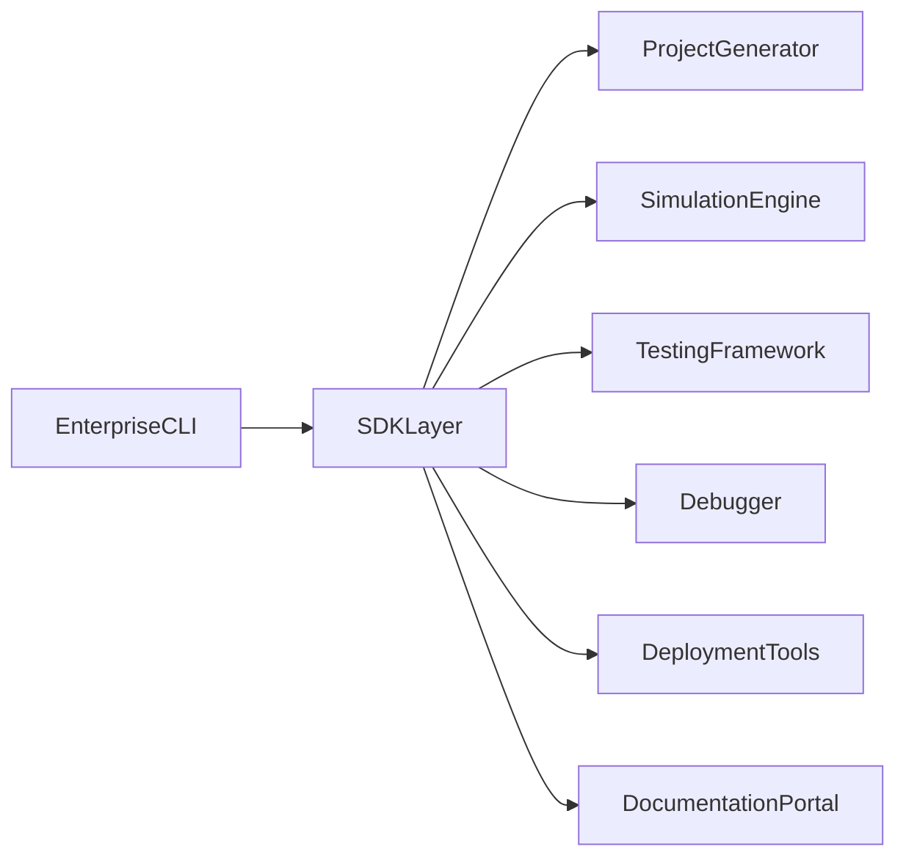

# Architecture Design Specification (ADS)

> **Document ID:** ADS-029-v1
>
> **Document Name:** Developer Experience Platform — Architecture
>
> **Version:** 2.0.0
>
> **Classification:** Enterprise Platform Plane
>
> **Importance:** HIGH
>
> **Depends On:** ADS-021-v5
>
> **Depends On:** ADS-022-v5
>
> **Depends On:** ADS-023-v5
>
> **Depends On:** ADS-024-v5
>
> **Depends On:** ADS-025-v5
>
> **Depends On:** ADS-026-v5
>
> **Depends On:** ADS-027-v5
>
> **Depends On:** ADS-028-v5
>
> **Next:** ADS-029-v2 — Developer Workflow Algorithms & Tooling

---

# Executive Summary

The Developer Experience Platform provides a unified engineering environment for designing, developing, testing, debugging, simulating, packaging, and deploying solutions on the Enterprise AI Software Factory.

Rather than exposing individual platform services directly, the Developer Experience Platform provides a cohesive developer workflow that accelerates adoption, improves productivity, and enforces platform standards.

The Developer Experience Platform provides

- Enterprise CLI
- SDKs
- Local Development Environment
- Workflow Simulation
- Agent Debugging
- Project Templates
- Plugin Development
- Testing Framework
- Deployment Tooling
- Developer Portal

---

# Why This System Exists

Enterprise platforms succeed when developers can build efficiently.

The Developer Experience Platform enables

- rapid onboarding
- standardized projects
- local testing
- repeatable builds
- simplified debugging
- reliable deployments
- consistent engineering practices

Every developer interacts with the platform through DX.

---

# Core Philosophy

Build Faster.

Debug Smarter.

Test Earlier.

Deploy Safely.

Standardize Everything.

---

# Design Goals

The Developer Experience Platform provides

- Enterprise CLI
- Language SDKs
- Project Scaffolding
- Local Runtime
- Simulation Engine
- Debugging Tools
- Testing Infrastructure
- Plugin SDK
- Deployment Integration
- Documentation Portal

---

# Architectural Position



DX becomes the primary developer entry point.

---

# High-Level Architecture



Every developer workflow begins through the SDK layer.

---

# Major Components

| Component | Responsibility |
|------------|----------------|
| Enterprise CLI | Developer commands |
| SDK Layer | Platform APIs |
| Project Generator | Project scaffolding |
| Simulation Engine | Local workflow execution |
| Testing Framework | Automated testing |
| Debugger | Agent and workflow debugging |
| Deployment Tools | Build and release |
| Plugin SDK | Extensions |
| Documentation Portal | Developer guidance |

---

# Developer Domains

| Domain | Purpose |
|---------|----------|
| CLI | Platform interaction |
| SDKs | Language integration |
| Templates | Project generation |
| Simulation | Local execution |
| Testing | Validation |
| Debugging | Diagnostics |
| Deployment | Release workflows |
| Documentation | Knowledge sharing |

Each domain is independently extensible.

---

# Developer Journey

```text
Initialize Project

↓

Develop

↓

Simulate

↓

Test

↓

Debug

↓

Package

↓

Deploy

↓

Monitor
```

Every workflow follows this lifecycle.

---

# DX Principles

The Developer Experience Platform follows

- Convention over Configuration
- Secure by Default
- Local First
- Automation First
- Reproducible Builds
- Observable Development
- Consistent Tooling

---

# Architecture Decision Records

## ADR-029-01

### Decision

Provide a unified Developer Experience Platform rather than disconnected tools.

### Status

Accepted

### Reason

A cohesive developer workflow reduces onboarding time and improves engineering consistency.

---

## ADR-029-02

### Decision

Standardize project creation through templates and generators.

### Status

Accepted

### Reason

Templates reduce configuration drift and encourage best practices.

---

# Operational Readiness Scorecard

| Capability | Status |
|------------|--------|
| Enterprise CLI | ✅ Required |
| SDK Layer | ✅ Required |
| Project Templates | ✅ Required |
| Local Simulation | ✅ Required |
| Testing Framework | ✅ Required |
| Debugging Tools | ✅ Required |
| Deployment Integration | ✅ Required |
| Documentation Portal | ✅ Required |

---

# Version Roadmap

| Version | Description |
|----------|-------------|
| v1 | Architecture |
| v2 | Developer Workflow Algorithms & Tooling |
| v3 | APIs, Events & Contracts |
| v4 | Runtime & Developer Infrastructure |
| v5 | End-to-End Developer Lifecycle |

---

# Related Documents

ADS-021-v5 — Workflow Kernel

ADS-022-v5 — Identity & Trust Plane

ADS-023-v5 — Enterprise Memory Plane

ADS-024-v5 — Agent Execution Platform

ADS-025-v5 — Compute & Infrastructure Platform

ADS-026-v5 — Security Platform

ADS-027-v5 — Observability Platform

ADS-028-v5 — Governance Platform

---

# Next Document

**ADS-029-v2 — Developer Workflow Algorithms & Tooling**

This document defines project scaffolding algorithms, local simulation, debugging workflows, testing orchestration, deployment pipelines, SDK behaviors, and developer productivity tooling.

---

# End of Document
