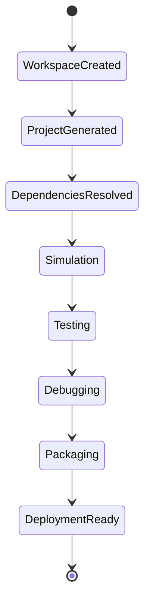

# Architecture Design Specification (ADS)

> **Document ID:** ADS-029-v2
>
> **Document Name:** Developer Experience Platform — Developer Workflow Algorithms & Tooling
>
> **Version:** 2.0.0
>
> **Classification:** Enterprise Platform Plane
>
> **Importance:** HIGH
>
> **Depends On:** ADS-029-v1
>
> **Next:** ADS-029-v3 — APIs, Events & Contracts
>
---

# Executive Summary

This document defines the algorithms responsible for project scaffolding, workspace management, local simulation, workflow debugging, automated testing, packaging, deployment preparation, and developer productivity tooling.

Every developer workflow is deterministic.

Every generated project is reproducible.

Every development environment is versioned.

---

# Design Philosophy

The Developer Experience Platform follows six principles.

- Local First
- Convention over Configuration
- Reproducible Environments
- Fast Feedback
- Automation First
- Observable Development

Developer workflows should minimize manual configuration.

---

# Developer Workflow Pipeline

```text
Workspace Creation

↓

Project Generation

↓

Dependency Resolution

↓

Simulation

↓

Testing

↓

Debugging

↓

Packaging

↓

Deployment Preparation
```

Every project follows this lifecycle.

---

# Developer Workspace

Every developer operates inside a versioned Developer Workspace.

```yaml
developerWorkspace:

  workspaceId:

  developer:

  organization:

  project:

  sdkVersion:

  cliVersion:

  runtimeProfile:

  simulationProfile:

  activePlugins:

  environment:

  createdAt:

  lastSynchronized:
```

Developer Workspaces remain reproducible.

---

# ALG-029-001

## Workspace Initialization

Workspace initialization configures

- SDK Version
- CLI Version
- Runtime Profile
- Active Plugins
- Environment Variables
- Organization Policies

Initialization is deterministic.

---

# ALG-029-002

## Project Generation

The Project Generator creates

- Directory Structure
- Configuration Files
- Sample Workflows
- Agent Templates
- Test Templates
- CI Configuration

Generated projects follow enterprise standards.

---

# Project Templates

Supported templates

| Template | Purpose |
|----------|----------|
| Workflow Service | Workflow applications |
| Agent Package | AI agents |
| MCP Server | Tool providers |
| Enterprise API | Backend services |
| Plugin | Platform extensions |
| Full Platform | Complete solution |

Templates remain versioned.

---

# ALG-029-003

## Dependency Resolution

The platform resolves

- SDK Packages
- Plugins
- Runtime Dependencies
- Model Connectors
- Infrastructure Profiles

Resolution is deterministic.

---

# ALG-029-004

## Local Simulation

Simulation evaluates

- Workflow Execution
- Agent Collaboration
- Memory Operations
- Tool Calls
- Infrastructure Requests

Simulation never affects production systems.

---

# Simulation Profiles

| Profile | Purpose |
|---------|----------|
| Fast | Rapid iteration |
| Standard | Functional validation |
| Full | Production-like execution |
| Chaos | Failure injection |

Simulation profiles remain configurable.

---

# ALG-029-005

## Debug Session

Debugging supports

- Breakpoints
- Step Execution
- State Inspection
- Agent Inspection
- Workflow Replay
- Variable Inspection

Debug sessions remain isolated.

---

# End of Part 1

# ALG-029-006

## Testing Orchestration

The Testing Framework coordinates

- Unit Tests
- Integration Tests
- Workflow Tests
- Agent Tests
- Security Tests
- Performance Tests
- End-to-End Tests

Testing executes automatically according to project configuration.

---

# ALG-029-007

## Packaging

Packaging prepares

- Workflow Bundles
- Agent Packages
- Plugin Packages
- Deployment Manifests
- Container Images
- Documentation

Packaging remains deterministic.

---

# ALG-029-008

## Deployment Preparation

Deployment preparation validates

- Project Configuration
- Dependencies
- Security Policies
- Governance Policies
- Infrastructure Profiles
- Build Artifacts

Deployment preparation never modifies production.

---

# Development Session

Every active engineering task creates a Development Session.

```yaml
developmentSession:

  sessionId:

  workspaceId:

  developer:

  activeBranch:

  activeWorkflow:

  debugSession:

  simulationRun:

  openedArtifacts:

  activePlugins:

  startedAt:

  lastActivity:
```

Development Sessions remain isolated from other developers.

---

# Testing Matrix

| Test Type | Purpose |
|-----------|----------|
| Unit | Component validation |
| Integration | Service interaction |
| Workflow | Workflow execution |
| Agent | Agent behavior |
| Security | Policy verification |
| Performance | Scalability |
| End-to-End | Complete system validation |

Every project defines a testing strategy.

---

# Build Profiles

Supported profiles

| Profile | Purpose |
|---------|----------|
| Development | Fast local iteration |
| Debug | Enhanced diagnostics |
| Staging | Pre-production validation |
| Production | Release builds |

Profiles remain reproducible.

---

# Developer State Machine



Every engineering workflow follows this lifecycle.

---

# CLI Commands

Standard commands

```text
platform init

platform simulate

platform test

platform debug

platform package

platform deploy --dry-run

platform doctor

platform plugin install
```

CLI behavior remains consistent across SDKs.

---

# Developer Metrics

```text
workspace_initialization_seconds

project_generation_total

simulation_runs_total

debug_sessions_total

test_execution_seconds

package_generation_total

deployment_preparation_total

developer_feedback_latency

workspace_sync_total

plugin_installations_total
```

---

# Structured Logging

Example

```json
{
  "workspaceId":"WS-104",
  "sessionId":"DEV-220",
  "project":"payment-platform",
  "simulationProfile":"Full",
  "testsPassed":148,
  "packageReady":true,
  "timestamp":"2026-08-15T14:11:23Z"
}
```

Logs remain reproducible and correlated.

---

# Architecture Decision Records

## ADR-029-03

### Decision

Represent reproducible environments as Developer Workspaces.

### Status

Accepted

### Reason

Versioned workspaces eliminate configuration drift and simplify onboarding.

---

## ADR-029-04

### Decision

Represent active engineering activity as Development Sessions.

### Status

Accepted

### Reason

Separating persistent environments from active work improves collaboration, replayability, and diagnostics.

---

## ADR-029-05

### Decision

Standardize all project creation through versioned templates.

### Status

Accepted

### Reason

Standardized templates improve consistency, maintainability, and enterprise governance.

---

# Operational Readiness Scorecard

| Capability | Status |
|------------|--------|
| Developer Workspaces | ✅ Required |
| Development Sessions | ✅ Required |
| Local Simulation | ✅ Required |
| Automated Testing | ✅ Required |
| Debugging | ✅ Required |
| Deterministic Packaging | ✅ Required |
| Deployment Preparation | ✅ Required |
| Versioned Templates | ✅ Required |

---

# Related Documents

ADS-021-v5 — Workflow Kernel

ADS-022-v5 — Identity & Trust Plane

ADS-023-v5 — Enterprise Memory Plane

ADS-024-v5 — Agent Execution Platform

ADS-025-v5 — Compute & Infrastructure Platform

ADS-026-v5 — Security Platform

ADS-027-v5 — Observability Platform

ADS-028-v5 — Governance Platform

ADS-029-v1 — Developer Experience Platform

ADS-029-v3 — APIs, Events & Contracts

---

# End of Document
