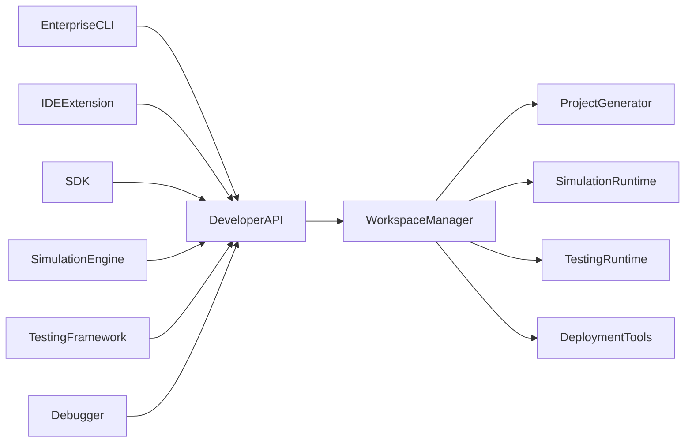
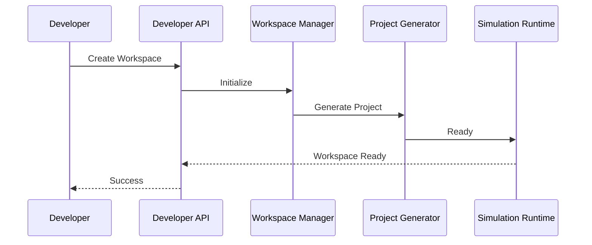

# Architecture Design Specification (ADS)

> **Document ID:** ADS-029-v3
>
> **Document Name:** Developer Experience Platform — APIs, Events & Contracts
>
> **Version:** 2.0.0
>
> **Classification:** Enterprise Platform Plane
>
> **Importance:** HIGH
>
> **Depends On:** ADS-029-v1
>
> **Depends On:** ADS-029-v2
>
> **Next:** ADS-029-v4 — Runtime & Developer Infrastructure
>
---

# Executive Summary

The Developer Experience Platform exposes standardized APIs for workspace management, project generation, local simulation, debugging, testing, packaging, deployment preparation, plugin development, and developer tooling.

Every developer interaction with the Enterprise AI Software Factory occurs through these contracts.

Developer tooling may evolve.

Developer contracts remain stable.

---

# Communication Principles

Every developer request MUST satisfy

- Authenticated
- Authorized
- Versioned
- Observable
- Reproducible
- Secure
- Replayable
- Tenant Isolated

No developer tool bypasses the DX Platform.

---

# Developer Communication Architecture



The Workspace Manager coordinates all developer operations.

---

# Public REST API

The Developer Experience Platform exposes APIs for

- Enterprise CLI
- SDKs
- IDE Extensions
- Simulation Engine
- Testing Framework
- Debugger
- Deployment Tools
- Developer Portal

## API-029-001

### Create Workspace

```http
POST /developer/v1/workspaces
```

Purpose

Creates a reproducible Developer Workspace.

---

Request

```json
{
  "organization":"Acme",
  "project":"payment-platform",
  "template":"workflow-service"
}
```

---

Response

```json
{
  "workspaceId":"WS-104",
  "status":"Created"
}
```

---

## API-029-002

### Generate Project

```http
POST /developer/v1/projects
```

Creates a new project from a template.

---

## API-029-003

### Start Simulation

```http
POST /developer/v1/simulations
```

Starts a local workflow simulation.

---

## API-029-004

### Start Debug Session

```http
POST /developer/v1/debug
```

Creates a Development Session for debugging.

---

## API-029-005

### Prepare Build

```http
POST /developer/v1/build
```

Generates a Build Manifest.

---

# Internal gRPC Services

```protobuf
service DeveloperService {

rpc CreateWorkspace(WorkspaceRequest)
returns(WorkspaceResponse);

rpc GenerateProject(ProjectRequest)
returns(ProjectResponse);

rpc StartSimulation(SimulationRequest)
returns(SimulationResponse);

rpc StartDebugSession(DebugRequest)
returns(DebugResponse);

rpc PrepareBuild(BuildRequest)
returns(BuildResponse);

}
```

---

# Developer Workspace Schema

```protobuf
message DeveloperWorkspace {

string workspace_id = 1;

string organization = 2;

string project = 3;

string sdk_version = 4;

string cli_version = 5;

}
```

---

# Development Session Schema

```protobuf
message DevelopmentSession {

string session_id = 1;

string workspace_id = 2;

string active_branch = 3;

string simulation_profile = 4;

string debug_mode = 5;

}
```

---

# Build Manifest Schema

```protobuf
message BuildManifest {

string manifest_id = 1;

string workspace_id = 2;

string source_revision = 3;

string build_profile = 4;

repeated string generated_artifacts = 5;

}
```

---

# MCP Tool Contracts

The Developer Experience Platform exposes

```
create_workspace

generate_project

start_simulation

start_debug_session

prepare_build

run_tests

package_project

developer_diagnostics
```

Every invocation is authenticated and observable.

---

# Developer Events

Every developer operation emits immutable events.

## EVT-029-001

WorkspaceCreated

---

## EVT-029-002

ProjectGenerated

---

## EVT-029-003

SimulationStarted

---

## EVT-029-004

DebugSessionStarted

---

## EVT-029-005

TestsExecuted

---

## EVT-029-006

BuildPrepared

---

## EVT-029-007

PackageGenerated

---

## EVT-029-008

DeploymentPrepared

---

# Event Flow



---

# Event Ordering

```text
WorkspaceCreated

↓

ProjectGenerated

↓

DependenciesResolved

↓

SimulationStarted

↓

TestsExecuted

↓

BuildPrepared

↓

DeploymentPrepared
```

---

# Event Metadata

Every event contains

```yaml
eventId:
workspaceId:
sessionId:
buildManifest:
developer:
traceId:
timestamp:
schemaVersion:
```

---

# End of Part 1
