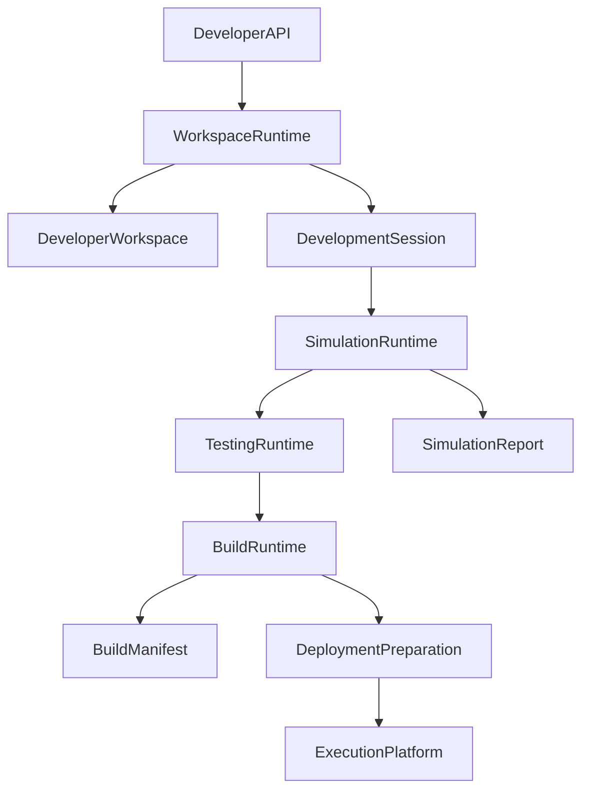

# Architecture Design Specification (ADS)

> **Document ID:** ADS-029-v4
>
> **Document Name:** Developer Experience Platform — Runtime & Developer Infrastructure
>
> **Version:** 2.0.0
>
> **Classification:** Enterprise Runtime Specification
>
> **Importance:** HIGH
>
> **Depends On:** ADS-029-v1
>
> **Depends On:** ADS-029-v2
>
> **Depends On:** ADS-029-v3
>
> **Next:** ADS-029-v5 — End-to-End Developer Lifecycle
>
---

# Executive Summary

This document defines the runtime infrastructure responsible for managing developer workspaces, simulations, testing, debugging, packaging, deployment preparation, SDK execution, plugin isolation, and developer tooling.

The runtime continuously provides reproducible engineering environments while remaining isolated from production infrastructure.

Developer operations never modify production resources unless explicitly authorized.

---

# Runtime Philosophy

The Developer Runtime follows seven principles.

- Local First
- Reproducible Environments
- Fast Feedback
- Safe Experimentation
- Deterministic Builds
- Observable Development
- Plugin Isolation

Developer productivity must never compromise platform integrity.

---

# Runtime Layers

## Workspace Runtime

Responsible for

- Workspace Initialization
- Workspace Synchronization
- Environment Management
- Version Management

---

## Simulation Runtime

Responsible for

- Workflow Simulation
- Agent Execution
- Memory Simulation
- Infrastructure Simulation

---

## Testing Runtime

Responsible for

- Test Scheduling
- Parallel Execution
- Coverage Analysis
- Test Reporting

---

## Debug Runtime

Responsible for

- Breakpoints
- Variable Inspection
- Workflow Replay
- Agent State Inspection

---

## Build Runtime

Responsible for

- Packaging
- Artifact Generation
- Build Validation
- Manifest Generation

---

# Runtime Architecture



Developer Runtime remains isolated from production execution until deployment preparation completes.

---

# Runtime Components

| Component | Responsibility |
|------------|----------------|
| Workspace Runtime | Workspace lifecycle |
| Simulation Runtime | Local execution |
| Testing Runtime | Test orchestration |
| Debug Runtime | Interactive debugging |
| Build Runtime | Packaging and builds |
| Plugin Runtime | Plugin isolation |
| SDK Runtime | SDK execution |
| Runtime Monitor | Developer runtime health |

---

# Developer Runtime Pipeline

```text
Workspace

↓

Development Session

↓

Simulation

↓

Testing

↓

Debugging

↓

Packaging

↓

Build Manifest

↓

Deployment Preparation
```

Every engineering workflow follows this runtime pipeline.

---

# Workspace Runtime

Workspace Runtime manages

- Workspace Creation
- Environment Synchronization
- Dependency Resolution
- SDK Updates
- Plugin Registration

Workspaces remain reproducible.

---

# Simulation Runtime

Simulation Runtime executes

- Workflow Logic
- Agent Collaboration
- Tool Calls
- Memory Operations
- Infrastructure Emulation

Simulation remains isolated from production.

---

# Development Session Management

Every active session tracks

- Active Workspace
- Current Branch
- Open Artifacts
- Running Simulations
- Active Debuggers
- Pending Builds

Sessions remain isolated per developer.

---

# Runtime Guarantees

The Developer Runtime guarantees

- Workspace Isolation
- Deterministic Simulation
- Reproducible Builds
- Plugin Isolation
- Fast Local Feedback
- Safe Deployment Preparation
- Version Consistency

---

# End of Part 1
