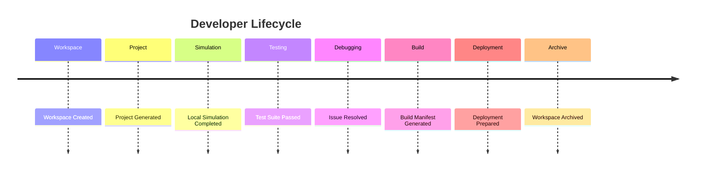

# Enterprise AI Software Factory
# Architecture Design Specification (ADS)

> **Document ID:** ADS-029-v5
>
> **Document Name:** Developer Experience Platform — End-to-End Developer Lifecycle
>
> **Version:** 2.0.0
>
> **Classification:** Reference Implementation
>
> **Importance:** HIGH
>
> **Depends On:** ADS-029-v1
>
> **Depends On:** ADS-029-v2
>
> **Depends On:** ADS-029-v3
>
> **Depends On:** ADS-029-v4
>
---

# Executive Summary

This document demonstrates how the Developer Experience Platform supports an engineer through a complete software delivery lifecycle—from workspace creation to deployment preparation.

It illustrates how Developer Workspaces, Development Sessions, Build Manifests, Simulation Reports, Workspace Snapshots, and Developer Activity Records work together to create a deterministic and reproducible engineering workflow.

Every workspace is reproducible.

Every build is deterministic.

Every engineering action is traceable.

---

# Scenario

An engineer creates a new enterprise payment platform.

The workflow uses

- Workflow Kernel
- Memory Plane
- Agent Execution Platform
- Compute Platform
- Security Platform
- Observability Platform
- Governance Platform
- Developer Experience Platform

---

# Stage 1 — Workspace Creation

Developer creates

```
WS-2026-001
```

Workspace contains

- SDK Version
- CLI Version
- Runtime Profile
- Plugin Set
- Organization Policies

Workspace becomes reproducible.

---

# Stage 2 — Project Generation

Template selected

```
Workflow Service
```

Generated

- Directory Structure
- Configuration
- Sample Workflows
- CI Pipeline
- Test Suite

Project generation completes successfully.

---

# Stage 3 — Development Session

Generated

```
DEV-2026-014
```

Tracks

- Active Branch
- Open Files
- Debug Session
- Simulation Profile

Development Session remains isolated.

---

# Stage 4 — Local Simulation

Simulation profile

```
Full
```

Simulation validates

- Workflow Execution
- Agent Collaboration
- Memory Operations
- Tool Calls

Generated

```
SIM-2026-006
```

Simulation Report archived.

---

# Stage 5 — Testing

Executed

- Unit Tests
- Integration Tests
- Workflow Tests
- Security Tests
- Performance Tests

Results

```
148 / 148 Passed
```

Testing succeeds.

---

# Stage 6 — Debugging

Developer investigates a failed edge case.

Debugger provides

- Breakpoints
- Variable Inspection
- Workflow Replay
- Agent State Inspection

Issue resolved.

---

# Stage 7 — Build Manifest

Generated

```
BUILD-2026-019
```

Manifest includes

- Source Revision
- Dependency Versions
- Build Profile
- Generated Artifacts

Manifest becomes immutable.

---

# Stage 8 — Workspace Snapshot

Generated

```
WSNAP-2026-003
```

Snapshot captures

- Runtime State
- Active Plugins
- Open Artifacts
- Environment Variables

Snapshot archived.

---

# Stage 9 — Deployment Preparation

Validation succeeds

- Security Policies
- Governance Policies
- Infrastructure Profiles
- Build Integrity

Deployment package prepared.

---

# Stage 10 — Developer Activity Record

Generated

```
DAR-2026-010
```

Records

- Build
- Simulation
- Testing
- Packaging
- Deployment Preparation

Developer Activity Record becomes immutable.

---

# Stage 11 — Deployment Handoff

Deployment package transferred to the Execution Platform.

Runtime validation succeeds.

Deployment approved.

---

# Stage 12 — Archive

Artifacts archived

- Developer Workspace
- Development Session
- Build Manifest
- Simulation Report
- Workspace Snapshot
- Developer Activity Record

Engineering history remains reproducible.

---

# Developer Timeline



---

# Developer Event Stream

```text
WorkspaceCreated

↓

ProjectGenerated

↓

DevelopmentSessionStarted

↓

SimulationCompleted

↓

TestsExecuted

↓

DebugSessionCompleted

↓

BuildPrepared

↓

WorkspaceSnapshotCreated

↓

DeploymentPrepared

↓

DeveloperActivityRecorded
```

---

# Produced Artifacts

| Artifact | Identifier |
|-----------|------------|
| Developer Workspace | WS-2026-001 |
| Development Session | DEV-2026-014 |
| Build Manifest | BUILD-2026-019 |
| Simulation Report | SIM-2026-006 |
| Workspace Snapshot | WSNAP-2026-003 |
| Developer Activity Record | DAR-2026-010 |

---

# Runtime Metrics

| Metric | Value |
|---------|------:|
| Workspaces Created | 412 |
| Simulations Executed | 1,287 |
| Tests Executed | 18,932 |
| Build Success Rate | 99.4% |
| Average Simulation Time | 24 s |
| Average Build Time | 2.8 min |
| Workspace Restorations | 15 |
| Plugin Installations | 203 |

---

# Operational Readiness Scorecard

| Capability | Status |
|------------|--------|
| Developer Workspace | ✅ Verified |
| Development Session | ✅ Verified |
| Simulation Reports | ✅ Verified |
| Build Manifest | ✅ Verified |
| Workspace Snapshots | ✅ Verified |
| Developer Activity Records | ✅ Verified |
| Deterministic Builds | ✅ Verified |
| Deployment Preparation | ✅ Verified |

---

# Lessons Learned

The Developer Experience Platform demonstrates the following principles.

- Developer Workspaces provide reproducible engineering environments.
- Development Sessions capture active engineering context without affecting reproducibility.
- Simulation Reports validate workflow behavior before deployment.
- Build Manifests provide deterministic packaging and artifact verification.
- Workspace Snapshots enable rapid recovery and collaborative debugging.
- Developer Activity Records preserve an immutable history of significant engineering actions.
- Standardized tooling improves onboarding, collaboration, and release quality.

---

# Architecture Decision Record

## ADR-029-09

### Decision

Represent developer workflows as a deterministic lifecycle composed of immutable engineering artifacts.

### Status

Accepted

### Reason

Artifact-centric development improves reproducibility, collaboration, debugging, auditability, and engineering consistency.

---

# Technology Decision Record

## TDR-029-06

### Technology

Unified Developer Experience Platform

### Decision

Implement a centralized Developer Experience Platform responsible for workspace management, simulation, testing, debugging, packaging, deployment preparation, and engineering tooling.

### Reason

A unified platform provides a consistent developer experience while integrating seamlessly with workflow execution, security, governance, observability, and deployment infrastructure.

---

# Related Documents

ADS-021-v5 — Workflow Kernel

ADS-022-v5 — Identity & Trust Plane

ADS-023-v5 — Enterprise Memory Plane

ADS-024-v5 — Agent Execution Platform

ADS-025-v5 — Compute & Infrastructure Platform

ADS-026-v5 — Security Platform

ADS-027-v5 — Observability Platform

ADS-028-v5 — Governance Platform

ADS-029-v1 — Developer Experience Platform

ADS-029-v2 — Developer Workflow Algorithms & Tooling

ADS-029-v3 — APIs, Events & Contracts

ADS-029-v4 — Runtime & Developer Infrastructure

---

# End of Document
