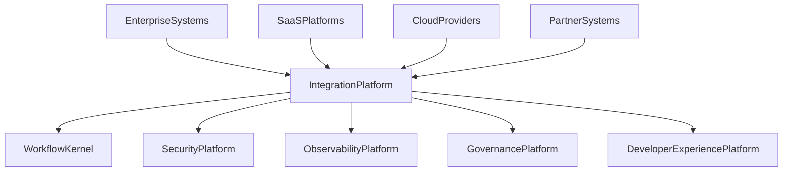
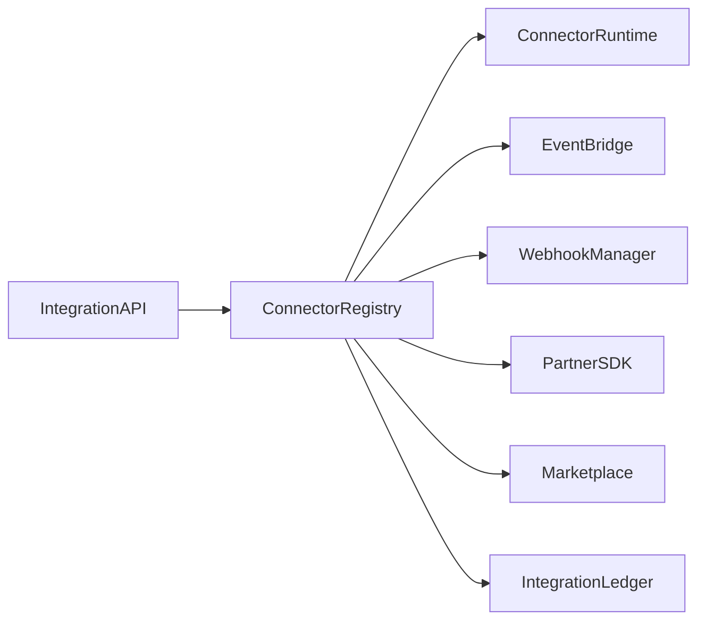

# Enterprise AI Software Factory
# Architecture Design Specification (ADS)

> **Document ID:** ADS-030-v1
>
> **Document Name:** Integration & Ecosystem Platform — Architecture
>
> **Version:** 2.0.0
>
> **Classification:** Enterprise Platform Plane
>
> **Importance:** HIGH
>
> **Depends On:** ADS-021-v5
>
> **Depends On:** ADS-022-v5
>
> **Depends On:** ADS-023-v5
>
> **Depends On:** ADS-024-v5
>
> **Depends On:** ADS-025-v5
>
> **Depends On:** ADS-026-v5
>
> **Depends On:** ADS-027-v5
>
> **Depends On:** ADS-028-v5
>
> **Depends On:** ADS-029-v5
>
> **Next:** ADS-030-v2 — Integration Algorithms & Connector Framework
>
---

# Executive Summary

The Integration & Ecosystem Platform enables secure, governed, observable integration between the Enterprise AI Software Factory and external systems.

The platform provides standardized mechanisms for connecting workflows, agents, APIs, event streams, SaaS platforms, enterprise applications, cloud providers, and partner ecosystems.

Integrations become first-class platform artifacts.

---

# Why This System Exists

Enterprise AI platforms rarely operate in isolation.

Organizations require seamless integration with

- Enterprise Applications
- SaaS Platforms
- APIs
- Event Streams
- Cloud Providers
- Databases
- Data Lakes
- Messaging Platforms
- Identity Providers
- Partner Systems

The Integration Platform standardizes these interactions.

---

# Core Philosophy

Connect Securely.

Integrate Consistently.

Observe Everything.

Govern Every Connection.

---

# Design Goals

The platform provides

- Connector Framework
- API Gateway Integration
- Event Bus Integration
- Webhook Management
- Partner SDK
- Marketplace Support
- Connector Registry
- Integration Policies
- Integration Monitoring
- External System Governance

---

# Architectural Position

Every external interaction passes through the Integration Platform.

---

# High-Level Architecture

Connector Registry coordinates every integration.

---

# Major Components

| Component | Responsibility |
|------------|----------------|
| Integration API | Public integration interface |
| Connector Registry | Connector discovery |
| Connector Runtime | Connector execution |
| Event Bridge | Event integration |
| Webhook Manager | Webhook lifecycle |
| Partner SDK | Third-party integrations |
| Marketplace | Connector distribution |
| Integration Ledger | Immutable integration history |

---

# Integration Domains

| Domain | Purpose |
|---------|---------|
| APIs | External APIs |
| Events | Event streaming |
| Webhooks | HTTP callbacks |
| SaaS | Cloud applications |
| Databases | Data access |
| Messaging | Queues & brokers |
| Identity | Federation |
| Marketplace | Third-party ecosystem |

Every domain follows consistent integration contracts.

---

# Integration Principles

The platform follows

- API First
- Event Driven
- Secure by Default
- Observable Integrations
- Versioned Connectors
- Policy Enforcement
- Tenant Isolation

---

# Integration Boundaries

All external communication passes through

- Connector Runtime
- Security Validation
- Governance Policies
- Observability
- Identity Verification

No direct platform bypasses are permitted.

---

# Architecture Decision Records

## ADR-030-01

### Decision

Centralize all enterprise integrations into a dedicated Integration Platform.

### Status

Accepted

### Reason

Centralized integration improves governance, observability, security, and operational consistency.

---

## ADR-030-02

### Decision

Represent integrations as immutable platform artifacts.

### Status

Accepted

### Reason

Artifact-centric integration improves replayability, auditing, debugging, and lifecycle management.

---

# Operational Readiness Scorecard

| Capability | Status |
|------------|--------|
| Connector Framework | ✅ Required |
| Event Integration | ✅ Required |
| API Gateway | ✅ Required |
| Marketplace | ✅ Required |
| Partner SDK | ✅ Required |
| Integration Ledger | ✅ Required |
| Integration Governance | ✅ Required |
| Observability | ✅ Required |

---

# Version Roadmap

| Version | Description |
|----------|-------------|
| v1 | Architecture |
| v2 | Integration Algorithms & Connector Framework |
| v3 | APIs, Events & Contracts |
| v4 | Runtime & Integration Infrastructure |
| v5 | End-to-End Integration Lifecycle |

---

# Related Documents

ADS-021-v5 — Workflow Kernel

ADS-022-v5 — Identity & Trust Plane

ADS-023-v5 — Enterprise Memory Plane

ADS-024-v5 — Agent Execution Platform

ADS-025-v5 — Compute & Infrastructure Platform

ADS-026-v5 — Security Platform

ADS-027-v5 — Observability Platform

ADS-028-v5 — Governance Platform

ADS-029-v5 — Developer Experience Platform

---

# Next Document

**ADS-030-v2 — Integration Algorithms & Connector Framework**

Defines connector lifecycle, integration orchestration, protocol adapters, event routing, webhook processing, partner onboarding, connector versioning, and ecosystem governance.

---

# End of Document
