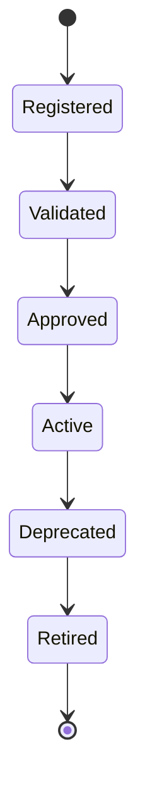

# Enterprise AI Software Factory
# Architecture Design Specification (ADS)

> **Document ID:** ADS-030-v2
>
> **Document Name:** Integration & Ecosystem Platform — Integration Algorithms & Connector Framework
>
> **Version:** 2.0.0
>
> **Classification:** Enterprise Platform Plane
>
> **Importance:** HIGH
>
> **Depends On:** ADS-030-v1
>
> **Next:** ADS-030-v3 — APIs, Events & Contracts
>
---

# Executive Summary

This document defines the algorithms responsible for connector registration, protocol adaptation, event routing, webhook processing, connector lifecycle management, partner onboarding, marketplace validation, and integration governance.

Every connector is versioned.

Every integration is observable.

Every external interaction is governed.

---

# Design Philosophy

The Integration Platform follows six principles.

- Contract First
- Secure by Default
- Event Driven
- Version Everything
- Observe Every Exchange
- Govern Every Connection

Integrations remain deterministic and reproducible.

---

# Integration Lifecycle

```text
Connector Registration

↓

Contract Validation

↓

Authentication

↓

Protocol Adaptation

↓

Execution

↓

Observation

↓

Governance

↓

Lifecycle Management
```

Every connector follows this lifecycle.

---

# Integration Contract

Every external integration begins with an immutable Integration Contract.

```yaml
integrationContract:

  contractId:

  connectorId:

  externalSystem:

  supportedProtocols:

  authenticationMethod:

  dataSchemas:

  eventMappings:

  rateLimits:

  retryPolicy:

  sla:

  version:

  effectiveFrom:
```

Integration Contracts remain immutable.

---

# ALG-030-001

## Connector Registration

Connector registration validates

- Connector Identity
- Organization
- Connector Type
- Supported Protocols
- Version
- Security Profile

Registration creates a Connector Record.

---

# ALG-030-002

## Contract Validation

Validation verifies

- Schema Compatibility
- Authentication Method
- Protocol Support
- Version Compatibility
- Governance Policies
- Security Policies

Validation precedes execution.

---

# Supported Protocols

| Protocol | Purpose |
|----------|----------|
| REST | HTTP APIs |
| gRPC | Internal services |
| GraphQL | Query APIs |
| WebSocket | Real-time communication |
| Kafka | Event streaming |
| AMQP | Messaging |
| MQTT | IoT integration |
| SFTP | File exchange |

Protocols remain extensible.

---

# ALG-030-003

## Protocol Adaptation

The platform adapts

- Request Format
- Authentication
- Serialization
- Transport
- Error Mapping

Adaptation remains transparent to workflows.

---

# ALG-030-004

## Event Routing

The Event Bridge routes

- Workflow Events
- Business Events
- Integration Events
- Partner Events
- Webhook Events

Routing is policy-driven.

---

# Connector Categories

| Category | Purpose |
|----------|----------|
| Enterprise | ERP, CRM |
| SaaS | Cloud platforms |
| Messaging | Queues & brokers |
| Storage | Object & file storage |
| Identity | Federation |
| AI Services | External models |
| Databases | Data platforms |
| Custom | Organization-specific |

Categories determine default policies.

---

# ALG-030-005

## Webhook Processing

Webhook Manager validates

- Signature
- Source
- Payload
- Timestamp
- Replay Protection

Only verified webhooks are accepted.

---

# End of Part 1
# ALG-030-006

## Partner Onboarding

Every external partner completes a standardized onboarding process.

Onboarding validates

- Organization Identity
- Connector Ownership
- Security Profile
- Compliance Profile
- Supported Integrations
- Marketplace Eligibility

Successful onboarding registers the partner.

---

# ALG-030-007

## Connector Versioning

Connector versions evaluate

- Semantic Version
- Contract Compatibility
- Breaking Changes
- Schema Evolution
- Deprecation Status

Version upgrades remain deterministic.

---

# ALG-030-008

## Connector Lifecycle

Connector lifecycle stages

- Registered
- Validated
- Approved
- Active
- Deprecated
- Retired

Lifecycle transitions remain auditable.

---

# Connector Record

Every registered connector creates a Connector Record.

```yaml
connectorRecord:

  connectorId:

  integrationContract:

  connectorType:

  provider:

  deploymentModel:

  supportedOperations:

  runtimeConfiguration:

  securityProfile:

  healthStatus:

  version:

  registeredAt:
```

Connector Records remain immutable.

---

# Marketplace Validation

Marketplace evaluates

- Connector Integrity
- Security Validation
- Governance Compliance
- License Compatibility
- Version Compatibility
- Documentation Quality

Only validated connectors become publicly available.

---

# Integration Policies

Supported policy types

| Policy | Purpose |
|--------|----------|
| Authentication | Identity verification |
| Authorization | Access control |
| Rate Limiting | Resource protection |
| Retry | Failure handling |
| Timeout | Availability |
| Data Classification | Sensitive data handling |
| Audit | Compliance logging |

Policies remain version-controlled.

---

# Connector State Machine



Every connector follows this lifecycle.

---

# Event Routing Strategies

Supported routing

| Strategy | Purpose |
|----------|----------|
| Broadcast | Multiple consumers |
| Direct | Single destination |
| Topic | Category-based |
| Queue | Reliable processing |
| Fan-out | Parallel delivery |

Routing policies remain configurable.

---

# Integration Metrics

```text
connector_registrations_total

active_connectors_total

contract_validations_total

partner_onboardings_total

webhook_requests_total

event_routes_total

connector_failures_total

marketplace_publications_total

integration_latency_seconds

connector_health_score
```

---

# Structured Logging

Example

```json
{
  "connectorId":"CONN-210",
  "contractId":"IC-045",
  "provider":"Acme",
  "protocol":"REST",
  "status":"Active",
  "health":"Healthy",
  "timestamp":"2026-09-10T12:08:17Z"
}
```

Logs remain immutable and correlated.

---

# Architecture Decision Records

## ADR-030-03

### Decision

Represent every registered connector as a Connector Record.

### Status

Accepted

### Reason

Connector Records separate implementation details from Integration Contracts while improving governance and lifecycle management.

---

## ADR-030-04

### Decision

Standardize connector lifecycle management.

### Status

Accepted

### Reason

Lifecycle management ensures safe deployment, upgrades, deprecation, and retirement of integrations.

---

## ADR-030-05

### Decision

Validate marketplace connectors before publication.

### Status

Accepted

### Reason

Connector validation improves ecosystem security, quality, and interoperability.

---

# Operational Readiness Scorecard

| Capability | Status |
|------------|--------|
| Integration Contracts | ✅ Required |
| Connector Records | ✅ Required |
| Connector Lifecycle | ✅ Required |
| Partner Onboarding | ✅ Required |
| Marketplace Validation | ✅ Required |
| Event Routing | ✅ Required |
| Integration Policies | ✅ Required |
| Versioned Connectors | ✅ Required |

---

# Related Documents

ADS-021-v5 — Workflow Kernel

ADS-022-v5 — Identity & Trust Plane

ADS-023-v5 — Enterprise Memory Plane

ADS-024-v5 — Agent Execution Platform

ADS-025-v5 — Compute & Infrastructure Platform

ADS-026-v5 — Security Platform

ADS-027-v5 — Observability Platform

ADS-028-v5 — Governance Platform

ADS-029-v5 — Developer Experience Platform

ADS-030-v1 — Integration & Ecosystem Platform

ADS-030-v3 — APIs, Events & Contracts

---

# End of Document
