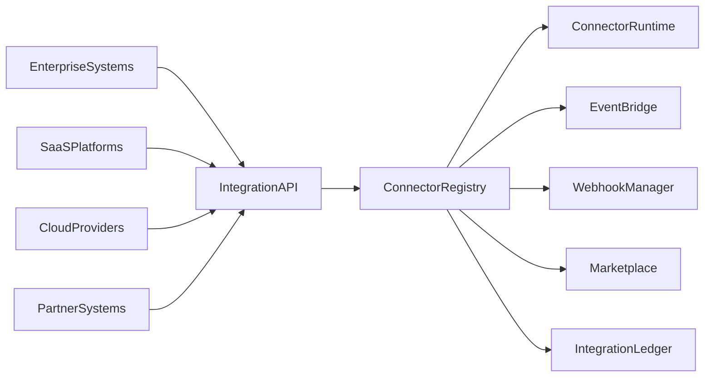
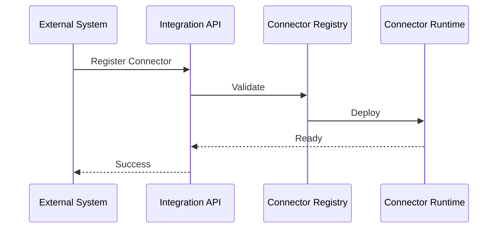

# Enterprise AI Software Factory
# Architecture Design Specification (ADS)

> **Document ID:** ADS-030-v3
>
> **Document Name:** Integration & Ecosystem Platform — APIs, Events & Contracts
>
> **Version:** 2.0.0
>
> **Classification:** Enterprise Platform Plane
>
> **Importance:** HIGH
>
> **Depends On:** ADS-030-v1
>
> **Depends On:** ADS-030-v2
>
> **Next:** ADS-030-v4 — Runtime & Integration Infrastructure

---

# Executive Summary

The Integration & Ecosystem Platform exposes standardized APIs for connector registration, contract validation, event routing, webhook management, partner onboarding, marketplace operations, and integration lifecycle management.

Every external interaction occurs through these contracts.

Connector implementations may evolve.

Integration contracts remain stable.

---

# Communication Principles

Every integration request MUST satisfy

- Authenticated
- Authorized
- Versioned
- Observable
- Governed
- Replayable
- Secure
- Tenant Isolated

No external system bypasses the Integration Platform.

---

# Integration Communication Architecture



Connector Registry coordinates every external interaction.

---

# Public REST API

The Integration Platform exposes APIs for

- Enterprise Applications
- SaaS Platforms
- Cloud Providers
- Partner Systems
- Marketplace
- Event Producers
- Webhook Providers
- Developer SDKs

---

## API-030-001

### Register Connector

```http
POST /integration/v1/connectors
```

Purpose

Registers a Connector Record.

---

Request

```json
{
  "provider":"Acme",
  "connectorType":"REST",
  "contractId":"IC-045"
}
```

---

Response

```json
{
  "connectorId":"CONN-210",
  "status":"Registered"
}
```

---

## API-030-002

### Validate Contract

```http
POST /integration/v1/contracts/validate
```

Validates an Integration Contract.

---

## API-030-003

### Start Integration Session

```http
POST /integration/v1/sessions
```

Creates an Integration Session.

---

## API-030-004

### Publish Event

```http
POST /integration/v1/events
```

Publishes an integration event.

---

## API-030-005

### Register Webhook

```http
POST /integration/v1/webhooks
```

Registers a managed webhook endpoint.

---

# Internal gRPC Services

```protobuf
service IntegrationService {

rpc RegisterConnector(ConnectorRequest)
returns(ConnectorResponse);

rpc ValidateContract(ContractRequest)
returns(ContractResponse);

rpc StartIntegrationSession(SessionRequest)
returns(SessionResponse);

rpc PublishEvent(EventRequest)
returns(EventResponse);

rpc RegisterWebhook(WebhookRequest)
returns(WebhookResponse);

}
```

---

# Integration Contract Schema

```protobuf
message IntegrationContract {

string contract_id = 1;

string connector_id = 2;

string external_system = 3;

string protocol = 4;

string authentication = 5;

string version = 6;

}
```

---

# Connector Record Schema

```protobuf
message ConnectorRecord {

string connector_id = 1;

string provider = 2;

string connector_type = 3;

string deployment_model = 4;

string version = 5;

}
```

---

# Integration Session Schema

```protobuf
message IntegrationSession {

string session_id = 1;

string connector_id = 2;

string workflow_id = 3;

string protocol = 4;

string endpoint = 5;

string outcome = 6;

}
```

---

# MCP Tool Contracts

The Integration Platform exposes

```
register_connector

validate_contract

start_integration_session

publish_event

register_webhook

query_marketplace

connector_health

integration_diagnostics
```

Every invocation is authenticated and audited.

---

# Integration Events

Every integration operation emits immutable events.

---

## EVT-030-001

ConnectorRegistered

---

## EVT-030-002

ContractValidated

---

## EVT-030-003

IntegrationSessionStarted

---

## EVT-030-004

EventPublished

---

## EVT-030-005

WebhookRegistered

---

## EVT-030-006

PartnerOnboarded

---

## EVT-030-007

ConnectorDeprecated

---

## EVT-030-008

ConnectorRetired

---

# Event Flow



---

# Event Ordering

```text
ConnectorRegistered

↓

ContractValidated

↓

ConnectorApproved

↓

IntegrationSessionStarted

↓

EventPublished

↓

SessionCompleted
```

---

# Event Metadata

Every event contains

```yaml
eventId:
connectorId:
contractId:
sessionId:
workflowId:
traceId:
timestamp:
schemaVersion:
```

---

# End of Part 1
